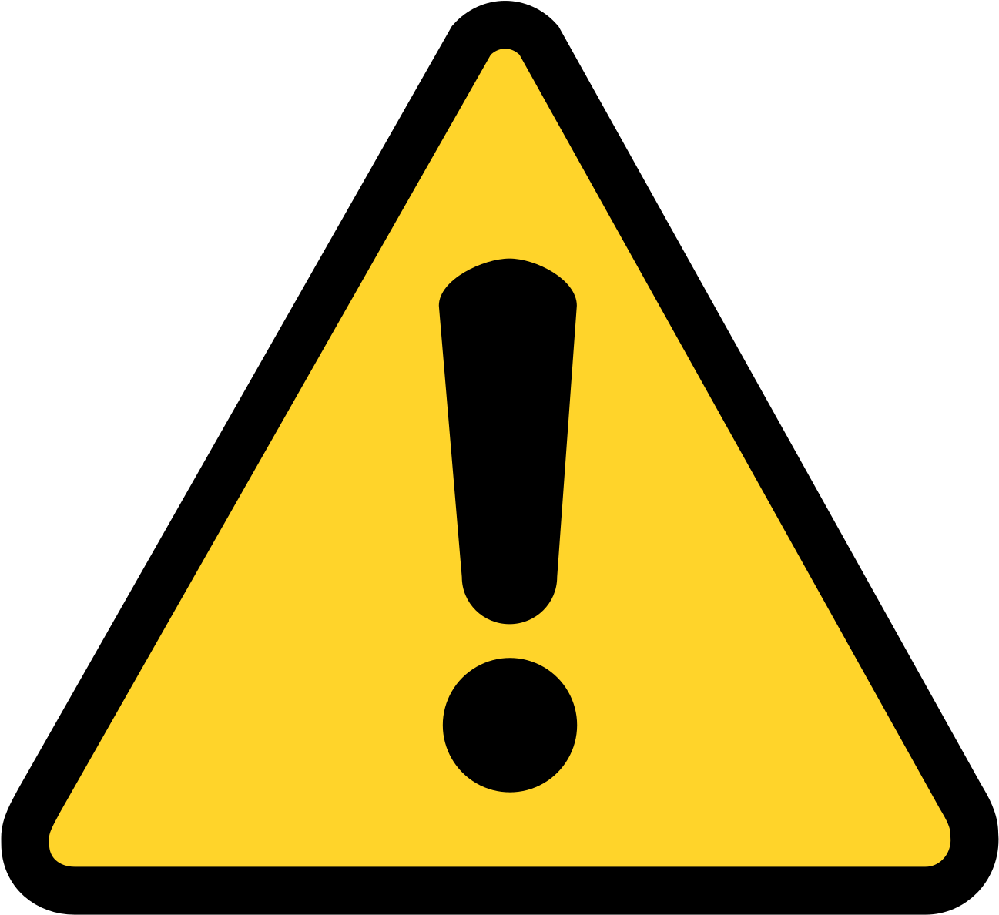
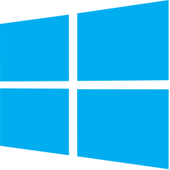

# Open Source Everything: I FLOSS WITH FREEDOM
For a while now I have been meticulously creating a list of open source software that in my personal opinion are the best. Unlike other lists that provide more options than what is deemed perfect, this list aims to only provide the best. The sections with multiple software listed simply have multiple perfect choices, and thus are both listed. This list is meant to be simple and straight to the point. Very few software here are proprietary. The only circumstances in which proprietary software is added is when it provides a boost in privacy that no open source option is available for. Sections and software marked with "This section needs improved" may not be best software and require further examination to come to a decision. 

# Versioning
**Version 45.2024.12.03.2**

The release code is in the format:
- **Total Releases:** The total number of releases since creation
- **Year:** The year of the release
- **Month:** The month of the release
- **Day:** The day of the release
- **Daily Release Index:** How many releases were made that day, starting at 0

# Mirrors
This repository is mirrored on other platforms. It was originally hosted on GitHub, but is now hosted on GitLab. It was at one point accidentally deleted on GitHub, so it shows up as a fork of another user's repository there after it was restored.

### GitLab (Host)
https://gitlab.com/an-anonymous-coder1/Open-Source-Everything

### GitHub (Mirror)
https://github.com/An-anonymous-coder/Open-Source-Everything

### Codeberg (Mirror)
Coming soon!

# Legend
### Stamps
Stamps give you a general idea of the consensus around a piece of software. This helps you better gague which software is highly recommended by me or the community as a whole. 

 = Verified best software

 = My top choices

 = I have personally used and inspected this software

 = Software is proprietary

 = Software is outdated/abandoned

 = This section needs improved

### Platforms
This is a list of the platforms software is currently available on. "Apple products" includes iOS, macOS, and iPadOS.

 = Available for Apple products

 = Available for Android products

 = Available for Linux

 = Available for Windows

 = Available online

# Table of Contents
[AI Tools & Services](https://gitlab.com/an-anonymous-coder1/Open-Source-Everything/#ai-tools--services)

[Audio & Music](https://gitlab.com/an-anonymous-coder1/Open-Source-Everything/#audio--music)

[Backup & Sync](https://gitlab.com/an-anonymous-coder1/Open-Source-Everything/#backup--sync)

[Business & Commerce](https://gitlab.com/an-anonymous-coder1/Open-Source-Everything/#business--commerce)

[CD/DVD Tools](https://gitlab.com/an-anonymous-coder1/Open-Source-Everything/#cddvd-tools)

[Development](https://gitlab.com/an-anonymous-coder1/Open-Source-Everything/#development)

[Digital Coins & Cryptocurrency](https://gitlab.com/an-anonymous-coder1/Open-Source-Everything/#digital-coins--cryptocurrency)

[Education & Reference](https://gitlab.com/an-anonymous-coder1/Open-Source-Everything/#education--reference)

[File Management](https://gitlab.com/an-anonymous-coder1/Open-Source-Everything/#file-management)

[File Sharing](https://gitlab.com/an-anonymous-coder1/Open-Source-Everything/#file-sharing)

[Games](https://gitlab.com/an-anonymous-coder1/Open-Source-Everything/#games)

[Gaming Software](https://gitlab.com/an-anonymous-coder1/Open-Source-Everything/#gaming-software)

[Home & Family](https://gitlab.com/an-anonymous-coder1/Open-Source-Everything/#home--family)

[Network & Admin](https://gitlab.com/an-anonymous-coder1/Open-Source-Everything/#network--admin)

[News & Books](https://gitlab.com/an-anonymous-coder1/Open-Source-Everything/#news--books)

[Office & Productivity](https://gitlab.com/an-anonymous-coder1/Open-Source-Everything/#office--productivity)

[Online Services](https://gitlab.com/an-anonymous-coder1/Open-Source-Everything/#online-services)

[OS & Utilities](https://gitlab.com/an-anonymous-coder1/Open-Source-Everything/#os--utilities)

[Photos & Graphics](https://gitlab.com/an-anonymous-coder1/Open-Source-Everything/#photos--graphics)

[Remote Work & Education](https://gitlab.com/an-anonymous-coder1/Open-Source-Everything/#remote-work--education)

[Security & Privacy](https://gitlab.com/an-anonymous-coder1/Open-Source-Everything/#security--privacy)

[Social & Communications](https://gitlab.com/an-anonymous-coder1/Open-Source-Everything/#social--communications)

[Sport & Health](https://gitlab.com/an-anonymous-coder1/Open-Source-Everything/#sport--health)

[System & Hardware](https://gitlab.com/an-anonymous-coder1/Open-Source-Everything/#system--hardware)

[Travel & Location](https://gitlab.com/an-anonymous-coder1/Open-Source-Everything/#travel--location)

[Video & Movies](https://gitlab.com/an-anonymous-coder1/Open-Source-Everything/#video--movies)

[Web Browsing](https://gitlab.com/an-anonymous-coder1/Open-Source-Everything/#web-browsing)

[Other](https://gitlab.com/an-anonymous-coder1/Open-Source-Everything/#other)

# AI Tools & Services
### AI Chatbots 

- [GPT4ALL](https://gpt4all.io/)
  
  **Stamps:** 
  
  **Platforms:** 

- [Ollama](https://ollama.com/)
  
  **Stamps:** 
  
  **Platforms:** 

- [Venice](https://venice.ai/)
  
  **Stamps:** 
  
  **Platforms:** 

### AI Image Generators 

- [Craiyon](https://www.craiyon.com/)
  
  **Stamps:** 
  
  **Platforms:** 

- [FLUX.1](https://blackforestlabs.ai/)
  
  **Stamps:** 
  
  **Platforms:** 

### AI Music Generators 

- [Stable Audio Open](https://huggingface.co/stabilityai/stable-audio-open-1.0)
  
  **Stamps:** 
  
  **Platforms:** 

### AI Video Generators 

- [Hotshot](https://hotshot.co/)
  
  **Stamps:** 
  
  **Platforms:** 

- [Mochi AI](https://www.genmo.ai/)
  
  **Stamps:** 
  
  **Platforms:** 

- [Samsar](https://www.samsar.one/)
  
  **Stamps:** 
  
  **Platforms:** 

- [Stable Video Diffusion](https://stability.ai/stable-video)
  
  **Stamps:** 
  
  **Platforms:** 

# Audio & Music
### Audio Editors

- [Audacity](https://www.audacityteam.org/)
  
  **Stamps:** 
  
  **Platforms:** 

### Music Recognition Apps

- [Audire](https://github.com/alexmercerind/audire)
  
  **Stamps:** 
  
  **Platforms:** 

- [Audile](https://github.com/aleksey-saenko/MusicRecognizer)
  
  **Stamps:** 
  
  **Platforms:** 

### Podcast Players

- [AntennaPod](https://antennapod.org/)
  
  **Stamps:** 
  
  **Platforms:** 

# Backup & Sync
### Backup Clients

- [Duplicati](https://www.duplicati.com/)
  
  **Stamps:** 
  
  **Platforms:** 

- [Vorta](https://vorta.borgbase.com/)
  
  **Stamps:** 
  
  **Platforms:** 

### Cloud Storage Services 

- [Nextcloud](https://nextcloud.com/)
  
  **Stamps:** 
  
  **Platforms:** 

### File Sync Tools

- [Syncthing](https://syncthing.net/)
  
  **Stamps:** 
  
  **Platforms:** 

# Business & Commerce
### Virtual Card Services

- [Privacy.com](https://privacy.com/)
  
  **Stamps:** 
  
  **Platforms:** 

### Personal Finance Tools

- [Ivy Wallet](https://ivywallet.app/)
  
  **Stamps:** 
  
  **Platforms:** 

### Survey Creators

- [LimeSurvey](https://www.limesurvey.org/)
  
  **Stamps:** 
  
  **Platforms:** 

# CD/DVD Tools
### Bootable USB Creators 

- [belenaEtcher](https://etcher.balena.io/)
  
  **Stamps:** 
  
  **Platforms:** 

- [EtchDroid](https://etchdroid.app/)
  
  **Stamps:** 
  
  **Platforms:** 

- [Rufus](https://rufus.ie/)
  
  **Stamps:** 
  
  **Platforms:** 

- [Ventoy](https://www.ventoy.net/)
  
  **Stamps:** 
  
  **Platforms:** 

### Disc Burners

- [Brasero](https://wiki.gnome.org/Apps/Brasero)
  
  **Stamps:** 
  
  **Platforms:** 

# Development
### Code Editors

- [VSCodium](https://vscodium.com/)
  
  **Stamps:** 
  
  **Platforms:** 

- [GNU Emacs](https://www.gnu.org/software/emacs/)
  
  **Stamps:** 
  
  **Platforms:** 

### Pastebin Services

- [PrivateBin](https://privatebin.info/)
  
  **Stamps:** 
  
  **Platforms:** 

### Source Code Hosting Services

- [GitLab](https://about.gitlab.com/)
  
  **Stamps:** 
  
  **Platforms:** 

- [Codeberg](https://codeberg.org/)
  
  **Stamps:** 
  
  **Platforms:** 

# Digital Coins & Cryptocurrency
### Cryptocurrency Coins

- [Monero](https://getmonero.org/home)
  
  **Stamps:** 
  
  **Platforms:** 

# Education & Reference
### Encyclopedias

- [Wikipedia](https://www.wikipedia.org/)
  
  **Stamps:** 
  
  **Platforms:** 

### Flashcard Learning Tools

- [AnkiDroid](https://github.com/ankidroid/Anki-Android/)
  
  **Stamps:** 
  
  **Platforms:** 

### Grammar Checkers

- [LanguageTool](https://languagetool.org/)
  
  **Stamps:** 
  
  **Platforms:** 

### Sky Maps

- [Sky Map](https://github.com/sky-map-team/stardroid)
  
  **Stamps:** 
  
  **Platforms:** 

### Web Archiving Services

- [Wayback Machine](https://web.archive.org/)
  
  **Stamps:** 
  
  **Platforms:** 

# File Management
### File Archivers 

- [7-Zip](https://www.7-zip.org/)
  
  **Stamps:** 
  
  **Platforms:** 

- [PeaZip](https://peazip.github.io/)
  
  **Stamps:** 
  
  **Platforms:** 

# File Sharing
### Large File Transfer Services

- [KDE Connect](https://kdeconnect.kde.org/)
  
  **Stamps:** 
  
  **Platforms:** 

- [LocalSend](https://localsend.org/)
  
  **Stamps:** 
  
  **Platforms:** 

- [OnionShare](https://onionshare.org/)
  
  **Stamps:** 
  
  **Platforms:** 

### Torrent Clients

- [qBittorrent](https://qbittorrent.org/)
  
  **Stamps:** 
  
  **Platforms:** 

- [LibreTorrent](https://gitlab.com/proninyaroslav/libretorrent)
  
  **Stamps:** 
  
  **Platforms:** 

### Torrent Search Engines

- [BTDigg](https://btdig.com/)
  
  **Stamps:** 
  
  **Platforms:** 

# Games
### Chess Games

- [Lichess](https://lichess.org/)
  
  **Stamps:** 
  
  **Platforms:** 

- [blichess](https://github.com/vovagorodok/blichess)
  
  **Stamps:** 
  
  **Platforms:** 

### Music Games

- [osu!](https://osu.ppy.sh/home)
  
  **Stamps:** 
  
  **Platforms:** 

### Puzzle Games

- [2048 (PFA)](https://secuso.aifb.kit.edu/english/653.php)
  
  **Stamps:** 
  
  **Platforms:** 

- [Simon Tatham's Portable Puzzle Collection](http://www.chiark.greenend.org.uk/~sgtatham/puzzles/)
  
  **Stamps:**  
  
  **Platforms:** 

- [Open Sudoku](https://opensudoku.moire.org/)
  
  **Stamps:** 
  
  **Platforms:** 

# Gaming Software
### Game Emulators 

- [RetroArch](https://retroarch.com/)
  
  **Stamps:** 
  
  **Platforms:** 

# Home & Family
### Genealogy Tools 

- [Gramps](https://gramps-project.org/blog/)
  
  **Stamps:** 
  
  **Platforms:** 

# Network & Admin
### CAPTCHAs 

- [mCaptcha](https://mcaptcha.org/)
  
  **Stamps:** 
  
  **Platforms:** 

### DNS Resolvers 

- [Mullvad](https://mullvad.net/en/help/dns-over-https-and-dns-over-tls)
  
  **Stamps:**  
  
  **Platforms:** 

- [Control D](https://controld.com/free-dns)
  
  **Stamps:** 
  
  **Platforms:** 

### Network Monitors

- [Wireshark](https://www.wireshark.org/)
  
  **Stamps:** 
  
  **Platforms:** 

- [Nmap](http://nmap.org/)
  
  **Stamps:** 
  
  **Platforms:** 

### Router Custom Firmwares 

- [DD-WRT](https://dd-wrt.com/)
  
  **Stamps:** 
  
  **Platforms:** 

- [OPNsense](https://opnsense.org/)
  
  **Stamps:** 
  
  **Platforms:** 

- [OpenWrt](https://openwrt.org/)
  
  **Stamps:** 
  
  **Platforms:** 

### Virtualization Tools 

- [VirtualBox](https://www.virtualbox.org/)
  
  **Stamps:** 
  
  **Platforms:** 

- [Docker](https://www.docker.com/)
  
  **Stamps:** 
  
  **Platforms:** 

### Work Profile for Android

- [Shelter](https://github.com/PeterCxy/Shelter)
  
  **Stamps:** 
  
  **Platforms:** 

# News & Books
### Ebook Libraries

- [Anna's Archive](https://annas-archive.org/)
  
  **Stamps:** 
  
  **Platforms:** 

- [Open Library](https://openlibrary.org/)
  
  **Stamps:** 
  
  **Platforms:** 

### Ebook Readers

- [calibre](https://calibre-ebook.com/)
  
  **Stamps:** 
  
  **Platforms:** 

- [Librera Reader](https://librera.mobi/)
  
  **Stamps:** 
  
  **Platforms:** 

### RSS Readers

- [Feeder](https://github.com/spacecowboy/Feeder)
    
  **Stamps:** 
  
  **Platforms:** 

# Office & Productivity
### Email Clients

- [Thunderbird](https://www.thunderbird.net/)
  
  **Stamps:** 
  
  **Platforms:** 

- [Betterbird](https://www.betterbird.eu/)
  
  **Stamps:** 
  
  **Platforms:** 

### Mind Mapping Tools

- [draw.io](https://www.diagrams.net/)
  
  **Stamps:** 
  
  **Platforms:** 

### Note Taking Apps

- [Joplin](https://joplinapp.org/)
  
  **Stamps:** 
  
  **Platforms:** 

- [Xournal++](https://xournalpp.github.io/)
  
  **Stamps:** 
  
  **Platforms:** 

### Office Suites

- [LibreOffice](https://www.libreoffice.org/)
  
  **Stamps:** 
  
  **Platforms:** 

### PDF Readers

- [Evince](https://wiki.gnome.org/Apps/Evince)

  **Stamps:** 
  
  **Platforms:** 

- [Okular](https://okular.kde.org/)

  **Stamps:** 
  
  **Platforms:** 

### Scheduling and Calendar Apps

- [Etar](https://github.com/Etar-Group/Etar-Calendar)
  
  **Stamps:** 
  
  **Platforms:** 

- [Fossify Calendar](https://github.com/FossifyOrg/Calendar)
  
  **Stamps:** 
  
  **Platforms:** 

### Text Editors (CLI)

- [GNU nano](https://www.nano-editor.org/)
  
  **Stamps:** 
  
  **Platforms:** 

- [Vim](https://www.vim.org/)
  
  **Stamps:** 
  
  **Platforms:** 

### Text Editors (GUI)

- [gedit](https://gedit-technology.github.io/apps/gedit/)
  
  **Stamps:** 
  
  **Platforms:** 

- [Kate](https://kate-editor.org/)
  
  **Stamps:** 
  
  **Platforms:** 

- [Notepad++](https://notepad-plus-plus.org/)
  
  **Stamps:** 
  
  **Platforms:** 

### WebMail Providers

- [Proton Mail](https://proton.me/mail)
  
  **Stamps:** 
  
  **Platforms:** 

- [Tuta Mail](https://tuta.com/)
  
  **Stamps:** 
  
  **Platforms:** 

# Online Services
### App Stores for Android 

- [Accrescent](https://accrescent.app/)
  
  **Stamps:** 
  
  **Platforms:** 

- [Aurora Store](https://auroraoss.com/)
  
  **Stamps:** 
  
  **Platforms:** 

- [F-Droid](https://f-droid.org/)
  
  **Stamps:** 
  
  **Platforms:** 

- [Obtainium](https://obtainium.imranr.dev/)
  
  **Stamps:** 
  
  **Platforms:** 

### App Stores for Linux

- [GNOME Software](https://apps.gnome.org/app/org.gnome.Software/)
  
  **Stamps:** 
  
  **Platforms:** 

- [Flathub](https://flathub.org/)
  
  **Stamps:** 
  
  **Platforms:** 

### Pornography

- [Danbooru](https://danbooru.donmai.us/)
  
  **Stamps:** WARNING: Sensitive content, explicit material, adult, inappropriate, mature, NSFW, 18+, pornography, nudity, etc. 
    
  **Platforms:** 

- [E621](https://e621.net/posts)
  
  **Stamps:** WARNING: Sensitive content, explicit material, adult, inappropriate, mature, NSFW, 18+, pornography, nudity, etc. 
    
  **Platforms:** 

### Weather Forecast Tools

- [Breezy Weather](https://github.com/breezy-weather/breezy-weather)
  
  **Stamps:** 
  
  **Platforms:** 

### Web Search Engines

- [SearXNG](https://docs.searxng.org/)
  
  **Stamps:** 
  
  **Platforms:** 

# OS & Utilities
### Android Distributions

- [GrapheneOS](https://grapheneos.org/)
  
  **Stamps:** 
  
  **Platforms:** 

### Application Launchers for Android

- [Lawnchair](https://lawnchair.app/)
  
  **Stamps:** 
  
  **Platforms:** 

### Boot Managers

- [GRUB](http://www.gnu.org/software/grub/)
  
  **Stamps:** 
  
  **Platforms:** 

### Compatibility Layer Tools

- [Wine](https://www.winehq.org/)
  
  **Stamps:** 
  
  **Platforms:** 

### Desktop Environments

- [GNOME](https://www.gnome.org/)
  
  **Stamps:** 
  
  **Platforms:** 

- [KDE Plasma](https://kde.org/plasma-desktop)
  
  **Stamps:** 
  
  **Platforms:** 

### Disk Usage Analyzers

- [CrystalDiskInfo](https://crystalmark.info/en/software/crystaldiskinfo/)
  
  **Stamps:** 
  
  **Platforms:** 

- [GNOME Disk Usage Analyzer](https://wiki.gnome.org/Apps/DiskUsageAnalyzer)
  
  **Stamps:** 
  
  **Platforms:** 

- [WinDirStat](https://windirstat.net/)
  
  **Stamps:** 
  
  **Platforms:** 

### Linux Distros 

- [Arch Linux](https://www.archlinux.org/)
  
  **Stamps:** 
  
  **Platforms:** 

- [Fedora](https://fedoraproject.org/)
  
  **Stamps:** 
  
  **Platforms:** 

- [NixOS](https://nixos.org/)
  
  **Stamps:** 
  
  **Platforms:** 

- [openSUSE Tumbleweed](https://get.opensuse.org/tumbleweed/)
  
  **Stamps:** 
  
  **Platforms:** 

### Mobile Keyboards for Android

- [HeliBoard](https://github.com/Helium314/HeliBoard)
  
  **Stamps:** 
  
  **Platforms:** 

### Operating Systems

- [Tails](https://tails.net/)
  
  **Stamps:** 
  
  **Platforms:** 

- [Qubes OS](https://www.qubes-os.org/)
  
  **Stamps:** 
  
  **Platforms:** 

### Survival Apps

- [Trail Sense](https://kylecorry.com/Trail-Sense/)
  
  **Stamps:** 
  
  **Platforms:** 

### System Cleaners

- [BleachBit](https://www.bleachbit.org/)

  **Stamps:** 
  
  **Platforms:** 

### Terminal Emulators for Android

- [Termux](https://termux.dev/en/)
    
  **Stamps:** 
  
  **Platforms:** 

# Photos & Graphics
### 3D Modelers

- [Blender](https://www.blender.org/)
  
  **Stamps:** 
  
  **Platforms:** 

### CAD Software

- [FreeCAD](https://www.freecad.org/)
  
  **Stamps:** 
  
  **Platforms:** 

### Digital Painting Tools

- [Krita](https://krita.org/)
  
  **Stamps:** 
  
  **Platforms:** 

### Image Editors

- [GIMP](https://www.gimp.org/)
  
  **Stamps:** 
  
  **Platforms:** 

### Photo Managers 

- [Fossify Gallery](https://github.com/FossifyOrg/Gallery)
  
  **Stamps:** 
  
  **Platforms:** 

- [Aves](https://github.com/deckerst/aves)
  
  **Stamps:** 
  
  **Platforms:** 

### Screenshot Capture Tools

- [Flameshot](https://flameshot.org/)
  
  **Stamps:** 
  
  **Platforms:** 

### Vector Graphic Apps

- [Inkscape](https://inkscape.org/)
  
  **Stamps:** 
  
  **Platforms:** 

# Remote Work & Education
### Video Conferencing Tools 

- [Infomaniak kMeet](https://www.infomaniak.com/en/kmeet)
  
  **Stamps:** 
  
  **Platforms:** 

# Security & Privacy
### Authenticators

- [Aegis Authenticator](https://getaegis.app/)
  
  **Stamps:** 
  
  **Platforms:** 

- [Ente Auth](https://ente.io/auth/)
  
  **Stamps:** 
  
  **Platforms:** 

### Disk Encryption Tools

- [LUKS](https://gitlab.com/cryptsetup/cryptsetup)
  
  **Stamps:** 
  
  **Platforms:** 

- [VeraCrypt](https://www.veracrypt.fr/en/Home.html)
  
  **Stamps:** 
  
  **Platforms:** 

### File Encryption Software

- [Cryptomator](https://cryptomator.org/)
  
  **Stamps:** 
  
  **Platforms:** 

- [Picocrypt](https://github.com/Picocrypt/Picocrypt)
  
  **Stamps:** 
  
  **Platforms:** 

### Firewalls 

### Password Managers

- [KeePassXC](https://keepassxc.org/)
  
  **Stamps:** 
  
  **Platforms:** 

- [KeePassDX](https://www.keepassdx.com/)
  
  **Stamps:** 
  
  **Platforms:** 

### Email Aliasing Services

- [addy.io](https://addy.io/)
  
  **Stamps:** 
  
  **Platforms:** 

### Virtual Private Network Apps

- [Mullvad](https://www.mullvad.net/)
  
  **Stamps:** 
  
  **Platforms:** 

- [Proton VPN](https://protonvpn.com/)
  
  **Stamps:** 
  
  **Platforms:** 

# Social & Communications
### Blog Publishing Tools

- [WordPress](https://wordpress.org/)
  
  **Stamps:** 
  
  **Platforms:** 

### Communication Protocols 

- [Matrix](https://matrix.org/)
  
  **Stamps:** 
  
  **Platforms:** 

- [XMPP](https://xmpp.org/)
  
  **Stamps:** 
  
  **Platforms:** 

- [SMP](https://simplex.chat/docs/protocol/simplex-chat.html)
  
  **Stamps:** 
  
  **Platforms:** 

- [Signal](https://github.com/signalapp/libsignal)
  
  **Stamps:** 
  
  **Platforms:** 

### Dating Services

- [Alovoa](https://alovoa.com/)
  
  **Stamps:** 
  
  **Platforms:** 

### Instant Messengers

- [Briar](https://briarproject.org/)
  
  **Stamps:** 
  
  **Platforms:** 

- [SimpleX Chat](https://simplex.chat/)
  
  **Stamps:** 
  
  **Platforms:** 

### Microblogs

- [Mastodon](https://joinmastodon.org/)
  
  **Stamps:** 
  
  **Platforms:** 

### Short-Form Video

- [Loops](https://loops.video/)
    
  **Stamps:** 
  
  **Platforms:** 

- [ProxiTok](https://github.com/pablouser1/ProxiTok)
  
  **Stamps:** 
  
  **Platforms:** 

### Social Networks

- [Lemmy](https://join-lemmy.org/)
  
  **Stamps:** 
  
  **Platforms:** 

### Photo Sharing Apps

- [Pixelfed](https://pixelfed.org/)
  
  **Stamps:** 
  
  **Platforms:** 

### Random Video Chat Apps

- [Live Talk](https://play.google.com/store/apps/details?id=com.mcastrangertalk.livetalkrandome)
  
  **Stamps:** 
  
  **Platforms:** 

# Sport & Health
### Beauty Product Information Tools

- [Open Beauty Facts](https://world.openbeautyfacts.org/)
  
  **Stamps:** 
  
  **Platforms:** 

### Breathing Exercise Tools

- [Inner Breeze](https://inbreeze.xyz/)
  
  **Stamps:** 
  
  **Platforms:** 

### Diabetic Trackers

- [Diaguard](https://diaguard.wordpress.com/)
  
  **Stamps:** 
  
  **Platforms:** 

### Diet Creation Tools

- [Daily Dozen](https://nutritionfacts.org/open-source/)
  
  **Stamps:** 
  
  **Platforms:** 

### Fitness Trackers

- [Gadgetbridge](https://gadgetbridge.org/)
  
  **Stamps:** 
  
  **Platforms:** 

### Gym Exercise Trackers

- [Massive](https://github.com/brandonp2412/Massive)
  
  **Stamps:** 
  
  **Platforms:** 

### Habit Trackers

- [Loop Habit Tracker](https://github.com/iSoron/uhabits)
  
  **Stamps:** 
  
  **Platforms:** 

- [Table Habit](https://github.com/FriesI23/mhabit)
  
  **Stamps:** 
  
  **Platforms:** 

### Medicine Reminder Tools

- [Simpill](https://gitlab.com/simpilldev/simpill)
  
  **Stamps:** 
  
  **Platforms:** 

### Meditation Tools

- [Medito](https://meditofoundation.org/medito-app)
  
  **Stamps:** 
  
  **Platforms:** 

### Menstrual Cycle Trackers

- [drip.](https://bloodyhealth.gitlab.io/)
  
  **Stamps:** 
  
  **Platforms:** 

- [Mensinator](https://github.com/EmmaTellblom/Mensinator)
  
  **Stamps:** 
  
  **Platforms:** 

### Mood Trackers

- [Pixy](https://pixy.day/)
  
  **Stamps:** 
  
  **Platforms:** 

### Nutrition Information Tools

- [Open Food Facts](https://world.openfoodfacts.org/)
  
  **Stamps:** 
  
  **Platforms:** 

### Pedometers

- [Paseo](https://gitlab.com/pardomi/paseo)
  
  **Stamps:** 
  
  **Platforms:** 

### Physical Activity Trackers 

- [FitoTrack](https://codeberg.org/jannis/FitoTrack)
  
  **Stamps:** 
  
  **Platforms:** 

- [OpenTracks](https://f-droid.org/en/packages/de.dennisguse.opentracks/)
  
  **Stamps:** 
  
  **Platforms:** 

### Seasonal Food Information Tools

- [Seasonal Foods Calendar](https://flunzmas.com/seasonal-foods-calendar/)
  
  **Stamps:** 
  
  **Platforms:** 

### Relaxation Tools

- [Noice](https://trynoice.com/)
  
  **Stamps:** 
  
  **Platforms:** 

### Weed Trackers

- [Petals](https://github.com/LeoColman/Petals)
  
  **Stamps:** 
  
  **Platforms:** 

### Weight & Diet Trackers

- [Energize](https://codeberg.org/epinez/Energize)
  
  **Stamps:** 
  
  **Platforms:** 

- [OpenNutriTracker](https://simonoppowa.github.io/OpenNutriTracker-Website/)
  
  **Stamps:** 
  
  **Platforms:** 

- [openScale](https://github.com/oliexdev/openScale)
  
  **Stamps:** 
  
  **Platforms:** 

- [Waistline](https://github.com/davidhealey/waistline)
  
  **Stamps:** 
  
  **Platforms:** 

### Workout Routine Tools

- [Feeel](https://gitlab.com/enjoyingfoss/feeel)
  
  **Stamps:** 
  
  **Platforms:** 

### Workout Timers

- [TimeR Machine](https://github.com/timer-machine/timer-machine-android)
  
  **Stamps:** 
  
  **Platforms:** 

# System & Hardware
### BIOS/UEFI Replacements

- [coreboot](https://coreboot.org/)
  
  **Stamps:** 
  
  **Platforms:** 

- [Libreboot](https://www.libreboot.org/)
  
  **Stamps:** 
  
  **Platforms:** 

# Travel & Location
### Map Services

- [OpenStreetMap](https://www.openstreetmap.org/)
  
  **Stamps:** 
  
  **Platforms:** 

- [OsmAnd](https://osmand.net/)
  
  **Stamps:** 
  
  **Platforms:** 

- [Organic Maps](https://organicmaps.app/)
  
  **Stamps:** 
  
  **Platforms:** 

- [StreetComplete](https://streetcomplete.app/)
  
  **Stamps:** 
  
  **Platforms:** 

### Mock Location Apps

- [Fake Traveler](https://github.com/mcastillof/FakeTraveler)
   
  **Stamps:** 
  
  **Platforms:** 

# Video & Movies
### Media Centers

- [Kodi](https://kodi.tv/)
  
  **Stamps:** 
  
  **Platforms:** 

- [Jellyfin](https://jellyfin.org/)
  
  **Stamps:** 
  
  **Platforms:** 

### Media Players

- [VLC Media Player](https://www.videolan.org/vlc/)
  
  **Stamps:** 
  
  **Platforms:** 

### Movie Streaming Services

- [Stremio](https://www.stremio.com/)
  
  **Stamps:** 
  
  **Platforms:** 

### Screen Recorders

- [OBS Studio](https://obsproject.com/)
  
  **Stamps:** 
  
  **Platforms:** 

### Video Downloaders

- [yt-dlp](https://github.com/yt-dlp/yt-dlp)
  
  **Stamps:** 
  
  **Platforms:** 

### Video Editors 

- [Kdenlive](https://kdenlive.org/)
  
  **Stamps:** 
  
  **Platforms:** 

- [Open Video Editor](https://github.com/devhyper/open-video-editor)
  
  **Stamps:** 
  
  **Platforms:** 

### Video Sharing Tools

- [Odysee](https://odysee.com/)
  
  **Stamps:** 
  
  **Platforms:** 

- [PeerTube](https://joinpeertube.org/)
  
  **Stamps:** 
  
  **Platforms:** 

### Watch Videos Together Tools 

- [OpenTogetherTube](https://opentogethertube.com/)
  
  **Stamps:** 
  
  **Platforms:** 

### YouTube Clients

- [FreeTube](https://freetubeapp.io/)
  
  **Stamps:** 
  
  **Platforms:** 

- [Tubular](https://github.com/polymorphicshade/Tubular)
  
  **Stamps:** 
  
  **Platforms:** 

### YouTube Frontends

- [Invidious](https://redirect.invidious.io/)
  
  **Stamps:** 
  
  **Platforms:** 

- [Piped](https://github.com/TeamPiped/Piped)
  
  **Stamps:** 
  
  **Platforms:** 

# Web Browsing
### Image Search Engines

- [Search by Image](https://github.com/dessant/search-by-image)
  
  **Stamps:** 
  
  **Platforms:** 

### Web Browsers

- [Brave](https://brave.com/)
  
  **Stamps:** 
  
  **Platforms:** 

- [Mullvad Browser](https://mullvad.net/en/browser)
  
  **Stamps:** 
  
  **Platforms:** 

- [Tor Browser](https://www.torproject.org/projects/torbrowser.html)
  
  **Stamps:** 
  
  **Platforms:** 

### Ad Blockers

- [uBlock Origin](https://github.com/gorhill/uBlock)
  
  **Stamps:** 
  
  **Platforms:** 

- [NoScript](https://noscript.net/)
  
  **Stamps:** 
  
  **Platforms:** 

- [Pi-hole](https://pi-hole.net/)
  
  **Stamps:** 
  
  **Platforms:** 

# Other
### Phone Number Services

- [JMP.chat](https://jmp.chat/)
  
  **Stamps:** 
  
  **Platforms:** 

- [MySudo](https://mysudo.com/)
  
  **Stamps:** 
  
  **Platforms:** 

### QR Code Readers

- [Binary Eye](https://www.markusfisch.de/apps-android.html#binary-eye)
    
  **Stamps:** 
  
  **Platforms:** 

### Text to Speech Service 

- [RHVoice](https://rhvoice.org/)
    
  **Stamps:** 
  
  **Platforms:** 