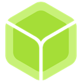
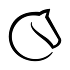

    <h1>
        Open Source Everything
    </h1>
    <h3>
        <i>
            "I FLOSS WITH FREEDOM!"
        </i>
    </h3>

**Open Source Everything** is a curated list of the best source-available software. Unlike other lists that try to provide a wide selection of software, this list instead focuses on only the best software in each category. 

While proprietary software is avoided on this list where possible, there are some circumstances where proprietary software provides a boost in privacy or security where no source-available alternative does. Those options are marked with the  stamp. 

Some software or sections marked with the  stamp may not be the best software. Those require further examination and improvements before coming to a final conclusion.

    <h1>
        Versioning
    </h1>

    <h3>
        Current version: <tt>94.2025.1.3.7</tt>
    </h3>

The version code follows the format:
- **Total Releases:** The total number of releases since creation
- **Year:** The year of the release
- **Month:** The month of the release
- **Day:** The day of the release
- **Daily Release Index:** Index of the releases made each day, beginning at 0

    <h1>
        Mirrors
    </h1>

This repository is mirrored on other platforms. It was originally hosted on GitHub, but is now hosted on GitLab. It was at one point accidentally deleted on GitHub, so it shows up as a fork of another user's repository there after it was restored.

###  GitLab (Host)

https://gitlab.com/an-anonymous-coder1/Open-Source-Everything

###  GitHub (Mirror)

https://github.com/An-anonymous-coder/Open-Source-Everything

###  Codeberg (Mirror)

*Coming soon!*

    <h1>
        Legend
    </h1>

    <h3>
        Stamps
    </h3>

Stamps give you a general idea of the consensus around a piece of software. They help you gague which software is recommended by me and the open source community as a whole.

 Verified best software

 This software is proprietary

 My top choices

 This software has been used and inspected

 This software is outdated or abandoned

 This section needs to be improved

    <h3>
        Platforms
    </h3>

Platforms tell you on which devices software is available to be used. Because this list does not focus on a wide selection of software, alternatives may not be listed for some platforms.

 Available for Android devices

 Available for Apple devices

 Available for Linux devices

 Available for Windows devices

 Available online

    <h1>
        Table of Contents
    </h1>

[AI Tools & Services](#--------ai-tools--services----)

[Audio & Music](#--------audio--music----)

[Backup & Sync](#--------backup--sync----)

[Business & Commerce](#--------business--commerce----)

[CD/DVD Tools](#--------cddvd-tools----)

[Development](#--------development----)

[Digital Coins & Cryptocurrency](#--------digital-coins--cryptocurrency----)

[Education & Reference](#--------education--reference----)

[File Management](#--------file-management----)

[File Sharing](#--------file-sharing----)

[Games](#--------games----)

[Gaming Software](#--------gaming-software----)

[Home & Family](#--------home--family----)

[Network & Admin](#--------network--admin----)

[News & Books](#--------news--books----)

[Office & Productivity](#--------office--productivity----)

[Online Services](#--------online-services----)

[OS & Utilities](#--------os--utilities----)

[Photos & Graphics](#--------photos--graphics----)

[Religion & Prayer](#--------religion--prayer----)

[Remote Work & Education](#--------remote-work--education----)

[Security & Privacy](#--------security--privacy----)

[Social & Communications](#--------social--communications----)

[Sport & Health](#--------sport--health----)

[System & Hardware](#--------system--hardware----)

[Travel & Location](#--------travel--location----)

[Video & Movies](#--------video--movies----)

[Web Browsing](#--------web-browsing----)

    <h1>
        AI Tools & Services
    </h1>

    <h3>
        AI Chatbots 
    </h3>

    <table>
        <tr>
            <td rowspan="3">
                
            </td>
            <th colspan="2" style="text-align: center;">
                <a href="https://gpt4all.io/">
                    GPT4ALL
                </a>
            </th>
        </tr>
        <tr>
            <th>
                Stamps
            </th>
            <td>
                
            </td>
        </tr>
        <tr>
            <th>
                Platforms
            </th>
            <td>
                
                
                
            </td>
        </tr>
    </table>
    <table>
        <tr>
            <td rowspan="3">
                
            </td>
            <th colspan="2" style="text-align: center;">
                <a href="https://ollama.com/">
                    Ollama
                </a>
            </th>
        </tr>
        <tr>
            <th>
                Stamps
            </th>
            <td>
                
            </td>
        </tr>
        <tr>
            <th>
                Platforms
            </th>
            <td>
                
                
                
            </td>
        </tr>
    </table>
    <table>
        <tr>
            <td rowspan="3">
                
            </td>
            <th colspan="2" style="text-align: center;">
                <a href="https://venice.ai/">
                    Venice
                </a>
            </th>
        </tr>
        <tr>
            <th>
                Stamps
            </th>
            <td>
                
                
                
            </td>
        </tr>
        <tr>
            <th>
                Platforms
            </th>
            <td>
                
                
                
            </td>
        </tr>
    </table>

    <h3>
        AI Image Generators 
    </h3>

    <table>
        <tr>
            <td rowspan="3">
                
            </td>
            <th colspan="2" style="text-align: center;">
                <a href="https://www.craiyon.com/">
                    Craiyon
                </a>
            </th>
        </tr>
        <tr>
            <th>
                Stamps
            </th>
            <td>
                
            </td>
        </tr>
        <tr>
            <th>
                Platforms
            </th>
            <td>
                
            </td>
        </tr>
    </table>
    <table>
        <tr>
            <td rowspan="3">
                
            </td>
            <th colspan="2" style="text-align: center;">
                <a href="https://blackforestlabs.ai/">
                    FLUX.1
                </a>
            </th>
        </tr>
        <tr>
            <th>
                Stamps
            </th>
            <td>
                
                
            </td>
        </tr>
        <tr>
            <th>
                Platforms
            </th>
            <td>
                
                
                
                
            </td>
        </tr>
    </table>

    <h3>
        AI Music Generators 
    </h3>

    <table>
        <tr>
            <td rowspan="3">
                
            </td>
            <th colspan="2" style="text-align: center;">
                <a href="https://huggingface.co/stabilityai/stable-audio-open-1.0">
                    Stable Audio Open
                </a>
            </th>
        </tr>
        <tr>
            <th>
                Stamps
            </th>
            <td>
                
            </td>
        </tr>
        <tr>
            <th>
                Platforms
            </th>
            <td>
                
            </td>
        </tr>
    </table>

    <h3>
        AI Video Generators 
    </h3>

    <table>
        <tr>
            <td rowspan="3">
                
            </td>
            <th colspan="2" style="text-align: center;">
                <a href="https://hotshot.co/">
                    Hotshot
                </a>
            </th>
        </tr>
        <tr>
            <th>
                Stamps
            </th>
            <td>
                
            </td>
        </tr>
        <tr>
            <th>
                Platforms
            </th>
            <td>
                
            </td>
        </tr>
    </table>
    <table>
        <tr>
            <td rowspan="3">
                
            </td>
            <th colspan="2" style="text-align: center;">
                <a href="https://www.genmo.ai/">
                    Mochi AI
                </a>
            </th>
        </tr>
        <tr>
            <th>
                Stamps
            </th>
            <td>
                
            </td>
        </tr>
        <tr>
            <th>
                Platforms
            </th>
            <td>
                
            </td>
        </tr>
    </table>
    <table>
        <tr>
            <td rowspan="3">
                
            </td>
            <th colspan="2" style="text-align: center;">
                <a href="https://stability.ai/stable-video">
                    Stable Video Diffusion
                </a>
            </th>
        </tr>
        <tr>
            <th>
                Stamps
            </th>
            <td>
                
            </td>
        </tr>
        <tr>
            <th>
                Platforms
            </th>
            <td>
                
            </td>
        </tr>
    </table>

    <h1>
        Audio & Music
    </h1>

    <h3>
        Audio Editors
    </h3>

    <table>
        <tr>
            <td rowspan="3">
                
            </td>
            <th colspan="2" style="text-align: center;">
                <a href="https://www.audacityteam.org/">
                    Audacity
                </a>
            </th>
        </tr>
        <tr>
            <th>
                Stamps
            </th>
            <td>
                
                
                
            </td>
        </tr>
        <tr>
            <th>
                Platforms
            </th>
            <td>
                
                
                
            </td>
        </tr>
    </table>

    <h3>
        Audio Transcription Tools
    </h3>

    <table>
        <tr>
            <td rowspan="3">
                
            </td>
            <th colspan="2" style="text-align: center;">
                <a href="https://github.com/soupslurpr/Transcribro">
                    Transcribro
                </a>
            </th>
        </tr>
        <tr>
            <th>
                Stamps
            </th>
            <td>
                
                
                
            </td>
        </tr>
        <tr>
            <th>
                Platforms
            </th>
            <td>
                
            </td>
        </tr>
    </table>

    <h3>
        Music Production Apps 
    </h3>

    <table>
        <tr>
            <td rowspan="3">
                
            </td>
            <th colspan="2" style="text-align: center;">
                <a href="https://lmms.io/">
                    LMMS
                </a>
            </th>
        </tr>
        <tr>
            <th>
                Stamps
            </th>
            <td>
                
            </td>
        </tr>
        <tr>
            <th>
                Platforms
            </th>
            <td>
                
                
                
            </td>
        </tr>
    </table>
    <table>
        <tr>
            <td rowspan="3">
                
            </td>
            <th colspan="2" style="text-align: center;">
                <a href="https://musescore.org/">
                    MuseScore Studio
                </a>
            </th>
        </tr>
        <tr>
            <th>
                Stamps
            </th>
            <td>
                
            </td>
        </tr>
        <tr>
            <th>
                Platforms
            </th>
            <td>
                
                
                
                
            </td>
        </tr>
    </table>

    <h3>
        Music Recognition Apps
    </h3>

    <table>
        <tr>
            <td rowspan="3">
                
            </td>
            <th colspan="2" style="text-align: center;">
                <a href="https://github.com/alexmercerind/audire">
                    Audire
                </a>
            </th>
        </tr>
        <tr>
            <th>
                Stamps
            </th>
            <td>
                
                
                
            </td>
        </tr>
        <tr>
            <th>
                Platforms
            </th>
            <td>
                
            </td>
        </tr>
    </table>
    <table>
        <tr>
            <td rowspan="3">
                
            </td>
            <th colspan="2" style="text-align: center;">
                <a href="https://github.com/aleksey-saenko/MusicRecognizer">
                    Audile
                </a>
            </th>
        </tr>
        <tr>
            <th>
                Stamps
            </th>
            <td>
                
                
            </td>
        </tr>
        <tr>
            <th>
                Platforms
            </th>
            <td>
                
            </td>
        </tr>
    </table>

    <h3>
        Podcast Players
    </h3>

    <table>
        <tr>
            <td rowspan="3">
                
            </td>
            <th colspan="2" style="text-align: center;">
                <a href="https://antennapod.org/">
                    AntennaPod
                </a>
            </th>
        </tr>
        <tr>
            <th>
                Stamps
            </th>
            <td>
                
                
            </td>
        </tr>
        <tr>
            <th>
                Platforms
            </th>
            <td>
                
            </td>
        </tr>
    </table>

    <h1>
        Backup & Sync
    </h1>

    <h3>
        Backup Clients
    </h3>

    <table>
        <tr>
            <td rowspan="3">
                
            </td>
            <th colspan="2" style="text-align: center;">
                <a href="https://www.duplicati.com/">
                    Duplicati
                </a>
            </th>
        </tr>
        <tr>
            <th>
                Stamps
            </th>
            <td>
                
            </td>
        </tr>
        <tr>
            <th>
                Platforms
            </th>
            <td>
                
                
                
            </td>
        </tr>
    </table>
    <table>
        <tr>
            <td rowspan="3">
                
            </td>
            <th colspan="2" style="text-align: center;">
                <a href="https://vorta.borgbase.com/">
                    Vorta
                </a>
            </th>
        </tr>
        <tr>
            <th>
                Stamps
            </th>
            <td>
                
            </td>
        </tr>
        <tr>
            <th>
                Platforms
            </th>
            <td>
                
                
            </td>
        </tr>
    </table>

    <h3>
        Cloud Storage Services 
    </h3>

    <table>
        <tr>
            <td rowspan="3">
                
            </td>
            <th colspan="2" style="text-align: center;">
                <a href="https://nextcloud.com/">
                    Nextcloud
                </a>
            </th>
        </tr>
        <tr>
            <th>
                Stamps
            </th>
            <td>
                
            </td>
        </tr>
        <tr>
            <th>
                Platforms
            </th>
            <td>
                
                
                
                
                
            </td>
        </tr>
    </table>

    <h3>
        File Sync Tools
    </h3>

    <table>
        <tr>
            <td rowspan="3">
                
            </td>
            <th colspan="2" style="text-align: center;">
                <a href="https://syncthing.net/">
                    Syncthing
                </a>
            </th>
        </tr>
        <tr>
            <th>
                Stamps
            </th>
            <td>
                
                
            </td>
        </tr>
        <tr>
            <th>
                Platforms
            </th>
            <td>
                
                
                
            </td>
        </tr>
    </table>
    <table>
        <tr>
            <td rowspan="3">
                
            </td>
            <th colspan="2" style="text-align: center;">
                <a href="https://github.com/Catfriend1/syncthing-android">
                    Syncthing-Fork
                </a>
            </th>
        </tr>
        <tr>
            <th>
                Stamps
            </th>
            <td>
                
                
            </td>
        </tr>
        <tr>
            <th>
                Platforms
            </th>
            <td>
                
            </td>
        </tr>
    </table>

    <h1>
        Business & Commerce
    </h1>

    <h3>
        Budget Managers
    </h3>

    <table>
        <tr>
            <td rowspan="3">
                
            </td>
            <th colspan="2" style="text-align: center;">
                <a href="https://www.gnucash.org/">
                    GnuCash
                </a>
            </th>
        </tr>
        <tr>
            <th>
                Stamps
            </th>
            <td>
                
            </td>
        </tr>
        <tr>
            <th>
                Platforms
            </th>
            <td>
                
                
                
            </td>
        </tr>
    </table>

    <h3>
        Personal Finance Tools
    </h3>

    <table>
        <tr>
            <td rowspan="3">
                
            </td>
            <th colspan="2" style="text-align: center;">
                <a href="https://ivywallet.app/">
                    Ivy Wallet
                </a>
            </th>
        </tr>
        <tr>
            <th>
                Stamps
            </th>
            <td>
                
            </td>
        </tr>
        <tr>
            <th>
                Platforms
            </th>
            <td>
                
            </td>
        </tr>
    </table>

    <h3>
        Survey Creators
    </h3>

    <table>
        <tr>
            <td rowspan="3">
                
            </td>
            <th colspan="2" style="text-align: center;">
                <a href="https://www.limesurvey.org/">
                    LimeSurvey
                </a>
            </th>
        </tr>
        <tr>
            <th>
                Stamps
            </th>
            <td>
                
            </td>
        </tr>
        <tr>
            <th>
                Platforms
            </th>
            <td>
                
                
                
                
            </td>
        </tr>
    </table>

    <h3>
        Taxes
    </h3>

    <table>
        <tr>
            <td rowspan="3">
                
            </td>
            <th colspan="2" style="text-align: center;">
                <a href="https://opentaxsolver.sourceforge.net/">
                    Open Tax Solver
                </a>
            </th>
        </tr>
        <tr>
            <th>
                Stamps
            </th>
            <td>
                
                
            </td>
        </tr>
        <tr>
            <th>
                Platforms
            </th>
            <td>
                
                
                
            </td>
        </tr>
    </table>
    <table>
        <tr>
            <td rowspan="3">
                
            </td>
            <th colspan="2" style="text-align: center;">
                <a href="https://ustaxes.org/">
                    US Taxes
                </a>
            </th>
        </tr>
        <tr>
            <th>
                Stamps
            </th>
            <td>
                
                
                
            </td>
        </tr>
        <tr>
            <th>
                Platforms
            </th>
            <td>
                
                
                
                
            </td>
        </tr>
    </table>

    <h3>
        Virtual Card Services
    </h3>

    <table>
        <tr>
            <td rowspan="3">
                
            </td>
            <th colspan="2" style="text-align: center;">
                <a href="https://privacy.com/">
                    Privacy.com
                </a>
            </th>
        </tr>
        <tr>
            <th>
                Stamps
            </th>
            <td>
                
                
                
            </td>
        </tr>
        <tr>
            <th>
                Platforms
            </th>
            <td>
                
                
                
            </td>
        </tr>
    </table>

    <h1>
        CD/DVD Tools
    </h1>

    <h3>
        Bootable USB Creators
    </h3>

    <table>
        <tr>
        <td rowspan="3">
                
            </td>
            <th colspan="2" style="text-align: center;">
                <a href="https://etcher.balena.io/">
                    belenaEtcher
                </a>
            </th>
        </tr>
        <tr>
            <th>
                Stamps
            </th>
            <td>
                
                
                
            </td>
        </tr>
        <tr>
            <th>
                Platforms
            </th>
            <td>
                
                
                
            </td>
        </tr>
    </table>
    <table>
        <tr>
            <td rowspan="3">
                
            </td>
            <th colspan="2" style="text-align: center;">
                <a href="https://etchdroid.app/">
                    EtchDroid
                </a>
            </th>
        </tr>
        <tr>
            <th>
                Stamps
            </th>
            <td>
                
                
                
            </td>
        </tr>
        <tr>
            <th>
                Platforms
            </th>
            <td>
                
            </td>
        </tr>
    </table>
    <table>
        <tr>
            <td rowspan="3">
                
            </td>
            <th colspan="2" style="text-align: center;">
                <a href="https://www.ventoy.net/">
                    Ventoy
                </a>
            </th>
        </tr>
        <tr>
            <th>
                Stamps
            </th>
            <td>
                
            </td>
        </tr>
        <tr>
            <th>
                Platforms
            </th>
            <td>
                
                
            </td>
        </tr>
    </table>

    <h3>
        Disc Burners
    </h3>

    <table>
        <tr>
            <td rowspan="3">
                
            </td>
            <th colspan="2" style="text-align: center;">
                <a href="https://wiki.gnome.org/Apps/Brasero">
                    Brasero
                </a>
            </th>
        </tr>
        <tr>
            <th>
                Stamps
            </th>
            <td>
                
                
                
            </td>
        </tr>
        <tr>
            <th>
                Platforms
            </th>
            <td>
                
            </td>
        </tr>
    </table>

    <h1>
        Development
    </h1>

    <h3>
        Android Development Tools
    </h3>

    <table>
        <tr>
            <td rowspan="3">
                
            </td>
            <th colspan="2" style="text-align: center;">
                <a href="https://developer.android.com/studio">
                    Android Studio
                </a>
            </th>
        </tr>
        <tr>
            <th>
                Stamps
            </th>
            <td>
                
                
                
            </td>
        </tr>
        <tr>
            <th>
                Platforms
            </th>
            <td>
                
                
                
            </td>
        </tr>
    </table>

    <h3>
        Code Editors
    </h3>

    <table>
        <tr>
            <td rowspan="3">
                
            </td>
            <th colspan="2" style="text-align: center;">
                <a href="https://www.gnu.org/software/emacs/">
                    GNU Emacs
                </a>
            </th>
        </tr>
        <tr>
            <th>
                Stamps
            </th>
            <td>
                
                
            </td>
        </tr>
        <tr>
            <th>
                Platforms
            </th>
            <td>
                
                
                
                
            </td>
        </tr>
    </table>
    <table>
        <tr>
            <td rowspan="3">
                
            </td>
            <th colspan="2" style="text-align: center;">
                <a href="https://vscodium.com/">
                    VSCodium
                </a>
            </th>
        </tr>
        <tr>
            <th>
                Stamps
            </th>
            <td>
                
                
                
            </td>
        </tr>
        <tr>
            <th>
                Platforms
            </th>
            <td>
                
                
                
            </td>
        </tr>
    </table>

    <h3>
        Game Development Tools
    </h3>

    <table>
        <tr>
            <td rowspan="3">
                
            </td>
            <th colspan="2" style="text-align: center;">
                <a href="https://godotengine.org/">
                    Godot Engine
                </a>
            </th>
        </tr>
        <tr>
            <th>
                Stamps
            </th>
            <td>
                
            </td>
        </tr>
        <tr>
            <th>
                Platforms
            </th>
            <td>
                
                
                
                
            </td>
        </tr>
    </table>

    <h3>
        Graphics Libraries
    </h3>

    <table>
        <tr>
            <td rowspan="3">
                
            </td>
            <th colspan="2" style="text-align: center;">
                <a href="https://www.khronos.org/vulkan/">
                    Vulkan
                </a>
            </th>
        </tr>
        <tr>
            <th>
                Stamps
            </th>
            <td>
                
                
            </td>
        </tr>
        <tr>
            <th>
                Platforms
            </th>
            <td>
                
                
                
                
            </td>
        </tr>
    </table>

    <h3>
        Pastebin Services
    </h3>

    <table>
        <tr>
            <td rowspan="3">
                
            </td>
            <th colspan="2" style="text-align: center;">
                <a href="https://privatebin.info/">
                    PrivateBin
                </a>
            </th>
        </tr>
        <tr>
            <th>
                Stamps
            </th>
            <td>
                
            </td>
        </tr>
        <tr>
            <th>
                Platforms
            </th>
            <td>
                
            </td>
        </tr>
    </table>

    <h3>
        Software Frameworks 
    </h3>

    <table>
        <tr>
            <td rowspan="3">
                
            </td>
            <th colspan="2" style="text-align: center;">
                <a href="https://www.qt.io/product/framework">
                    Qt
                </a>
            </th>
        </tr>
        <tr>
            <th>
                Stamps
            </th>
            <td>
                
            </td>
        </tr>
        <tr>
            <th>
                Platforms
            </th>
            <td>
                
                
                
            </td>
        </tr>
    </table>

    <h3>
        Source Code Hosting Services (Online)
    </h3>

    <table>
        <tr>
            <td rowspan="3">
                
            </td>
            <th colspan="2" style="text-align: center;">
                <a href="https://about.gitlab.com/">
                    GitLab
                </a>
            </th>
        </tr>
        <tr>
            <th>
                Stamps
            </th>
            <td>
                
                
            </td>
        </tr>
        <tr>
            <th>
                Platforms
            </th>
            <td>
                
                
            </td>
        </tr>
    </table>
    <table>
        <tr>
            <td rowspan="3">
                
            </td>
            <th colspan="2" style="text-align: center;">
                <a href="https://codeberg.org/">
                    Codeberg
                </a>
            </th>
        </tr>
        <tr>
            <th>
                Stamps
            </th>
            <td>
                
            </td>
        </tr>
        <tr>
            <th>
                Platforms
            </th>
            <td>
                
            </td>
        </tr>
    </table>

    <h3>
        Source Code Hosting Services (Self-Hosted)
    </h3>

    <table>
        <tr>
            <td rowspan="3">
                
            </td>
            <th colspan="2" style="text-align: center;">
                <a href="https://about.gitea.com/">
                    Gitea
                </a>
            </th>
        </tr>
        <tr>
            <th>
                Stamps
            </th>
            <td>
                
            </td>
        </tr>
        <tr>
            <th>
                Platforms
            </th>
            <td>
                
                
                
                
            </td>
        </tr>
    </table>
    <table>
        <tr>
            <td rowspan="3">
                
            </td>
            <th colspan="2" style="text-align: center;">
                <a href="https://gogs.io/">
                    Gogs
                </a>
            </th>
        </tr>
        <tr>
            <th>
                Stamps
            </th>
            <td>
                
            </td>
        </tr>
        <tr>
            <th>
                Platforms
            </th>
            <td>
                
                
                
            </td>
        </tr>
    </table>

    <h3>
        Version Control Systems
    </h3>

    <table>
        <tr>
            <td rowspan="3">
                
            </td>
            <th colspan="2" style="text-align: center;">
                <a href="https://git-scm.com/">
                    Git
                </a>
            </th>
        </tr>
        <tr>
            <th>
                Stamps
            </th>
            <td>
                
                
                
            </td>
        </tr>
        <tr>
            <th>
                Platforms
            </th>
            <td>
                
                
                
                
            </td>
        </tr>
    </table>

    <h3>
        Web Servers
    </h3>

    <table>
        <tr>
            <td rowspan="3">
                
            </td>
            <th colspan="2" style="text-align: center;">
                <a href="https://httpd.apache.org/">
                    Apache
                </a>
            </th>
        </tr>
        <tr>
            <th>
                Stamps
            </th>
            <td>
                
            </td>
        </tr>
        <tr>
            <th>
                Platforms
            </th>
            <td>
                
                
                
            </td>
        </tr>
    </table>
    <table>
        <tr>
            <td rowspan="3">
                
            </td>
            <th colspan="2" style="text-align: center;">
                <a href="https://nginx.com/">
                    nginx
                </a>
            </th>
        </tr>
        <tr>
            <th>
                Stamps
            </th>
            <td>
                
            </td>
        </tr>
        <tr>
            <th>
                Platforms
            </th>
            <td>
                
                
            </td>
        </tr>
    </table>

    <h1>
        Digital Coins & Cryptocurrency
    </h1>

    <h3>
        Cryptocurrency Coins
    </h3>

    <table>
        <tr>
            <td rowspan="3">
                
            </td>
            <th colspan="2" style="text-align: center;">
                <a href="https://getmonero.org/home">
                    Monero
                </a>
            </th>
        </tr>
        <tr>
            <th>
                Stamps
            </th>
            <td>
                
                
                
            </td>
        </tr>
        <tr>
            <th>
                Platforms
            </th>
            <td>
                
                
                
            </td>
        </tr>
    </table>

    <h3>
        Crypto Wallets
    </h3>

    <table>
        <tr>
            <td rowspan="3">
                
            </td>
            <th colspan="2" style="text-align: center;">
                <a href="https://github.com/monero-project/monero-gui">
                    Monero GUI
                </a>
            </th>
        </tr>
        <tr>
            <th>
                Stamps
            </th>
            <td>
                
                
                
            </td>
        </tr>
        <tr>
            <th>
                Platforms
            </th>
            <td>
                
                
                
            </td>
        </tr>
    </table>

    <h1>
        Education & Reference
    </h1>

    <h3>
        2D Graphing Calculators
    </h3>

    <table>
        <tr>
            <td rowspan="3">
                
            </td>
            <th colspan="2" style="text-align: center;">
                <a href="https://www.geogebra.org/classic">
                    GeoGebra Classic
                </a>
            </th>
        </tr>
        <tr>
            <th>
                Stamps
            </th>
            <td>
                
                
                
            </td>
        </tr>
        <tr>
            <th>
                Platforms
            </th>
            <td>
                
                
                
                
            </td>
        </tr>
    </table>

    <h3>
        3D Graphing Calculators
    </h3>

    <table>
        <tr>
            <td rowspan="3">
                
            </td>
            <th colspan="2" style="text-align: center;">
                <a href="https://www.geogebra.org/3d">
                    GeoGebra 3D Calculator
                </a>
            </th>
        </tr>
        <tr>
            <th>
                Stamps
            </th>
            <td>
                
                
                
            </td>
        </tr>
        <tr>
            <th>
                Platforms
            </th>
            <td>
                
                
                
            </td>
        </tr>
    </table>

    <h3>
        Circuit Simulators 
    </h3>

    <table>
        <tr>
            <td rowspan="3">
                
            </td>
            <th colspan="2" style="text-align: center;">
                <a href="https://www.kicad.org/">
                    KiCad
                </a>
            </th>
        </tr>
        <tr>
            <th>
                Stamps
            </th>
            <td>
                
            </td>
        </tr>
        <tr>
            <th>
                Platforms
            </th>
            <td>
                
                
                
            </td>
        </tr>
    </table>

    <h3>
        Code Learning Services
    </h3>

    <table>
        <tr>
            <td rowspan="3">
                
            </td>
            <th colspan="2" style="text-align: center;">
                <a href="https://www.freecodecamp.org/">
                    freeCodeCamp
                </a>
            </th>
        </tr>
        <tr>
            <th>
                Stamps
            </th>
            <td>
                
                
                
            </td>
        </tr>
        <tr>
            <th>
                Platforms
            </th>
            <td>
                
                
            </td>
        </tr>
    </table>

    <h3>
        Encyclopedias
    </h3>

    <table>
        <tr>
            <td rowspan="3">
                
            </td>
            <th colspan="2" style="text-align: center;">
                <a href="https://www.wikipedia.org/">
                    Wikipedia
                </a>
            </th>
        </tr>
        <tr>
            <th>
                Stamps
            </th>
            <td>
                
                
                
            </td>
        </tr>
        <tr>
            <th>
                Platforms
            </th>
            <td>
                
                
                
            </td>
        </tr>
    </table>

    <h3>
        Flashcard Learning Tools
    </h3>

    <table>
        <tr>
            <td rowspan="3">
                
            </td>
            <th colspan="2" style="text-align: center;">
                <a href="https://github.com/ankidroid/Anki-Android/">
                    AnkiDroid
                </a>
            </th>
        </tr>
        <tr>
            <th>
                Stamps
            </th>
            <td>
                
            </td>
        </tr>
        <tr>
            <th>
                Platforms
            </th>
            <td>
                
            </td>
        </tr>
    </table>

    <h3>
        Grammar Checkers
    </h3>

    <table>
        <tr>
            <td rowspan="3">
                
            </td>
            <th colspan="2" style="text-align: center;">
                <a href="https://languagetool.org/">
                    LanguageTool
                </a>
            </th>
        </tr>
        <tr>
            <th>
                Stamps
            </th>
            <td>
                
                
            </td>
        </tr>
        <tr>
            <th>
                Platforms
            </th>
            <td>
                
                
                
                
            </td>
        </tr>
    </table>

    <h3>
        Sky Maps
    </h3>

    <table>
        <tr>
            <td rowspan="3">
                
            </td>
            <th colspan="2" style="text-align: center;">
                <a href="https://github.com/sky-map-team/stardroid">
                    Sky Map
                </a>
            </th>
        </tr>
        <tr>
            <th>
                Stamps
            </th>
            <td>
                
            </td>
        </tr>
        <tr>
            <th>
                Platforms
            </th>
            <td>
                
            </td>
        </tr>
    </table>

    <h3>
        Translators
    </h3>

    <table>
        <tr>
            <td rowspan="3">
                
            </td>
            <th colspan="2" style="text-align: center;">
                <a href="https://libretranslate.com/">
                    LibreTranslate
                </a>
            </th>
        </tr>
        <tr>
            <th>
                Stamps
            </th>
            <td>
                
                
                
            </td>
        </tr>
        <tr>
            <th>
                Platforms
            </th>
            <td>
                
            </td>
        </tr>
    </table>

    <h3>
        Web Archiving Services
    </h3>

    <table>
        <tr>
            <td rowspan="3">
                
            </td>
            <th colspan="2" style="text-align: center;">
                <a href="https://web.archive.org/">
                    Wayback Machine
                </a>
            </th>
        </tr>
        <tr>
            <th>
                Stamps
            </th>
            <td>
                
                
                
            </td>
        </tr>
        <tr>
            <th>
                Platforms
            </th>
            <td>
                
                
                
            </td>
        </tr>
    </table>

    <h1>
        File Management
    </h1>

    <h3>
        File Archivers 
    </h3>

    <table>
        <tr>
            <td rowspan="3">
                
            </td>
            <th colspan="2" style="text-align: center;">
                <a href="https://www.7-zip.org/">
                    7-Zip
                </a>
            </th>
        </tr>
        <tr>
            <th>
                Stamps
            </th>
            <td>
                
            </td>
        </tr>
        <tr>
            <th>
                Platforms
            </th>
            <td>
                
                
                
            </td>
        </tr>
    </table>
    <table>
        <tr>
            <td rowspan="3">
                
            </td>
            <th colspan="2" style="text-align: center;">
                <a href="https://peazip.github.io/">
                    PeaZip
                </a>
            </th>
        </tr>
        <tr>
            <th>
                Stamps
            </th>
            <td>
                
            </td>
        </tr>
        <tr>
            <th>
                Platforms
            </th>
            <td>
                
                
                
            </td>
        </tr>
    </table>

    <h1>
        File Sharing
    </h1>

    <h3>
        Large File Transfer Services
    </h3>

    <table>
        <tr>
            <td rowspan="3">
                
            </td>
            <th colspan="2" style="text-align: center;">
                <a href="https://kdeconnect.kde.org/">
                    KDE Connect
                </a>
            </th>
        </tr>
        <tr>
            <th>
                Stamps
            </th>
            <td>
                
            </td>
        </tr>
        <tr>
            <th>
                Platforms
            </th>
            <td>
                
                
                
                
            </td>
        </tr>
    </table>
    <table>
        <tr>
            <td rowspan="3">
                
            </td>
            <th colspan="2" style="text-align: center;">
                <a href="https://localsend.org/">
                    LocalSend
                </a>
            </th>
        </tr>
        <tr>
            <th>
                Stamps
            </th>
            <td>
                
                
                
            </td>
        </tr>
        <tr>
            <th>
                Platforms
            </th>
            <td>
                
                
                
                
            </td>
        </tr>
    </table>
    <table>
        <tr>
            <td rowspan="3">
                
            </td>
            <th colspan="2" style="text-align: center;">
                <a href="https://onionshare.org/">
                    OnionShare
                </a>
            </th>
        </tr>
        <tr>
            <th>
                Stamps
            </th>
            <td>
                
                
                
            </td>
        </tr>
        <tr>
            <th>
                Platforms
            </th>
            <td>
                
                
                
                
                
            </td>
        </tr>
    </table>

    <h3>
        Torrent Clients
    </h3>

    <table>
        <tr>
            <td rowspan="3">
                
            </td>
            <th colspan="2" style="text-align: center;">
                <a href="https://qbittorrent.org/">
                    qBittorrent
                </a>
            </th>
        </tr>
        <tr>
            <th>
                Stamps
            </th>
            <td>
                
                
                
            </td>
        </tr>
        <tr>
            <th>
                Platforms
            </th>
            <td>
                
                
                
            </td>
        </tr>
    </table>
    <table>
        <tr>
            <td rowspan="3">
                
            </td>
            <th colspan="2" style="text-align: center;">
                <a href="https://gitlab.com/proninyaroslav/libretorrent">
                    LibreTorrent
                </a>
            </th>
        </tr>
        <tr>
            <th>
                Stamps
            </th>
            <td>
                
                
            </td>
        </tr>
        <tr>
            <th>
                Platforms
            </th>
            <td>
                
            </td>
        </tr>
    </table>

    <h3>
        Torrent Search Engines
    </h3>

    <table>
        <tr>
            <td rowspan="3">
                
            </td>
            <th colspan="2" style="text-align: center;">
                <a href="https://btdig.com/">
                    BTDigg
                </a>
            </th>
        </tr>
        <tr>
            <th>
                Stamps
            </th>
            <td>
                
            </td>
        </tr>
        <tr>
            <th>
                Platforms
            </th>
            <td>
                
            </td>
        </tr>
    </table>

    <h1>
        Games
    </h1>

    <h3>
        Chess Games
    </h3>

    <table>
        <tr>
            <td rowspan="3">
                
            </td>
            <th colspan="2" style="text-align: center;">
                <a href="https://lichess.org/">
                    Lichess
                </a>
            </th>
        </tr>
        <tr>
            <th>
                Stamps
            </th>
            <td>
                
                
            </td>
        </tr>
        <tr>
            <th>
                Platforms
            </th>
            <td>
                
                
                
            </td>
        </tr>
    </table>
    <table>
        <tr>
            <td rowspan="3">
                
            </td>
            <th colspan="2" style="text-align: center;">
                <a href="https://github.com/vovagorodok/blichess">
                    blichess
                </a>
            </th>
        </tr>
        <tr>
            <th>
                Stamps
            </th>
            <td>
                
                
                
            </td>
        </tr>
        <tr>
            <th>
                Platforms
            </th>
            <td>
                
            </td>
        </tr>
    </table>

    <h3>
        First-Person Shooters
    </h3>

    <table>
        <tr>
            <td rowspan="3">
                
            </td>
            <th colspan="2" style="text-align: center;">
                <a href="http://www.xonotic.org/">
                    Xonotic
                </a>
            </th>
        </tr>
        <tr>
            <th>
                Stamps
            </th>
            <td>
                
                
            </td>
        </tr>
        <tr>
            <th>
                Platforms
            </th>
            <td>
                
                
                
            </td>
        </tr>
    </table>

    <h3>
        Flight Simulators
    </h3>

    <table>
        <tr>
            <td rowspan="3">
                
            </td>
            <th colspan="2" style="text-align: center;">
                <a href="https://www.flightgear.org/">
                    FlightGear
                </a>
            </th>
        </tr>
        <tr>
            <th>
                Stamps
            </th>
            <td>
                
            </td>
        </tr>
        <tr>
            <th>
                Platforms
            </th>
            <td>
                
                
                
            </td>
        </tr>
    </table>

    <h3>
        Music Games
    </h3>

    <table>
        <tr>
            <td rowspan="3">
                
            </td>
            <th colspan="2" style="text-align: center;">
                <a href="https://osu.ppy.sh/home">
                    osu!
                </a>
            </th>
        </tr>
        <tr>
            <th>
                Stamps
            </th>
            <td>
                
                
            </td>
        </tr>
        <tr>
            <th>
                Platforms
            </th>
            <td>
                
                
                
                
            </td>
        </tr>
    </table>

    <h3>
        Platform Games
    </h3>

    <table>
        <tr>
            <td rowspan="3">
                
            </td>
            <th colspan="2" style="text-align: center;">
                <a href="https://projecthawkthorne.com/">
                    Journey to the Center of Hawkthorne
                </a>
            </th>
        </tr>
        <tr>
            <th>
                Stamps
            </th>
            <td>
                
                 
            </td>
        </tr>
        <tr>
            <th>
                Platforms
            </th>
            <td>
                
                
                
                
            </td>
        </tr>
    </table>

    <h3>
        Puzzle Games
    </h3>

    <table>
        <tr>
            <td rowspan="3">
                
            </td>
            <th colspan="2" style="text-align: center;">
                <a href="https://secuso.aifb.kit.edu/english/653.php">
                    2048 (PFA)
                </a>
            </th>
        </tr>
        <tr>
            <th>
                Stamps
            </th>
            <td>
                
                
            </td>
        </tr>
        <tr>
            <th>
                Platforms
            </th>
            <td>
                
            </td>
        </tr>
    </table>
    <table>
        <tr>
            <td rowspan="3">
                
            </td>
            <th colspan="2" style="text-align: center;">
                <a href="http://www.chiark.greenend.org.uk/~sgtatham/puzzles/">
                    Simon Tatham's Portable Puzzle Collection
                </a>
            </th>
        </tr>
        <tr>
            <th>
                Stamps
            </th>
            <td>
                
                 
            </td>
        </tr>
        <tr>
            <th>
                Platforms
            </th>
            <td>
                
                
                
                
                
            </td>
        </tr>
    </table>
    <table>
        <tr>
            <td rowspan="3">
                
            </td>
            <th colspan="2" style="text-align: center;">
                <a href="https://opensudoku.moire.org/">
                    Open Sudoku
                </a>
            </th>
        </tr>
        <tr>
            <th>
                Stamps
            </th>
            <td>
                
                
            </td>
        </tr>
        <tr>
            <th>
                Platforms
            </th>
            <td>
                
            </td>
        </tr>
    </table>

    <h3>
        Racing Games
    </h3>

    <table>
        <tr>
            <td rowspan="3">
                
            </td>
            <th colspan="2" style="text-align: center;">
                <a href="https://supertuxkart.net/Main_Page">
                    SuperTuxKart
                </a>
            </th>
        </tr>
        <tr>
            <th>
                Stamps
            </th>
            <td>
                
            </td>
        </tr>
        <tr>
            <th>
                Platforms
            </th>
            <td>
                
                
                
                
            </td>
        </tr>
    </table>

    <h3>
        Real-time Strategy Games
    </h3>

    <table>
        <tr>
            <td rowspan="3">
                
            </td>
            <th colspan="2" style="text-align: center;">
                <a href="https://play0ad.com/">
                    0 A.D.
                </a>
            </th>
        </tr>
        <tr>
            <th>
                Stamps
            </th>
            <td>
                
            </td>
        </tr>
        <tr>
            <th>
                Platforms
            </th>
            <td>
                
                
                
            </td>
        </tr>
    </table>

    <h3>
        Role-playing Games
    </h3>

    <table>
        <tr>
            <td rowspan="3">
                
            </td>
            <th colspan="2" style="text-align: center;">
                <a href="https://shatteredpixel.com/">
                    Shattered Pixel Dungeon
                </a>
            </th>
        </tr>
        <tr>
            <th>
                Stamps
            </th>
            <td>
                
            </td>
        </tr>
        <tr>
            <th>
                Platforms
            </th>
            <td>
                
                
                
                
            </td>
        </tr>
    </table>

    <h3>
        Sandbox Games
    </h3>

    <table>
        <tr>
            <td rowspan="3">
                
            </td>
            <th colspan="2" style="text-align: center;">
                <a href="https://www.luanti.org/">
                    Luanti
                </a>
            </th>
        </tr>
        <tr>
            <th>
                Stamps
            </th>
            <td>
                 
            </td>
        </tr>
        <tr>
            <th>
                Platforms
            </th>
            <td>
                
                
                
                
            </td>
        </tr>
    </table>

    <h3>
        Turn Based Games
    </h3>

    <table>
        <tr>
            <td rowspan="3">
                
            </td>
            <th colspan="2" style="text-align: center;">
                <a href="https://www.wesnoth.org/">
                    The Battle for Wesnoth
                </a>
            </th>
        </tr>
        <tr>
            <th>
                Stamps
            </th>
            <td>
                
            </td>
        </tr>
        <tr>
            <th>
                Platforms
            </th>
            <td>
                
                
                
                
            </td>
        </tr>
    </table>

    <h1>
        Gaming Software
    </h1>

    <h3>
        Anti-Cheat Tools 
    </h3>

    <h3>
        Game Cheating Tools
    </h3>

    <table>
        <tr>
            <td rowspan="3">
                
            </td>
            <th colspan="2" style="text-align: center;">
                <a href="https://cheatengine.org/">
                    Cheat Engine
                </a>
            </th>
        </tr>
        <tr>
            <th>
                Stamps
            </th>
            <td>
                
            </td>
        </tr>
        <tr>
            <th>
                Platforms
            </th>
            <td>
                
                
            </td>
        </tr>
    </table>

    <h3>
        Game Emulators 
    </h3>

    <table>
        <tr>
            <td rowspan="3">
                
            </td>
            <th colspan="2" style="text-align: center;">
                <a href="https://retroarch.com/">
                    RetroArch
                </a>
            </th>
        </tr>
        <tr>
            <th>
                Stamps
            </th>
            <td>
                
            </td>
        </tr>
        <tr>
            <th>
                Platforms
            </th>
            <td>
                
                
                
                
                
            </td>
        </tr>
    </table>

    <h3>
        Game Stores
    </h3>

    <table>
        <tr>
            <td rowspan="3">
                
            </td>
            <th colspan="2" style="text-align: center;">
                <a href="https://itch.io/">
                    itch.io
                </a>
            </th>
        </tr>
        <tr>
            <th>
                Stamps
            </th>
            <td>
                
            </td>
        </tr>
        <tr>
            <th>
                Platforms
            </th>
            <td>
                
                
                
                
                
            </td>
        </tr>
    </table>
    <table>
        <tr>
            <td rowspan="3">
                
            </td>
            <th colspan="2" style="text-align: center;">
                <a href="https://lutris.net/">
                    Lutris
                </a>
            </th>
        </tr>
        <tr>
            <th>
                Stamps
            </th>
            <td>
                
            </td>
        </tr>
        <tr>
            <th>
                Platforms
            </th>
            <td>
                
                
            </td>
        </tr>
    </table>

    <h1>
        Home & Family
    </h1>

    <h3>
        Genealogy Tools 
    </h3>

    <table>
        <tr>
            <td rowspan="3">
                
            </td>
            <th colspan="2" style="text-align: center;">
                <a href="https://gramps-project.org/blog/">
                    Gramps
                </a>
            </th>
        </tr>
        <tr>
            <th>
                Stamps
            </th>
            <td>
                
            </td>
        </tr>
        <tr>
            <th>
                Platforms
            </th>
            <td>
                
                
                
            </td>
        </tr>
    </table>

    <h3>
        Home Automation Tools 
    </h3>

    <table>
        <tr>
            <td rowspan="3">
                
            </td>
            <th colspan="2" style="text-align: center;">
                <a href="https://www.home-assistant.io/">
                    Home Assistant
                </a>
            </th>
        </tr>
        <tr>
            <th>
                Stamps
            </th>
            <td>
                
            </td>
        </tr>
        <tr>
            <th>
                Platforms
            </th>
            <td>
                
                
                
                
            </td>
        </tr>
    </table>
    <table>
        <tr>
            <td rowspan="3">
                
            </td>
            <th colspan="2" style="text-align: center;">
                <a href="https://www.openhab.org/">
                    openHAB
                </a>
            </th>
        </tr>
        <tr>
            <th>
                Stamps
            </th>
            <td>
                
            </td>
        </tr>
        <tr>
            <th>
                Platforms
            </th>
            <td>
                
                
                
                
                
            </td>
        </tr>
    </table>

    <h1>
        Network & Admin
    </h1>

    <h3>
        Anonymizing Networks
    </h3>

    <table>
        <tr>
            <td rowspan="3">
                
            </td>
            <th colspan="2" style="text-align: center;">
                <a href="https://www.torproject.org/">
                    Tor
                </a>
            </th>
        </tr>
        <tr>
            <th>
                Stamps
            </th>
            <td>
                
                
                
            </td>
        </tr>
        <tr>
            <th>
                Platforms
            </th>
            <td>
                
                
                
            </td>
        </tr>
    </table>
    <table>
        <tr>
            <td rowspan="3">
                
            </td>
            <th colspan="2" style="text-align: center;">
                <a href="https://geti2p.net/">
                    I2P
                </a>
            </th>
        </tr>
        <tr>
            <th>
                Stamps
            </th>
            <td>
                
                
                
            </td>
        </tr>
        <tr>
            <th>
                Platforms
            </th>
            <td>
                
                
                
                
            </td>
        </tr>
    </table>

    <h3>
        CAPTCHAs 
    </h3>

    <table>
        <tr>
            <td rowspan="3">
                
            </td>
            <th colspan="2" style="text-align: center;">
                <a href="https://mcaptcha.org/">
                    mCaptcha
                </a>
            </th>
        </tr>
        <tr>
            <th>
                Stamps
            </th>
            <td>
                
            </td>
        </tr>
        <tr>
            <th>
                Platforms
            </th>
            <td>
                
            </td>
        </tr>
    </table>

    <h3>
        Certificate Authorities
    </h3>

    <table>
        <tr>
            <td rowspan="3">
                
            </td>
            <th colspan="2" style="text-align: center;">
                <a href="https://letsencrypt.org/">
                    Let's Encrypt
                </a>
            </th>
        </tr>
        <tr>
            <th>
                Stamps
            </th>
            <td>
                
                
            </td>
        </tr>
        <tr>
            <th>
                Platforms
            </th>
            <td>
                
            </td>
        </tr>
    </table>

    <h3>
        DNS Resolvers 
    </h3>

    <table>
        <tr>
            <td rowspan="3">
                
            </td>
            <th colspan="2" style="text-align: center;">
                <a href="https://mullvad.net/en/help/dns-over-https-and-dns-over-tls">
                    MullvadDNS
                </a>
            </th>
        </tr>
        <tr>
            <th>
                Stamps
            </th>
            <td>
                 
            </td>
        </tr>
        <tr>
            <th>
                Platforms
            </th>
            <td>
                
                
                
                
                
            </td>
        </tr>
    </table>
    <table>
        <tr>
            <td rowspan="3">
                
            </td>
            <th colspan="2" style="text-align: center;">
                <a href="https://controld.com/free-dns">
                    Control D
                </a>
            </th>
        </tr>
        <tr>
            <th>
                Stamps
            </th>
            <td>
                
            </td>
        </tr>
        <tr>
            <th>
                Platforms
            </th>
            <td>
                
                
                
                
                
            </td>
        </tr>
    </table>

    <h3>
        Network Monitors
    </h3>

    <table>
        <tr>
            <td rowspan="3">
                
            </td>
            <th colspan="2" style="text-align: center;">
                <a href="https://www.wireshark.org/">
                    Wireshark
                </a>
            </th>
        </tr>
        <tr>
            <th>
                Stamps
            </th>
            <td>
                
                
                
            </td>
        </tr>
        <tr>
            <th>
                Platforms
            </th>
            <td>
                
                
                
            </td>
        </tr>
    </table>
    <table>
        <tr>
            <td rowspan="3">
                
            </td>
            <th colspan="2" style="text-align: center;">
                <a href="http://nmap.org/">
                    Nmap
                </a>
            </th>
        </tr>
        <tr>
            <th>
                Stamps
            </th>
            <td>
                
                
                
            </td>
        </tr>
        <tr>
            <th>
                Platforms
            </th>
            <td>
                
                
                
            </td>
        </tr>
    </table>

    <h3>
        Proxies
    </h3>

    <table>
        <tr>
            <td rowspan="3">
                
            </td>
            <th colspan="2" style="text-align: center;">
                <a href="https://shadowsocks.org/">
                    Shadowsocks
                </a>
            </th>
        </tr>
        <tr>
            <th>
                Stamps
            </th>
            <td>
                
                
                
            </td>
        </tr>
        <tr>
            <th>
                Platforms
            </th>
            <td>
                
                
                
                
            </td>
        </tr>
    </table>

    <h3>
        Remote Desktop Tools
    </h3>

    <table>
        <tr>
            <td rowspan="3">
                
            </td>
            <th colspan="2" style="text-align: center;">
                <a href="https://rustdesk.com/">
                    RustDesk
                </a>
            </th>
        </tr>
        <tr>
            <th>
                Stamps
            </th>
            <td>
                
                
            </td>
        </tr>
        <tr>
            <th>
                Platforms
            </th>
            <td>
                
                
                
                
            </td>
        </tr>
    </table>

    <h3>
        Router Custom Firmwares 
    </h3>

    <table>
        <tr>
            <td rowspan="3">
                
            </td>
            <th colspan="2" style="text-align: center;">
                <a href="https://dd-wrt.com/">
                    DD-WRT
                </a>
            </th>
        </tr>
        <tr>
            <th>
                Stamps
            </th>
            <td>
                
            </td>
        </tr>
        <tr>
            <th>
                Platforms
            </th>
            <td>
                
                
                
            </td>
        </tr>
    </table>
    <table>
        <tr>
            <td rowspan="3">
                
            </td>
            <th colspan="2" style="text-align: center;">
                <a href="https://opnsense.org/">
                    OPNsense
                </a>
            </th>
        </tr>
        <tr>
            <th>
                Stamps
            </th>
            <td>
                
            </td>
        </tr>
        <tr>
            <th>
                Platforms
            </th>
            <td>
                
            </td>
        </tr>
    </table>
    <table>
        <tr>
            <td rowspan="3">
                
            </td>
            <th colspan="2" style="text-align: center;">
                <a href="https://openwrt.org/">
                    OpenWrt
                </a>
            </th>
        </tr>
        <tr>
            <th>
                Stamps
            </th>
            <td>
                
            </td>
        </tr>
        <tr>
            <th>
                Platforms
            </th>
            <td>
                
            </td>
        </tr>
    </table>

    <h3>
        SSH Clients
    </h3>

    <table>
        <tr>
            <td rowspan="3">
                
            </td>
            <th colspan="2" style="text-align: center;">
                <a href="https://www.openssh.com/">
                    OpenSSH
                </a>
            </th>
        </tr>
        <tr>
            <th>
                Stamps
            </th>
            <td>
                
                
                
            </td>
        </tr>
        <tr>
            <th>
                Platforms
            </th>
            <td>
                
                
                
            </td>
        </tr>
    </table>
    <table>
        <tr>
            <td rowspan="3">
                
            </td>
            <th colspan="2" style="text-align: center;">
                <a href="https://www.chiark.greenend.org.uk/~sgtatham/putty/">
                    PuTTY
                </a>
            </th>
        </tr>
        <tr>
            <th>
                Stamps
            </th>
            <td>
                
            </td>
        </tr>
        <tr>
            <th>
                Platforms
            </th>
            <td>
                
                
            </td>
        </tr>
    </table>

    <h3>
        Virtualization Tools 
    </h3>

    <table>
        <tr>
            <td rowspan="3">
                
            </td>
            <th colspan="2" style="text-align: center;">
                <a href="https://www.virtualbox.org/">
                    VirtualBox
                </a>
            </th>
        </tr>
        <tr>
            <th>
                Stamps
            </th>
            <td>
                
                
            </td>
        </tr>
        <tr>
            <th>
                Platforms
            </th>
            <td>
                
                
                
            </td>
        </tr>
    </table>
    <table>
        <tr>
            <td rowspan="3">
                
            </td>
            <th colspan="2" style="text-align: center;">
                <a href="https://www.docker.com/">
                    Docker
                </a>
            </th>
        </tr>
        <tr>
            <th>
                Stamps
            </th>
            <td>
                
                
                
            </td>
        </tr>
        <tr>
            <th>
                Platforms
            </th>
            <td>
                
                
                
                
            </td>
        </tr>
    </table>

    <h3>
        Web Analytics Services 
    </h3>

    <table>
        <tr>
            <td rowspan="3">
                
            </td>
            <th colspan="2" style="text-align: center;">
                <a href="https://matomo.org/">
                    Matomo
                </a>
            </th>
        </tr>
        <tr>
            <th>
                Stamps
            </th>
            <td>
                
            </td>
        </tr>
        <tr>
            <th>
                Platforms
            </th>
            <td>
                
                
                
            </td>
        </tr>
    </table>

    <h3>
        Work Profile for Android
    </h3>

    <table>
        <tr>
            <td rowspan="3">
                
            </td>
            <th colspan="2" style="text-align: center;">
                <a href="https://github.com/PeterCxy/Shelter">
                    Shelter
                </a>
            </th>
        </tr>
        <tr>
            <th>
                Stamps
            </th>
            <td>
                
            </td>
        </tr>
        <tr>
            <th>
                Platforms
            </th>
            <td>
                
            </td>
        </tr>
    </table>

    <h1>
        News & Books
    </h1>

    <h3>
        Ebook Libraries
    </h3>

    <table>
        <tr>
            <td rowspan="3">
                
            </td>
            <th colspan="2" style="text-align: center;">
                <a href="https://annas-archive.org/">
                    Anna's Archive
                </a>
            </th>
        </tr>
        <tr>
            <th>
                Stamps
            </th>
            <td>
                
                
                
            </td>
        </tr>
        <tr>
            <th>
                Platforms
            </th>
            <td>
                
            </td>
        </tr>
    </table>
    <table>
        <tr>
            <td rowspan="3">
                
            </td>
            <th colspan="2" style="text-align: center;">
                <a href="https://openlibrary.org/">
                    Open Library
                </a>
            </th>
        </tr>
        <tr>
            <th>
                Stamps
            </th>
            <td>
                
            </td>
        </tr>
        <tr>
            <th>
                Platforms
            </th>
            <td>
                
            </td>
        </tr>
    </table>

    <h3>
        Ebook Readers
    </h3>

    <table>
        <tr>
            <td rowspan="3">
                
            </td>
            <th colspan="2" style="text-align: center;">
                <a href="https://calibre-ebook.com/">
                    calibre
                </a>
            </th>
        </tr>
        <tr>
            <th>
                Stamps
            </th>
            <td>
                
                
            </td>
        </tr>
        <tr>
            <th>
                Platforms
            </th>
            <td>
                
                
                
            </td>
        </tr>
    </table>
    <table>
        <tr>
            <td rowspan="3">
                
            </td>
            <th colspan="2" style="text-align: center;">
                <a href="https://librera.mobi/">
                    Librera Reader
                </a>
            </th>
        </tr>
        <tr>
            <th>
                Stamps
            </th>
            <td>
                
            </td>
        </tr>
        <tr>
            <th>
                Platforms
            </th>
            <td>
                
            </td>
        </tr>
    </table>

    <h3>
        RSS Readers
    </h3>

    <table>
        <tr>
            <td rowspan="3">
                
            </td>
            <th colspan="2" style="text-align: center;">
                <a href="https://github.com/spacecowboy/Feeder">
                    Feeder
                </a>
            </th>
        </tr>
        <tr>
            <th>
                Stamps
            </th>
            <td>
                
                
            </td>
        </tr>
        <tr>
            <th>
                Platforms
            </th>
            <td>
                
            </td>
        </tr>
    </table>

    <h1>
        Office & Productivity
    </h1>

    <h3>
        Clipboard Managers
    </h3>

    <table>
        <tr>
            <td rowspan="3">
                
            </td>
            <th colspan="2" style="text-align: center;">
                <a href="https://hluk.github.io/CopyQ/">
                    CopyQ
                </a>
            </th>
        </tr>
        <tr>
            <th>
                Stamps
            </th>
            <td>
                
            </td>
        </tr>
        <tr>
            <th>
                Platforms
            </th>
            <td>
                
                
                
            </td>
        </tr>
    </table>

    <h3>
        Email Clients
    </h3>

    <table>
        <tr>
            <td rowspan="3">
                
            </td>
            <th colspan="2" style="text-align: center;">
                <a href="https://www.thunderbird.net/">
                    Thunderbird
                </a>
            </th>
        </tr>
        <tr>
            <th>
                Stamps
            </th>
            <td>
                
            </td>
        </tr>
        <tr>
            <th>
                Platforms
            </th>
            <td>
                
                
                
            </td>
        </tr>
    </table>
    <table>
        <tr>
            <td rowspan="3">
                
            </td>
            <th colspan="2" style="text-align: center;">
                <a href="https://www.betterbird.eu/">
                    Betterbird
                </a>
            </th>
        </tr>
        <tr>
            <th>
                Stamps
            </th>
            <td>
                
            </td>
        </tr>
        <tr>
            <th>
                Platforms
            </th>
            <td>
                
                
                
            </td>
        </tr>
    </table>

    <h3>
        Mind Mapping Tools
    </h3>

    <table>
        <tr>
            <td rowspan="3">
                
            </td>
            <th colspan="2" style="text-align: center;">
                <a href="https://www.diagrams.net/">
                    draw.io
                </a>
            </th>
        </tr>
        <tr>
            <th>
                Stamps
            </th>
            <td>
                
                
            </td>
        </tr>
        <tr>
            <th>
                Platforms
            </th>
            <td>
                
                
                
                
            </td>
        </tr>
    </table>

    <h3>
        Note Taking Apps
    </h3>

    <table>
        <tr>
            <td rowspan="3">
                
            </td>
            <th colspan="2" style="text-align: center;">
                <a href="https://joplinapp.org/">
                    Joplin
                </a>
            </th>
        </tr>
        <tr>
            <th>
                Stamps
            </th>
            <td>
                
                
                
            </td>
        </tr>
        <tr>
            <th>
                Platforms
            </th>
            <td>
                
                
                
                
                
            </td>
        </tr>
    </table>
    <table>
        <tr>
            <td rowspan="3">
                
            </td>
            <th colspan="2" style="text-align: center;">
                <a href="https://xournalpp.github.io/">
                    Xournal++
                </a>
            </th>
        </tr>
        <tr>
            <th>
                Stamps
            </th>
            <td>
                
            </td>
        </tr>
        <tr>
            <th>
                Platforms
            </th>
            <td>
                
                
                
            </td>
        </tr>
    </table>

    <h3>
        Office Suites
    </h3>

    <table>
        <tr>
            <td rowspan="3">
                
            </td>
            <th colspan="2" style="text-align: center;">
                <a href="https://www.libreoffice.org/">
                    LibreOffice
                </a>
            </th>
        </tr>
        <tr>
            <th>
                Stamps
            </th>
            <td>
                
                
                
            </td>
        </tr>
        <tr>
            <th>
                Platforms
            </th>
            <td>
                
                
                
                
            </td>
        </tr>
    </table>

    <h3>
        PDF Readers
    </h3>

    <table>
        <tr>
            <td rowspan="3">
                
            </td>
            <th colspan="2" style="text-align: center;">
                <a href="https://wiki.gnome.org/Apps/Evince">
                    Evince
                </a>
            </th>
        </tr>
        <tr>
            <th>
                Stamps
            </th>
            <td>
                
            </td>
        </tr>
        <tr>
            <th>
                Platforms
            </th>
            <td>
                
            </td>
        </tr>
    </table>
    <table>
        <tr>
            <td rowspan="3">
                
            </td>
            <th colspan="2" style="text-align: center;">
                <a href="https://okular.kde.org/">
                    Okular
                </a>
            </th>
        </tr>
        <tr>
            <th>
                Stamps
            </th>
            <td>
                
            </td>
        </tr>
        <tr>
            <th>
                Platforms
            </th>
            <td>
                
                
            </td>
        </tr>
    </table>

    <h3>
        Scheduling and Calendar Apps
    </h3>

    <table>
        <tr>
            <td rowspan="3">
                
            </td>
            <th colspan="2" style="text-align: center;">
                <a href="https://github.com/Etar-Group/Etar-Calendar">
                    Etar
                </a>
            </th>
        </tr>
        <tr>
            <th>
                Stamps
            </th>
            <td>
                
                
            </td>
        </tr>
        <tr>
            <th>
                Platforms
            </th>
            <td>
                
            </td>
        </tr>
    </table>
    <table>
        <tr>
            <td rowspan="3">
                
            </td>
            <th colspan="2" style="text-align: center;">
                <a href="https://github.com/FossifyOrg/Calendar">
                    Fossify Calendar
                </a>
            </th>
        </tr>
        <tr>
            <th>
                Stamps
            </th>
            <td>
                
                
                
            </td>
        </tr>
        <tr>
            <th>
                Platforms
            </th>
            <td>
                
            </td>
        </tr>
    </table>

    <h3>
        Task Automation Apps 
    </h3>

    <table>
        <tr>
            <td rowspan="3">
                
            </td>
            <th colspan="2" style="text-align: center;">
                <a href="https://autohotkey.com/">
                    AutoHotkey
                </a>
            </th>
        </tr>
        <tr>
            <th>
                Stamps
            </th>
            <td>
                
            </td>
        </tr>
        <tr>
            <th>
                Platforms
            </th>
            <td>
                
            </td>
        </tr>
    </table>

    <h3>
        Text Editors (CLI)
    </h3>

    <table>
        <tr>
            <td rowspan="3">
                
            </td>
            <th colspan="2" style="text-align: center;">
                <a href="https://www.nano-editor.org/">
                    GNU nano
                </a>
            </th>
        </tr>
        <tr>
            <th>
                Stamps
            </th>
            <td>
                
                
                
            </td>
        </tr>
        <tr>
            <th>
                Platforms
            </th>
            <td>
                
                
                
            </td>
        </tr>
    </table>
    <table>
        <tr>
            <td rowspan="3">
                
            </td>
            <th colspan="2" style="text-align: center;">
                <a href="https://www.vim.org/">
                    Vim
                </a>
            </th>
        </tr>
        <tr>
            <th>
                Stamps
            </th>
            <td>
                
                
            </td>
        </tr>
        <tr>
            <th>
                Platforms
            </th>
            <td>
                
                
                
            </td>
        </tr>
    </table>

    <h3>
        Text Editors (GUI)
    </h3>

    <table>
        <tr>
            <td rowspan="3">
                
            </td>
            <th colspan="2" style="text-align: center;">
                <a href="https://gedit-technology.github.io/apps/gedit/">
                    gedit
                </a>
            </th>
        </tr>
        <tr>
            <th>
                Stamps
            </th>
            <td>
                
                
                
            </td>
        </tr>
        <tr>
            <th>
                Platforms
            </th>
            <td>
                
                
                
            </td>
        </tr>
    </table>
    <table>
        <tr>
            <td rowspan="3">
                
            </td>
            <th colspan="2" style="text-align: center;">
                <a href="https://kate-editor.org/">
                    Kate
                </a>
            </th>
        </tr>
        <tr>
            <th>
                Stamps
            </th>
            <td>
                
                
            </td>
        </tr>
        <tr>
            <th>
                Platforms
            </th>
            <td>
                
                
                
            </td>
        </tr>
    </table>
    <table>
        <tr>
            <td rowspan="3">
                
            </td>
            <th colspan="2" style="text-align: center;">
                <a href="https://notepad-plus-plus.org/">
                    Notepad++
                </a>
            </th>
        </tr>
        <tr>
            <th>
                Stamps
            </th>
            <td>
                
            </td>
        </tr>
        <tr>
            <th>
                Platforms
            </th>
            <td>
                
            </td>
        </tr>
    </table>

    <h3>
        Time Tracking Tools
    </h3>

    <table>
        <tr>
            <td rowspan="3">
                
            </td>
            <th colspan="2" style="text-align: center;">
                <a href="https://activitywatch.net/">
                    ActivityWatch
                </a>
            </th>
        </tr>
        <tr>
            <th>
                Stamps
            </th>
            <td>
                
            </td>
        </tr>
        <tr>
            <th>
                Platforms
            </th>
            <td>
                
                
                
                
            </td>
        </tr>
    </table>

    <h3>
        WebMail Providers
    </h3>

    <table>
        <tr>
            <td rowspan="3">
                
            </td>
            <th colspan="2" style="text-align: center;">
                <a href="https://proton.me/mail">
                    Proton Mail
                </a>
            </th>
        </tr>
        <tr>
            <th>
                Stamps
            </th>
            <td>
                
                
                
            </td>
        </tr>
        <tr>
            <th>
                Platforms
            </th>
            <td>
                
                
                
                
                
            </td>
        </tr>
    </table>
    <table>
        <tr>
            <td rowspan="3">
                
            </td>
            <th colspan="2" style="text-align: center;">
                <a href="https://tuta.com/">
                    Tuta Mail
                </a>
            </th>
        </tr>
        <tr>
            <th>
                Stamps
            </th>
            <td>
                
                
                
            </td>
        </tr>
        <tr>
            <th>
                Platforms
            </th>
            <td>
                
                
                
                
                
            </td>
        </tr>
    </table>

    <h1>
        Online Services
    </h1>

    <h3>
        App Stores for Android 
    </h3>

    <table>
        <tr>
            <td rowspan="3">
                
            </td>
            <th colspan="2" style="text-align: center;">
                <a href="https://accrescent.app/">
                    Accrescent
                </a>
            </th>
        </tr>
        <tr>
            <th>
                Stamps
            </th>
            <td>
                
                
                
            </td>
        </tr>
        <tr>
            <th>
                Platforms
            </th>
            <td>
                
            </td>
        </tr>
    </table>
    <table>
        <tr>
            <td rowspan="3">
                
            </td>
            <th colspan="2" style="text-align: center;">
                <a href="https://auroraoss.com/">
                    Aurora Store
                </a>
            </th>
        </tr>
        <tr>
            <th>
                Stamps
            </th>
            <td>
                
            </td>
        </tr>
        <tr>
            <th>
                Platforms
            </th>
            <td>
                
            </td>
        </tr>
    </table>
    <table>
        <tr>
            <td rowspan="3">
                
            </td>
            <th colspan="2" style="text-align: center;">
                <a href="https://f-droid.org/">
                    F-Droid
                </a>
            </th>
        </tr>
        <tr>
            <th>
                Stamps
            </th>
            <td>
                
            </td>
        </tr>
        <tr>
            <th>
                Platforms
            </th>
            <td>
                
                
            </td>
        </tr>
    </table>
    <table>
        <tr>
            <td rowspan="3">
                
            </td>
            <th colspan="2" style="text-align: center;">
                <a href="https://obtainium.imranr.dev/">
                    Obtainium
                </a>
            </th>
        </tr>
        <tr>
            <th>
                Stamps
            </th>
            <td>
                
                
                
            </td>
        </tr>
        <tr>
            <th>
                Platforms
            </th>
            <td>
                
                
            </td>
        </tr>
    </table>

    <h3>
        App Stores for Linux
    </h3>

    <table>
        <tr>
            <td rowspan="3">
                
            </td>
            <th colspan="2" style="text-align: center;">
                <a href="https://apps.gnome.org/app/org.gnome.Software/">
                    GNOME Software
                </a>
            </th>
        </tr>
        <tr>
            <th>
                Stamps
            </th>
            <td>
                
            </td>
        </tr>
        <tr>
            <th>
                Platforms
            </th>
            <td>
                
            </td>
        </tr>
    </table>
    <table>
        <tr>
            <td rowspan="3">
                
            </td>
            <th colspan="2" style="text-align: center;">
                <a href="https://flathub.org/">
                    Flathub
                </a>
            </th>
        </tr>
        <tr>
            <th>
                Stamps
            </th>
            <td>
                
                
            </td>
        </tr>
        <tr>
            <th>
                Platforms
            </th>
            <td>
                
                
            </td>
        </tr>
    </table>

    <h3>
        Crowdfunding Services
    </h3>

    <table>
        <tr>
            <td rowspan="3">
                
            </td>
            <th colspan="2" style="text-align: center;">
                <a href="https://liberapay.com/">
                    Liberapay
                </a>
            </th>
        </tr>
        <tr>
            <th>
                Stamps
            </th>
            <td>
                
            </td>
        </tr>
        <tr>
            <th>
                Platforms
            </th>
            <td>
                
            </td>
        </tr>
    </table>

    <h3>
        Pornography
    </h3>

    <table>
        <tr>
            <td rowspan="3">
                
            </td>
            <th colspan="2" style="text-align: center;">
                <a href="https://danbooru.donmai.us/">
                    Danbooru
                </a>
            </th>
        </tr>
        <tr>
            <th>
                Stamps
            </th>
            <td>
                18+
            </td>
        </tr>
        <tr>
            <th>
                Platforms
            </th>
            <td>
                
            </td>
        </tr>
    </table>
    <table>
        <tr>
            <td rowspan="3">
                
            </td>
            <th colspan="2" style="text-align: center;">
                <a href="https://e621.net/posts">
                    E621
                </a>
            </th>
        </tr>
        <tr>
            <th>
                Stamps
            </th>
            <td>
                18+
            </td>
        </tr>
        <tr>
            <th>
                Platforms
            </th>
            <td>
                
            </td>
        </tr>
    </table>

    <h3>
        URL Shorteners 
    </h3>

    <table>
        <tr>
            <td rowspan="3">
                
            </td>
            <th colspan="2" style="text-align: center;">
                <a href="https://www.url.zip/">
                    url.zip
                </a>
            </th>
        </tr>
        <tr>
            <th>
                Stamps
            </th>
            <td>
                
                
            </td>
        </tr>
        <tr>
            <th>
                Platforms
            </th>
            <td>
                
            </td>
        </tr>
    </table>
    <table>
        <tr>
            <td rowspan="3">
                
            </td>
            <th colspan="2" style="text-align: center;">
                <a href="https://v.gd/">
                    v.gd
                </a>
            </th>
        </tr>
        <tr>
            <th>
                Stamps
            </th>
            <td>
                
            </td>
        </tr>
        <tr>
            <th>
                Platforms
            </th>
            <td>
                
            </td>
        </tr>
    </table>

    <h3>
        Weather Forecast Tools
    </h3>

    <table>
        <tr>
            <td rowspan="3">
                
            </td>
            <th colspan="2" style="text-align: center;">
                <a href="https://github.com/breezy-weather/breezy-weather">
                    Breezy Weather
                </a>
            </th>
        </tr>
        <tr>
            <th>
                Stamps
            </th>
            <td>
                
                
                
            </td>
        </tr>
        <tr>
            <th>
                Platforms
            </th>
            <td>
                
            </td>
        </tr>
    </table>

    <h3>
        Web Search Engines
    </h3>

    <table>
        <tr>
            <td rowspan="3">
                
            </td>
            <th colspan="2" style="text-align: center;">
                <a href="https://docs.searxng.org/">
                    SearXNG
                </a>
            </th>
        </tr>
        <tr>
            <th>
                Stamps
            </th>
            <td>
                
                
                
            </td>
        </tr>
        <tr>
            <th>
                Platforms
            </th>
            <td>
                
                
            </td>
        </tr>
    </table>

    <h1>
        OS & Utilities
    </h1>

    <h3>
        Android Distributions
    </h3>

    <table>
        <tr>
            <td rowspan="3">
                
            </td>
            <th colspan="2" style="text-align: center;">
                <a href="https://grapheneos.org/">
                    GrapheneOS
                </a>
            </th>
        </tr>
        <tr>
            <th>
                Stamps
            </th>
            <td>
                
                
                
            </td>
        </tr>
        <tr>
            <th>
                Platforms
            </th>
            <td>
                
            </td>
        </tr>
    </table>

    <h3>
        Application Launchers for Android
    </h3>

    <table>
        <tr>
            <td rowspan="3">
                
            </td>
            <th colspan="2" style="text-align: center;">
                <a href="https://lawnchair.app/">
                    Lawnchair
                </a>
            </th>
        </tr>
        <tr>
            <th>
                Stamps
            </th>
            <td>
                
                
                
            </td>
        </tr>
        <tr>
            <th>
                Platforms
            </th>
            <td>
                
            </td>
        </tr>
    </table>

    <h3>
        Boot Managers
    </h3>

    <table>
        <tr>
            <td rowspan="3">
                
            </td>
            <th colspan="2" style="text-align: center;">
                <a href="http://www.gnu.org/software/grub/">
                    GRUB
                </a>
            </th>
        </tr>
        <tr>
            <th>
                Stamps
            </th>
            <td>
                
                
                
            </td>
        </tr>
        <tr>
            <th>
                Platforms
            </th>
            <td>
                
                
                
            </td>
        </tr>
    </table>

    <h3>
        Compatibility Layer Tools
    </h3>

    <table>
        <tr>
            <td rowspan="3">
                
            </td>
            <th colspan="2" style="text-align: center;">
                <a href="https://www.winehq.org/">
                    Wine
                </a>
            </th>
        </tr>
        <tr>
            <th>
                Stamps
            </th>
            <td>
                
                
                
            </td>
        </tr>
        <tr>
            <th>
                Platforms
            </th>
            <td>
                
                
                
            </td>
        </tr>
    </table>

    <h3>
        Desktop Environments
    </h3>

    <table>
        <tr>
            <td rowspan="3">
                
            </td>
            <th colspan="2" style="text-align: center;">
                <a href="https://www.gnome.org/">
                    GNOME
                </a>
            </th>
        </tr>
        <tr>
            <th>
                Stamps
            </th>
            <td>
                
                
            </td>
        </tr>
        <tr>
            <th>
                Platforms
            </th>
            <td>
                
            </td>
        </tr>
    </table>
    <table>
        <tr>
            <td rowspan="3">
                
            </td>
            <th colspan="2" style="text-align: center;">
                <a href="https://kde.org/plasma-desktop">
                    KDE Plasma
                </a>
            </th>
        </tr>
        <tr>
            <th>
                Stamps
            </th>
            <td>
                
                
            </td>
        </tr>
        <tr>
            <th>
                Platforms
            </th>
            <td>
                
            </td>
        </tr>
    </table>

    <h3>
        Disk Usage Analyzers
    </h3>

    <table>
        <tr>
            <td rowspan="3">
                
            </td>
            <th colspan="2" style="text-align: center;">
                <a href="https://crystalmark.info/en/software/crystaldiskinfo/">
                    CrystalDiskInfo
                </a>
            </th>
        </tr>
        <tr>
            <th>
                Stamps
            </th>
            <td>
                
            </td>
        </tr>
        <tr>
            <th>
                Platforms
            </th>
            <td>
                
            </td>
        </tr>
    </table>
    <table>
        <tr>
            <td rowspan="3">
                
            </td>
            <th colspan="2" style="text-align: center;">
                <a href="https://wiki.gnome.org/Apps/DiskUsageAnalyzer">
                    Disk Usage Analyzer
                </a>
            </th>
        </tr>
        <tr>
            <th>
                Stamps
            </th>
            <td>
                
                
                
            </td>
        </tr>
        <tr>
            <th>
                Platforms
            </th>
            <td>
                
                
            </td>
        </tr>
    </table>
    <table>
        <tr>
            <td rowspan="3">
                
            </td>
            <th colspan="2" style="text-align: center;">
                <a href="https://windirstat.net/">
                    WinDirStat
                </a>
            </th>
        </tr>
        <tr>
            <th>
                Stamps
            </th>
            <td>
                
            </td>
        </tr>
        <tr>
            <th>
                Platforms
            </th>
            <td>
                
            </td>
        </tr>
    </table>

    <h3>
        Font Editors
    </h3>

    <table>
        <tr>
            <td rowspan="3">
                
            </td>
            <th colspan="2" style="text-align: center;">
                <a href="https://fontforge.org/">
                    FontForge
                </a>
            </th>
        </tr>
        <tr>
            <th>
                Stamps
            </th>
            <td>
                
            </td>
        </tr>
        <tr>
            <th>
                Platforms
            </th>
            <td>
                
                
                
            </td>
        </tr>
    </table>

    <h3>
        Key Mapping Tools
    </h3>

    <table>
        <tr>
            <td rowspan="3">
                
            </td>
            <th colspan="2" style="text-align: center;">
                <a href="https://github.com/AntiMicroX/antimicroX">
                    AntiMicroX
                </a>
            </th>
        </tr>
        <tr>
            <th>
                Stamps
            </th>
            <td>
                
            </td>
        </tr>
        <tr>
            <th>
                Platforms
            </th>
            <td>
                
                
            </td>
        </tr>
    </table>

    <h3>
        Linux Distros
    </h3>

    <table>
        <tr>
            <td rowspan="3">
                
            </td>
            <th colspan="2" style="text-align: center;">
                <a href="https://www.qubes-os.org/">
                    Qubes OS
                </a>
            </th>
        </tr>
        <tr>
            <th>
                Stamps
            </th>
            <td>
                
                
                
            </td>
        </tr>
        <tr>
            <th>
                Platforms
            </th>
            <td>
                
            </td>
        </tr>
    </table>
    <table>
        <tr>
            <td rowspan="3">
                
            </td>
            <th colspan="2" style="text-align: center;">
                <a href="https://github.com/secureblue/secureblue">
                    secureblue
                </a>
            </th>
        </tr>
        <tr>
            <th>
                Stamps
            </th>
            <td>
                
                
                
            </td>
        </tr>
        <tr>
            <th>
                Platforms
            </th>
            <td>
                
            </td>
        </tr>
    </table>
    <table>
        <tr>
            <td rowspan="3">
                
            </td>
            <th colspan="2" style="text-align: center;">
                <a href="https://tails.net/">
                    Tails
                </a>
            </th>
        </tr>
        <tr>
            <th>
                Stamps
            </th>
            <td>
                
                
                
            </td>
        </tr>
        <tr>
            <th>
                Platforms
            </th>
            <td>
                
            </td>
        </tr>
    </table>

    <h3>
        Mobile Keyboards for Android
    </h3>

    <table>
        <tr>
            <td rowspan="3">
                
            </td>
            <th colspan="2" style="text-align: center;">
                <a href="https://github.com/Helium314/HeliBoard">
                    HeliBoard
                </a>
            </th>
        </tr>
        <tr>
            <th>
                Stamps
            </th>
            <td>
                
                
                
            </td>
        </tr>
        <tr>
            <th>
                Platforms
            </th>
            <td>
                
            </td>
        </tr>
    </table>

    <h3>
        Operating Systems
    </h3>

    <table>
        <tr>
            <td rowspan="3">
                
            </td>
            <th colspan="2" style="text-align: center;">
                <a href="https://www.kernel.org/">
                    Linux kernel
                </a>
            </th>
        </tr>
        <tr>
            <th>
                Stamps
            </th>
            <td>
                
                
                
            </td>
        </tr>
        <tr>
            <th>
                Platforms
            </th>
            <td>
                
            </td>
        </tr>
    </table>

    <h3>
        Printing Systems
    </h3>

    <table>
        <tr>
            <td rowspan="3">
                
            </td>
            <th colspan="2" style="text-align: center;">
                <a href="https://www.cups.org/">
                    Common Unix Printing System
                </a>
            </th>
        </tr>
        <tr>
            <th>
                Stamps
            </th>
            <td>
                
                
                
            </td>
        </tr>
        <tr>
            <th>
                Platforms
            </th>
            <td>
                
                
            </td>
        </tr>
    </table>

    <h3>
        QR Code Readers
    </h3>

    <table>
        <tr>
            <td rowspan="3">
                
            </td>
            <th colspan="2" style="text-align: center;">
                <a href="https://www.markusfisch.de/apps-android.html#binary-eye">
                    Binary Eye
                </a>
            </th>
        </tr>
        <tr>
            <th>
                Stamps
            </th>
            <td>
                
                
            </td>
        </tr>
        <tr>
            <th>
                Platforms
            </th>
            <td>
                
            </td>
        </tr>
    </table>

    <h3>
        Survival Apps
    </h3>

    <table>
        <tr>
            <td rowspan="3">
                
            </td>
            <th colspan="2" style="text-align: center;">
                <a href="https://kylecorry.com/Trail-Sense/">
                    Trail Sense
                </a>
            </th>
        </tr>
        <tr>
            <th>
                Stamps
            </th>
            <td>
                
                
                
            </td>
        </tr>
        <tr>
            <th>
                Platforms
            </th>
            <td>
                
            </td>
        </tr>
    </table>

    <h3>
        System Cleaners
    </h3>

    <table>
        <tr>
            <td rowspan="3">
                
            </td>
            <th colspan="2" style="text-align: center;">
                <a href="https://www.bleachbit.org/">
                    BleachBit
                </a>
            </th>
        </tr>
        <tr>
            <th>
                Stamps
            </th>
            <td>
                
                
            </td>
        </tr>
        <tr>
            <th>
                Platforms
            </th>
            <td>
                
                
                
            </td>
        </tr>
    </table>

    <h3>
        System Tweakers
    </h3>

    <table>
        <tr>
            <td rowspan="3">
                
            </td>
            <th colspan="2" style="text-align: center;">
                <a href="https://privacy.sexy/">
                    privacy.sexy
                </a>
            </th>
        </tr>
        <tr>
            <th>
                Stamps
            </th>
            <td>
                
                
                
            </td>
        </tr>
        <tr>
            <th>
                Platforms
            </th>
            <td>
                
                
                
            </td>
        </tr>
    </table>

    <h3>
        Terminal Emulators for Android
    </h3>

    <table>
        <tr>
            <td rowspan="3">
                
            </td>
            <th colspan="2" style="text-align: center;">
                <a href="https://termux.dev/en/">
                    Termux
                </a>
            </th>
        </tr>
        <tr>
            <th>
                Stamps
            </th>
            <td>
                
                
            </td>
        </tr>
        <tr>
            <th>
                Platforms
            </th>
            <td>
                
            </td>
        </tr>
    </table>

    <h3>
        Text to Speech Service 
    </h3>

    <table>
        <tr>
            <td rowspan="3">
                
            </td>
            <th colspan="2" style="text-align: center;">
                <a href="https://rhvoice.org/">
                    RHVoice
                </a>
            </th>
        </tr>
        <tr>
            <th>
                Stamps
            </th>
            <td>
                
            </td>
        </tr>
        <tr>
            <th>
                Platforms
            </th>
            <td>
                
                
                
            </td>
        </tr>
    </table>

    <h3>
        Virtual Assistant
    </h3>

    <table>
        <tr>
            <td rowspan="3">
                
            </td>
            <th colspan="2" style="text-align: center;">
                <a href="https://github.com/Stypox/dicio-android">
                    Dicio
                </a>
            </th>
        </tr>
        <tr>
            <th>
                Stamps
            </th>
            <td>
                
            </td>
        </tr>
        <tr>
            <th>
                Platforms
            </th>
            <td>
                
            </td>
        </tr>
    </table>

    <h1>
        Photos & Graphics
    </h1>

    <h3>
        3D Modelers
    </h3>

    <table>
        <tr>
            <td rowspan="3">
                
            </td>
            <th colspan="2" style="text-align: center;">
                <a href="https://www.blender.org/">
                    Blender
                </a>
            </th>
        </tr>
        <tr>
            <th>
                Stamps
            </th>
            <td>
                
                
                
            </td>
        </tr>
        <tr>
            <th>
                Platforms
            </th>
            <td>
                
                
                
            </td>
        </tr>
    </table>

    <h3>
        CAD Software
    </h3>

    <table>
        <tr>
            <td rowspan="3">
                
            </td>
            <th colspan="2" style="text-align: center;">
                <a href="https://www.freecad.org/">
                    FreeCAD
                </a>
            </th>
        </tr>
        <tr>
            <th>
                Stamps
            </th>
            <td>
                
                
                
            </td>
        </tr>
        <tr>
            <th>
                Platforms
            </th>
            <td>
                
                
                
            </td>
        </tr>
    </table>

    <h3>
        Camera Apps
    </h3>

    <table>
        <tr>
            <td rowspan="3">
                
            </td>
            <th colspan="2" style="text-align: center;">
                <a href="https://opencamera.org.uk/">
                    Open Camera
                </a>
            </th>
        </tr>
        <tr>
            <th>
                Stamps
            </th>
            <td>
                
                
            </td>
        </tr>
        <tr>
            <th>
                Platforms
            </th>
            <td>
                
            </td>
        </tr>
    </table>
    <table>
        <tr>
            <td rowspan="3">
                
            </td>
            <th colspan="2" style="text-align: center;">
                <a href="https://github.com/GrapheneOS/Camera">
                    Secure Camera
                </a>
            </th>
        </tr>
        <tr>
            <th>
                Stamps
            </th>
            <td>
                
                
            </td>
        </tr>
        <tr>
            <th>
                Platforms
            </th>
            <td>
                
            </td>
        </tr>
    </table>

    <h3>
        Digital Painting Tools
    </h3>

    <table>
        <tr>
            <td rowspan="3">
                
            </td>
            <th colspan="2" style="text-align: center;">
                <a href="https://krita.org/">
                    Krita
                </a>
            </th>
        </tr>
        <tr>
            <th>
                Stamps
            </th>
            <td>
                
                
                
            </td>
        </tr>
        <tr>
            <th>
                Platforms
            </th>
            <td>
                
                
                
            </td>
        </tr>
    </table>

    <h3>
        Icon Libraries
    </h3>

    <table>
        <tr>
            <td rowspan="3">
                
            </td>
            <th colspan="2" style="text-align: center;">
                <a href="https://fontawesome.com/">
                    Font Awesome
                </a>
            </th>
        </tr>
        <tr>
            <th>
                Stamps
            </th>
            <td>
                
                
                
            </td>
        </tr>
        <tr>
            <th>
                Platforms
            </th>
            <td>
                
            </td>
        </tr>
    </table>

    <h3>
        Image Editors
    </h3>

    <table>
        <tr>
            <td rowspan="3">
                
            </td>
            <th colspan="2" style="text-align: center;">
                <a href="https://www.gimp.org/">
                    GIMP
                </a>
            </th>
        </tr>
        <tr>
            <th>
                Stamps
            </th>
            <td>
                
                
                
            </td>
        </tr>
        <tr>
            <th>
                Platforms
            </th>
            <td>
                
                
                
            </td>
        </tr>
    </table>

    <h3>
        Panorama Makers
    </h3>

    <table>
        <tr>
            <td rowspan="3">
                
            </td>
            <th colspan="2" style="text-align: center;">
                <a href="https://hugin.sourceforge.io/">
                    Hugin
                </a>
            </th>
        </tr>
        <tr>
            <th>
                Stamps
            </th>
            <td>
                
            </td>
        </tr>
        <tr>
            <th>
                Platforms
            </th>
            <td>
                
                
                
            </td>
        </tr>
    </table>

    <h3>
        Photo Managers 
    </h3>

    <table>
        <tr>
            <td rowspan="3">
                
            </td>
            <th colspan="2" style="text-align: center;">
                <a href="https://github.com/deckerst/aves">
                    Aves
                </a>
            </th>
        </tr>
        <tr>
            <th>
                Stamps
            </th>
            <td>
                
                
                
            </td>
        </tr>
        <tr>
            <th>
                Platforms
            </th>
            <td>
                
            </td>
        </tr>
    </table>

    <h3>
        Screenshot Capture Tools
    </h3>

    <table>
        <tr>
            <td rowspan="3">
                
            </td>
            <th colspan="2" style="text-align: center;">
                <a href="https://flameshot.org/">
                    Flameshot
                </a>
            </th>
        </tr>
        <tr>
            <th>
                Stamps
            </th>
            <td>
                
                
                
            </td>
        </tr>
        <tr>
            <th>
                Platforms
            </th>
            <td>
                
                
                
            </td>
        </tr>
    </table>

    <h3>
        Vector Graphic Apps
    </h3>

    <table>
        <tr>
            <td rowspan="3">
                
            </td>
            <th colspan="2" style="text-align: center;">
                <a href="https://inkscape.org/">
                    Inkscape
                </a>
            </th>
        </tr>
        <tr>
            <th>
                Stamps
            </th>
            <td>
                
                
                
            </td>
        </tr>
        <tr>
            <th>
                Platforms
            </th>
            <td>
                
                
                
            </td>
        </tr>
    </table>

    <h1>
        Religion & Prayer
    </h1>

    <h3>
        Adhan Reminders 
    </h3>

    <table>
        <tr>
            <td rowspan="3">
                
            </td>
            <th colspan="2" style="text-align: center;">
                <a href="https://github.com/meypod/al-azan">
                    Al-Azan
                </a>
            </th>
        </tr>
        <tr>
            <th>
                Stamps
            </th>
            <td>
                
            </td>
        </tr>
        <tr>
            <th>
                Platforms
            </th>
            <td>
                
            </td>
        </tr>
    </table>
    <table>
        <tr>
            <td rowspan="3">
                
            </td>
            <th colspan="2" style="text-align: center;">
                <a href="https://github.com/metinkale38/prayer-times-android">
                    Prayer Times (Namaz Vakti)
                </a>
            </th>
        </tr>
        <tr>
            <th>
                Stamps
            </th>
            <td>
                
            </td>
        </tr>
        <tr>
            <th>
                Platforms
            </th>
            <td>
                
            </td>
        </tr>
    </table>

    <h3>
        Bible Study Tools
    </h3>

    <table>
        <tr>
            <td rowspan="3">
                
            </td>
            <th colspan="2" style="text-align: center;">
                <a href="https://andbible.org/">
                    AndBible
                </a>
            </th>
        </tr>
        <tr>
            <th>
                Stamps
            </th>
            <td>
                
                
                
            </td>
        </tr>
        <tr>
            <th>
                Platforms
            </th>
            <td>
                
            </td>
        </tr>
    </table>

    <h3>
        Quran 
    </h3>

    <table>
        <tr>
            <td rowspan="3">
                
            </td>
            <th colspan="2" style="text-align: center;">
                <a href="https://android.quran.com/">
                    Quran for Android
                </a>
            </th>
        </tr>
        <tr>
            <th>
                Stamps
            </th>
            <td>
                
            </td>
        </tr>
        <tr>
            <th>
                Platforms
            </th>
            <td>
                
            </td>
        </tr>
    </table>
    <table>
        <tr>
            <td rowspan="3">
                
            </td>
            <th colspan="2" style="text-align: center;">
                <a href="https://github.com/AlfaazPlus/QuranApp">
                    QuranApp
                </a>
            </th>
        </tr>
        <tr>
            <th>
                Stamps
            </th>
            <td>
                
            </td>
        </tr>
        <tr>
            <th>
                Platforms
            </th>
            <td>
                
            </td>
        </tr>
    </table>

    <h1>
        Remote Work & Education
    </h1>

    <h3>
        Video Conferencing Tools
    </h3>

    <table>
        <tr>
            <td rowspan="3">
                
            </td>
            <th colspan="2" style="text-align: center;">
                <a href="https://element.io/">
                    Element
                </a>
            </th>
        </tr>
        <tr>
            <th>
                Stamps
            </th>
            <td>
                
                
                
            </td>
        </tr>
        <tr>
            <th>
                Platforms
            </th>
            <td>
                
                
                
                
                
            </td>
        </tr>
    </table>

    <h1>
        Security & Privacy
    </h1>

    <h3>
        Anti-Virus Tools
    </h3>

    <table>
        <tr>
            <td rowspan="3">
                
            </td>
            <th colspan="2" style="text-align: center;">
                <a href="https://www.clamav.net/">
                    ClamAV
                </a>
            </th>
        </tr>
        <tr>
            <th>
                Stamps
            </th>
            <td>
                
            </td>
        </tr>
        <tr>
            <th>
                Platforms
            </th>
            <td>
                
                
                
            </td>
        </tr>
    </table>
    <table>
        <tr>
            <td rowspan="3">
                
            </td>
            <th colspan="2" style="text-align: center;">
                <a href="https://www.virustotal.com/">
                    VirusTotal
                </a>
            </th>
        </tr>
        <tr>
            <th>
                Stamps
            </th>
            <td>
                
            </td>
        </tr>
        <tr>
            <th>
                Platforms
            </th>
            <td>
                
                
                
                
                
            </td>
        </tr>
    </table>

    <h3>
        Authenticators
    </h3>

    <table>
        <tr>
            <td rowspan="3">
                
            </td>
            <th colspan="2" style="text-align: center;">
                <a href="https://getaegis.app/">
                    Aegis Authenticator
                </a>
            </th>
        </tr>
        <tr>
            <th>
                Stamps
            </th>
            <td>
                
                
                
            </td>
        </tr>
        <tr>
            <th>
                Platforms
            </th>
            <td>
                
            </td>
        </tr>
    </table>
    <table>
        <tr>
            <td rowspan="3">
                
            </td>
            <th colspan="2" style="text-align: center;">
                <a href="https://ente.io/auth/">
                    Ente Auth
                </a>
            </th>
        </tr>
        <tr>
            <th>
                Stamps
            </th>
            <td>
                
                
            </td>
        </tr>
        <tr>
            <th>
                Platforms
            </th>
            <td>
                
                
                
                
                
            </td>
        </tr>
    </table>

    <h3>
        Data Breach Tools
    </h3>

    <table>
        <tr>
            <td rowspan="3">
                
            </td>
            <th colspan="2" style="text-align: center;">
                <a href="https://haveibeenpwned.com/">
                    Have I Been Pwned?
                </a>
            </th>
        </tr>
        <tr>
            <th>
                Stamps
            </th>
            <td>
                
                
                
            </td>
        </tr>
        <tr>
            <th>
                Platforms
            </th>
            <td>
                
            </td>
        </tr>
    </table>

    <h3>
        Disk Encryption Tools
    </h3>

    <table>
        <tr>
            <td rowspan="3">
                
            </td>
            <th colspan="2" style="text-align: center;">
                <a href="https://gitlab.com/cryptsetup/cryptsetup">
                    LUKS
                </a>
            </th>
        </tr>
        <tr>
            <th>
                Stamps
            </th>
            <td>
                
                
                
            </td>
        </tr>
        <tr>
            <th>
                Platforms
            </th>
            <td>
                
            </td>
        </tr>
    </table>
    <table>
        <tr>
            <td rowspan="3">
                
            </td>
            <th colspan="2" style="text-align: center;">
                <a href="https://www.veracrypt.fr/en/Home.html">
                    VeraCrypt
                </a>
            </th>
        </tr>
        <tr>
            <th>
                Stamps
            </th>
            <td>
                
                
            </td>
        </tr>
        <tr>
            <th>
                Platforms
            </th>
            <td>
                
                
                
            </td>
        </tr>
    </table>

    <h3>
        Disposable Email Services
    </h3>

    <table>
        <tr>
            <td rowspan="3">
                
            </td>
            <th colspan="2" style="text-align: center;">
                <a href="https://maildrop.cc/">
                    MailDrop
                </a>
            </th>
        </tr>
        <tr>
            <th>
                Stamps
            </th>
            <td>
                
                
                
            </td>
        </tr>
        <tr>
            <th>
                Platforms
            </th>
            <td>
                
            </td>
        </tr>
    </table>

    <h3>
        Email Aliasing Services
    </h3>

    <table>
        <tr>
            <td rowspan="3">
                
            </td>
            <th colspan="2" style="text-align: center;">
                <a href="https://addy.io/">
                    addy.io
                </a>
            </th>
        </tr>
        <tr>
            <th>
                Stamps
            </th>
            <td>
                
                
                
            </td>
        </tr>
        <tr>
            <th>
                Platforms
            </th>
            <td>
                
                
            </td>
        </tr>
    </table>

    <h3>
        File Encryption Software
    </h3>

    <table>
        <tr>
            <td rowspan="3">
                
            </td>
            <th colspan="2" style="text-align: center;">
                <a href="https://cryptomator.org/">
                    Cryptomator
                </a>
            </th>
        </tr>
        <tr>
            <th>
                Stamps
            </th>
            <td>
                
                
            </td>
        </tr>
        <tr>
            <th>
                Platforms
            </th>
            <td>
                
                
                
                
            </td>
        </tr>
    </table>
    <table>
        <tr>
            <td rowspan="3">
                
            </td>
            <th colspan="2" style="text-align: center;">
                <a href="https://github.com/Picocrypt/Picocrypt">
                    Picocrypt
                </a>
            </th>
        </tr>
        <tr>
            <th>
                Stamps
            </th>
            <td>
                
                
            </td>
        </tr>
        <tr>
            <th>
                Platforms
            </th>
            <td>
                
                
                
            </td>
        </tr>
    </table>

    <h3>
        Firewalls 
    </h3>

    <h3>
        Password Managers
    </h3>

    <table>
        <tr>
            <td rowspan="3">
                
            </td>
            <th colspan="2" style="text-align: center;">
                <a href="https://keepassxc.org/">
                    KeePassXC
                </a>
            </th>
        </tr>
        <tr>
            <th>
                Stamps
            </th>
            <td>
                
                
                
            </td>
        </tr>
        <tr>
            <th>
                Platforms
            </th>
            <td>
                
                
                
            </td>
        </tr>
    </table>
    <table>
        <tr>
            <td rowspan="3">
                
            </td>
            <th colspan="2" style="text-align: center;">
                <a href="https://www.keepassdx.com/">
                    KeePassDX
                </a>
            </th>
        </tr>
        <tr>
            <th>
                Stamps
            </th>
            <td>
                
                
                
            </td>
        </tr>
        <tr>
            <th>
                Platforms
            </th>
            <td>
                
            </td>
        </tr>
    </table>

    <h3>
        Phone Number Services
    </h3>

    <table>
        <tr>
            <td rowspan="3">
                
            </td>
            <th colspan="2" style="text-align: center;">
                <a href="https://jmp.chat/">
                    JMP.chat
                </a>
            </th>
        </tr>
        <tr>
            <th>
                Stamps
            </th>
            <td>
                
            </td>
        </tr>
        <tr>
            <th>
                Platforms
            </th>
            <td>
                
            </td>
        </tr>
    </table>
    <table>
        <tr>
            <td rowspan="3">
                
            </td>
            <th colspan="2" style="text-align: center;">
                <a href="https://mysudo.com/">
                    MySudo
                </a>
            </th>
        </tr>
        <tr>
            <th>
                Stamps
            </th>
            <td>
                
                
                
            </td>
        </tr>
        <tr>
            <th>
                Platforms
            </th>
            <td>
                
                
            </td>
        </tr>
    </table>

    <h3>
        Privacy Tools
    </h3>

    <table>
        <tr>
            <td rowspan="3">
                
            </td>
            <th colspan="2" style="text-align: center;">
                <a href="https://exodus-privacy.eu.org/">
                    Exodus Privacy
                </a>
            </th>
        </tr>
        <tr>
            <th>
                Stamps
            </th>
            <td>
                
                
                
            </td>
        </tr>
        <tr>
            <th>
                Platforms
            </th>
            <td>
                
                
            </td>
        </tr>
    </table>
    <table>
        <tr>
            <td rowspan="3">
                
            </td>
            <th colspan="2" style="text-align: center;">
                <a href="https://tosdr.org/">
                    Terms of Service; Didn't Read
                </a>
            </th>
        </tr>
        <tr>
            <th>
                Stamps
            </th>
            <td>
                
                
                
            </td>
        </tr>
        <tr>
            <th>
                Platforms
            </th>
            <td>
                
                
            </td>
        </tr>
    </table>

    <h3>
        Virtual Private Network Apps
    </h3>

    <table>
        <tr>
            <td rowspan="3">
                
            </td>
            <th colspan="2" style="text-align: center;">
                <a href="https://www.mullvad.net/">
                    Mullvad
                </a>
            </th>
        </tr>
        <tr>
            <th>
                Stamps
            </th>
            <td>
                
                
                
            </td>
        </tr>
        <tr>
            <th>
                Platforms
            </th>
            <td>
                
                
                
                
                
            </td>
        </tr>
    </table>
    <table>
        <tr>
            <td rowspan="3">
                
            </td>
            <th colspan="2" style="text-align: center;">
                <a href="https://orbot.app/">
                    Orbot
                </a>
            </th>
        </tr>
        <tr>
            <th>
                Stamps
            </th>
            <td>
                
                
                
            </td>
        </tr>
        <tr>
            <th>
                Platforms
            </th>
            <td>
                
                
            </td>
        </tr>
    </table>
    <table>
        <tr>
            <td rowspan="3">
                
            </td>
            <th colspan="2" style="text-align: center;">
                <a href="https://protonvpn.com/">
                    Proton VPN
                </a>
            </th>
        </tr>
        <tr>
            <th>
                Stamps
            </th>
            <td>
                
                
                
            </td>
        </tr>
        <tr>
            <th>
                Platforms
            </th>
            <td>
                
                
                
                
            </td>
        </tr>
    </table>

    <h3>
        Vulnerability Scanners
    </h3>

    <table>
        <tr>
            <td rowspan="3">
                
            </td>
            <th colspan="2" style="text-align: center;">
                <a href="https://metasploit.com/">
                    Metasploit
                </a>
            </th>
        </tr>
        <tr>
            <th>
                Stamps
            </th>
            <td>
                
                
                
            </td>
        </tr>
        <tr>
            <th>
                Platforms
            </th>
            <td>
                
                
            </td>
        </tr>
    </table>

    <h1>
        Social & Communications
    </h1>

    <h3>
        Blog Publishing Tools
    </h3>

    <table>
        <tr>
            <td rowspan="3">
                
            </td>
            <th colspan="2" style="text-align: center;">
                <a href="https://wordpress.org/">
                    WordPress
                </a>
            </th>
        </tr>
        <tr>
            <th>
                Stamps
            </th>
            <td>
                
                
            </td>
        </tr>
        <tr>
            <th>
                Platforms
            </th>
            <td>
                
                
                
                
                
            </td>
        </tr>
    </table>

    <h3>
        Comment Platforms
    </h3>

    <table>
        <tr>
            <td rowspan="3">
                
            </td>
            <th colspan="2" style="text-align: center;">
                <a href="https://isso-comments.de/">
                    Isso
                </a>
            </th>
        </tr>
        <tr>
            <th>
                Stamps
            </th>
            <td>
                
            </td>
        </tr>
        <tr>
            <th>
                Platforms
            </th>
            <td>
                
            </td>
        </tr>
    </table>

    <h3>
        Communication Protocols 
    </h3>

    <table>
        <tr>
            <td rowspan="3">
                
            </td>
            <th colspan="2" style="text-align: center;">
                <a href="https://matrix.org/">
                    Matrix
                </a>
            </th>
        </tr>
        <tr>
            <th>
                Stamps
            </th>
            <td>
                
            </td>
        </tr>
        <tr>
            <th>
                Platforms
            </th>
            <td>
                
                
                
                
                
            </td>
        </tr>
    </table>
    <table>
        <tr>
            <td rowspan="3">
                
            </td>
            <th colspan="2" style="text-align: center;">
                <a href="https://xmpp.org/">
                    XMPP
                </a>
            </th>
        </tr>
        <tr>
            <th>
                Stamps
            </th>
            <td>
                
            </td>
        </tr>
        <tr>
            <th>
                Platforms
            </th>
            <td>
                
                
                
                
                
            </td>
        </tr>
    </table>
    <table>
        <tr>
            <td rowspan="3">
                
            </td>
            <th colspan="2" style="text-align: center;">
                <a href="https://simplex.chat/docs/protocol/simplex-chat.html">
                    SMP
                </a>
            </th>
        </tr>
        <tr>
            <th>
                Stamps
            </th>
            <td>
                
            </td>
        </tr>
        <tr>
            <th>
                Platforms
            </th>
            <td>
                
                
                
                
            </td>
        </tr>
    </table>
    <table>
        <tr>
            <td rowspan="3">
                
            </td>
            <th colspan="2" style="text-align: center;">
                <a href="https://github.com/signalapp/libsignal">
                    Signal
                </a>
            </th>
        </tr>
        <tr>
            <th>
                Stamps
            </th>
            <td>
                
            </td>
        </tr>
        <tr>
            <th>
                Platforms
            </th>
            <td>
                
                
                
                
            </td>
        </tr>
    </table>

    <h3>
        Dating Services
    </h3>

    <table>
        <tr>
            <td rowspan="3">
                
            </td>
            <th colspan="2" style="text-align: center;">
                <a href="https://alovoa.com/">
                    Alovoa
                </a>
            </th>
        </tr>
        <tr>
            <th>
                Stamps
            </th>
            <td>
                
            </td>
        </tr>
        <tr>
            <th>
                Platforms
            </th>
            <td>
                
                
            </td>
        </tr>
    </table>

    <h3>
        Instant Messengers
    </h3>

    <table>
        <tr>
            <td rowspan="3">
                
            </td>
            <th colspan="2" style="text-align: center;">
                <a href="https://briarproject.org/">
                    Briar
                </a>
            </th>
        </tr>
        <tr>
            <th>
                Stamps
            </th>
            <td>
                
                
                
            </td>
        </tr>
        <tr>
            <th>
                Platforms
            </th>
            <td>
                
                
                
                
            </td>
        </tr>
    </table>
    <table>
        <tr>
            <td rowspan="3">
                
            </td>
            <th colspan="2" style="text-align: center;">
                <a href="https://simplex.chat/">
                    SimpleX Chat
                </a>
            </th>
        </tr>
        <tr>
            <th>
                Stamps
            </th>
            <td>
                
                
                
            </td>
        </tr>
        <tr>
            <th>
                Platforms
            </th>
            <td>
                
                
                
                
            </td>
        </tr>
    </table>

    <h3>
        Microblogs
    </h3>

    <table>
        <tr>
            <td rowspan="3">
                
            </td>
            <th colspan="2" style="text-align: center;">
                <a href="https://joinmastodon.org/">
                    Mastodon
                </a>
            </th>
        </tr>
        <tr>
            <th>
                Stamps
            </th>
            <td>
                
            </td>
        </tr>
        <tr>
            <th>
                Platforms
            </th>
            <td>
                
                
                
            </td>
        </tr>
    </table>

    <h3>
        Random Chat
    </h3>

    <table>
        <tr>
            <td rowspan="3">
                
            </td>
            <th colspan="2" style="text-align: center;">
                <a href="https://mero.chat/">
                    MeroChat
                </a>
            </th>
        </tr>
        <tr>
            <th>
                Stamps
            </th>
            <td>
                
                
                
            </td>
        </tr>
        <tr>
            <th>
                Platforms
            </th>
            <td>
                
            </td>
        </tr>
    </table>

    <h3>
        Short-Form Video
    </h3>

    <table>
        <tr>
            <td rowspan="3">
                
            </td>
            <th colspan="2" style="text-align: center;">
                <a href="https://loops.video/">
                    Loops
                </a>
            </th>
        </tr>
        <tr>
            <th>
                Stamps
            </th>
            <td>
                
                
                
            </td>
        </tr>
        <tr>
            <th>
                Platforms
            </th>
            <td>
                
                
            </td>
        </tr>
    </table>
    <table>
        <tr>
            <td rowspan="3">
                
            </td>
            <th colspan="2" style="text-align: center;">
                <a href="https://github.com/pablouser1/ProxiTok">
                    ProxiTok
                </a>
            </th>
        </tr>
        <tr>
            <th>
                Stamps
            </th>
            <td>
                
                
            </td>
        </tr>
        <tr>
            <th>
                Platforms
            </th>
            <td>
                
            </td>
        </tr>
    </table>

    <h3>
        Social Media Analytics 
    </h3>

    <table>
        <tr>
            <td rowspan="3">
                
            </td>
            <th colspan="2" style="text-align: center;">
                <a href="https://postiz.com/">
                    Postiz
                </a>
            </th>
        </tr>
        <tr>
            <th>
                Stamps
            </th>
            <td>
                
            </td>
        </tr>
        <tr>
            <th>
                Platforms
            </th>
            <td>
                
            </td>
        </tr>
    </table>

    <h3>
        Social Networks
    </h3>

    <table>
        <tr>
            <td rowspan="3">
                
            </td>
            <th colspan="2" style="text-align: center;">
                <a href="https://join-lemmy.org/">
                    Lemmy
                </a>
            </th>
        </tr>
        <tr>
            <th>
                Stamps
            </th>
            <td>
                
            </td>
        </tr>
        <tr>
            <th>
                Platforms
            </th>
            <td>
                
                
                
            </td>
        </tr>
    </table>

    <h3>
        Photo Sharing Apps
    </h3>

    <table>
        <tr>
            <td rowspan="3">
                
            </td>
            <th colspan="2" style="text-align: center;">
                <a href="https://pixelfed.org/">
                    Pixelfed
                </a>
            </th>
        </tr>
        <tr>
            <th>
                Stamps
            </th>
            <td>
                
            </td>
        </tr>
        <tr>
            <th>
                Platforms
            </th>
            <td>
                
                
            </td>
        </tr>
    </table>

    <h3>
        Random Video Chat Apps 
    </h3>

    <h1>
        Sport & Health
    </h1>

    <h3>
        Beauty Product Information Tools
    </h3>

    <table>
        <tr>
            <td rowspan="3">
                
            </td>
            <th colspan="2" style="text-align: center;">
                <a href="https://world.openbeautyfacts.org/">
                    Open Beauty Facts
                </a>
            </th>
        </tr>
        <tr>
            <th>
                Stamps
            </th>
            <td>
                
                
                
            </td>
        </tr>
        <tr>
            <th>
                Platforms
            </th>
            <td>
                
                
            </td>
        </tr>
    </table>

    <h3>
        Breathing Exercise Tools
    </h3>

    <table>
        <tr>
            <td rowspan="3">
                
            </td>
            <th colspan="2" style="text-align: center;">
                <a href="https://inbreeze.xyz/">
                    Inner Breeze
                </a>
            </th>
        </tr>
        <tr>
            <th>
                Stamps
            </th>
            <td>
                
                
                
            </td>
        </tr>
        <tr>
            <th>
                Platforms
            </th>
            <td>
                
                
            </td>
        </tr>
    </table>

    <h3>
        Diabetic Trackers
    </h3>

    <table>
        <tr>
            <td rowspan="3">
                
            </td>
            <th colspan="2" style="text-align: center;">
                <a href="https://diaguard.wordpress.com/">
                    Diaguard
                </a>
            </th>
        </tr>
        <tr>
            <th>
                Stamps
            </th>
            <td>
                
                
                
            </td>
        </tr>
        <tr>
            <th>
                Platforms
            </th>
            <td>
                
            </td>
        </tr>
    </table>

    <h3>
        Diet Creation Tools
    </h3>

    <table>
        <tr>
            <td rowspan="3">
                
            </td>
            <th colspan="2" style="text-align: center;">
                <a href="https://nutritionfacts.org/open-source/">
                    Daily Dozen
                </a>
            </th>
        </tr>
        <tr>
            <th>
                Stamps
            </th>
            <td>
                
                
                
            </td>
        </tr>
        <tr>
            <th>
                Platforms
            </th>
            <td>
                
                
            </td>
        </tr>
    </table>

    <h3>
        Fitness Trackers
    </h3>

    <table>
        <tr>
            <td rowspan="3">
                
            </td>
            <th colspan="2" style="text-align: center;">
                <a href="https://gadgetbridge.org/">
                    Gadgetbridge
                </a>
            </th>
        </tr>
        <tr>
            <th>
                Stamps
            </th>
            <td>
                
                
                
            </td>
        </tr>
        <tr>
            <th>
                Platforms
            </th>
            <td>
                
            </td>
        </tr>
    </table>

    <h3>
        Gym Exercise Trackers
    </h3>

    <table>
        <tr>
            <td rowspan="3">
                
            </td>
            <th colspan="2" style="text-align: center;">
                <a href="https://github.com/brandonp2412/Massive">
                    Massive
                </a>
            </th>
        </tr>
        <tr>
            <th>
                Stamps
            </th>
            <td>
                
                
                
            </td>
        </tr>
        <tr>
            <th>
                Platforms
            </th>
            <td>
                
            </td>
        </tr>
    </table>

    <h3>
        Habit Trackers
    </h3>

    <table>
        <tr>
            <td rowspan="3">
                
            </td>
            <th colspan="2" style="text-align: center;">
                <a href="https://github.com/iSoron/uhabits">
                    Loop Habit Tracker
                </a>
            </th>
        </tr>
        <tr>
            <th>
                Stamps
            </th>
            <td>
                
                
            </td>
        </tr>
        <tr>
            <th>
                Platforms
            </th>
            <td>
                
            </td>
        </tr>
    </table>
    <table>
        <tr>
            <td rowspan="3">
                
            </td>
            <th colspan="2" style="text-align: center;">
                <a href="https://github.com/FriesI23/mhabit">
                    Table Habit
                </a>
            </th>
        </tr>
        <tr>
            <th>
                Stamps
            </th>
            <td>
                
                
            </td>
        </tr>
        <tr>
            <th>
                Platforms
            </th>
            <td>
                
            </td>
        </tr>
    </table>

    <h3>
        Medicine Reminder Tools
    </h3>

    <table>
        <tr>
            <td rowspan="3">
                
            </td>
            <th colspan="2" style="text-align: center;">
                <a href="https://gitlab.com/simpilldev/simpill">
                    Simpill
                </a>
            </th>
        </tr>
        <tr>
            <th>
                Stamps
            </th>
            <td>
                
                
                
                
            </td>
        </tr>
        <tr>
            <th>
                Platforms
            </th>
            <td>
                
            </td>
        </tr>
    </table>

    <h3>
        Meditation Tools
    </h3>

    <table>
        <tr>
            <td rowspan="3">
                
            </td>
            <th colspan="2" style="text-align: center;">
                <a href="https://meditofoundation.org/medito-app">
                    Medito
                </a>
            </th>
        </tr>
        <tr>
            <th>
                Stamps
            </th>
            <td>
                
                
                
            </td>
        </tr>
        <tr>
            <th>
                Platforms
            </th>
            <td>
                
                
            </td>
        </tr>
    </table>

    <h3>
        Menstrual Cycle Trackers
    </h3>

    <table>
        <tr>
            <td rowspan="3">
                
            </td>
            <th colspan="2" style="text-align: center;">
                <a href="https://bloodyhealth.gitlab.io/">
                    drip.
                </a>
            </th>
        </tr>
        <tr>
            <th>
                Stamps
            </th>
            <td>
                
                
                
            </td>
        </tr>
        <tr>
            <th>
                Platforms
            </th>
            <td>
                
                
            </td>
        </tr>
    </table>
    <table>
        <tr>
            <td rowspan="3">
                
            </td>
            <th colspan="2" style="text-align: center;">
                <a href="https://github.com/EmmaTellblom/Mensinator">
                    Mensinator
                </a>
            </th>
        </tr>
        <tr>
            <th>
                Stamps
            </th>
            <td>
                
                
            </td>
        </tr>
        <tr>
            <th>
                Platforms
            </th>
            <td>
                
            </td>
        </tr>
    </table>

    <h3>
        Mood Trackers
    </h3>

    <table>
        <tr>
            <td rowspan="3">
                
            </td>
            <th colspan="2" style="text-align: center;">
                <a href="https://pixy.day/">
                    Pixy Mood Tracker
                </a>
            </th>
        </tr>
        <tr>
            <th>
                Stamps
            </th>
            <td>
                
                
                
                
            </td>
        </tr>
        <tr>
            <th>
                Platforms
            </th>
            <td>
                
                
            </td>
        </tr>
    </table>

    <h3>
        Nutrition Information Tools
    </h3>

    <table>
        <tr>
            <td rowspan="3">
                
            </td>
            <th colspan="2" style="text-align: center;">
                <a href="https://world.openfoodfacts.org/">
                    Open Food Facts
                </a>
            </th>
        </tr>
        <tr>
            <th>
                Stamps
            </th>
            <td>
                
                
                
            </td>
        </tr>
        <tr>
            <th>
                Platforms
            </th>
            <td>
                
                
                
            </td>
        </tr>
    </table>

    <h3>
        Pedometers
    </h3>

    <table>
        <tr>
            <td rowspan="3">
                
            </td>
            <th colspan="2" style="text-align: center;">
                <a href="https://gitlab.com/pardomi/paseo">
                    Paseo
                </a>
            </th>
        </tr>
        <tr>
            <th>
                Stamps
            </th>
            <td>
                
                
                
                
            </td>
        </tr>
        <tr>
            <th>
                Platforms
            </th>
            <td>
                
            </td>
        </tr>
    </table>

    <h3>
        Physical Activity Trackers 
    </h3>

    <table>
        <tr>
            <td rowspan="3">
                
            </td>
            <th colspan="2" style="text-align: center;">
                <a href="https://codeberg.org/jannis/FitoTrack">
                    FitoTrack
                </a>
            </th>
        </tr>
        <tr>
            <th>
                Stamps
            </th>
            <td>
                
                
                
            </td>
        </tr>
        <tr>
            <th>
                Platforms
            </th>
            <td>
                
            </td>
        </tr>
    </table>
    <table>
        <tr>
            <td rowspan="3">
                
            </td>
            <th colspan="2" style="text-align: center;">
                <a href="https://f-droid.org/en/packages/de.dennisguse.opentracks/">
                    OpenTracks
                </a>
            </th>
        </tr>
        <tr>
            <th>
                Stamps
            </th>
            <td>
                
                
            </td>
        </tr>
        <tr>
            <th>
                Platforms
            </th>
            <td>
                
            </td>
        </tr>
    </table>

    <h3>
        Seasonal Food Information Tools
    </h3>

    <table>
        <tr>
            <td rowspan="3">
                
            </td>
            <th colspan="2" style="text-align: center;">
                <a href="https://flunzmas.com/seasonal-foods-calendar/">
                    Seasonal Foods Calendar
                </a>
            </th>
        </tr>
        <tr>
            <th>
                Stamps
            </th>
            <td>
                
                
                
                
            </td>
        </tr>
        <tr>
            <th>
                Platforms
            </th>
            <td>
                
            </td>
        </tr>
    </table>

    <h3>
        Relaxation Tools
    </h3>

    <table>
        <tr>
            <td rowspan="3">
                
            </td>
            <th colspan="2" style="text-align: center;">
                <a href="https://trynoice.com/">
                    Noice
                </a>
            </th>
        </tr>
        <tr>
            <th>
                Stamps
            </th>
            <td>
                
                
                
            </td>
        </tr>
        <tr>
            <th>
                Platforms
            </th>
            <td>
                
            </td>
        </tr>
    </table>

    <h3>
        Weed Trackers
    </h3>

    <table>
        <tr>
            <td rowspan="3">
                
            </td>
            <th colspan="2" style="text-align: center;">
                <a href="https://github.com/LeoColman/Petals">
                    Petals
                </a>
            </th>
        </tr>
        <tr>
            <th>
                Stamps
            </th>
            <td>
                
                
                
            </td>
        </tr>
        <tr>
            <th>
                Platforms
            </th>
            <td>
                
            </td>
        </tr>
    </table>

    <h3>
        Weight & Diet Trackers
    </h3>

    <table>
        <tr>
            <td rowspan="3">
                
            </td>
            <th colspan="2" style="text-align: center;">
                <a href="https://codeberg.org/epinez/Energize">
                    Energize
                </a>
            </th>
        </tr>
        <tr>
            <th>
                Stamps
            </th>
            <td>
                
                
            </td>
        </tr>
        <tr>
            <th>
                Platforms
            </th>
            <td>
                
            </td>
        </tr>
    </table>
    <table>
        <tr>
            <td rowspan="3">
                
            </td>
            <th colspan="2" style="text-align: center;">
                <a href="https://simonoppowa.github.io/OpenNutriTracker-Website/">
                    OpenNutriTracker
                </a>
            </th>
        </tr>
        <tr>
            <th>
                Stamps
            </th>
            <td>
                
                
            </td>
        </tr>
        <tr>
            <th>
                Platforms
            </th>
            <td>
                
                
            </td>
        </tr>
    </table>
    <table>
        <tr>
            <td rowspan="3">
                
            </td>
            <th colspan="2" style="text-align: center;">
                <a href="https://github.com/oliexdev/openScale">
                    openScale
                </a>
            </th>
        </tr>
        <tr>
            <th>
                Stamps
            </th>
            <td>
                
                
            </td>
        </tr>
        <tr>
            <th>
                Platforms
            </th>
            <td>
                
            </td>
        </tr>
    </table>
    <table>
        <tr>
            <td rowspan="3">
                
            </td>
            <th colspan="2" style="text-align: center;">
                <a href="https://github.com/davidhealey/waistline">
                    Waistline
                </a>
            </th>
        </tr>
        <tr>
            <th>
                Stamps
            </th>
            <td>
                
                
            </td>
        </tr>
        <tr>
            <th>
                Platforms
            </th>
            <td>
                
            </td>
        </tr>
    </table>

    <h3>
        Workout Routine Tools
    </h3>

    <table>
        <tr>
            <td rowspan="3">
                
            </td>
            <th colspan="2" style="text-align: center;">
                <a href="https://gitlab.com/enjoyingfoss/feeel">
                    Feeel
                </a>
            </th>
        </tr>
        <tr>
            <th>
                Stamps
            </th>
            <td>
                
                
                
            </td>
        </tr>
        <tr>
            <th>
                Platforms
            </th>
            <td>
                
            </td>
        </tr>
    </table>

    <h3>
        Workout Timers
    </h3>

    <table>
        <tr>
            <td rowspan="3">
                
            </td>
            <th colspan="2" style="text-align: center;">
                <a href="https://github.com/timer-machine/timer-machine-android">
                    TimeR Machine
                </a>
            </th>
        </tr>
        <tr>
            <th>
                Stamps
            </th>
            <td>
                
                
                
            </td>
        </tr>
        <tr>
            <th>
                Platforms
            </th>
            <td>
                
            </td>
        </tr>
    </table>

    <h1>
        System & Hardware
    </h1>

    <h3>
        BIOS/UEFI Replacements
    </h3>

    <table>
        <tr>
            <td rowspan="3">
                
            </td>
            <th colspan="2" style="text-align: center;">
                <a href="https://coreboot.org/">
                    coreboot
                </a>
            </th>
        </tr>
        <tr>
            <th>
                Stamps
            </th>
            <td>
                
                
            </td>
        </tr>
        <tr>
            <th>
                Platforms
            </th>
            <td>
                
            </td>
        </tr>
    </table>
    <table>
        <tr>
            <td rowspan="3">
                
            </td>
            <th colspan="2" style="text-align: center;">
                <a href="https://www.libreboot.org/">
                    Libreboot
                </a>
            </th>
        </tr>
        <tr>
            <th>
                Stamps
            </th>
            <td>
                
                
            </td>
        </tr>
        <tr>
            <th>
                Platforms
            </th>
            <td>
                
            </td>
        </tr>
    </table>

    <h3>
        Server Management Tools 
    </h3>

    <table>
        <tr>
            <td rowspan="3">
                
            </td>
            <th colspan="2" style="text-align: center;">
                <a href="https://webmin.com/">
                    Webmin
                </a>
            </th>
        </tr>
        <tr>
            <th>
                Stamps
            </th>
            <td>
                
            </td>
        </tr>
        <tr>
            <th>
                Platforms
            </th>
            <td>
                
                
            </td>
        </tr>
    </table>

    <h1>
        Travel & Location
    </h1>

    <h3>
        Map Services
    </h3>

    <table>
        <tr>
            <td rowspan="3">
                
            </td>
            <th colspan="2" style="text-align: center;">
                <a href="https://www.openstreetmap.org/">
                    OpenStreetMap
                </a>
            </th>
        </tr>
        <tr>
            <th>
                Stamps
            </th>
            <td>
                
                
                
            </td>
        </tr>
        <tr>
            <th>
                Platforms
            </th>
            <td>
                
            </td>
        </tr>
    </table>
    <table>
        <tr>
            <td rowspan="3">
                
            </td>
            <th colspan="2" style="text-align: center;">
                <a href="https://osmand.net/">
                    OsmAnd
                </a>
            </th>
        </tr>
        <tr>
            <th>
                Stamps
            </th>
            <td>
                
                
            </td>
        </tr>
        <tr>
            <th>
                Platforms
            </th>
            <td>
                
                
            </td>
        </tr>
    </table>
    <table>
        <tr>
            <td rowspan="3">
                
            </td>
            <th colspan="2" style="text-align: center;">
                <a href="https://organicmaps.app/">
                    Organic Maps
                </a>
            </th>
        </tr>
        <tr>
            <th>
                Stamps
            </th>
            <td>
                
                
                
            </td>
        </tr>
        <tr>
            <th>
                Platforms
            </th>
            <td>
                
                
                
            </td>
        </tr>
    </table>
    <table>
        <tr>
            <td rowspan="3">
                
            </td>
            <th colspan="2" style="text-align: center;">
                <a href="https://streetcomplete.app/">
                    StreetComplete
                </a>
            </th>
        </tr>
        <tr>
            <th>
                Stamps
            </th>
            <td>
                
                
                
            </td>
        </tr>
        <tr>
            <th>
                Platforms
            </th>
            <td>
                
            </td>
        </tr>
    </table>

    <h3>
        Mock Location Apps
    </h3>

    <table>
        <tr>
            <td rowspan="3">
                
            </td>
            <th colspan="2" style="text-align: center;">
                <a href="https://github.com/mcastillof/FakeTraveler">
                    Fake Traveler
                </a>
            </th>
        </tr>
        <tr>
            <th>
                Stamps
            </th>
            <td>
                
                
                
            </td>
        </tr>
        <tr>
            <th>
                Platforms
            </th>
            <td>
                
            </td>
        </tr>
    </table>

    <h1>
        Video & Movies
    </h1>

    <h3>
        Media Centers
    </h3>

    <table>
        <tr>
            <td rowspan="3">
                
            </td>
            <th colspan="2" style="text-align: center;">
                <a href="https://kodi.tv/">
                    Kodi
                </a>
            </th>
        </tr>
        <tr>
            <th>
                Stamps
            </th>
            <td>
                
            </td>
        </tr>
        <tr>
            <th>
                Platforms
            </th>
            <td>
                
                
                
                
            </td>
        </tr>
    </table>
    <table>
        <tr>
            <td rowspan="3">
                
            </td>
            <th colspan="2" style="text-align: center;">
                <a href="https://jellyfin.org/">
                    Jellyfin
                </a>
            </th>
        </tr>
        <tr>
            <th>
                Stamps
            </th>
            <td>
                
            </td>
        </tr>
        <tr>
            <th>
                Platforms
            </th>
            <td>
                
                
                
                
            </td>
        </tr>
    </table>

    <h3>
        Media Players
    </h3>

    <table>
        <tr>
            <td rowspan="3">
                
            </td>
            <th colspan="2" style="text-align: center;">
                <a href="https://www.videolan.org/vlc/">
                    VLC Media Player
                </a>
            </th>
        </tr>
        <tr>
            <th>
                Stamps
            </th>
            <td>
                
                
                
            </td>
        </tr>
        <tr>
            <th>
                Platforms
            </th>
            <td>
                
                
                
                
            </td>
        </tr>
    </table>

    <h3>
        Movie Streaming Services
    </h3>

    <table>
        <tr>
            <td rowspan="3">
                
            </td>
            <th colspan="2" style="text-align: center;">
                <a href="https://www.stremio.com/">
                    Stremio
                </a>
            </th>
        </tr>
        <tr>
            <th>
                Stamps
            </th>
            <td>
                
            </td>
        </tr>
        <tr>
            <th>
                Platforms
            </th>
            <td>
                
                
                
                
            </td>
        </tr>
    </table>

    <h3>
        Screen Recorders
    </h3>

    <table>
        <tr>
            <td rowspan="3">
                
            </td>
            <th colspan="2" style="text-align: center;">
                <a href="https://obsproject.com/">
                    OBS Studio
                </a>
            </th>
        </tr>
        <tr>
            <th>
                Stamps
            </th>
            <td>
                
                
                
            </td>
        </tr>
        <tr>
            <th>
                Platforms
            </th>
            <td>
                
                
                
            </td>
        </tr>
    </table>

    <h3>
        Video Converters
    </h3>

    <table>
        <tr>
            <td rowspan="3">
                
            </td>
            <th colspan="2" style="text-align: center;">
                <a href="https://ffmpeg.org/">
                    FFmpeg
                </a>
            </th>
        </tr>
        <tr>
            <th>
                Stamps
            </th>
            <td>
                
            </td>
        </tr>
        <tr>
            <th>
                Platforms
            </th>
            <td>
                
                
                
            </td>
        </tr>
    </table>
    <table>
        <tr>
            <td rowspan="3">
                
            </td>
            <th colspan="2" style="text-align: center;">
                <a href="https://handbrake.fr/">
                    HandBrake
                </a>
            </th>
        </tr>
        <tr>
            <th>
                Stamps
            </th>
            <td>
                
            </td>
        </tr>
        <tr>
            <th>
                Platforms
            </th>
            <td>
                
                
                
            </td>
        </tr>
    </table>

    <h3>
        Video Downloaders
    </h3>

    <table>
        <tr>
            <td rowspan="3">
                
            </td>
            <th colspan="2" style="text-align: center;">
                <a href="https://github.com/yt-dlp/yt-dlp">
                    yt-dlp
                </a>
            </th>
        </tr>
        <tr>
            <th>
                Stamps
            </th>
            <td>
                
                
                
            </td>
        </tr>
        <tr>
            <th>
                Platforms
            </th>
            <td>
                
                
                
            </td>
        </tr>
    </table>

    <h3>
        Video Editors 
    </h3>

    <table>
        <tr>
            <td rowspan="3">
                
            </td>
            <th colspan="2" style="text-align: center;">
                <a href="https://kdenlive.org/">
                    Kdenlive
                </a>
            </th>
        </tr>
        <tr>
            <th>
                Stamps
            </th>
            <td>
                
            </td>
        </tr>
        <tr>
            <th>
                Platforms
            </th>
            <td>
                
                
                
            </td>
        </tr>
    </table>
    <table>
        <tr>
            <td rowspan="3">
                
            </td>
            <th colspan="2" style="text-align: center;">
                <a href="https://github.com/devhyper/open-video-editor">
                    Open Video Editor
                </a>
            </th>
        </tr>
        <tr>
            <th>
                Stamps
            </th>
            <td>
                
                
                
            </td>
        </tr>
        <tr>
            <th>
                Platforms
            </th>
            <td>
                
            </td>
        </tr>
    </table>

    <h3>
        Video Sharing Tools
    </h3>

    <table>
        <tr>
            <td rowspan="3">
                
            </td>
            <th colspan="2" style="text-align: center;">
                <a href="https://odysee.com/">
                    Odysee
                </a>
            </th>
        </tr>
        <tr>
            <th>
                Stamps
            </th>
            <td>
                
                
            </td>
        </tr>
        <tr>
            <th>
                Platforms
            </th>
            <td>
                
                
                
            </td>
        </tr>
    </table>
    <table>
        <tr>
            <td rowspan="3">
                
            </td>
            <th colspan="2" style="text-align: center;">
                <a href="https://joinpeertube.org/">
                    PeerTube
                </a>
            </th>
        </tr>
        <tr>
            <th>
                Stamps
            </th>
            <td>
                
                
            </td>
        </tr>
        <tr>
            <th>
                Platforms
            </th>
            <td>
                
                
            </td>
        </tr>
    </table>

    <h3>
        Watch Videos Together Tools 
    </h3>

    <table>
        <tr>
            <td rowspan="3">
                
            </td>
            <th colspan="2" style="text-align: center;">
                <a href="https://opentogethertube.com/">
                    OpenTogetherTube
                </a>
            </th>
        </tr>
        <tr>
            <th>
                Stamps
            </th>
            <td>
                
            </td>
        </tr>
        <tr>
            <th>
                Platforms
            </th>
            <td>
                
            </td>
        </tr>
    </table>

    <h3>
        YouTube Clients
    </h3>

    <table>
        <tr>
            <td rowspan="3">
                
            </td>
            <th colspan="2" style="text-align: center;">
                <a href="https://freetubeapp.io/">
                    FreeTube
                </a>
            </th>
        </tr>
        <tr>
            <th>
                Stamps
            </th>
            <td>
                
                
                
            </td>
        </tr>
        <tr>
            <th>
                Platforms
            </th>
            <td>
                
                
                
            </td>
        </tr>
    </table>
    <table>
        <tr>
            <td rowspan="3">
                
            </td>
            <th colspan="2" style="text-align: center;">
                <a href="https://github.com/polymorphicshade/Tubular">
                    Tubular
                </a>
            </th>
        </tr>
        <tr>
            <th>
                Stamps
            </th>
            <td>
                
                
                
            </td>
        </tr>
        <tr>
            <th>
                Platforms
            </th>
            <td>
                
            </td>
        </tr>
    </table>

    <h3>
        YouTube Frontends
    </h3>

    <table>
        <tr>
            <td rowspan="3">
                
            </td>
            <th colspan="2" style="text-align: center;">
                <a href="https://redirect.invidious.io/">
                    Invidious
                </a>
            </th>
        </tr>
        <tr>
            <th>
                Stamps
            </th>
            <td>
                
                
                
            </td>
        </tr>
        <tr>
            <th>
                Platforms
            </th>
            <td>
                
            </td>
        </tr>
    </table>
    <table>
        <tr>
            <td rowspan="3">
                
            </td>
            <th colspan="2" style="text-align: center;">
                <a href="https://github.com/TeamPiped/Piped">
                    Piped
                </a>
            </th>
        </tr>
        <tr>
            <th>
                Stamps
            </th>
            <td>
                
                
            </td>
        </tr>
        <tr>
            <th>
                Platforms
            </th>
            <td>
                
            </td>
        </tr>
    </table>

    <h1>
        Web Browsing
    </h1>

    <h3>
        Ad Blockers
    </h3>

    <table>
        <tr>
            <td rowspan="3">
                
            </td>
            <th colspan="2" style="text-align: center;">
                <a href="https://github.com/gorhill/uBlock">
                    uBlock Origin
                </a>
            </th>
        </tr>
        <tr>
            <th>
                Stamps
            </th>
            <td>
                
                
                
            </td>
        </tr>
        <tr>
            <th>
                Platforms
            </th>
            <td>
                
                
                
                
            </td>
        </tr>
    </table>
    <table>
        <tr>
            <td rowspan="3">
                
            </td>
            <th colspan="2" style="text-align: center;">
                <a href="https://noscript.net/">
                    NoScript
                </a>
            </th>
        </tr>
        <tr>
            <th>
                Stamps
            </th>
            <td>
                
                
                
            </td>
        </tr>
        <tr>
            <th>
                Platforms
            </th>
            <td>
                
                
                
                
            </td>
        </tr>
    </table>
    <table>
        <tr>
            <td rowspan="3">
                
            </td>
            <th colspan="2" style="text-align: center;">
                <a href="https://pi-hole.net/">
                    Pi-hole
                </a>
            </th>
        </tr>
        <tr>
            <th>
                Stamps
            </th>
            <td>
                
                
            </td>
        </tr>
        <tr>
            <th>
                Platforms
            </th>
            <td>
                
            </td>
        </tr>
    </table>

    <h3>
        Bookmark Managers 
    </h3>

    <table>
        <tr>
            <td rowspan="3">
                
            </td>
            <th colspan="2" style="text-align: center;">
                <a href="https://raindrop.io/">
                    Raindrop.io
                </a>
            </th>
        </tr>
        <tr>
            <th>
                Stamps
            </th>
            <td>
                
            </td>
        </tr>
        <tr>
            <th>
                Platforms
            </th>
            <td>
                
                
                
                
                
            </td>
        </tr>
    </table>

    <h3>
        Browser Testing Tools
    </h3>

    <table>
        <tr>
            <td rowspan="3">
                
            </td>
            <th colspan="2" style="text-align: center;">
                <a href="https://amiunique.org/fingerprint">
                    Am I Unique?
                </a>
            </th>
        </tr>
        <tr>
            <th>
                Stamps
            </th>
            <td>
                
                
            </td>
        </tr>
        <tr>
            <th>
                Platforms
            </th>
            <td>
                
            </td>
        </tr>
    </table>
    <table>
        <tr>
            <td rowspan="3">
                
            </td>
            <th colspan="2" style="text-align: center;">
                <a href="https://browseraudit.com/">
                    BrowserAudit
                </a>
            </th>
        </tr>
        <tr>
            <th>
                Stamps
            </th>
            <td>
                
                
                
            </td>
        </tr>
        <tr>
            <th>
                Platforms
            </th>
            <td>
                
            </td>
        </tr>
    </table>
    <table>
        <tr>
            <td rowspan="3">
                
            </td>
            <th colspan="2" style="text-align: center;">
                <a href="https://coveryourtracks.eff.org/">
                    Cover Your Tracks
                </a>
            </th>
        </tr>
        <tr>
            <th>
                Stamps
            </th>
            <td>
                
                
                
            </td>
        </tr>
        <tr>
            <th>
                Platforms
            </th>
            <td>
                
            </td>
        </tr>
    </table>
    <table>
        <tr>
            <td rowspan="3">
                
            </td>
            <th colspan="2" style="text-align: center;">
                <a href="https://abrahamjuliot.github.io/creepjs/">
                    CreepJS
                </a>
            </th>
        </tr>
        <tr>
            <th>
                Stamps
            </th>
            <td>
                
                
            </td>
        </tr>
        <tr>
            <th>
                Platforms
            </th>
            <td>
                
            </td>
        </tr>
    </table>

    <h3>
        Chromium-based Browsers
    </h3>

    <table>
        <tr>
            <td rowspan="3">
                
            </td>
            <th colspan="2" style="text-align: center;">
                <a href="https://brave.com/">
                    Brave
                </a>
            </th>
        </tr>
        <tr>
            <th>
                Stamps
            </th>
            <td>
                
                
                
            </td>
        </tr>
        <tr>
            <th>
                Platforms
            </th>
            <td>
                
                
                
                
            </td>
        </tr>
    </table>

    <h3>
        Firefox-based Browsers
    </h3>

    <table>
        <tr>
            <td rowspan="3">
                
            </td>
            <th colspan="2" style="text-align: center;">
                <a href="https://mullvad.net/en/browser">
                    Mullvad Browser
                </a>
            </th>
        </tr>
        <tr>
            <th>
                Stamps
            </th>
            <td>
                
                
            </td>
        </tr>
        <tr>
            <th>
                Platforms
            </th>
            <td>
                
                
                
            </td>
        </tr>
    </table>
    <table>
        <tr>
            <td rowspan="3">
                
            </td>
            <th colspan="2" style="text-align: center;">
                <a href="https://www.torproject.org/projects/torbrowser.html">
                    Tor Browser
                </a>
            </th>
        </tr>
        <tr>
            <th>
                Stamps
            </th>
            <td>
                
                
                
            </td>
        </tr>
        <tr>
            <th>
                Platforms
            </th>
            <td>
                
                
                
                
            </td>
        </tr>
    </table>

    <h3>
        Image Search Engines
    </h3>

    <table>
        <tr>
            <td rowspan="3">
                
            </td>
            <th colspan="2" style="text-align: center;">
                <a href="https://github.com/dessant/search-by-image">
                    Search by Image
                </a>
            </th>
        </tr>
        <tr>
            <th>
                Stamps
            </th>
            <td>
                
            </td>
        </tr>
        <tr>
            <th>
                Platforms
            </th>
            <td>
                
                
            </td>
        </tr>
    </table>

