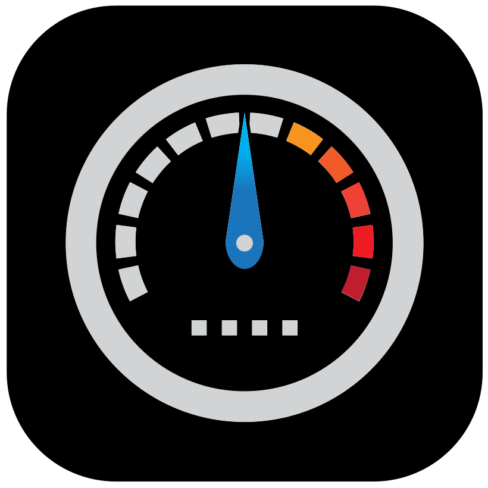
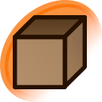

    

    <h1>
        Open Source Everything
    </h1>
    <h3>
        <i>
            "I FLOSS WITH FREEDOM!"
        </i>
    </h3>

**Open Source Everything** is a curated list of the best source-available and open source software, hardware, and standards. Unlike other lists that try to provide a wide selection of software, this list instead focuses on only the best software in each category.

While proprietary software is avoided on this list where possible, there are some circumstances where proprietary software provides a boost in privacy or security where no source-available alternative does. Those options are marked with the  stamp.

Some software or sections marked with the  stamp may not be the best software. Those require further examination and improvements before coming to a final conclusion.

It is not this list's job to tell you what software you *should* use. Some software on here may even be software you *shouldn't* use. In the end, your preferences and choices are your own.

    <h1>
        
        Versioning
    </h1>

    <h3>
        Current version: <tt>158.2025.11.5.0</tt>
    </h3>

The version code follows the format:
- **Total Releases:** The total number of releases since creation
- **Year:** The year of the release
- **Month:** The month of the release
- **Day:** The day of the release
- **Daily Release Index:** Index of the releases made each day, beginning at 0

    <h1>
        
        Mirrors
    </h1>

Made by [An-anonymous-coder](https://gitlab.com/an-anonymous-coder1/Open-Source-Everything)

This repository is mirrored on other platforms. It was originally hosted on GitHub, but is now hosted on GitLab. It was at one point accidentally deleted on GitHub, so it shows up as a fork of another user's repository there after it was restored.

###  GitLab (Host)

https://gitlab.com/an-anonymous-coder1/Open-Source-Everything

###  GitHub (Mirror)

https://github.com/An-anonymous-coder/Open-Source-Everything

###  Codeberg (Mirror)

*Coming soon!*

    <h1>
        
        Legend
    </h1>

    <h3>
        Stamps
    </h3>

Stamps give you a general idea of the consensus around a piece of software. They help you gague which software is recommended by me and the open source community as a whole. They're magically delicious.

 **Verified best software:** Software that has been verified to be the best in its category. This does not gurantee quality.

 **This software is proprietary:** This software is not open source, but has a benefit to privacy or security that no open source option has.

 **My top choices:** My top choices for software in its category. Sometimes I prefer software that isn't on this list.

 **Personal favorites:** Software that has become a personal favorite of mine that I use daily.

 **This software has been used and inspected:** I have personally tried out this software to ensure the accuracy of its stamps.

 **This software is outdated or abandoned:** This software is no longer actively maintained, but no up-to-date alternative exists.

 **This section needs to be improved:** This software or category is lacking in details, and may not be best software. Please contribute if you can.

    <h3>
        Platforms
    </h3>

Platforms tell you on which devices software is available to be used. Because this list does not focus on a wide selection of software, alternatives may not be listed for some platforms.

 Available for Android devices

 Available for Apple devices

 Available for Linux devices

 Available for Windows devices

 Available through web browsers

    <h3>
        Interfaces
    </h3>

Sometimes best software isn't available for many platforms or doesn't have a UI. Those are given a special section to list clients, ports, forks, frontends, wrappers, GUIs, etc. for the software.

    <h1>
        
        Table of Contents
    </h1>

 [AI Tools & Services](#----------------ai-tools--services----)

 [Audio & Music](#----------------audio--music----)

 [Backup & Sync](#----------------backup--sync----)

 [Business & Commerce](#----------------business--commerce----)

 [CD/DVD Tools](#----------------cddvd-tools----)

 [Development](#----------------development----)

 [Digital Coins & Cryptocurrency](#----------------digital-coins--cryptocurrency----)

 [Education & Reference](#----------------education--reference----)

 [File Management](#----------------file-management----)

 [File Sharing](#----------------file-sharing----)

 [Games](#----------------games----)

 [Gaming Software](#----------------gaming-software----)

 [Home & Family](#----------------home--family----)

 [Network & Admin](#----------------network--admin----)

 [News & Books](#----------------news--books----)

 [Office & Productivity](#----------------office--productivity----)

 [Online Services](#----------------online-services----)

 [OS & Utilities](#----------------os--utilities----)

 [Photos & Graphics](#----------------photos--graphics----)

 [Religion & Prayer](#----------------religion--prayer----)

 [Remote Work & Education](#----------------remote-work--education----)

 [Security & Privacy](#----------------security--privacy----)

 [Social & Communications](#----------------social--communications----)

 [Sport & Health](#----------------sport--health----)

 [System & Hardware](#----------------system--hardware----)

 [Travel & Location](#----------------travel--location----)

 [Video & Movies](#----------------video--movies----)

 [Web Browsing](#----------------web-browsing----)

    <h1>
        
        AI Tools & Services
    </h1>

    <h3>
        AI Chatbots
    </h3>

    <table>
        <tr>
            <td rowspan="3">
                
            </td>
            <th colspan="2" style="text-align: center;">
                <a href="https://duck.ai/">
                    Duck.ai
                </a>
            </th>
        </tr>
        <tr>
            <th>
                Stamps
            </th>
            <td>
                
                
                
                
                
            </td>
        </tr>
        <tr>
            <th>
                Platforms
            </th>
            <td>
                
            </td>
        </tr>
    </table>
    <table>
        <tr>
            <td rowspan="3">
                
            </td>
            <th colspan="2" style="text-align: center;">
                <a href="https://ollama.com/">
                    Ollama
                </a>
            </th>
        </tr>
        <tr>
            <th>
                Stamps
            </th>
            <td>
                
                
                
            </td>
        </tr>
        <tr>
            <th>
                Platforms
            </th>
            <td>
                
                
                
            </td>
        </tr>
    </table>

    <h3>
        AI Coding Assistant Apps
    </h3>

    <table>
        <tr>
            <td rowspan="3">
                
            </td>
            <th colspan="2" style="text-align: center;">
                <a href="https://cerebrascoder.com/">
                    CerebrasCoder
                </a>
            </th>
        </tr>
        <tr>
            <th>
                Stamps
            </th>
            <td>
                
                
                
            </td>
        </tr>
        <tr>
            <th>
                Platforms
            </th>
            <td>
                
            </td>
        </tr>
    </table>

    <h3>
        AI Image Generators
    </h3>

    <table>
        <tr>
            <td rowspan="3">
                
            </td>
            <th colspan="2" style="text-align: center;">
                <a href="https://chat.qwen.ai/">
                    Qwen-Image
                </a>
            </th>
        </tr>
        <tr>
            <th>
                Stamps
            </th>
            <td>
                
                
                
            </td>
        </tr>
        <tr>
            <th>
                Platforms
            </th>
            <td>
                
                
                
                
            </td>
        </tr>
    </table>

    <h3>
        AI Music Generators 
    </h3>

    <table>
        <tr>
            <td rowspan="3">
                
            </td>
            <th colspan="2" style="text-align: center;">
                <a href="https://huggingface.co/stabilityai/stable-audio-open-1.0">
                    Stable Audio Open
                </a>
            </th>
        </tr>
        <tr>
            <th>
                Stamps
            </th>
            <td>
                
            </td>
        </tr>
        <tr>
            <th>
                Platforms
            </th>
            <td>
                
            </td>
        </tr>
    </table>

    <h3>
        AI Search Engines
    </h3>

    <table>
        <tr>
            <td rowspan="3">
                
            </td>
            <th colspan="2" style="text-align: center;">
                <a href="https://www.morphic.sh/">
                    Morphic
                </a>
            </th>
        </tr>
        <tr>
            <th>
                Stamps
            </th>
            <td>
                
                
                
            </td>
        </tr>
        <tr>
            <th>
                Platforms
            </th>
            <td>
                
            </td>
        </tr>
    </table>

    <h3>
        AI Video Generators 
    </h3>

    <table>
        <tr>
            <td rowspan="3">
                
            </td>
            <th colspan="2" style="text-align: center;">
                <a href="https://www.genmo.ai/">
                    Mochi AI
                </a>
            </th>
        </tr>
        <tr>
            <th>
                Stamps
            </th>
            <td>
                
            </td>
        </tr>
        <tr>
            <th>
                Platforms
            </th>
            <td>
                
            </td>
        </tr>
    </table>
    <table>
        <tr>
            <td rowspan="3">
                
            </td>
            <th colspan="2" style="text-align: center;">
                <a href="https://stability.ai/stable-video">
                    Stable Video Diffusion
                </a>
            </th>
        </tr>
        <tr>
            <th>
                Stamps
            </th>
            <td>
                
            </td>
        </tr>
        <tr>
            <th>
                Platforms
            </th>
            <td>
                
            </td>
        </tr>
    </table>

    <h3>
        Large Language Models
    </h3>

    <table>
        <tr>
            <td rowspan="3">
                
            </td>
            <th colspan="2" style="text-align: center;">
                <a href="https://www.deepseek.com/">
                    DeepSeek
                </a>
            </th>
        </tr>
        <tr>
            <th>
                Stamps
            </th>
            <td>
                
                
                
            </td>
        </tr>
        <tr>
            <th>
                Platforms
            </th>
            <td>
                
                
                
            </td>
        </tr>
    </table>
    <table>
        <tr>
            <td rowspan="3">
                
            </td>
            <th colspan="2" style="text-align: center;">
                <a href="https://chat.qwen.ai/">
                    Qwen
                </a>
            </th>
        </tr>
        <tr>
            <th>
                Stamps
            </th>
            <td>
                
                
                
            </td>
        </tr>
        <tr>
            <th>
                Platforms
            </th>
            <td>
                
                
                
                
            </td>
        </tr>
    </table>

    <h1>
        
        Audio & Music
    </h1>

    <h3>
        Audio Codecs 
    </h3>

    <table>
        <tr>
            <td rowspan="3">
                
            </td>
            <th colspan="2" style="text-align: center;">
                <a href="https://xiph.org/flac/">
                    FLAC
                </a>
            </th>
        </tr>
        <tr>
            <th>
                Stamps
            </th>
            <td>
                
            </td>
        </tr>
        <tr>
            <th>
                Platforms
            </th>
            <td>
                
                
                
                
            </td>
        </tr>
    </table>

    <h3>
        Audio Editors
    </h3>

    <table>
        <tr>
            <td rowspan="3">
                
            </td>
            <th colspan="2" style="text-align: center;">
                <a href="https://www.audacityteam.org/">
                    Audacity
                </a>
            </th>
        </tr>
        <tr>
            <th>
                Stamps
            </th>
            <td>
                
                
                
            </td>
        </tr>
        <tr>
            <th>
                Platforms
            </th>
            <td>
                
                
                
            </td>
        </tr>
        <tr>
            <th colspan="3">
                

                    Interfaces
                

                <table>
                    <tr>
                        <td rowspan="3">
                            
                        </td>
                        <th colspan="2" style="text-align: center;">
                            <a href="https://tenacityaudio.org/">
                                Tenacity
                            </a>
                        </th>
                    </tr>
                    <tr>
                        <th>
                            Stamps
                        </th>
                        <td>
                            
                        </td>
                    </tr>
                    <tr>
                        <th>
                            Platforms
                        </th>
                        <td>
                            
                            
                            
                        </td>
                    </tr>
                </table>
            </th>
        </tr>
    </table>

    <h3>
        Audio Players
    </h3>

    <table>
        <tr>
            <td rowspan="3">
                
            </td>
            <th colspan="2" style="text-align: center;">
                <a href="https://retromusic.app/">
                    Retro Music Player
                </a>
            </th>
        </tr>
        <tr>
            <th>
                Stamps
            </th>
            <td>
                
                
                
                
            </td>
        </tr>
        <tr>
            <th>
                Platforms
            </th>
            <td>
                
            </td>
        </tr>
    </table>

    <h3>
        Audio Recorders
    </h3>

    <table>
        <tr>
            <td rowspan="3">
                
            </td>
            <th colspan="2" style="text-align: center;">
                <a href="https://github.com/FossifyOrg/Voice-Recorder">
                    Fossify Voice Recorder
                </a>
            </th>
        </tr>
        <tr>
            <th>
                Stamps
            </th>
            <td>
                
                
                
            </td>
        </tr>
        <tr>
            <th>
                Platforms
            </th>
            <td>
                
            </td>
        </tr>
    </table>

    <h3>
        Audio Transcription Tools
    </h3>

    <table>
        <tr>
            <td rowspan="3">
                
            </td>
            <th colspan="2" style="text-align: center;">
                <a href="https://openai.com/blog/whisper/">
                    Whisper
                </a>
            </th>
        </tr>
        <tr>
            <th>
                Stamps
            </th>
            <td>
                
                
                
            </td>
        </tr>
        <tr>
            <th>
                Platforms
            </th>
            <td>
                
                
                
            </td>
        </tr>
        <tr>
            <th colspan="3">
                

                    Interfaces
                

                <table>
                    <tr>
                        <td rowspan="3">
                            
                        </td>
                        <th colspan="2" style="text-align: center;">
                            <a href="https://github.com/soupslurpr/Transcribro">
                                Transcribro
                            </a>
                        </th>
                    </tr>
                    <tr>
                        <th>
                            Stamps
                        </th>
                        <td>
                            
                            
                            
                        </td>
                    </tr>
                    <tr>
                        <th>
                            Platforms
                        </th>
                        <td>
                            
                        </td>
                    </tr>
                </table>
            </th>
        </tr>
    </table>

    <h3>
        Internet Radio Serices
    </h3>

    <table>
        <tr>
            <td rowspan="3">
                
            </td>
            <th colspan="2" style="text-align: center;">
                <a href="https://www.radio-browser.info/">
                    radio-browser
                </a>
            </th>
        </tr>
        <tr>
            <th>
                Stamps
            </th>
            <td>
                
                
                
        </tr>
        <tr>
            <th>
                Platforms
            </th>
            <td>
                
                
                
                
                
            </td>
        </tr>
    </table>

    <h3>
        Lyrics Displayers 
    </h3>

    <h3>
        Metronomes
    </h3>

    <table>
        <tr>
            <td rowspan="3">
                
            </td>
            <th colspan="2" style="text-align: center;">
                <a href="https://codeberg.org/thetwom/metronome">
                    Metronome
                </a>
            </th>
        </tr>
        <tr>
            <th>
                Stamps
            </th>
            <td>
                
                
                
            </td>
        </tr>
        <tr>
            <th>
                Platforms
            </th>
            <td>
                
            </td>
        </tr>
    </table>

    <h3>
        Music Discovery Services
    </h3>

    <table>
        <tr>
            <td rowspan="3">
                
            </td>
            <th colspan="2" style="text-align: center;">
                <a href="https://musicbrainz.org/">
                    MusicBrainz
                </a>
            </th>
        </tr>
        <tr>
            <th>
                Stamps
            </th>
            <td>
                
                
                
            </td>
        </tr>
        <tr>
            <th>
                Platforms
            </th>
            <td>
                
                
            </td>
        </tr>
    </table>

    <h3>
        Music Downloaders
    </h3>

    <table>
        <tr>
            <td rowspan="3">
                
            </td>
            <th colspan="2" style="text-align: center;">
                <a href="https://spotdl.readthedocs.io/en/latest/">
                    spotDL
                </a>
            </th>
        </tr>
        <tr>
            <th>
                Stamps
            </th>
            <td>
                
                
                
            </td>
        </tr>
        <tr>
            <th>
                Platforms
            </th>
            <td>
                
                
                
            </td>
        </tr>
        <tr>
            <th colspan="3">
                

                    Interfaces
                

                <table>
                    <tr>
                        <td rowspan="3">
                            
                        </td>
                        <th colspan="2" style="text-align: center;">
                            <a href="https://github.com/Eutalix/Spowlo">
                                Spowlo
                            </a>
                        </th>
                    </tr>
                    <tr>
                        <th>
                            Stamps
                        </th>
                        <td>
                            
                            
                            
                        </td>
                    </tr>
                    <tr>
                        <th>
                            Platforms
                        </th>
                        <td>
                            
                        </td>
                    </tr>
                </table>
            </th>
        </tr>
    </table>

    <h3>
        Music Production Apps 
    </h3>

    <table>
        <tr>
            <td rowspan="3">
                
            </td>
            <th colspan="2" style="text-align: center;">
                <a href="https://lmms.io/">
                    LMMS
                </a>
            </th>
        </tr>
        <tr>
            <th>
                Stamps
            </th>
            <td>
                
            </td>
        </tr>
        <tr>
            <th>
                Platforms
            </th>
            <td>
                
                
                
            </td>
        </tr>
    </table>
    <table>
        <tr>
            <td rowspan="3">
                
            </td>
            <th colspan="2" style="text-align: center;">
                <a href="https://musescore.org/">
                    MuseScore Studio
                </a>
            </th>
        </tr>
        <tr>
            <th>
                Stamps
            </th>
            <td>
                
            </td>
        </tr>
        <tr>
            <th>
                Platforms
            </th>
            <td>
                
                
                
                
            </td>
        </tr>
    </table>

    <h3>
        Music Recognition Apps
    </h3>

    <table>
        <tr>
            <td rowspan="3">
                
            </td>
            <th colspan="2" style="text-align: center;">
                <a href="https://github.com/aleksey-saenko/MusicRecognizer">
                    Audile
                </a>
            </th>
        </tr>
        <tr>
            <th>
                Stamps
            </th>
            <td>
            
                
                
            </td>
        </tr>
        <tr>
            <th>
                Platforms
            </th>
            <td>
                
            </td>
        </tr>
    </table>

    <h3>
        Music Streaming Services
    </h3>

    <table>
        <tr>
            <td rowspan="3">
                
            </td>
            <th colspan="2" style="text-align: center;">
                <a href="https://audius.co/">
                    Audius
                </a>
            </th>
        </tr>
        <tr>
            <th>
                Stamps
            </th>
            <td>
                
                
                
            </td>
        </tr>
        <tr>
            <th>
                Platforms
            </th>
            <td>
                
                
                
                
                
            </td>
        </tr>
    </table>
    <table>
        <tr>
            <td rowspan="3">
                
            </td>
            <th colspan="2" style="text-align: center;">
                <a href="https://www.funkwhale.audio/">
                    Funkwhale
                </a>
            </th>
        </tr>
        <tr>
            <th>
                Stamps
            </th>
            <td>
                
                
            </td>
        </tr>
        <tr>
            <th>
                Platforms
            </th>
            <td>
                
                
                
                
                
            </td>
        </tr>
    </table>

    <h3>
        Podcast Players
    </h3>

    <table>
        <tr>
            <td rowspan="3">
                
            </td>
            <th colspan="2" style="text-align: center;">
                <a href="https://antennapod.org/">
                    AntennaPod
                </a>
            </th>
        </tr>
        <tr>
            <th>
                Stamps
            </th>
            <td>
                
                
            </td>
        </tr>
        <tr>
            <th>
                Platforms
            </th>
            <td>
                
            </td>
        </tr>
    </table>

    <h3>
        Soundboards 
    </h3>

    <table>
        <tr>
            <td rowspan="3">
                
            </td>
            <th colspan="2" style="text-align: center;">
                <a href="https://soundux.rocks/">
                    Soundux
                </a>
            </th>
        </tr>
        <tr>
            <th>
                Stamps
            </th>
            <td>
                
            </td>
        </tr>
        <tr>
            <th>
                Platforms
            </th>
            <td>
                
                
            </td>
        </tr>
    </table>

    <h3>
        Spectrogram Visualizers 
    </h3>

    <table>
        <tr>
            <td rowspan="3">
                
            </td>
            <th colspan="2" style="text-align: center;">
                <a href="https://friture.org/">
                    Friture
                </a>
            </th>
        </tr>
        <tr>
            <th>
                Stamps
            </th>
            <td>
                
            </td>
        </tr>
        <tr>
            <th>
                Platforms
            </th>
            <td>
                
                
                
            </td>
        </tr>
    </table>

    <h3>
        SSTV Image Decoders 
    </h3>

    <table>
        <tr>
            <td rowspan="3">
                
            </td>
            <th colspan="2" style="text-align: center;">
                <a href="https://github.com/xdsopl/robot36/">
                    Robot36
                </a>
            </th>
        </tr>
        <tr>
            <th>
                Stamps
            </th>
            <td>
                
            </td>
        </tr>
        <tr>
            <th>
                Platforms
            </th>
            <td>
                
            </td>
        </tr>
    </table>

    <h3>
        SSTV Image Encoders 
    </h3>

    <table>
        <tr>
            <td rowspan="3">
                
            </td>
            <th colspan="2" style="text-align: center;">
                <a href="https://github.com/olgamiller/SSTVEncoder2">
                    SSTV Encoder
                </a>
            </th>
        </tr>
        <tr>
            <th>
                Stamps
            </th>
            <td>
                
            </td>
        </tr>
        <tr>
            <th>
                Platforms
            </th>
            <td>
                
            </td>
        </tr>
    </table>

    <h3>
        Voice Changers 
    </h3>

    <table>
        <tr>
            <td rowspan="3">
                
            </td>
            <th colspan="2" style="text-align: center;">
                <a href="https://github.com/w-okada/voice-changer">
                    VCClient
                </a>
            </th>
        </tr>
        <tr>
            <th>
                Stamps
            </th>
            <td>
                
            </td>
        </tr>
        <tr>
            <th>
                Platforms
            </th>
            <td>
                
                
            </td>
        </tr>
    </table>

    <h1>
        
        Backup & Sync
    </h1>

    <h3>
        Backup Clients
    </h3>

    <table>
        <tr>
            <td rowspan="3">
                
            </td>
            <th colspan="2" style="text-align: center;">
                <a href="https://www.borgbackup.org/">
                    BorgBackup
                </a>
            </th>
        </tr>
        <tr>
            <th>
                Stamps
            </th>
            <td>
                
                
                
            </td>
        </tr>
        <tr>
            <th>
                Platforms
            </th>
            <td>
                
                
            </td>
        </tr>
        <tr>
            <th colspan="3">
                

                    Interfaces
                

                <table>
                    <tr>
                        <td rowspan="3">
                            
                        </td>
                        <th colspan="2" style="text-align: center;">
                            <a href="https://apps.gnome.org/PikaBackup/">
                                Pika Backup
                            </a>
                        </th>
                    </tr>
                    <tr>
                        <th>
                            Stamps
                        </th>
                        <td>
                            
                            
                            
                        </td>
                    </tr>
                    <tr>
                        <th>
                            Platforms
                        </th>
                        <td>
                            
                        </td>
                    </tr>
                </table>
            </th>
        </tr>
    </table>
    <table>
        <tr>
            <td rowspan="3">
                
            </td>
            <th colspan="2" style="text-align: center;">
                <a href="https://seedvault.app/">
                    Seedvault
                </a>
            </th>
        </tr>
        <tr>
            <th>
                Stamps
            </th>
            <td>
                
                
                
                
            </td>
        </tr>
        <tr>
            <th>
                Platforms
            </th>
            <td>
                
            </td>
        </tr>
    </table>

    <h3>
        Cloud Storage Services 
    </h3>

    <table>
        <tr>
            <td rowspan="3">
                
            </td>
            <th colspan="2" style="text-align: center;">
                <a href="https://nextcloud.com/">
                    Nextcloud
                </a>
            </th>
        </tr>
        <tr>
            <th>
                Stamps
            </th>
            <td>
                
            </td>
        </tr>
        <tr>
            <th>
                Platforms
            </th>
            <td>
                
                
                
                
                
            </td>
        </tr>
    </table>

    <h3>
        Disk Cloning Tools 
    </h3>

    <h3>
        File Sync Tools
    </h3>

    <table>
        <tr>
            <td rowspan="3">
                
            </td>
            <th colspan="2" style="text-align: center;">
                <a href="https://syncthing.net/">
                    Syncthing
                </a>
            </th>
        </tr>
        <tr>
            <th>
                Stamps
            </th>
            <td>
                
                
            </td>
        </tr>
        <tr>
            <th>
                Platforms
            </th>
            <td>
                
                
                
            </td>
        </tr>
        <tr>
            <th colspan="3">
                

                    Interfaces
                

                <table>
                    <tr>
                        <td rowspan="3">
                            
                        </td>
                        <th colspan="2" style="text-align: center;">
                            <a href="https://github.com/Catfriend1/syncthing-android">
                                Syncthing-Fork
                            </a>
                        </th>
                    </tr>
                    <tr>
                        <th>
                            Stamps
                        </th>
                        <td>
                            
                            
                        </td>
                    </tr>
                    <tr>
                        <th>
                            Platforms
                        </th>
                        <td>
                            
                        </td>
                    </tr>
                </table>
            </th>
        </tr>
    </table>

    <h1>
        
        Business & Commerce
    </h1>

    <h3>
        Ad Networks 
    </h3>

    <table>
        <tr>
            <td rowspan="3">
                
            </td>
            <th colspan="2" style="text-align: center;">
                <a href="https://www.adex.network/">
                    AdEx
                </a>
            </th>
        </tr>
        <tr>
            <th>
                Stamps
            </th>
            <td>
                
            </td>
        </tr>
        <tr>
            <th>
                Platforms
            </th>
            <td>
                
            </td>
        </tr>
    </table>

    <h3>
        Budget Managers
    </h3>

    <table>
        <tr>
            <td rowspan="3">
                
            </td>
            <th colspan="2" style="text-align: center;">
                <a href="https://cashewapp.web.app/">
                    Cashew
                </a>
            </th>
        </tr>
        <tr>
            <th>
                Stamps
            </th>
            <td>
                
                
                
            </td>
        </tr>
        <tr>
            <th>
                Platforms
            </th>
            <td>
                
                
                
            </td>
        </tr>
    </table>
    <table>
        <tr>
            <td rowspan="3">
                
            </td>
            <th colspan="2" style="text-align: center;">
                <a href="https://www.gnucash.org/">
                    GnuCash
                </a>
            </th>
        </tr>
        <tr>
            <th>
                Stamps
            </th>
            <td>
                
            </td>
        </tr>
        <tr>
            <th>
                Platforms
            </th>
            <td>
                
                
                
            </td>
        </tr>
    </table>

    <h3>
        Cloud Computing Services
    </h3>

    <table>
        <tr>
            <td rowspan="3">
                
            </td>
            <th colspan="2" style="text-align: center;">
                <a href="https://boinc.berkeley.edu/">
                    BOINC
                </a>
            </th>
        </tr>
        <tr>
            <th>
                Stamps
            </th>
            <td>
                
                
                
            </td>
        </tr>
        <tr>
            <th>
                Platforms
            </th>
            <td>
                
                
                
                
            </td>
        </tr>
    </table>

    <h3>
        Coupon Finders 
    </h3>

    <table>
        <tr>
            <td rowspan="3">
                
            </td>
            <th colspan="2" style="text-align: center;">
                <a href="https://github.com/zeemouu/BeesWax/">
                    BeesWax
                </a>
            </th>
        </tr>
        <tr>
            <th>
                Stamps
            </th>
            <td>
                
            </td>
        </tr>
        <tr>
            <th>
                Platforms
            </th>
            <td>
                
            </td>
        </tr>
    </table>

    <h3>
        CRM Systems 
    </h3>

    <h3>
        E-commerce Systems 
    </h3>

    <h3>
        Email Marketing Services 
    </h3>

    <h3>
        Invoicing Software 
    </h3>

    <table>
        <tr>
            <td rowspan="3">
                
            </td>
            <th colspan="2" style="text-align: center;">
                <a href="https://www.invoiceplane.com/">
                    InvoicePlane
                </a>
            </th>
        </tr>
        <tr>
            <th>
                Stamps
            </th>
            <td>
                
            </td>
        </tr>
        <tr>
            <th>
                Platforms
            </th>
            <td>
                
            </td>
        </tr>
    </table>

    <h3>
        Online Banking Tools 
    </h3>

    <h3>
        Online Shops 
    </h3>

    <table>
        <tr>
            <td rowspan="3">
                
            </td>
            <th colspan="2" style="text-align: center;">
                <a href="https://coincards.com/us/">
                    Coincards
                </a>
            </th>
        </tr>
        <tr>
            <th>
                Stamps
            </th>
            <td>
                
                
            </td>
        </tr>
        <tr>
            <th>
                Platforms
            </th>
            <td>
                
            </td>
        </tr>
    </table>
    <table>
        <tr>
            <td rowspan="3">
                
            </td>
            <th colspan="2" style="text-align: center;">
                <a href="https://cryptwerk.com/pay-with/xmr/">
                    Cryptwerk
                </a>
            </th>
        </tr>
        <tr>
            <th>
                Stamps
            </th>
            <td>
                
                
            </td>
        </tr>
        <tr>
            <th>
                Platforms
            </th>
            <td>
                
            </td>
        </tr>
    </table>
    <table>
        <tr>
            <td rowspan="3">
                
            </td>
            <th colspan="2" style="text-align: center;">
                <a href="https://xmrbazaar.com/">
                    XmrBazaar
                </a>
            </th>
        </tr>
        <tr>
            <th>
                Stamps
            </th>
            <td>
                
                
            </td>
        </tr>
        <tr>
            <th>
                Platforms
            </th>
            <td>
                
            </td>
        </tr>
    </table>

    <h3>
        Payment Processing Services
    </h3>

    <table>
        <tr>
            <td rowspan="3">
                
            </td>
            <th colspan="2" style="text-align: center;">
                <a href="https://taler.net/">
                    GNU Taler
                </a>
            </th>
        </tr>
        <tr>
            <th>
                Stamps
            </th>
            <td>
                
                
        </tr>
        <tr>
            <th>
                Platforms
            </th>
            <td>
                
            </td>
        </tr>
    </table>

    <h3>
        Personal Finance Tools
    </h3>

    <table>
        <tr>
            <td rowspan="3">
                
            </td>
            <th colspan="2" style="text-align: center;">
                <a href="https://ivywallet.app/">
                    Ivy Wallet
                </a>
            </th>
        </tr>
        <tr>
            <th>
                Stamps
            </th>
            <td>
                
            </td>
        </tr>
        <tr>
            <th>
                Platforms
            </th>
            <td>
                
            </td>
        </tr>
    </table>

    <h3>
        Price Comparison Services 
    </h3>

    <h3>
        Rsum Builders 
    </h3>

    <table>
        <tr>
            <td rowspan="3">
                
            </td>
            <th colspan="2" style="text-align: center;">
                <a href="https://open-resume.com/">
                    OpenResume
                </a>
            </th>
        </tr>
        <tr>
            <th>
                Stamps
            </th>
            <td>
                
        </tr>
        <tr>
            <th>
                Platforms
            </th>
            <td>
                
            </td>
        </tr>
    </table>

    <h3>
        SEO Tools 
    </h3>

    <h3>
        Stock Trading Apps 
    </h3>

    <h3>
        Survey Creators
    </h3>

    <table>
        <tr>
            <td rowspan="3">
                
            </td>
            <th colspan="2" style="text-align: center;">
                <a href="https://www.limesurvey.org/">
                    LimeSurvey
                </a>
            </th>
        </tr>
        <tr>
            <th>
                Stamps
            </th>
            <td>
                
            </td>
        </tr>
        <tr>
            <th>
                Platforms
            </th>
            <td>
                
                
                
                
            </td>
        </tr>
    </table>

    <h3>
        Taxes
    </h3>

    <table>
        <tr>
            <td rowspan="3">
                
            </td>
            <th colspan="2" style="text-align: center;">
                <a href="https://github.com/IRS-Public/direct-file">
                    Direct File
                </a>
            </th>
        </tr>
        <tr>
            <th>
                Stamps
            </th>
            <td>
                
                
            </td>
        </tr>
        <tr>
            <th>
                Platforms
            </th>
            <td>
                
            </td>
        </tr>
    </table>

    <h3>
        Virtual Card Services
    </h3>

    <table>
        <tr>
            <td rowspan="3">
                
            </td>
            <th colspan="2" style="text-align: center;">
                <a href="https://privacy.com/">
                    Privacy.com
                </a>
            </th>
        </tr>
        <tr>
            <th>
                Stamps
            </th>
            <td>
                
                
                
            </td>
        </tr>
        <tr>
            <th>
                Platforms
            </th>
            <td>
                
                
                
            </td>
        </tr>
    </table>

    <h1>
        
        CD/DVD Tools
    </h1>

    <h3>
        Bootable Media Creators
    </h3>

    <table>
        <tr>
            <td rowspan="3">
                
            </td>
            <th colspan="2" style="text-align: center;">
                <a href="https://apps.gnome.org/DiskUtility/">
                    Disks
                </a>
            </th>
        </tr>
        <tr>
            <th>
                Stamps
            </th>
            <td>
                
                
                
            </td>
        </tr>
        <tr>
            <th>
                Platforms
            </th>
            <td>
                
            </td>
        </tr>
    </table>
    <table>
        <tr>
            <td rowspan="3">
                
            </td>
            <th colspan="2" style="text-align: center;">
                <a href="https://etchdroid.app/">
                    EtchDroid
                </a>
            </th>
        </tr>
        <tr>
            <th>
                Stamps
            </th>
            <td>
                
                
                
            </td>
        </tr>
        <tr>
            <th>
                Platforms
            </th>
            <td>
                
            </td>
        </tr>
    </table>
    <table>
        <tr>
            <td rowspan="3">
                
            </td>
            <th colspan="2" style="text-align: center;">
                <a href="https://rufus.ie/">
                    Rufus
                </a>
            </th>
        </tr>
        <tr>
            <th>
                Stamps
            </th>
            <td>
                
            </td>
        </tr>
        <tr>
            <th>
                Platforms
            </th>
            <td>
                
            </td>
        </tr>
    </table>

    <h3>
        Disc Burners
    </h3>

    <table>
        <tr>
            <td rowspan="3">
                
            </td>
            <th colspan="2" style="text-align: center;">
                <a href="https://wiki.gnome.org/Apps/Brasero">
                    Brasero
                </a>
            </th>
        </tr>
        <tr>
            <th>
                Stamps
            </th>
            <td>
                
                
                
            </td>
        </tr>
        <tr>
            <th>
                Platforms
            </th>
            <td>
                
            </td>
        </tr>
    </table>

    <h3>
        DVD Rippers
    </h3>

    <table>
        <tr>
            <td rowspan="3">
                
            </td>
            <th colspan="2" style="text-align: center;">
                <a href="https://apps.kde.org/k3b/">
                    K3b
                </a>
            </th>
        </tr>
        <tr>
            <th>
                Stamps
            </th>
            <td>
                
                
            </td>
        </tr>
        <tr>
            <th>
                Platforms
            </th>
            <td>
                
            </td>
        </tr>
    </table>

    <h1>
        
        Development
    </h1>

    <h3>
        Android Development Tools
    </h3>

    <table>
        <tr>
            <td rowspan="3">
                
            </td>
            <th colspan="2" style="text-align: center;">
                <a href="https://developer.android.com/studio">
                    Android Studio
                </a>
            </th>
        </tr>
        <tr>
            <th>
                Stamps
            </th>
            <td>
                
                
                
            </td>
        </tr>
        <tr>
            <th>
                Platforms
            </th>
            <td>
                
                
                
            </td>
        </tr>
    </table>

    <h3>
        Build Systems 
    </h3>

    <h3>
        Code Editors & IDEs
    </h3>

    <table>
        <tr>
            <td rowspan="3">
                
            </td>
            <th colspan="2" style="text-align: center;">
                <a href="https://apps.gnome.org/Builder/">
                    GNOME Builder
                </a>
            </th>
        </tr>
        <tr>
            <th>
                Stamps
            </th>
            <td>
                
                
                
            </td>
        </tr>
        <tr>
            <th>
                Platforms
            </th>
            <td>
                
            </td>
        </tr>
    </table>
    <table>
        <tr>
            <td rowspan="3">
                
            </td>
            <th colspan="2" style="text-align: center;">
                <a href="https://vscodium.com/">
                    VSCodium
                </a>
            </th>
        </tr>
        <tr>
            <th>
                Stamps
            </th>
            <td>
                
                
                
                
            </td>
        </tr>
        <tr>
            <th>
                Platforms
            </th>
            <td>
                
                
                
            </td>
        </tr>
    </table>

    <h3>
        Computer Vision
    </h3>

    <table>
        <tr>
            <td rowspan="3">
                
            </td>
            <th colspan="2" style="text-align: center;">
                <a href="https://opencv.org/">
                    OpenCV
                </a>
            </th>
        </tr>
        <tr>
            <th>
                Stamps
            </th>
            <td>
                
            </td>
        </tr>
        <tr>
            <th>
                Platforms
            </th>
            <td>
                
                
                
                
            </td>
        </tr>
    </table>

    <h3>
        Database Management Tools 
    </h3>

    <table>
        <tr>
            <td rowspan="3">
                
            </td>
            <th colspan="2" style="text-align: center;">
                <a href="https://github.com/dbeaver/dbeaver">
                    DBeaver
                </a>
            </th>
        </tr>
        <tr>
            <th>
                Stamps
            </th>
            <td>
                
            </td>
        </tr>
        <tr>
            <th>
                Platforms
            </th>
            <td>
                
                
                
            </td>
        </tr>
    </table>

    <h3>
        Decompilers
    </h3>

    <table>
        <tr>
            <td rowspan="3">
                
            </td>
            <th colspan="2" style="text-align: center;">
                <a href="https://apktool.org/">
                    Apktool
                </a>
            </th>
        </tr>
        <tr>
            <th>
                Stamps
            </th>
            <td>
                
                
            </td>
        </tr>
        <tr>
            <th>
                Platforms
            </th>
            <td>
                
                
                
            </td>
        </tr>
    </table>
    <table>
        <tr>
            <td rowspan="3">
                
            </td>
            <th colspan="2" style="text-align: center;">
                <a href="https://ghidra-sre.org/">
                    Ghidra
                </a>
            </th>
        </tr>
        <tr>
            <th>
                Stamps
            </th>
            <td>
                
                
            </td>
        </tr>
        <tr>
            <th>
                Platforms
            </th>
            <td>
                
                
                
            </td>
        </tr>
    </table>

    <h3>
        Design Languages
    </h3>

    <table>
        <tr>
            <td rowspan="3">
                
            </td>
            <th colspan="2" style="text-align: center;">
                <a href="https://gnome.pages.gitlab.gnome.org/libadwaita/">
                    Adwaita
                </a>
            </th>
        </tr>
        <tr>
            <th>
                Stamps
            </th>
            <td>
                
                
                
                
            </td>
        </tr>
        <tr>
            <th>
                Platforms
            </th>
            <td>
                
            </td>
        </tr>
    </table>
    <table>
        <tr>
            <td rowspan="3">
                
            </td>
            <th colspan="2" style="text-align: center;">
                <a href="https://material.io/">
                    Material Design
                </a>
            </th>
        </tr>
        <tr>
            <th>
                Stamps
            </th>
            <td>
                
                
                
                
            </td>
        </tr>
        <tr>
            <th>
                Platforms
            </th>
            <td>
                
                
                
                
                
            </td>
        </tr>
    </table>

    <h3>
        Documentation Generators
    </h3>

    <table>
        <tr>
            <td rowspan="3">
                
            </td>
            <th colspan="2" style="text-align: center;">
                <a href="https://devdocs.io/">
                    DevDocs
                </a>
            </th>
        </tr>
        <tr>
            <th>
                Stamps
            </th>
            <td>
                
                
            </td>
        </tr>
        <tr>
            <th>
                Platforms
            </th>
            <td>
                
            </td>
        </tr>
    </table>

    <h3>
        Game Development Tools
    </h3>

    <table>
        <tr>
            <td rowspan="3">
                
            </td>
            <th colspan="2" style="text-align: center;">
                <a href="https://godotengine.org/">
                    Godot Engine
                </a>
            </th>
        </tr>
        <tr>
            <th>
                Stamps
            </th>
            <td>
                
                
                
            </td>
        </tr>
        <tr>
            <th>
                Platforms
            </th>
            <td>
                
                
                
                
            </td>
        </tr>
    </table>

    <h3>
        GPU Acceleration
    </h3>

    <table>
        <tr>
            <td rowspan="3">
                
            </td>
            <th colspan="2" style="text-align: center;">
                <a href="https://www.amd.com/en/products/software/rocm.html">
                    ROCm
                </a>
            </th>
        </tr>
        <tr>
            <th>
                Stamps
            </th>
            <td>
                
                
            </td>
        </tr>
        <tr>
            <th>
                Platforms
            </th>
            <td>
                
                
            </td>
        </tr>
    </table>

    <h3>
        Graphics Libraries
    </h3>

    <table>
        <tr>
            <td rowspan="3">
                
            </td>
            <th colspan="2" style="text-align: center;">
                <a href="https://www.khronos.org/vulkan/">
                    Vulkan
                </a>
            </th>
        </tr>
        <tr>
            <th>
                Stamps
            </th>
            <td>
                
                
            </td>
        </tr>
        <tr>
            <th>
                Platforms
            </th>
            <td>
                
                
                
                
            </td>
        </tr>
    </table>

    <h3>
        Markup Languages
    </h3>

    <table>
        <tr>
            <td rowspan="3">
                
            </td>
            <th colspan="2" style="text-align: center;">
                <a href="https://html.spec.whatwg.org/multipage/">
                    HTML
                </a>
            </th>
        </tr>
        <tr>
            <th>
                Stamps
            </th>
            <td>
                
                
                
            </td>
        </tr>
        <tr>
            <th>
                Platforms
            </th>
            <td>
                
            </td>
        </tr>
    </table>

    <h3>
        Package Managers
    </h3>

    <table>
        <tr>
            <td rowspan="3">
                
            </td>
            <th colspan="2" style="text-align: center;">
                <a href="https://flatpak.org/">
                    Flatpak
                </a>
            </th>
        </tr>
        <tr>
            <th>
                Stamps
            </th>
            <td>
                
                
                
            </td>
        </tr>
        <tr>
            <th>
                Platforms
            </th>
            <td>
                
            </td>
        </tr>
    </table>

    <h3>
        Pastebin Services
    </h3>

    <table>
        <tr>
            <td rowspan="3">
                
            </td>
            <th colspan="2" style="text-align: center;">
                <a href="https://privatebin.info/">
                    PrivateBin
                </a>
            </th>
        </tr>
        <tr>
            <th>
                Stamps
            </th>
            <td>
                
                
            </td>
        </tr>
        <tr>
            <th>
                Platforms
            </th>
            <td>
                
            </td>
        </tr>
    </table>

    <h3>
        Programming Languages
    </h3>

    <table>
        <tr>
            <td rowspan="3">
                
            </td>
            <th colspan="2" style="text-align: center;">
                <a href="https://www.rust-lang.org/">
                    Rust
                </a>
            </th>
        </tr>
        <tr>
            <th>
                Stamps
            </th>
            <td>
                
                
                
                
            </td>
        </tr>
        <tr>
            <th>
                Platforms
            </th>
            <td>
                
                
                
            </td>
        </tr>
    </table>

    <h3>
        Software Frameworks
    </h3>

    <table>
        <tr>
            <td rowspan="3">
                
            </td>
            <th colspan="2" style="text-align: center;">
                <a href="https://www.gtk.org/">
                    GTK
                </a>
            </th>
        </tr>
        <tr>
            <th>
                Stamps
            </th>
            <td>
                
                
                
            </td>
        </tr>
        <tr>
            <th>
                Platforms
            </th>
            <td>
                
                
                
            </td>
        </tr>
    </table>

    <h3>
        Software Licenses
    </h3>

    <table>
        <tr>
            <td rowspan="3">
                
            </td>
            <th colspan="2" style="text-align: center;">
                <a href="https://www.gnu.org/licenses/gpl-3.0.en.html">
                    GNU General Public License
                </a>
            </th>
        </tr>
        <tr>
            <th>
                Stamps
            </th>
            <td>
                
                
                
                
            </td>
        </tr>
        <tr>
            <th>
                Platforms
            </th>
            <td>
                
            </td>
        </tr>
    </table>

    <h3>
        Source Code Hosting Services (Online)
    </h3>

    <table>
        <tr>
            <td rowspan="3">
                
            </td>
            <th colspan="2" style="text-align: center;">
                <a href="https://codeberg.org/">
                    Codeberg
                </a>
            </th>
        </tr>
        <tr>
            <th>
                Stamps
            </th>
            <td>
                
                
            </td>
        </tr>
        <tr>
            <th>
                Platforms
            </th>
            <td>
                
            </td>
        </tr>
    </table>
    <table>
        <tr>
            <td rowspan="3">
                
            </td>
            <th colspan="2" style="text-align: center;">
                <a href="https://about.gitlab.com/">
                    GitLab
                </a>
            </th>
        </tr>
        <tr>
            <th>
                Stamps
            </th>
            <td>
                
                
                
            </td>
        </tr>
        <tr>
            <th>
                Platforms
            </th>
            <td>
                
                
            </td>
        </tr>
    </table>

    <h3>
        Source Code Hosting Services (Self-hosted)
    </h3>

    <table>
        <tr>
            <td rowspan="3">
                
            </td>
            <th colspan="2" style="text-align: center;">
                <a href="https://forgejo.org/">
                    Forgejo
                </a>
            </th>
        </tr>
        <tr>
            <th>
                Stamps
            </th>
            <td>
                
                
            </td>
        </tr>
        <tr>
            <th>
                Platforms
            </th>
            <td>
                
            </td>
        </tr>
    </table>

    <h3>
        Static Site Generators
    </h3>

    <table>
        <tr>
            <td rowspan="3">
                
            </td>
            <th colspan="2" style="text-align: center;">
                <a href="URL">
                    Jekyll
                </a>
            </th>
        </tr>
        <tr>
            <th>
                Stamps
            </th>
            <td>
                
                
            </td>
        </tr>
        <tr>
            <th>
                Platforms
            </th>
            <td>
                
                
                
            </td>
        </tr>
    </table>
    <table>
        <tr>
            <td rowspan="3">
                
            </td>
            <th colspan="2" style="text-align: center;">
                <a href="https://rust-lang.github.io/mdBook/">
                    mdBook
                </a>
            </th>
        </tr>
        <tr>
            <th>
                Stamps
            </th>
            <td>
                
                
                
            </td>
        </tr>
        <tr>
            <th>
                Platforms
            </th>
            <td>
                
                
                
            </td>
        </tr>
    </table>

    <h3>
        Style Sheet Languages
    </h3>

    <table>
        <tr>
            <td rowspan="3">
                
            </td>
            <th colspan="2" style="text-align: center;">
                <a href="https://www.w3.org/Style/CSS/">
                    CSS
                </a>
            </th>
        </tr>
        <tr>
            <th>
                Stamps
            </th>
            <td>
                
                
                
            </td>
        </tr>
        <tr>
            <th>
                Platforms
            </th>
            <td>
                
            </td>
        </tr>
    </table>

    <h3>
        UI Design Tools
    </h3>

    <table>
        <tr>
            <td rowspan="3">
                
            </td>
            <th colspan="2" style="text-align: center;">
                <a href="https://penpot.app/">
                    Penpot
                </a>
            </th>
        </tr>
        <tr>
            <th>
                Stamps
            </th>
            <td>
                
                
            </td>
        </tr>
        <tr>
            <th>
                Platforms
            </th>
            <td>
                
            </td>
        </tr>
    </table>

    <h3>
        Version Control Systems
    </h3>

    <table>
        <tr>
            <td rowspan="3">
                
            </td>
            <th colspan="2" style="text-align: center;">
                <a href="https://git-scm.com/">
                    Git
                </a>
            </th>
        </tr>
        <tr>
            <th>
                Stamps
            </th>
            <td>
                
                
                
            </td>
        </tr>
        <tr>
            <th>
                Platforms
            </th>
            <td>
                
                
                
                
            </td>
        </tr>
    </table>

    <h3>
        Web Debuggers
    </h3>

    <table>
        <tr>
            <td rowspan="3">
                
            </td>
            <th colspan="2" style="text-align: center;">
                <a href="https://developer.chrome.com/docs/devtools">
                    Chrome DevTools
                </a>
            </th>
        </tr>
        <tr>
            <th>
                Stamps
            </th>
            <td>
                
                
                
            </td>
        </tr>
        <tr>
            <th>
                Platforms
            </th>
            <td>
                
                
                
            </td>
        </tr>
    </table>
    <table>
        <tr>
            <td rowspan="3">
                
            </td>
            <th colspan="2" style="text-align: center;">
                <a href="https://firefox-source-docs.mozilla.org/devtools-user/index.html">
                    Firefox DevTools
                </a>
            </th>
        </tr>
        <tr>
            <th>
                Stamps
            </th>
            <td>
                
                
            </td>
        </tr>
        <tr>
            <th>
                Platforms
            </th>
            <td>
                
                
                
            </td>
        </tr>
    </table>

    <h3>
        Web Servers
    </h3>

    <table>
        <tr>
            <td rowspan="3">
                
            </td>
            <th colspan="2" style="text-align: center;">
                <a href="https://httpd.apache.org/">
                    Apache HTTP Server
                </a>
            </th>
        </tr>
        <tr>
            <th>
                Stamps
            </th>
            <td>
                
            </td>
        </tr>
        <tr>
            <th>
                Platforms
            </th>
            <td>
                
                
                
            </td>
        </tr>
    </table>
    <table>
        <tr>
            <td rowspan="3">
                
            </td>
            <th colspan="2" style="text-align: center;">
                <a href="https://nginx.com/">
                    nginx
                </a>
            </th>
        </tr>
        <tr>
            <th>
                Stamps
            </th>
            <td>
                
            </td>
        </tr>
        <tr>
            <th>
                Platforms
            </th>
            <td>
                
                
            </td>
        </tr>
    </table>

    <h1>
        
        Digital Coins & Cryptocurrency
    </h1>

    <h3>
        Anti-KYC
    </h3>

    <table>
        <tr>
            <td rowspan="3">
                
            </td>
            <th colspan="2" style="text-align: center;">
                <a href="https://kycnot.me/">
                    KYCnot.me
                </a>
            </th>
        </tr>
        <tr>
            <th>
                Stamps
            </th>
            <td>
                
                
                
            </td>
        </tr>
        <tr>
            <th>
                Platforms
            </th>
            <td>
                
            </td>
        </tr>
    </table>

    <h3>
        Cryptocurrency ATM Maps
    </h3>

    <table>
        <tr>
            <td rowspan="3">
                
            </td>
            <th colspan="2" style="text-align: center;">
                <a href="https://btcmap.org/">
                    BTC Map
                </a>
            </th>
        </tr>
        <tr>
            <th>
                Stamps
            </th>
            <td>
                
                
            </td>
        </tr>
        <tr>
            <th>
                Platforms
            </th>
            <td>
                
                
                
            </td>
        </tr>
    </table>

    <h3>
        Crypto Miners
    </h3>

    <table>
        <tr>
            <td rowspan="3">
                
            </td>
            <th colspan="2" style="text-align: center;">
                <a href="https://xmrig.com/">
                    XMRig
                </a>
            </th>
        </tr>
        <tr>
            <th>
                Stamps
            </th>
            <td>
                
                
                
            </td>
        </tr>
        <tr>
            <th>
                Platforms
            </th>
            <td>
                
                
                
            </td>
        </tr>
    </table>

    <h3>
        Crypto Wallets
    </h3>

    <table>
        <tr>
            <td rowspan="3">
                
            </td>
            <th colspan="2" style="text-align: center;">
                <a href="https://github.com/monero-project/monero-gui">
                    Monero GUI
                </a>
            </th>
        </tr>
        <tr>
            <th>
                Stamps
            </th>
            <td>
                
                
                
            </td>
        </tr>
        <tr>
            <th>
                Platforms
            </th>
            <td>
                
                
                
            </td>
        </tr>
    </table>
    <table>
        <tr>
            <td rowspan="3">
                
            </td>
            <th colspan="2" style="text-align: center;">
                <a href="https://monero.com/">
                    Monero.com
                </a>
            </th>
        </tr>
        <tr>
            <th>
                Stamps
            </th>
            <td>
                
                
                
            </td>
        </tr>
        <tr>
            <th>
                Platforms
            </th>
            <td>
                
                
                
                
            </td>
        </tr>
    </table>

    <h3>
        Cryptocurrency Coins
    </h3>

    <table>
        <tr>
            <td rowspan="3">
                
            </td>
            <th colspan="2" style="text-align: center;">
                <a href="https://getmonero.org/home">
                    Monero
                </a>
            </th>
        </tr>
        <tr>
            <th>
                Stamps
            </th>
            <td>
                
                
                
                
            </td>
        </tr>
        <tr>
            <th>
                Platforms
            </th>
            <td>
                
                
                
            </td>
        </tr>
    </table>

    <h3>
        Cryptocurrency Exchanges
    </h3>

    <table>
        <tr>
            <td rowspan="3">
                
            </td>
            <th colspan="2" style="text-align: center;">
                <a href="https://bisq.network/">
                    Bisq
                </a>
            </th>
        </tr>
        <tr>
            <th>
                Stamps
            </th>
            <td>
                
                
                
            </td>
        </tr>
        <tr>
            <th>
                Platforms
            </th>
            <td>
                
                
                
                
            </td>
        </tr>
    </table>

    <h3>
        Hardware Wallets
    </h3>

    <table>
        <tr>
            <td rowspan="3">
                
            </td>
            <th colspan="2" style="text-align: center;">
                <a href="https://www.ledger.com/">
                    Ledger
                </a>
            </th>
        </tr>
        <tr>
            <th>
                Stamps
            </th>
            <td>
                
                
            </td>
        </tr>
        <tr>
            <th>
                Platforms
            </th>
            <td>
                
                
                
                
            </td>
        </tr>
    </table>

    <h1>
        
        Education & Reference
    </h1>

    <h3>
        2D Graphing Calculators
    </h3>

    <table>
        <tr>
            <td rowspan="3">
                
            </td>
            <th colspan="2" style="text-align: center;">
                <a href="https://www.geogebra.org/graphing">
                    GeoGebra Graphing Calculator
                </a>
            </th>
        </tr>
        <tr>
            <th>
                Stamps
            </th>
            <td>
                
                
                
            </td>
        </tr>
        <tr>
            <th>
                Platforms
            </th>
            <td>
                
                
                
                
            </td>
        </tr>
    </table>

    <h3>
        3D Graphing Calculators
    </h3>

    <table>
        <tr>
            <td rowspan="3">
                
            </td>
            <th colspan="2" style="text-align: center;">
                <a href="https://www.geogebra.org/3d">
                    GeoGebra 3D Calculator
                </a>
            </th>
        </tr>
        <tr>
            <th>
                Stamps
            </th>
            <td>
                
                
                
            </td>
        </tr>
        <tr>
            <th>
                Platforms
            </th>
            <td>
                
                
                
            </td>
        </tr>
    </table>

    <h3>
        Academic Research Tools 
    </h3>

    <h3>
        Circuit Simulators 
    </h3>

    <table>
        <tr>
            <td rowspan="3">
                
            </td>
            <th colspan="2" style="text-align: center;">
                <a href="https://www.kicad.org/">
                    KiCad
                </a>
            </th>
        </tr>
        <tr>
            <th>
                Stamps
            </th>
            <td>
                
            </td>
        </tr>
        <tr>
            <th>
                Platforms
            </th>
            <td>
                
                
                
            </td>
        </tr>
    </table>

    <h3>
        Code Learning Services
    </h3>

    <table>
        <tr>
            <td rowspan="3">
                
            </td>
            <th colspan="2" style="text-align: center;">
                <a href="https://exercism.org/">
                    Exercism
                </a>
            </th>
        </tr>
        <tr>
            <th>
                Stamps
            </th>
            <td>
                
                
                
            </td>
        </tr>
        <tr>
            <th>
                Platforms
            </th>
            <td>
                
            </td>
        </tr>
    </table>
    <table>
        <tr>
            <td rowspan="3">
                
            </td>
            <th colspan="2" style="text-align: center;">
                <a href="https://www.freecodecamp.org/">
                    freeCodeCamp
                </a>
            </th>
        </tr>
        <tr>
            <th>
                Stamps
            </th>
            <td>
                
                
                
            </td>
        </tr>
        <tr>
            <th>
                Platforms
            </th>
            <td>
                
                
            </td>
        </tr>
    </table>

    <h3>
        Dictionaries 
    </h3>

    <table>
        <tr>
            <td rowspan="3">
                
            </td>
            <th colspan="2" style="text-align: center;">
                <a href="https://www.wiktionary.org/">
                    Wiktionary
                </a>
            </th>
        </tr>
        <tr>
            <th>
                Stamps
            </th>
            <td>
                
                
                
            </td>
        </tr>
        <tr>
            <th>
                Platforms
            </th>
            <td>
                
                
                
                
                
            </td>
        </tr>
    </table>

    <h3>
        Encyclopedias
    </h3>

    <table>
        <tr>
            <td rowspan="3">
                
            </td>
            <th colspan="2" style="text-align: center;">
                <a href="https://www.kiwix.org/">
                    Kiwix
                </a>
            </th>
        </tr>
        <tr>
            <th>
                Stamps
            </th>
            <td>
                
                
            </td>
        </tr>
        <tr>
            <th>
                Platforms
            </th>
            <td>
                
                
                
                
            </td>
        </tr>
    </table>
    <table>
        <tr>
            <td rowspan="3">
                
            </td>
            <th colspan="2" style="text-align: center;">
                <a href="https://www.wikipedia.org/">
                    Wikipedia
                </a>
            </th>
        </tr>
        <tr>
            <th>
                Stamps
            </th>
            <td>
                
                
                
            </td>
        </tr>
        <tr>
            <th>
                Platforms
            </th>
            <td>
                
                
                
            </td>
        </tr>
        <tr>
            <th colspan="3">
                

                    Interfaces
                

                <table>
                    <tr>
                        <td rowspan="3">
                            
                        </td>
                        <th colspan="2" style="text-align: center;">
                            <a href="https://github.com/nsh07/WikiReader">
                                WikiReader
                            </a>
                        </th>
                    </tr>
                    <tr>
                        <th>
                            Stamps
                        </th>
                        <td>
                            
                            
                            
                        </td>
                    </tr>
                    <tr>
                        <th>
                            Platforms
                        </th>
                        <td>
                            
                        </td>
                    </tr>
                </table>
            </th>
        </tr>
    </table>

    <h3>
        Flashcard Learning Tools
    </h3>

    <table>
        <tr>
            <td rowspan="3">
                
            </td>
            <th colspan="2" style="text-align: center;">
                <a href="https://apps.ankiweb.net/">
                    Anki
                </a>
            </th>
        </tr>
        <tr>
            <th>
                Stamps
            </th>
            <td>
                
                
                
            </td>
        </tr>
        <tr>
            <th>
                Platforms
            </th>
            <td>
                
                
                
            </td>
        </tr>
        <tr>
            <th colspan="3">
                

                    Interfaces
                

                <table>
                    <tr>
                        <td rowspan="3">
                            
                        </td>
                        <th colspan="2" style="text-align: center;">
                            <a href="https://github.com/ankidroid/Anki-Android/">
                                AnkiDroid
                            </a>
                        </th>
                    </tr>
                    <tr>
                        <th>
                            Stamps
                        </th>
                        <td>
                            
                            
                            
                        </td>
                    </tr>
                    <tr>
                        <th>
                            Platforms
                        </th>
                        <td>
                            
                        </td>
                    </tr>
                </table>
            </th>
        </tr>
    </table>

    <h3>
        Fractal Explorers
    </h3>

    <table>
        <tr>
            <td rowspan="3">
                
            </td>
            <th colspan="2" style="text-align: center;">
                <a href="https://xaos-project.github.io/">
                    Xaos
                </a>
            </th>
        </tr>
        <tr>
            <th>
                Stamps
            </th>
            <td>
                
                
                
            </td>
        </tr>
        <tr>
            <th>
                Platforms
            </th>
            <td>
                
                
                
                
            </td>
        </tr>
    </table>

    <h3>
        Grade Calculators 
    </h3>

    <h3>
        Grammar Checkers
    </h3>

    <table>
        <tr>
            <td rowspan="3">
                
            </td>
            <th colspan="2" style="text-align: center;">
                <a href="https://languagetool.org/">
                    LanguageTool
                </a>
            </th>
        </tr>
        <tr>
            <th>
                Stamps
            </th>
            <td>
                
                
                
            </td>
        </tr>
        <tr>
            <th>
                Platforms
            </th>
            <td>
                
                
                
                
            </td>
        </tr>
    </table>

    <h3>
        Language Learning Tools
    </h3>

    <table>
        <tr>
            <td rowspan="3">
                
            </td>
            <th colspan="2" style="text-align: center;">
                <a href="https://librelingo.app/">
                    LibreLingo
                </a>
            </th>
        </tr>
        <tr>
            <th>
                Stamps
            </th>
            <td>
                
                
                
            </td>
        </tr>
        <tr>
            <th>
                Platforms
            </th>
            <td>
                
            </td>
        </tr>
    </table>

    <h3>
        Live Polling 
    </h3>

    <table>
        <tr>
            <td rowspan="3">
                
            </td>
            <th colspan="2" style="text-align: center;">
                <a href="https://particify.de/">
                    Particify
                </a>
            </th>
        </tr>
        <tr>
            <th>
                Stamps
            </th>
            <td>
                
            </td>
        </tr>
        <tr>
            <th>
                Platforms
            </th>
            <td>
                
            </td>
        </tr>
    </table>

    <h3>
        Math Solvers 
    </h3>

    <h3>
        Periodic tables
    </h3>

    <table>
        <tr>
            <td rowspan="3">
                
            </td>
            <th colspan="2" style="text-align: center;">
                <a href="https://jlindemann.se/homepage/atomic-periodic-table/">
                    Atomic  Periodic Table
                </a>
            </th>
        </tr>
        <tr>
            <th>
                Stamps
            </th>
            <td>
                
                
            </td>
        </tr>
        <tr>
            <th>
                Platforms
            </th>
            <td>
                
                
            </td>
        </tr>
    </table>
    <table>
        <tr>
            <td rowspan="3">
                
            </td>
            <th colspan="2" style="text-align: center;">
                <a href="https://codeberg.org/lo-vely/nucleus">
                    Nucleus
                </a>
            </th>
        </tr>
        <tr>
            <th>
                Stamps
            </th>
            <td>
                
                
            </td>
        </tr>
        <tr>
            <th>
                Platforms
            </th>
            <td>
                
            </td>
        </tr>
    </table>

    <h3>
        Q&A Services
    </h3>

    <table>
        <tr>
            <td rowspan="3">
                
            </td>
            <th colspan="2" style="text-align: center;">
                <a href="https://codidact.com/">
                    Codidact
                </a>
            </th>
        </tr>
        <tr>
            <th>
                Stamps
            </th>
            <td>
                
                
                
            </td>
        </tr>
        <tr>
            <th>
                Platforms
            </th>
            <td>
                
            </td>
        </tr>
    </table>

    <h3>
        Research Managers
    </h3>

    <table>
        <tr>
            <td rowspan="3">
                
            </td>
            <th colspan="2" style="text-align: center;">
                <a href="https://www.zotero.org/">
                    Zotero
                </a>
            </th>
        </tr>
        <tr>
            <th>
                Stamps
            </th>
            <td>
                
                
            </td>
        </tr>
        <tr>
            <th>
                Platforms
            </th>
            <td>
                
                
                
            </td>
        </tr>
    </table>

    <h3>
        Star Maps
    </h3>

    <table>
        <tr>
            <td rowspan="3">
                
            </td>
            <th colspan="2" style="text-align: center;">
                <a href="https://github.com/sky-map-team/stardroid">
                    Sky Map
                </a>
            </th>
        </tr>
        <tr>
            <th>
                Stamps
            </th>
            <td>
                
            </td>
        </tr>
        <tr>
            <th>
                Platforms
            </th>
            <td>
                
            </td>
        </tr>
    </table>

    <h3>
        Thesauruses 
    </h3>

    <h3>
        Translators
    </h3>

    <table>
        <tr>
            <td rowspan="3">
                
            </td>
            <th colspan="2" style="text-align: center;">
                <a href="https://libretranslate.com/">
                    LibreTranslate
                </a>
            </th>
        </tr>
        <tr>
            <th>
                Stamps
            </th>
            <td>
                
                
                
            </td>
        </tr>
        <tr>
            <th>
                Platforms
            </th>
            <td>
                
            </td>
        </tr>
        <tr>
            <th colspan="3">
                

                    Interfaces
                

                <table>
                    <tr>
                        <td rowspan="3">
                            
                        </td>
                        <th colspan="2" style="text-align: center;">
                            <a href="https://github.com/you-apps/TranslateYou">
                                Translate You
                            </a>
                        </th>
                    </tr>
                    <tr>
                        <th>
                            Stamps
                        </th>
                        <td>
                            
                            
                            
                        </td>
                    </tr>
                    <tr>
                        <th>
                            Platforms
                        </th>
                        <td>
                            
                        </td>
                    </tr>
                </table>
            </th>
        </tr>
    </table>

    <h3>
        Typing Tutor
    </h3>

    <table>
        <tr>
            <td rowspan="3">
                
            </td>
            <th colspan="2" style="text-align: center;">
                <a href="https://monkeytype.com/">
                    Monkeytype
                </a>
            </th>
        </tr>
        <tr>
            <th>
                Stamps
            </th>
            <td>
                
                
                
            </td>
        </tr>
        <tr>
            <th>
                Platforms
            </th>
            <td>
                
            </td>
        </tr>
    </table>

    <h3>
        Web Archiving Services
    </h3>

    <table>
        <tr>
            <td rowspan="3">
                
            </td>
            <th colspan="2" style="text-align: center;">
                <a href="https://web.archive.org/">
                    Wayback Machine
                </a>
            </th>
        </tr>
        <tr>
            <th>
                Stamps
            </th>
            <td>
                
                
                
            </td>
        </tr>
        <tr>
            <th>
                Platforms
            </th>
            <td>
                
                
                
            </td>
        </tr>
    </table>

    <h1>
        
        File Management
    </h1>

    <h3>
        Document Formats
    </h3>

    <table>
        <tr>
            <td rowspan="3">
                
            </td>
            <th colspan="2" style="text-align: center;">
                <a href="https://www.oasis-open.org/committees/tc_home.php?wg_abbrev=office">
                    Open Document Format
                </a>
            </th>
        </tr>
        <tr>
            <th>
                Stamps
            </th>
            <td>
                
                
                
            </td>
        </tr>
        <tr>
            <th>
                Platforms
            </th>
            <td>
                
                
                
                
            </td>
        </tr>
    </table>

    <h3>
        File Archivers
    </h3>

    <table>
        <tr>
            <td rowspan="3">
                
            </td>
            <th colspan="2" style="text-align: center;">
                <a href="https://www.7-zip.org/">
                    7-Zip
                </a>
            </th>
        </tr>
        <tr>
            <th>
                Stamps
            </th>
            <td>
                
                
                
            </td>
        </tr>
        <tr>
            <th>
                Platforms
            </th>
            <td>
                
                
                
            </td>
        </tr>
    </table>
    <table>
        <tr>
            <td rowspan="3">
                
            </td>
            <th colspan="2" style="text-align: center;">
                <a href="https://peazip.github.io/">
                    PeaZip
                </a>
            </th>
        </tr>
        <tr>
            <th>
                Stamps
            </th>
            <td>
                
            </td>
        </tr>
        <tr>
            <th>
                Platforms
            </th>
            <td>
                
                
                
            </td>
        </tr>
    </table>

    <h3>
        File Managers 
    </h3>

    <h3>
        Metadata Editors 
    </h3>

    <table>
        <tr>
            <td rowspan="3">
                
            </td>
            <th colspan="2" style="text-align: center;">
                <a href="https://wiki.gnome.org/Apps/EasyTAG">
                    EasyTAG
                </a>
            </th>
        </tr>
        <tr>
            <th>
                Stamps
            </th>
            <td>
                
                
                
            </td>
        </tr>
        <tr>
            <th>
                Platforms
            </th>
            <td>
                
                
            </td>
        </tr>
    </table>
    <table>
        <tr>
            <td rowspan="3">
                
            </td>
            <th colspan="2" style="text-align: center;">
                <a href="https://exiftool.org/">
                    ExifTool
                </a>
            </th>
        </tr>
        <tr>
            <th>
                Stamps
            </th>
            <td>
                
            </td>
        </tr>
        <tr>
            <th>
                Platforms
            </th>
            <td>
                
                
                
            </td>
        </tr>
    </table>

    <h3>
        Metadata Viewers 
    </h3>

    <table>
        <tr>
            <td rowspan="3">
                
            </td>
            <th colspan="2" style="text-align: center;">
                <a href="https://mediaarea.net/en/MediaInfo">
                    MediaInfo
                </a>
            </th>
        </tr>
        <tr>
            <th>
                Stamps
            </th>
            <td>
                
            </td>
        </tr>
        <tr>
            <th>
                Platforms
            </th>
            <td>
                
                
                
                
                
            </td>
        </tr>
    </table>

    <h1>
        
        File Sharing
    </h1>

    <h3>
        FTP Clients 
    </h3>

    <table>
        <tr>
            <td rowspan="3">
                
            </td>
            <th colspan="2" style="text-align: center;">
                <a href="https://filezilla-project.org/">
                    FileZilla
                </a>
            </th>
        </tr>
        <tr>
            <th>
                Stamps
            </th>
            <td>
                
            </td>
        </tr>
        <tr>
            <th>
                Platforms
            </th>
            <td>
                
                
                
            </td>
        </tr>
    </table>

    <h3>
        Large File Transfer Services
    </h3>

    <table>
        <tr>
            <td rowspan="3">
                
            </td>
            <th colspan="2" style="text-align: center;">
                <a href="https://kdeconnect.kde.org/">
                    KDE Connect
                </a>
            </th>
        </tr>
        <tr>
            <th>
                Stamps
            </th>
            <td>
                
            </td>
        </tr>
        <tr>
            <th>
                Platforms
            </th>
            <td>
                
                
                
                
            </td>
        </tr>
    </table>
    <table>
        <tr>
            <td rowspan="3">
                
            </td>
            <th colspan="2" style="text-align: center;">
                <a href="https://localsend.org/">
                    LocalSend
                </a>
            </th>
        </tr>
        <tr>
            <th>
                Stamps
            </th>
            <td>
                
                
                
                
            </td>
        </tr>
        <tr>
            <th>
                Platforms
            </th>
            <td>
                
                
                
                
            </td>
        </tr>
    </table>
    <table>
        <tr>
            <td rowspan="3">
                
            </td>
            <th colspan="2" style="text-align: center;">
                <a href="https://onionshare.org/">
                    OnionShare
                </a>
            </th>
        </tr>
        <tr>
            <th>
                Stamps
            </th>
            <td>
                
                
                
            </td>
        </tr>
        <tr>
            <th>
                Platforms
            </th>
            <td>
                
                
                
                
                
            </td>
        </tr>
    </table>

    <h3>
        Torrent Clients
    </h3>

    <table>
        <tr>
            <td rowspan="3">
                
            </td>
            <th colspan="2" style="text-align: center;">
                <a href="https://gitlab.com/proninyaroslav/libretorrent">
                    LibreTorrent
                </a>
            </th>
        </tr>
        <tr>
            <th>
                Stamps
            </th>
            <td>
                
                
            </td>
        </tr>
        <tr>
            <th>
                Platforms
            </th>
            <td>
                
            </td>
        </tr>
    </table>
    <table>
        <tr>
            <td rowspan="3">
                
            </td>
            <th colspan="2" style="text-align: center;">
                <a href="https://qbittorrent.org/">
                    qBittorrent
                </a>
            </th>
        </tr>
        <tr>
            <th>
                Stamps
            </th>
            <td>
                
                
                
            </td>
        </tr>
        <tr>
            <th>
                Platforms
            </th>
            <td>
                
                
                
            </td>
        </tr>
    </table>

    <h3>
        Torrent Search Engines
    </h3>

    <table>
        <tr>
            <td rowspan="3">
                
            </td>
            <th colspan="2" style="text-align: center;">
                <a href="https://btdig.com/">
                    BTDigg
                </a>
            </th>
        </tr>
        <tr>
            <th>
                Stamps
            </th>
            <td>
                
                
            </td>
        </tr>
        <tr>
            <th>
                Platforms
            </th>
            <td>
                
            </td>
        </tr>
    </table>

    <h1>
        
        Games
    </h1>

    <h3>
        Chess Game Engines
    </h3>

    <table>
        <tr>
            <td rowspan="3">
                
            </td>
            <th colspan="2" style="text-align: center;">
                <a href="https://stockfishchess.org/">
                    Stockfish
                </a>
            </th>
        </tr>
        <tr>
            <th>
                Stamps
            </th>
            <td>
                
                
                
            </td>
        </tr>
        <tr>
            <th>
                Platforms
            </th>
            <td>
                
                
                
                
            </td>
        </tr>
    </table>

    <h3>
        Chess Games
    </h3>

    <table>
        <tr>
            <td rowspan="3">
                
            </td>
            <th colspan="2" style="text-align: center;">
                <a href="https://lichess.org/">
                    Lichess
                </a>
            </th>
        </tr>
        <tr>
            <th>
                Stamps
            </th>
            <td>
                
                
                
            </td>
        </tr>
        <tr>
            <th>
                Platforms
            </th>
            <td>
                
                
                
            </td>
        </tr>
        <tr>
            <th colspan="3">
                

                    Interfaces
                

                <table>
                    <tr>
                        <td rowspan="3">
                            
                        </td>
                        <th colspan="2" style="text-align: center;">
                            <a href="https://github.com/vovagorodok/blichess">
                                blichess
                            </a>
                        </th>
                    </tr>
                    <tr>
                        <th>
                            Stamps
                        </th>
                        <td>
                            
                            
                        </td>
                    </tr>
                    <tr>
                        <th>
                            Platforms
                        </th>
                        <td>
                            
                        </td>
                    </tr>
                </table>
            </th>
        </tr>
    </table>

    <h3>
        Clicking Games
    </h3>

    <table>
        <tr>
            <td rowspan="3">
                
            </td>
            <th colspan="2" style="text-align: center;">
                <a href="https://adarkroom.doublespeakgames.com/">
                    A Dark Room
                </a>
            </th>
        </tr>
        <tr>
            <th>
                Stamps
            </th>
            <td>
                
                
                
            </td>
        </tr>
        <tr>
            <th>
                Platforms
            </th>
            <td>
                
                
                
                
                
            </td>
        </tr>
    </table>

    <h3>
        Dice Rollers
    </h3>

    <table>
        <tr>
            <td rowspan="3">
                
            </td>
            <th colspan="2" style="text-align: center;">
                <a href="https://secuso.aifb.kit.edu/english/Dicer.php">
                    Dicer
                </a>
            </th>
        </tr>
        <tr>
            <th>
                Stamps
            </th>
            <td>
                
                
            </td>
        </tr>
        <tr>
            <th>
                Platforms
            </th>
            <td>
                
            </td>
        </tr>
    </table>

    <h3>
        First-Person Shooters
    </h3>

    <table>
        <tr>
            <td rowspan="3">
                
            </td>
            <th colspan="2" style="text-align: center;">
                <a href="http://www.xonotic.org/">
                    Xonotic
                </a>
            </th>
        </tr>
        <tr>
            <th>
                Stamps
            </th>
            <td>
                
                
            </td>
        </tr>
        <tr>
            <th>
                Platforms
            </th>
            <td>
                
                
                
            </td>
        </tr>
    </table>

    <h3>
        Flight Simulators
    </h3>

    <table>
        <tr>
            <td rowspan="3">
                
            </td>
            <th colspan="2" style="text-align: center;">
                <a href="https://www.flightgear.org/">
                    FlightGear
                </a>
            </th>
        </tr>
        <tr>
            <th>
                Stamps
            </th>
            <td>
                
            </td>
        </tr>
        <tr>
            <th>
                Platforms
            </th>
            <td>
                
                
                
            </td>
        </tr>
    </table>

    <h3>
        Location Guessing Games 
    </h3>

    <table>
        <tr>
            <td rowspan="3">
                
            </td>
            <th colspan="2" style="text-align: center;">
                <a href="https://www.geohub.gg/">
                    GeoHub
                </a>
            </th>
        </tr>
        <tr>
            <th>
                Stamps
            </th>
            <td>
                
            </td>
        </tr>
        <tr>
            <th>
                Platforms
            </th>
            <td>
                
            </td>
        </tr>
    </table>

    <h3>
        Music Games
    </h3>

    <table>
        <tr>
            <td rowspan="3">
                
            </td>
            <th colspan="2" style="text-align: center;">
                <a href="https://osu.ppy.sh/home">
                    osu!
                </a>
            </th>
        </tr>
        <tr>
            <th>
                Stamps
            </th>
            <td>
                
                
            </td>
        </tr>
        <tr>
            <th>
                Platforms
            </th>
            <td>
                
                
                
                
            </td>
        </tr>
    </table>

    <h3>
        Platform Games
    </h3>

    <table>
        <tr>
            <td rowspan="3">
                
            </td>
            <th colspan="2" style="text-align: center;">
                <a href="https://projecthawkthorne.com/">
                    Journey to the Center of Hawkthorne
                </a>
            </th>
        </tr>
        <tr>
            <th>
                Stamps
            </th>
            <td>
                
                
            </td>
        </tr>
        <tr>
            <th>
                Platforms
            </th>
            <td>
                
                
                
                
            </td>
        </tr>
    </table>

    <h3>
        Puzzle Games
    </h3>

    <table>
        <tr>
            <td rowspan="3">
                
            </td>
            <th colspan="2" style="text-align: center;">
                <a href="https://secuso.aifb.kit.edu/english/653.php">
                    2048 (PFA)
                </a>
            </th>
        </tr>
        <tr>
            <th>
                Stamps
            </th>
            <td>
                
                
            </td>
        </tr>
        <tr>
            <th>
                Platforms
            </th>
            <td>
                
            </td>
        </tr>
    </table>
    <table>
        <tr>
            <td rowspan="3">
                
            </td>
            <th colspan="2" style="text-align: center;">
                <a href="https://opensudoku.moire.org/">
                    Open Sudoku
                </a>
            </th>
        </tr>
        <tr>
            <th>
                Stamps
            </th>
            <td>
                
                
            </td>
        </tr>
        <tr>
            <th>
                Platforms
            </th>
            <td>
                
            </td>
        </tr>
    </table>
    <table>
        <tr>
            <td rowspan="3">
                
            </td>
            <th colspan="2" style="text-align: center;">
                <a href="http://www.chiark.greenend.org.uk/~sgtatham/puzzles/">
                    Simon Tatham's Portable Puzzle Collection
                </a>
            </th>
        </tr>
        <tr>
            <th>
                Stamps
            </th>
            <td>
                
                
            </td>
        </tr>
        <tr>
            <th>
                Platforms
            </th>
            <td>
                
                
                
                
                
            </td>
        </tr>
    </table>

    <h3>
        Racing Games
    </h3>

    <table>
        <tr>
            <td rowspan="3">
                
            </td>
            <th colspan="2" style="text-align: center;">
                <a href="https://supertuxkart.net/Main_Page">
                    SuperTuxKart
                </a>
            </th>
        </tr>
        <tr>
            <th>
                Stamps
            </th>
            <td>
                
            </td>
        </tr>
        <tr>
            <th>
                Platforms
            </th>
            <td>
                
                
                
                
            </td>
        </tr>
    </table>

    <h3>
        Real-time Strategy Games
    </h3>

    <table>
        <tr>
            <td rowspan="3">
                
            </td>
            <th colspan="2" style="text-align: center;">
                <a href="https://play0ad.com/">
                    0 A.D.
                </a>
            </th>
        </tr>
        <tr>
            <th>
                Stamps
            </th>
            <td>
                
            </td>
        </tr>
        <tr>
            <th>
                Platforms
            </th>
            <td>
                
                
                
            </td>
        </tr>
    </table>

    <h3>
        Role-playing Games
    </h3>

    <table>
        <tr>
            <td rowspan="3">
                
            </td>
            <th colspan="2" style="text-align: center;">
                <a href="https://shatteredpixel.com/">
                    Shattered Pixel Dungeon
                </a>
            </th>
        </tr>
        <tr>
            <th>
                Stamps
            </th>
            <td>
                
            </td>
        </tr>
        <tr>
            <th>
                Platforms
            </th>
            <td>
                
                
                
                
            </td>
        </tr>
    </table>

    <h3>
        Sandbox Games
    </h3>

    <table>
        <tr>
            <td rowspan="3">
                
            </td>
            <th colspan="2" style="text-align: center;">
                <a href="https://www.luanti.org/">
                    Luanti
                </a>
            </th>
        </tr>
        <tr>
            <th>
                Stamps
            </th>
            <td>
                
            </td>
        </tr>
        <tr>
            <th>
                Platforms
            </th>
            <td>
                
                
                
                
            </td>
        </tr>
    </table>

    <h3>
        Turn Based Games
    </h3>

    <table>
        <tr>
            <td rowspan="3">
                
            </td>
            <th colspan="2" style="text-align: center;">
                <a href="https://www.wesnoth.org/">
                    The Battle for Wesnoth
                </a>
            </th>
        </tr>
        <tr>
            <th>
                Stamps
            </th>
            <td>
                
            </td>
        </tr>
        <tr>
            <th>
                Platforms
            </th>
            <td>
                
                
                
                
            </td>
        </tr>
    </table>

    <h1>
        
        Gaming Software
    </h1>

    <h3>
        Anti-Cheat Tools 
    </h3>

    <h3>
        Game Cheating Tools
    </h3>

    <table>
        <tr>
            <td rowspan="3">
                
            </td>
            <th colspan="2" style="text-align: center;">
                <a href="https://cheatengine.org/">
                    Cheat Engine
                </a>
            </th>
        </tr>
        <tr>
            <th>
                Stamps
            </th>
            <td>
                
            </td>
        </tr>
        <tr>
            <th>
                Platforms
            </th>
            <td>
                
                
            </td>
        </tr>
    </table>

    <h3>
        Game Emulators 
    </h3>

    <table>
        <tr>
            <td rowspan="3">
                
            </td>
            <th colspan="2" style="text-align: center;">
                <a href="https://retroarch.com/">
                    RetroArch
                </a>
            </th>
        </tr>
        <tr>
            <th>
                Stamps
            </th>
            <td>
                
            </td>
        </tr>
        <tr>
            <th>
                Platforms
            </th>
            <td>
                
                
                
                
                
            </td>
        </tr>
    </table>

    <h3>
        Game Stores
    </h3>

    <table>
        <tr>
            <td rowspan="3">
                
            </td>
            <th colspan="2" style="text-align: center;">
                <a href="https://itch.io/">
                    itch.io
                </a>
            </th>
        </tr>
        <tr>
            <th>
                Stamps
            </th>
            <td>
                
                
                
            </td>
        </tr>
        <tr>
            <th>
                Platforms
            </th>
            <td>
                
                
                
                
                
            </td>
        </tr>
    </table>
    <table>
        <tr>
            <td rowspan="3">
                
            </td>
            <th colspan="2" style="text-align: center;">
                <a href="https://lutris.net/">
                    Lutris
                </a>
            </th>
        </tr>
        <tr>
            <th>
                Stamps
            </th>
            <td>
                
            </td>
        </tr>
        <tr>
            <th>
                Platforms
            </th>
            <td>
                
                
            </td>
        </tr>
    </table>

    <h3>
        Rubik's Cube Timers 
    </h3>

    <table>
        <tr>
            <td rowspan="3">
                
            </td>
            <th colspan="2" style="text-align: center;">
                <a href="https://github.com/vallabhvidy/CubeTimer">
                    CubeTimer
                </a>
            </th>
        </tr>
        <tr>
            <th>
                Stamps
            </th>
            <td>
                
            </td>
        </tr>
        <tr>
            <th>
                Platforms
            </th>
            <td>
                
            </td>
        </tr>
    </table>

    <h3>
        Virtual Tabletops 
    </h3>

    <h1>
        
        Home & Family
    </h1>

    <h3>
        Delivery Tracking 
    </h3>

    <table>
        <tr>
            <td rowspan="3">
                
            </td>
            <th colspan="2" style="text-align: center;">
                <a href="https://github.com/proninyaroslav/libretrack">
                    LibreTrack
                </a>
            </th>
        </tr>
        <tr>
            <th>
                Stamps
            </th>
            <td>
                
                
            </td>
        </tr>
        <tr>
            <th>
                Platforms
            </th>
            <td>
                
                
            </td>
        </tr>
    </table>

    <h3>
        Genealogy Tools 
    </h3>

    <table>
        <tr>
            <td rowspan="3">
                
            </td>
            <th colspan="2" style="text-align: center;">
                <a href="https://gramps-project.org/blog/">
                    Gramps
                </a>
            </th>
        </tr>
        <tr>
            <th>
                Stamps
            </th>
            <td>
                
            </td>
        </tr>
        <tr>
            <th>
                Platforms
            </th>
            <td>
                
                
                
            </td>
        </tr>
    </table>

    <h3>
        Grocery Delivery Services 
    </h3>

    <h3>
        Grocery List Apps 
    </h3>

    <table>
        <tr>
            <td rowspan="3">
                
            </td>
            <th colspan="2" style="text-align: center;">
                <a href="https://grocy.info/">
                    Grocy
                </a>
            </th>
        </tr>
        <tr>
            <th>
                Stamps
            </th>
            <td>
                
            </td>
        </tr>
        <tr>
            <th>
                Platforms
            </th>
            <td>
                
                
            </td>
        </tr>
    </table>

    <h3>
        Home Automation Tools
    </h3>

    <table>
        <tr>
            <td rowspan="3">
                
            </td>
            <th colspan="2" style="text-align: center;">
                <a href="https://www.home-assistant.io/">
                    Home Assistant
                </a>
            </th>
        </tr>
        <tr>
            <th>
                Stamps
            </th>
            <td>
                
                
            </td>
        </tr>
        <tr>
            <th>
                Platforms
            </th>
            <td>
                
                
                
                
            </td>
        </tr>
    </table>

    <h3>
        Interior Design Apps
    </h3>

    <table>
        <tr>
            <td rowspan="3">
                
            </td>
            <th colspan="2" style="text-align: center;">
                <a href="https://www.sweethome3d.com/">
                    Sweet Home 3D
                </a>
            </th>
        </tr>
        <tr>
            <th>
                Stamps
            </th>
            <td>
                
            </td>
        </tr>
        <tr>
            <th>
                Platforms
            </th>
            <td>
                
                
                
                
            </td>
        </tr>
    </table>

    <h3>
        Recipe Managers 
    </h3>

    <table>
        <tr>
            <td rowspan="3">
                
            </td>
            <th colspan="2" style="text-align: center;">
                <a href="https://recipya-app.musicavis.ca/">
                    Recipya
                </a>
            </th>
        </tr>
        <tr>
            <th>
                Stamps
            </th>
            <td>
                
            </td>
        </tr>
        <tr>
            <th>
                Platforms
            </th>
            <td>
                
                
                
                
            </td>
        </tr>
    </table>

    <h1>
        
        Network & Admin
    </h1>

    <h3>
        Anonymizing Networks
    </h3>

    <table>
        <tr>
            <td rowspan="3">
                
            </td>
            <th colspan="2" style="text-align: center;">
                <a href="https://geti2p.net/">
                    I2P
                </a>
            </th>
        </tr>
        <tr>
            <th>
                Stamps
            </th>
            <td>
                
                
                
            </td>
        </tr>
        <tr>
            <th>
                Platforms
            </th>
            <td>
                
                
                
                
            </td>
        </tr>
    </table>
    <table>
        <tr>
            <td rowspan="3">
                
            </td>
            <th colspan="2" style="text-align: center;">
                <a href="https://www.torproject.org/">
                    Tor
                </a>
            </th>
        </tr>
        <tr>
            <th>
                Stamps
            </th>
            <td>
                
                
                
            </td>
        </tr>
        <tr>
            <th>
                Platforms
            </th>
            <td>
                
                
                
            </td>
        </tr>
        <tr>
            <th colspan="3">
                

                    Interfaces
                

                <table>
                    <tr>
                        <td rowspan="3">
                            
                        </td>
                        <th colspan="2" style="text-align: center;">
                            <a href="https://tractor.frama.io/carburetor/">
                                Carburetor
                            </a>
                        </th>
                    </tr>
                    <tr>
                        <th>
                            Stamps
                        </th>
                        <td>
                            
                            
                            
                        </td>
                    </tr>
                    <tr>
                        <th>
                            Platforms
                        </th>
                        <td>
                            
                        </td>
                    </tr>
                </table>
                <table>
                    <tr>
                        <td rowspan="3">
                            
                        </td>
                        <th colspan="2" style="text-align: center;">
                            <a href="https://support.torproject.org/tor-vpn/">
                                Tor VPN
                            </a>
                        </th>
                    </tr>
                    <tr>
                        <th>
                            Stamps
                        </th>
                        <td>
                            
                            
                            
                        </td>
                    </tr>
                    <tr>
                        <th>
                            Platforms
                        </th>
                        <td>
                            
                        </td>
                    </tr>
                </table>
            </th>
        </tr>
    </table>

    <h3>
        Application Sandbox
    </h3>

    <table>
        <tr>
            <td rowspan="3">
                
            </td>
            <th colspan="2" style="text-align: center;">
                <a href="https://github.com/igo95862/bubblejail">
                    Bubblejail
                </a>
            </th>
        </tr>
        <tr>
            <th>
                Stamps
            </th>
            <td>
                
                
            </td>
        </tr>
        <tr>
            <th>
                Platforms
            </th>
            <td>
                
            </td>
        </tr>
    </table>

    <h3>
        Bluetooth Scanners 
    </h3>

    <table>
        <tr>
            <td rowspan="3">
                
            </td>
            <th colspan="2" style="text-align: center;">
                <a href="https://github.com/Semper-Viventem/MetaRadar">
                    BLE Radar
                </a>
            </th>
        </tr>
        <tr>
            <th>
                Stamps
            </th>
            <td>
                
            </td>
        </tr>
        <tr>
            <th>
                Platforms
            </th>
            <td>
                
            </td>
        </tr>
    </table>

    <h3>
        Bluetooth Spammers
    </h3>

    <table>
        <tr>
            <td rowspan="3">
                
            </td>
            <th colspan="2" style="text-align: center;">
                <a href="https://github.com/simondankelmann/Bluetooth-LE-Spam">
                    Bluetooth LE Spam
                </a>
            </th>
        </tr>
        <tr>
            <th>
                Stamps
            </th>
            <td>
                
                
                
            </td>
        </tr>
        <tr>
            <th>
                Platforms
            </th>
            <td>
                
            </td>
        </tr>
    </table>

    <h3>
        Certificate Authorities
    </h3>

    <table>
        <tr>
            <td rowspan="3">
                
            </td>
            <th colspan="2" style="text-align: center;">
                <a href="https://letsencrypt.org/">
                    Let's Encrypt
                </a>
            </th>
        </tr>
        <tr>
            <th>
                Stamps
            </th>
            <td>
                
                
                
            </td>
        </tr>
        <tr>
            <th>
                Platforms
            </th>
            <td>
                
            </td>
        </tr>
    </table>

    <h3>
        DDoS Protection Systems
    </h3>

    <table>
        <tr>
            <td rowspan="3">
                
            </td>
            <th colspan="2" style="text-align: center;">
                <a href="https://anubis.techaro.lol/">
                    Anubis
                </a>
            </th>
        </tr>
        <tr>
            <th>
                Stamps
            </th>
            <td>
                
                
                
            </td>
        </tr>
        <tr>
            <th>
                Platforms
            </th>
            <td>
                
            </td>
        </tr>
    </table>

    <h3>
        DNS Resolvers 
    </h3>

    <table>
        <tr>
            <td rowspan="3">
                
            </td>
            <th colspan="2" style="text-align: center;">
                <a href="https://controld.com/free-dns">
                    Control D
                </a>
            </th>
        </tr>
        <tr>
            <th>
                Stamps
            </th>
            <td>
                
            </td>
        </tr>
        <tr>
            <th>
                Platforms
            </th>
            <td>
                
                
                
                
                
            </td>
        </tr>
    </table>
    <table>
        <tr>
            <td rowspan="3">
                
            </td>
            <th colspan="2" style="text-align: center;">
                <a href="https://mullvad.net/en/help/dns-over-https-and-dns-over-tls">
                    MullvadDNS
                </a>
            </th>
        </tr>
        <tr>
            <th>
                Stamps
            </th>
            <td>
                
            </td>
        </tr>
        <tr>
            <th>
                Platforms
            </th>
            <td>
                
                
                
                
                
            </td>
        </tr>
    </table>

    <h3>
        Domain Name Registrars 
    </h3>

    <h3>
        Hypervisors
    </h3>

    <table>
        <tr>
            <td rowspan="3">
                
            </td>
            <th colspan="2" style="text-align: center;">
                <a href="https://xenproject.org/projects/hypervisor/">
                    Xen Hypervisor
                </a>
            </th>
        </tr>
        <tr>
            <th>
                Stamps
            </th>
            <td>
                
                
                
            </td>
        </tr>
        <tr>
            <th>
                Platforms
            </th>
            <td>
                
            </td>
        </tr>
    </table>

    <h3>
        Internet Service Providers 
    </h3>

    <h3>
        Internet Speed Test Apps
    </h3>

    <table>
        <tr>
            <td rowspan="3">
                
            </td>
            <th colspan="2" style="text-align: center;">
                <a href="https://librespeed.org/">
                    LibreSpeed
                </a>
            </th>
        </tr>
        <tr>
            <th>
                Stamps
            </th>
            <td>
                
                
                
            </td>
        </tr>
        <tr>
            <th>
                Platforms
            </th>
            <td>
                
                
                
            </td>
        </tr>
    </table>

    <h3>
        Mobile Phone Operators
    </h3>

    <table>
        <tr>
            <td rowspan="3">
                
            </td>
            <th colspan="2" style="text-align: center;">
                <a href="https://www.cape.co/">
                    Cape
                </a>
            </th>
        </tr>
        <tr>
            <th>
                Stamps
            </th>
            <td>
                
                
            </td>
        </tr>
        <tr>
            <th>
                Platforms
            </th>
            <td>
                
                
            </td>
        </tr>
    </table>

    <h3>
        Network Auditors
    </h3>

    <table>
        <tr>
            <td rowspan="3">
                
            </td>
            <th colspan="2" style="text-align: center;">
                <a href="https://github.com/kimocoder/wifite2">
                    Wifite
                </a>
            </th>
        </tr>
        <tr>
            <th>
                Stamps
            </th>
            <td>
                
                
                
            </td>
        </tr>
        <tr>
            <th>
                Platforms
            </th>
            <td>
                
            </td>
        </tr>
    </table>

    <h3>
        Network Monitors
    </h3>

    <table>
        <tr>
            <td rowspan="3">
                
            </td>
            <th colspan="2" style="text-align: center;">
                <a href="http://nmap.org/">
                    Nmap
                </a>
            </th>
        </tr>
        <tr>
            <th>
                Stamps
            </th>
            <td>
                
                
                
            </td>
        </tr>
        <tr>
            <th>
                Platforms
            </th>
            <td>
                
                
                
            </td>
        </tr>
    </table>
    <table>
        <tr>
            <td rowspan="3">
                
            </td>
            <th colspan="2" style="text-align: center;">
                <a href="https://www.wireshark.org/">
                    Wireshark
                </a>
            </th>
        </tr>
        <tr>
            <th>
                Stamps
            </th>
            <td>
                
                
                
            </td>
        </tr>
        <tr>
            <th>
                Platforms
            </th>
            <td>
                
                
                
            </td>
        </tr>
    </table>

    <h3>
        Proxies
    </h3>

    <table>
        <tr>
            <td rowspan="3">
                
            </td>
            <th colspan="2" style="text-align: center;">
                <a href="https://shadowsocks.org/">
                    Shadowsocks
                </a>
            </th>
        </tr>
        <tr>
            <th>
                Stamps
            </th>
            <td>
                
                
                
            </td>
        </tr>
        <tr>
            <th>
                Platforms
            </th>
            <td>
                
                
                
                
            </td>
        </tr>
    </table>

    <h3>
        Relational Databases 
    </h3>

    <table>
        <tr>
            <td rowspan="3">
                
            </td>
            <th colspan="2" style="text-align: center;">
                <a href="https://www.postgresql.org/">
                    PostgreSQL
                </a>
            </th>
        </tr>
        <tr>
            <th>
                Stamps
            </th>
            <td>
                
            </td>
        </tr>
        <tr>
            <th>
                Platforms
            </th>
            <td>
                
                
                
            </td>
        </tr>
    </table>

    <h3>
        Remote Desktop Tools
    </h3>

    <table>
        <tr>
            <td rowspan="3">
                
            </td>
            <th colspan="2" style="text-align: center;">
                <a href="https://rustdesk.com/">
                    RustDesk
                </a>
            </th>
        </tr>
        <tr>
            <th>
                Stamps
            </th>
            <td>
                
                
            </td>
        </tr>
        <tr>
            <th>
                Platforms
            </th>
            <td>
                
                
                
                
            </td>
        </tr>
    </table>

    <h3>
        Router Custom Firmwares
    </h3>

    <table>
        <tr>
            <td rowspan="3">
                
            </td>
            <th colspan="2" style="text-align: center;">
                <a href="https://openwrt.org/">
                    OpenWrt
                </a>
            </th>
        </tr>
        <tr>
            <th>
                Stamps
            </th>
            <td>
                
                
                
            </td>
        </tr>
        <tr>
            <th>
                Platforms
            </th>
            <td>
                
            </td>
        </tr>
    </table>

    <h3>
        Security Auditing Tools
    </h3>

    <table>
        <tr>
            <td rowspan="3">
                
            </td>
            <th colspan="2" style="text-align: center;">
                <a href="https://cisofy.com/lynis/">
                    Lynis
                </a>
            </th>
        </tr>
        <tr>
            <th>
                Stamps
            </th>
            <td>
                
            </td>
        </tr>
        <tr>
            <th>
                Platforms
            </th>
            <td>
                
                
            </td>
        </tr>
    </table>

    <h3>
        SSH Clients
    </h3>

    <table>
        <tr>
            <td rowspan="3">
                
            </td>
            <th colspan="2" style="text-align: center;">
                <a href="https://www.openssh.com/">
                    OpenSSH
                </a>
            </th>
        </tr>
        <tr>
            <th>
                Stamps
            </th>
            <td>
                
                
                
            </td>
        </tr>
        <tr>
            <th>
                Platforms
            </th>
            <td>
                
                
                
            </td>
        </tr>
    </table>
    <table>
        <tr>
            <td rowspan="3">
                
            </td>
            <th colspan="2" style="text-align: center;">
                <a href="https://www.chiark.greenend.org.uk/~sgtatham/putty/">
                    PuTTY
                </a>
            </th>
        </tr>
        <tr>
            <th>
                Stamps
            </th>
            <td>
                
            </td>
        </tr>
        <tr>
            <th>
                Platforms
            </th>
            <td>
                
                
            </td>
        </tr>
    </table>

    <h3>
        Virtualization Tools
    </h3>

    <table>
        <tr>
            <td rowspan="3">
                
            </td>
            <th colspan="2" style="text-align: center;">
                <a href="https://distrobox.it/">
                    Distrobox
                </a>
            </th>
        </tr>
        <tr>
            <th>
                Stamps
            </th>
            <td>
                
                
                
            </td>
        </tr>
        <tr>
            <th>
                Platforms
            </th>
            <td>
                
            </td>
        </tr>
    </table>
    <table>
        <tr>
            <td rowspan="3">
                
            </td>
            <th colspan="2" style="text-align: center;">
                <a href="https://podman.io/">
                    Podman
                </a>
            </th>
        </tr>
        <tr>
            <th>
                Stamps
            </th>
            <td>
                
                
            </td>
        </tr>
        <tr>
            <th>
                Platforms
            </th>
            <td>
                
                
                
            </td>
        </tr>
    </table>
    <table>
        <tr>
            <td rowspan="3">
                
            </td>
            <th colspan="2" style="text-align: center;">
                <a href="https://www.virtualbox.org/">
                    VirtualBox
                </a>
            </th>
        </tr>
        <tr>
            <th>
                Stamps
            </th>
            <td>
                
                
            </td>
        </tr>
        <tr>
            <th>
                Platforms
            </th>
            <td>
                
                
                
            </td>
        </tr>
    </table>

    <h3>
        Wardriving
    </h3>

    <table>
        <tr>
            <td rowspan="3">
                
            </td>
            <th colspan="2" style="text-align: center;">
                <a href="https://wigle.net/">
                    WiGLE Wireless Wardriving
                </a>
            </th>
        </tr>
        <tr>
            <th>
                Stamps
            </th>
            <td>
                
                
                
            </td>
        </tr>
        <tr>
            <th>
                Platforms
            </th>
            <td>
                
            </td>
        </tr>
    </table>

    <h3>
        Web Analytics Services 
    </h3>

    <table>
        <tr>
            <td rowspan="3">
                
            </td>
            <th colspan="2" style="text-align: center;">
                <a href="https://matomo.org/">
                    Matomo
                </a>
            </th>
        </tr>
        <tr>
            <th>
                Stamps
            </th>
            <td>
                
                
            </td>
        </tr>
        <tr>
            <th>
                Platforms
            </th>
            <td>
                
                
                
            </td>
        </tr>
    </table>

    <h3>
        Web Application Firewall 
    </h3>

    <h3>
        Website Downloaders
    </h3>

    <table>
        <tr>
            <td rowspan="3">
                
            </td>
            <th colspan="2" style="text-align: center;">
                <a href="https://www.httrack.com/">
                    HTTrack
                </a>
            </th>
        </tr>
        <tr>
            <th>
                Stamps
            </th>
            <td>
                
            </td>
        </tr>
        <tr>
            <th>
                Platforms
            </th>
            <td>
                
                
                
                
            </td>
        </tr>
    </table>
    <table>
        <tr>
            <td rowspan="3">
                
            </td>
            <th colspan="2" style="text-align: center;">
                <a href="https://www.gnu.org/software/wget/">
                    Wget
                </a>
            </th>
        </tr>
        <tr>
            <th>
                Stamps
            </th>
            <td>
                
                
                
            </td>
        </tr>
        <tr>
            <th>
                Platforms
            </th>
            <td>
                
                
                
            </td>
        </tr>
    </table>

    <h3>
        Work Profile for Android
    </h3>

    <table>
        <tr>
            <td rowspan="3">
                
            </td>
            <th colspan="2" style="text-align: center;">
                <a href="https://github.com/PeterCxy/Shelter">
                    Shelter
                </a>
            </th>
        </tr>
        <tr>
            <th>
                Stamps
            </th>
            <td>
                
            </td>
        </tr>
        <tr>
            <th>
                Platforms
            </th>
            <td>
                
            </td>
        </tr>
    </table>

    <h1>
        
        News & Books
    </h1>

    <h3>
        Audiobook Creators 
    </h3>

    <table>
        <tr>
            <td rowspan="3">
                
            </td>
            <th colspan="2" style="text-align: center;">
                <a href="https://github.com/santinic/audiblez">
                    Audiblez
                </a>
            </th>
        </tr>
        <tr>
            <th>
                Stamps
            </th>
            <td>
                
            </td>
        </tr>
        <tr>
            <th>
                Platforms
            </th>
            <td>
                
                
                
            </td>
        </tr>
    </table>

    <h3>
        Comic and Manga Readers 
    </h3>

    <table>
        <tr>
            <td rowspan="3">
                
            </td>
            <th colspan="2" style="text-align: center;">
                <a href="https://mihon.app/">
                    Mihon
                </a>
            </th>
        </tr>
        <tr>
            <th>
                Stamps
            </th>
            <td>
                
            </td>
        </tr>
        <tr>
            <th>
                Platforms
            </th>
            <td>
                
            </td>
        </tr>
    </table>

    <h3>
        Ebook Libraries
    </h3>

    <table>
        <tr>
            <td rowspan="3">
                
            </td>
            <th colspan="2" style="text-align: center;">
                <a href="https://annas-archive.org/">
                    Anna's Archive
                </a>
            </th>
        </tr>
        <tr>
            <th>
                Stamps
            </th>
            <td>
                
                
                
            </td>
        </tr>
        <tr>
            <th>
                Platforms
            </th>
            <td>
                
            </td>
        </tr>
    </table>
    <table>
        <tr>
            <td rowspan="3">
                
            </td>
            <th colspan="2" style="text-align: center;">
                <a href="https://openlibrary.org/">
                    Open Library
                </a>
            </th>
        </tr>
        <tr>
            <th>
                Stamps
            </th>
            <td>
                
                
                
            </td>
        </tr>
        <tr>
            <th>
                Platforms
            </th>
            <td>
                
            </td>
        </tr>
    </table>

    <h3>
        Ebook Readers
    </h3>

    <table>
        <tr>
            <td rowspan="3">
                
            </td>
            <th colspan="2" style="text-align: center;">
                <a href="https://gitlab.com/Acclorite/book-story">
                    Book's Story
                </a>
            </th>
        </tr>
        <tr>
            <th>
                Stamps
            </th>
            <td>
                
                
                
            </td>
        </tr>
        <tr>
            <th>
                Platforms
            </th>
            <td>
                
            </td>
        </tr>
    </table>
    <table>
        <tr>
            <td rowspan="3">
                
            </td>
            <th colspan="2" style="text-align: center;">
                <a href="https://calibre-ebook.com/">
                    calibre
                </a>
            </th>
        </tr>
        <tr>
            <th>
                Stamps
            </th>
            <td>
                
                
            </td>
        </tr>
        <tr>
            <th>
                Platforms
            </th>
            <td>
                
                
                
            </td>
        </tr>
    </table>

    <h3>
        Fanfiction 
    </h3>

    <h3>
        Novel Authoring Tools
    </h3>

    <table>
        <tr>
            <td rowspan="3">
                
            </td>
            <th colspan="2" style="text-align: center;">
                <a href="https://www.theologeek.ch/manuskript/">
                    Manuskript
                </a>
            </th>
        </tr>
        <tr>
            <th>
                Stamps
            </th>
            <td>
                
            </td>
        </tr>
        <tr>
            <th>
                Platforms
            </th>
            <td>
                
                
                
            </td>
        </tr>
    </table>

    <h3>
        RSS Readers
    </h3>

    <table>
        <tr>
            <td rowspan="3">
                
            </td>
            <th colspan="2" style="text-align: center;">
                <a href="https://capyreader.com/">
                    Capy Reader
                </a>
            </th>
        </tr>
        <tr>
            <th>
                Stamps
            </th>
            <td>
                
                
            </td>
        </tr>
        <tr>
            <th>
                Platforms
            </th>
            <td>
                
            </td>
        </tr>
    </table>

    <h3>
        Speed Reading Tools 
    </h3>

    <h1>
        
        Office & Productivity
    </h1>

    <h3>
        Clipboard Managers
    </h3>

    <table>
        <tr>
            <td rowspan="3">
                
            </td>
            <th colspan="2" style="text-align: center;">
                <a href="https://hluk.github.io/CopyQ/">
                    CopyQ
                </a>
            </th>
        </tr>
        <tr>
            <th>
                Stamps
            </th>
            <td>
                
            </td>
        </tr>
        <tr>
            <th>
                Platforms
            </th>
            <td>
                
                
                
            </td>
        </tr>
    </table>

    <h3>
        Desktop Publishers
    </h3>

    <table>
        <tr>
            <td rowspan="3">
                
            </td>
            <th colspan="2" style="text-align: center;">
                <a href="https://www.scribus.net/">
                    Scribus
                </a>
            </th>
        </tr>
        <tr>
            <th>
                Stamps
            </th>
            <td>
                
            </td>
        </tr>
        <tr>
            <th>
                Platforms
            </th>
            <td>
                
                
                
            </td>
        </tr>
    </table>

    <h3>
        Document Collaboration
    </h3>

    <table>
        <tr>
            <td rowspan="3">
                
            </td>
            <th colspan="2" style="text-align: center;">
                <a href="https://cryptpad.org/">
                    CryptPad
                </a>
            </th>
        </tr>
        <tr>
            <th>
                Stamps
            </th>
            <td>
                
                
                
            </td>
        </tr>
        <tr>
            <th>
                Platforms
            </th>
            <td>
                
            </td>
        </tr>
    </table>

    <h3>
        Document Scanners
    </h3>

    <table>
        <tr>
            <td rowspan="3">
                
            </td>
            <th colspan="2" style="text-align: center;">
                <a href="https://github.com/Akylas/OSS-DocumentScanner">
                    OSS Document Scanner
                </a>
            </th>
        </tr>
        <tr>
            <th>
                Stamps
            </th>
            <td>
                
                
            </td>
        </tr>
        <tr>
            <th>
                Platforms
            </th>
            <td>
                
            </td>
        </tr>
    </table>

    <h3>
        E-signature Tools 
    </h3>

    <table>
        <tr>
            <td rowspan="3">
                
            </td>
            <th colspan="2" style="text-align: center;">
                <a href="https://www.docuseal.com/">
                    DocuSeal
                </a>
            </th>
        </tr>
        <tr>
            <th>
                Stamps
            </th>
            <td>
                
            </td>
        </tr>
        <tr>
            <th>
                Platforms
            </th>
            <td>
                
            </td>
        </tr>
    </table>

    <h3>
        Email Clients
    </h3>

    <table>
        <tr>
            <td rowspan="3">
                
            </td>
            <th colspan="2" style="text-align: center;">
                <a href="https://www.thunderbird.net/">
                    Thunderbird
                </a>
            </th>
        </tr>
        <tr>
            <th>
                Stamps
            </th>
            <td>
                
            </td>
        </tr>
        <tr>
            <th>
                Platforms
            </th>
            <td>
                
                
                
                
            </td>
        </tr>
        <tr>
            <th colspan="3">
                

                    Interfaces
                

                <table>
                    <tr>
                        <td rowspan="3">
                            
                        </td>
                        <th colspan="2" style="text-align: center;">
                            <a href="https://www.betterbird.eu/">
                                Betterbird
                            </a>
                        </th>
                    </tr>
                    <tr>
                        <th>
                            Stamps
                        </th>
                        <td>
                            
                        </td>
                    </tr>
                    <tr>
                        <th>
                            Platforms
                        </th>
                        <td>
                            
                            
                            
                        </td>
                    </tr>
                </table>
            </th>
        </tr>
    </table>

    <h3>
        Mind Mapping Tools
    </h3>

    <table>
        <tr>
            <td rowspan="3">
                
            </td>
            <th colspan="2" style="text-align: center;">
                <a href="https://www.diagrams.net/">
                    draw.io
                </a>
            </th>
        </tr>
        <tr>
            <th>
                Stamps
            </th>
            <td>
                
                
            </td>
        </tr>
        <tr>
            <th>
                Platforms
            </th>
            <td>
                
                
                
                
            </td>
        </tr>
    </table>

    <h3>
        Note Taking Apps
    </h3>

    <table>
        <tr>
            <td rowspan="3">
                
            </td>
            <th colspan="2" style="text-align: center;">
                <a href="https://joplinapp.org/">
                    Joplin
                </a>
            </th>
        </tr>
        <tr>
            <th>
                Stamps
            </th>
            <td>
                
                
                
            </td>
        </tr>
        <tr>
            <th>
                Platforms
            </th>
            <td>
                
                
                
                
                
            </td>
        </tr>
    </table>
    <table>
        <tr>
            <td rowspan="3">
                
            </td>
            <th colspan="2" style="text-align: center;">
                <a href="https://xournalpp.github.io/">
                    Xournal++
                </a>
            </th>
        </tr>
        <tr>
            <th>
                Stamps
            </th>
            <td>
                
            </td>
        </tr>
        <tr>
            <th>
                Platforms
            </th>
            <td>
                
                
                
            </td>
        </tr>
    </table>

    <h3>
        Office Suites
    </h3>

    <table>
        <tr>
            <td rowspan="3">
                
            </td>
            <th colspan="2" style="text-align: center;">
                <a href="https://www.libreoffice.org/">
                    LibreOffice
                </a>
            </th>
        </tr>
        <tr>
            <th>
                Stamps
            </th>
            <td>
                
                
                
            </td>
        </tr>
        <tr>
            <th>
                Platforms
            </th>
            <td>
                
                
                
                
            </td>
        </tr>
    </table>

    <h3>
        PDF Readers
    </h3>

    <table>
        <tr>
            <td rowspan="3">
                
            </td>
            <th colspan="2" style="text-align: center;">
                <a href="https://apps.gnome.org/Papers/">
                    Document Viewer
                </a>
            </th>
        </tr>
        <tr>
            <th>
                Stamps
            </th>
            <td>
                
                
                
            </td>
        </tr>
        <tr>
            <th>
                Platforms
            </th>
            <td>
                
            </td>
        </tr>
    </table>
    <table>
        <tr>
            <td rowspan="3">
                
            </td>
            <th colspan="2" style="text-align: center;">
                <a href="https://github.com/GrapheneOS/PdfViewer">
                    Secure PDF Viewer
                </a>
            </th>
        </tr>
        <tr>
            <th>
                Stamps
            </th>
            <td>
                
                
                
            </td>
        </tr>
        <tr>
            <th>
                Platforms
            </th>
            <td>
                
            </td>
        </tr>
    </table>

    <h3>
        Scheduling and Calendar Apps
    </h3>

    <table>
        <tr>
            <td rowspan="3">
                
            </td>
            <th colspan="2" style="text-align: center;">
                <a href="https://github.com/FossifyOrg/Calendar">
                    Fossify Calendar
                </a>
            </th>
        </tr>
        <tr>
            <th>
                Stamps
            </th>
            <td>
                
                
                
                
            </td>
        </tr>
        <tr>
            <th>
                Platforms
            </th>
            <td>
                
            </td>
        </tr>
    </table>

    <h3>
        Tally Counters
    </h3>

    <table>
        <tr>
            <td rowspan="3">
                
            </td>
            <th colspan="2" style="text-align: center;">
                <a href="https://github.com/gentlecat/counter">
                    Counter
                </a>
            </th>
        </tr>
        <tr>
            <th>
                Stamps
            </th>
            <td>
                
                
                
            </td>
        </tr>
        <tr>
            <th>
                Platforms
            </th>
            <td>
                
            </td>
        </tr>
    </table>

    <h3>
        Task Automation Apps 
    </h3>

    <table>
        <tr>
            <td rowspan="3">
                
            </td>
            <th colspan="2" style="text-align: center;">
                <a href="https://autohotkey.com/">
                    AutoHotkey
                </a>
            </th>
        </tr>
        <tr>
            <th>
                Stamps
            </th>
            <td>
                
            </td>
        </tr>
        <tr>
            <th>
                Platforms
            </th>
            <td>
                
            </td>
        </tr>
    </table>

    <h3>
        Text Editors (CLI)
    </h3>

    <table>
        <tr>
            <td rowspan="3">
                
            </td>
            <th colspan="2" style="text-align: center;">
                <a href="https://www.nano-editor.org/">
                    GNU nano
                </a>
            </th>
        </tr>
        <tr>
            <th>
                Stamps
            </th>
            <td>
                
                
                
            </td>
        </tr>
        <tr>
            <th>
                Platforms
            </th>
            <td>
                
                
                
            </td>
        </tr>
    </table>
    <table>
        <tr>
            <td rowspan="3">
                
            </td>
            <th colspan="2" style="text-align: center;">
                <a href="https://www.vim.org/">
                    Vim
                </a>
            </th>
        </tr>
        <tr>
            <th>
                Stamps
            </th>
            <td>
                
                
            </td>
        </tr>
        <tr>
            <th>
                Platforms
            </th>
            <td>
                
                
                
            </td>
        </tr>
    </table>

    <h3>
        Text Editors (GUI)
    </h3>

    <table>
        <tr>
            <td rowspan="3">
                
            </td>
            <th colspan="2" style="text-align: center;">
                <a href="https://gedit-technology.github.io/apps/gedit/">
                    gedit
                </a>
            </th>
        </tr>
        <tr>
            <th>
                Stamps
            </th>
            <td>
                
                
                
            </td>
        </tr>
        <tr>
            <th>
                Platforms
            </th>
            <td>
                
                
                
            </td>
        </tr>
    </table>
    <table>
        <tr>
            <td rowspan="3">
                
            </td>
            <th colspan="2" style="text-align: center;">
                <a href="https://kate-editor.org/">
                    Kate
                </a>
            </th>
        </tr>
        <tr>
            <th>
                Stamps
            </th>
            <td>
                
                
            </td>
        </tr>
        <tr>
            <th>
                Platforms
            </th>
            <td>
                
                
                
            </td>
        </tr>
    </table>
    <table>
        <tr>
            <td rowspan="3">
                
            </td>
            <th colspan="2" style="text-align: center;">
                <a href="https://notepad-plus-plus.org/">
                    Notepad++
                </a>
            </th>
        </tr>
        <tr>
            <th>
                Stamps
            </th>
            <td>
                
            </td>
        </tr>
        <tr>
            <th>
                Platforms
            </th>
            <td>
                
            </td>
        </tr>
    </table>

    <h3>
        Time Tracking Tools
    </h3>

    <table>
        <tr>
            <td rowspan="3">
                
            </td>
            <th colspan="2" style="text-align: center;">
                <a href="https://activitywatch.net/">
                    ActivityWatch
                </a>
            </th>
        </tr>
        <tr>
            <th>
                Stamps
            </th>
            <td>
                
            </td>
        </tr>
        <tr>
            <th>
                Platforms
            </th>
            <td>
                
                
                
                
            </td>
        </tr>
    </table>

    <h3>
        Todo List Managers 
    </h3>

    <table>
        <tr>
            <td rowspan="3">
                
            </td>
            <th colspan="2" style="text-align: center;">
                <a href="https://super-productivity.com/">
                    Super Productivity
                </a>
            </th>
        </tr>
        <tr>
            <th>
                Stamps
            </th>
            <td>
                
                
                
            </td>
        </tr>
        <tr>
            <th>
                Platforms
            </th>
            <td>
                
                
                
                
                
            </td>
        </tr>
    </table>

    <h3>
        WebMail Providers (Online)
    </h3>

    <table>
        <tr>
            <td rowspan="3">
                
            </td>
            <th colspan="2" style="text-align: center;">
                <a href="https://proton.me/mail">
                    Proton Mail
                </a>
            </th>
        </tr>
        <tr>
            <th>
                Stamps
            </th>
            <td>
                
                
                
            </td>
        </tr>
        <tr>
            <th>
                Platforms
            </th>
            <td>
                
                
                
                
                
            </td>
        </tr>
    </table>
    <table>
        <tr>
            <td rowspan="3">
                
            </td>
            <th colspan="2" style="text-align: center;">
                <a href="https://tuta.com/">
                    Tuta Mail
                </a>
            </th>
        </tr>
        <tr>
            <th>
                Stamps
            </th>
            <td>
                
                
                
            </td>
        </tr>
        <tr>
            <th>
                Platforms
            </th>
            <td>
                
                
                
                
                
            </td>
        </tr>
    </table>

    <h3>
        WebMail Providers (Self-Hosted)
    </h3>

    <table>
        <tr>
            <td rowspan="3">
                
            </td>
            <th colspan="2" style="text-align: center;">
                <a href="https://stalw.art/">
                    Stalwart
                </a>
            </th>
        </tr>
        <tr>
            <th>
                Stamps
            </th>
            <td>
                
            </td>
        </tr>
        <tr>
            <th>
                Platforms
            </th>
            <td>
                
        </tr>
    </table>

    <h3>
        Whiteboards
    </h3>

    <table>
        <tr>
            <td rowspan="3">
                
            </td>
            <th colspan="2" style="text-align: center;">
                <a href="https://excalidraw.com/">
                    Excalidraw
                </a>
            </th>
        </tr>
        <tr>
            <th>
                Stamps
            </th>
            <td>
                
                
                
            </td>
        </tr>
        <tr>
            <th>
                Platforms
            </th>
            <td>
                
            </td>
        </tr>
    </table>
    <table>
        <tr>
            <td rowspan="3">
                
            </td>
            <th colspan="2" style="text-align: center;">
                <a href="https://openboard.ch/index.en.html">
                    OpenBoard
                </a>
            </th>
        </tr>
        <tr>
            <th>
                Stamps
            </th>
            <td>
                
            </td>
        </tr>
        <tr>
            <th>
                Platforms
            </th>
            <td>
                
                
                
            </td>
        </tr>
    </table>

    <h1>
        
        Online Services
    </h1>

    <h3>
        App Compatibility Services
    </h3>

    <table>
        <tr>
            <td rowspan="3">
                
            </td>
            <th colspan="2" style="text-align: center;">
                <a href="https://plexus.techlore.tech/">
                    Plexus
                </a>
            </th>
        </tr>
        <tr>
            <th>
                Stamps
            </th>
            <td>
                
                
                
            </td>
        </tr>
        <tr>
            <th>
                Platforms
            </th>
            <td>
                
                
            </td>
        </tr>
    </table>

    <h3>
        App Discovery Services
    </h3>

    <table>
        <tr>
            <td rowspan="3">
                
            </td>
            <th colspan="2" style="text-align: center;">
                <a href="https://www.privacyguides.org/">
                    Privacy Guides
                </a>
            </th>
        </tr>
        <tr>
            <th>
                Stamps
            </th>
            <td>
                
                
                
            </td>
        </tr>
        <tr>
            <th>
                Platforms
            </th>
            <td>
                
            </td>
        </tr>
    </table>

    <h3>
        App Stores for Android
    </h3>

    <table>
        <tr>
            <td rowspan="3">
                
            </td>
            <th colspan="2" style="text-align: center;">
                <a href="https://accrescent.app/">
                    Accrescent
                </a>
            </th>
        </tr>
        <tr>
            <th>
                Stamps
            </th>
            <td>
                
                
                
                
            </td>
        </tr>
        <tr>
            <th>
                Platforms
            </th>
            <td>
                
            </td>
        </tr>
    </table>

    <h3>
        App Stores for Linux
    </h3>

    <table>
        <tr>
            <td rowspan="3">
                
            </td>
            <th colspan="2" style="text-align: center;">
                <a href="https://flathub.org/">
                    Flathub
                </a>
            </th>
        </tr>
        <tr>
            <th>
                Stamps
            </th>
            <td>
                
                
                
            </td>
        </tr>
        <tr>
            <th>
                Platforms
            </th>
            <td>
                
                
            </td>
        </tr>
        <tr>
            <th colspan="3">
                

                    Interfaces
                

                <table>
                    <tr>
                        <td rowspan="3">
                            
                        </td>
                        <th colspan="2" style="text-align: center;">
                            <a href="https://github.com/kolunmi/bazaar">
                                Bazaar
                            </a>
                        </th>
                    </tr>
                    <tr>
                        <th>
                            Stamps
                        </th>
                        <td>
                            
                            
                        </td>
                    </tr>
                    <tr>
                        <th>
                            Platforms
                        </th>
                        <td>
                            
                        </td>
                    </tr>
                </table>
            </th>
        </tr>
    </table>

    <h3>
        Classified Ad Services 
    </h3>

    <h3>
        Crowdfunding Services
    </h3>

    <table>
        <tr>
            <td rowspan="3">
                
            </td>
            <th colspan="2" style="text-align: center;">
                <a href="https://liberapay.com/">
                    Liberapay
                </a>
            </th>
        </tr>
        <tr>
            <th>
                Stamps
            </th>
            <td>
                
            </td>
        </tr>
        <tr>
            <th>
                Platforms
            </th>
            <td>
                
            </td>
        </tr>
    </table>

    <h3>
        Dark Web Search Engines
    </h3>

    <table>
        <tr>
            <td rowspan="3">
                
            </td>
            <th colspan="2" style="text-align: center;">
                <a href="https://ahmia.fi/">
                    Ahmia
                </a>
            </th>
        </tr>
        <tr>
            <th>
                Stamps
            </th>
            <td>
                
                
                
            </td>
        </tr>
        <tr>
            <th>
                Platforms
            </th>
            <td>
                
            </td>
        </tr>
    </table>

    <h3>
        Domain Search Engines 
    </h3>

    <table>
        <tr>
            <td rowspan="3">
                
            </td>
            <th colspan="2" style="text-align: center;">
                <a href="https://instantdomainsearch.com/">
                    Instant Domain Search
                </a>
            </th>
        </tr>
        <tr>
            <th>
                Stamps
            </th>
            <td>
                
            </td>
        </tr>
        <tr>
            <th>
                Platforms
            </th>
            <td>
                
            </td>
        </tr>
    </table>

    <h3>
        Job Search Services 
    </h3>

    <h3>
        Metasearch Engines
    </h3>

    <table>
        <tr>
            <td rowspan="3">
                
            </td>
            <th colspan="2" style="text-align: center;">
                <a href="https://docs.searxng.org/">
                    SearXNG
                </a>
            </th>
        </tr>
        <tr>
            <th>
                Stamps
            </th>
            <td>
                
                
                
                
            </td>
        </tr>
        <tr>
            <th>
                Platforms
            </th>
            <td>
                
                
            </td>
        </tr>
    </table>

    <h3>
        People Search Engines 
    </h3>

    <h3>
        Pornography
    </h3>

    <table>
        <tr>
            <td rowspan="3">
                
            </td>
            <th colspan="2" style="text-align: center;">
                <a href="https://danbooru.donmai.us/">
                    Danbooru
                </a>
            </th>
        </tr>
        <tr>
            <th>
                Stamps
            </th>
            <td>
                18+
            </td>
        </tr>
        <tr>
            <th>
                Platforms
            </th>
            <td>
                
            </td>
        </tr>
    </table>
    <table>
        <tr>
            <td rowspan="3">
                
            </td>
            <th colspan="2" style="text-align: center;">
                <a href="https://e621.net">
                    E621
                </a>
            </th>
        </tr>
        <tr>
            <th>
                Stamps
            </th>
            <td>
                18+
            </td>
        </tr>
        <tr>
            <th>
                Platforms
            </th>
            <td>
                
            </td>
        </tr>
    </table>

    <h3>
        Review Website 
    </h3>

    <h3>
        Surface Web Search Engines
    </h3>

    <table>
        <tr>
            <td rowspan="3">
                
            </td>
            <th colspan="2" style="text-align: center;">
                <a href="https://duckduckgo.com/">
                    DuckDuckGo
                </a>
            </th>
        </tr>
        <tr>
            <th>
                Stamps
            </th>
            <td>
                
                
                
            </td>
        </tr>
        <tr>
            <th>
                Platforms
            </th>
            <td>
                
                
                
            </td>
        </tr>
    </table>

    <table>
        <tr>
            <td rowspan="3">
                
            </td>
            <th colspan="2" style="text-align: center;">
                <a href="https://leta.mullvad.net/">
                    Mullvad Leta
                </a>
            </th>
        </tr>
        <tr>
            <th>
                Stamps
            </th>
            <td>
                
                
                
            </td>
        </tr>
        <tr>
            <th>
                Platforms
            </th>
            <td>
                
            </td>
        </tr>
    </table>

    <h3>
        Syndication Formats
    </h3>

    <table>
        <tr>
            <td rowspan="3">
                
            </td>
            <th colspan="2" style="text-align: center;">
                <a href="https://www.rfc-editor.org/rfc/rfc4287">
                    Atom
                </a>
            </th>
        </tr>
        <tr>
            <th>
                Stamps
            </th>
            <td>
                
                
                
            </td>
        </tr>
        <tr>
            <th>
                Platforms
            </th>
            <td>
                
            </td>
        </tr>
    </table>

    <h3>
        Trivia
    </h3>

    <table>
        <tr>
            <td rowspan="3">
                
            </td>
            <th colspan="2" style="text-align: center;">
                <a href="https://opentdb.com/">
                    Open Trivia DB
                </a>
            </th>
        </tr>
        <tr>
            <th>
                Stamps
            </th>
            <td>
                
                
                
            </td>
        </tr>
        <tr>
            <th>
                Platforms
            </th>
            <td>
                
            </td>
        </tr>
    </table>

    <h3>
        URL Expanders 
    </h3>

    <h3>
        URL Shorteners 
    </h3>

    <table>
        <tr>
            <td rowspan="3">
                
            </td>
            <th colspan="2" style="text-align: center;">
                <a href="https://v.gd/">
                    v.gd
                </a>
            </th>
        </tr>
        <tr>
            <th>
                Stamps
            </th>
            <td>
                
            </td>
        </tr>
        <tr>
            <th>
                Platforms
            </th>
            <td>
                
            </td>
        </tr>
    </table>

    <h3>
        Weather APIs
    </h3>

    <table>
        <tr>
            <td rowspan="3">
                
            </td>
            <th colspan="2" style="text-align: center;">
                <a href="https://open-meteo.com/">
                    Open-Meteo
                </a>
            </th>
        </tr>
        <tr>
            <th>
                Stamps
            </th>
            <td>
                
                
            </td>
        </tr>
        <tr>
            <th>
                Platforms
            </th>
            <td>
                
            </td>
        </tr>
    </table>

    <h3>
        Weather Forecast Tools
    </h3>

    <table>
        <tr>
            <td rowspan="3">
                
            </td>
            <th colspan="2" style="text-align: center;">
                <a href="https://github.com/breezy-weather/breezy-weather">
                    Breezy Weather
                </a>
            </th>
        </tr>
        <tr>
            <th>
                Stamps
            </th>
            <td>
                
                
                
                
            </td>
        </tr>
        <tr>
            <th>
                Platforms
            </th>
            <td>
                
            </td>
        </tr>
    </table>

    <h3>
        Weather Radars 
    </h3>

    <h3>
        Web Hosting Services 
    </h3>

    <table>
        <tr>
            <td rowspan="3">
                
            </td>
            <th colspan="2" style="text-align: center;">
                <a href="https://neocities.org/">
                    Neocities
                </a>
            </th>
        </tr>
        <tr>
            <th>
                Stamps
            </th>
            <td>
                
            </td>
        </tr>
        <tr>
            <th>
                Platforms
            </th>
            <td>
                
            </td>
        </tr>
    </table>

    <h1>
        
        OS & Utilities
    </h1>

    <h3>
        Android Emulators
    </h3>

    <table>
        <tr>
            <td rowspan="3">
                
            </td>
            <th colspan="2" style="text-align: center;">
                <a href="https://waydro.id/">
                    WayDroid
                </a>
            </th>
        </tr>
        <tr>
            <th>
                Stamps
            </th>
            <td>
                
                
                
            </td>
        </tr>
        <tr>
            <th>
                Platforms
            </th>
            <td>
                
            </td>
        </tr>
    </table>

    <h3>
        Application Launchers for Android
    </h3>

    <table>
        <tr>
            <td rowspan="3">
                
            </td>
            <th colspan="2" style="text-align: center;">
                <a href="https://lawnchair.app/">
                    Lawnchair
                </a>
            </th>
        </tr>
        <tr>
            <th>
                Stamps
            </th>
            <td>
                
                
                
            </td>
        </tr>
        <tr>
            <th>
                Platforms
            </th>
            <td>
                
            </td>
        </tr>
    </table>

    <h3>
        At a Glance Providers
    </h3>

    <table>
        <tr>
            <td rowspan="3">
                
            </td>
            <th colspan="2" style="text-align: center;">
                <a href="https://github.com/KieronQuinn/Smartspacer">
                    Smartspacer
                </a>
            </th>
        </tr>
        <tr>
            <th>
                Stamps
            </th>
            <td>
                
                
                
            </td>
        </tr>
        <tr>
            <th>
                Platforms
            </th>
            <td>
                
            </td>
        </tr>
    </table>

    <h3>
        Boot Managers
    </h3>

    <table>
        <tr>
            <td rowspan="3">
                
            </td>
            <th colspan="2" style="text-align: center;">
                <a href="http://www.gnu.org/software/grub/">
                    GRUB
                </a>
            </th>
        </tr>
        <tr>
            <th>
                Stamps
            </th>
            <td>
                
                
                
            </td>
        </tr>
        <tr>
            <th>
                Platforms
            </th>
            <td>
                
                
                
            </td>
        </tr>
    </table>

    <h3>
        Compatibility Layer Tools
    </h3>

    <table>
        <tr>
            <td rowspan="3">
                
            </td>
            <th colspan="2" style="text-align: center;">
                <a href="https://www.winehq.org/">
                    Wine
                </a>
            </th>
        </tr>
        <tr>
            <th>
                Stamps
            </th>
            <td>
                
                
                
            </td>
        </tr>
        <tr>
            <th>
                Platforms
            </th>
            <td>
                
                
                
            </td>
        </tr>
    </table>

    <h3>
        Desktop Environments
    </h3>

    <table>
        <tr>
            <td rowspan="3">
                
            </td>
            <th colspan="2" style="text-align: center;">
                <a href="https://www.gnome.org/">
                    GNOME
                </a>
            </th>
        </tr>
        <tr>
            <th>
                Stamps
            </th>
            <td>
                
                
                
                
            </td>
        </tr>
        <tr>
            <th>
                Platforms
            </th>
            <td>
                
            </td>
        </tr>
    </table>
    <table>
        <tr>
            <td rowspan="3">
                
            </td>
            <th colspan="2" style="text-align: center;">
                <a href="https://kde.org/plasma-desktop">
                    KDE Plasma
                </a>
            </th>
        </tr>
        <tr>
            <th>
                Stamps
            </th>
            <td>
                
                
                
            </td>
        </tr>
        <tr>
            <th>
                Platforms
            </th>
            <td>
                
            </td>
        </tr>
    </table>

    <h3>
        Desktop Operating Systems
    </h3>

    <table>
        <tr>
            <td rowspan="3">
                
            </td>
            <th colspan="2" style="text-align: center;">
                <a href="https://www.qubes-os.org/">
                    Qubes OS
                </a>
            </th>
        </tr>
        <tr>
            <th>
                Stamps
            </th>
            <td>
                
                
                
            </td>
        </tr>
        <tr>
            <th>
                Platforms
            </th>
            <td>
                
            </td>
        </tr>
    </table>
    <table>
        <tr>
            <td rowspan="3">
                
            </td>
            <th colspan="2" style="text-align: center;">
                <a href="https://secureblue.dev/">
                    secureblue
                </a>
            </th>
        </tr>
        <tr>
            <th>
                Stamps
            </th>
            <td>
                
                
                
                
            </td>
        </tr>
        <tr>
            <th>
                Platforms
            </th>
            <td>
                
            </td>
        </tr>
    </table>
    <table>
        <tr>
            <td rowspan="3">
                
            </td>
            <th colspan="2" style="text-align: center;">
                <a href="https://tails.net/">
                    Tails
                </a>
            </th>
        </tr>
        <tr>
            <th>
                Stamps
            </th>
            <td>
                
                
                
            </td>
        </tr>
        <tr>
            <th>
                Platforms
            </th>
            <td>
                
            </td>
        </tr>
    </table>

    <h3>
        Disk Usage Analyzers
    </h3>

    <table>
        <tr>
            <td rowspan="3">
                
            </td>
            <th colspan="2" style="text-align: center;">
                <a href="https://wiki.gnome.org/Apps/DiskUsageAnalyzer">
                    Disk Usage Analyzer
                </a>
            </th>
        </tr>
        <tr>
            <th>
                Stamps
            </th>
            <td>
                
                
                
            </td>
        </tr>
        <tr>
            <th>
                Platforms
            </th>
            <td>
                
                
            </td>
        </tr>
    </table>

    <h3>
        Font Editors
    </h3>

    <table>
        <tr>
            <td rowspan="3">
                
            </td>
            <th colspan="2" style="text-align: center;">
                <a href="https://fontforge.org/">
                    FontForge
                </a>
            </th>
        </tr>
        <tr>
            <th>
                Stamps
            </th>
            <td>
                
            </td>
        </tr>
        <tr>
            <th>
                Platforms
            </th>
            <td>
                
                
                
            </td>
        </tr>
    </table>

    <h3>
        Font Hosting Services 
    </h3>

    <table>
        <tr>
            <td rowspan="3">
                
            </td>
            <th colspan="2" style="text-align: center;">
                <a href="https://brick.im/">
                    Brick
                </a>
            </th>
        </tr>
        <tr>
            <th>
                Stamps
            </th>
            <td>
                
            </td>
        </tr>
        <tr>
            <th>
                Platforms
            </th>
            <td>
                
            </td>
        </tr>
    </table>

    <h3>
        Kernels
    </h3>

    <table>
        <tr>
            <td rowspan="3">
                
            </td>
            <th colspan="2" style="text-align: center;">
                <a href="https://www.kernel.org/">
                    Linux kernel
                </a>
            </th>
        </tr>
        <tr>
            <th>
                Stamps
            </th>
            <td>
                
                
                
                
            </td>
        </tr>
        <tr>
            <th>
                Platforms
            </th>
            <td>
                
            </td>
        </tr>
    </table>

    <h3>
        Key Mapping Tools
    </h3>

    <table>
        <tr>
            <td rowspan="3">
                
            </td>
            <th colspan="2" style="text-align: center;">
                <a href="https://github.com/AntiMicroX/antimicroX">
                    AntiMicroX
                </a>
            </th>
        </tr>
        <tr>
            <th>
                Stamps
            </th>
            <td>
                
            </td>
        </tr>
        <tr>
            <th>
                Platforms
            </th>
            <td>
                
                
            </td>
        </tr>
    </table>

    <h3>
        Mobile Keyboards
    </h3>

    <table>
        <tr>
            <td rowspan="3">
                
            </td>
            <th colspan="2" style="text-align: center;">
                <a href="https://github.com/Helium314/HeliBoard">
                    HeliBoard
                </a>
            </th>
        </tr>
        <tr>
            <th>
                Stamps
            </th>
            <td>
                
                
                
            </td>
        </tr>
        <tr>
            <th>
                Platforms
            </th>
            <td>
                
            </td>
        </tr>
    </table>

    <h3>
        Mobile Operating Systems
    </h3>

    <table>
        <tr>
            <td rowspan="3">
                
            </td>
            <th colspan="2" style="text-align: center;">
                <a href="https://grapheneos.org/">
                    GrapheneOS
                </a>
            </th>
        </tr>
        <tr>
            <th>
                Stamps
            </th>
            <td>
                
                
                
                
            </td>
        </tr>
        <tr>
            <th>
                Platforms
            </th>
            <td>
                
            </td>
        </tr>
    </table>

    <h3>
        Mouse Gesture Tools 
    </h3>

    <table>
        <tr>
            <td rowspan="3">
                
            </td>
            <th colspan="2" style="text-align: center;">
                <a href="https://github.com/Robbendebiene/Gesturefy">
                    Gesturefy
                </a>
            </th>
        </tr>
        <tr>
            <th>
                Stamps
            </th>
            <td>
                
            </td>
        </tr>
        <tr>
            <th>
                Platforms
            </th>
            <td>
                
                
                
            </td>
        </tr>
    </table>

    <h3>
        Partition Managers 
    </h3>

    <table>
        <tr>
            <td rowspan="3">
                
            </td>
            <th colspan="2" style="text-align: center;">
                <a href="https://apps.gnome.org/DiskUtility/">
                    Disks
                </a>
            </th>
        </tr>
        <tr>
            <th>
                Stamps
            </th>
            <td>
                
                
                
            </td>
        </tr>
        <tr>
            <th>
                Platforms
            </th>
            <td>
                
            </td>
        </tr>
    </table>

    <h3>
        Printing Systems
    </h3>

    <table>
        <tr>
            <td rowspan="3">
                
            </td>
            <th colspan="2" style="text-align: center;">
                <a href="https://www.cups.org/">
                    Common Unix Printing System
                </a>
            </th>
        </tr>
        <tr>
            <th>
                Stamps
            </th>
            <td>
                
                
                
            </td>
        </tr>
        <tr>
            <th>
                Platforms
            </th>
            <td>
                
                
            </td>
        </tr>
    </table>

    <h3>
        Process Monitoring Tools
    </h3>

    <table>
        <tr>
            <td rowspan="3">
                
            </td>
            <th colspan="2" style="text-align: center;">
                <a href="https://apps.gnome.org/SystemMonitor/">
                    System Monitor
                </a>
            </th>
        </tr>
        <tr>
            <th>
                Stamps
            </th>
            <td>
                
                
                
            </td>
        </tr>
        <tr>
            <th>
                Platforms
            </th>
            <td>
                
            </td>
        </tr>
    </table>

    <h3>
        Push Notifications
    </h3>

    <table>
        <tr>
            <td rowspan="3">
                
            </td>
            <th colspan="2" style="text-align: center;">
                <a href="https://unifiedpush.org/">
                    UnifiedPush
                </a>
            </th>
        </tr>
        <tr>
            <th>
                Stamps
            </th>
            <td>
                
                
            </td>
        </tr>
        <tr>
            <th>
                Platforms
            </th>
            <td>
                
                
            </td>
        </tr>
<tr>
            <th colspan="3">
                

                    Interfaces
                

                <table>
                    <tr>
                        <td rowspan="3">
                            
                        </td>
                        <th colspan="2" style="text-align: center;">
                            <a href="https://unifiedpush.org/users/distributors/sunup/">
                                Sunup
                            </a>
                        </th>
                    </tr>
                    <tr>
                        <th>
                            Stamps
                        </th>
                        <td>
                            
                            
                        </td>
                    </tr>
                    <tr>
                        <th>
                            Platforms
                        </th>
                        <td>
                            
                        </td>
                    </tr>
                </table>
            </th>
        </tr>
    </table>

    <h3>
        QR Code Generators
    </h3>

    <table>
        <tr>
            <td rowspan="3">
                
            </td>
            <th colspan="2" style="text-align: center;">
                <a href="https://mini-qr-code-generator.vercel.app/">
                    MiniQR
                </a>
            </th>
        </tr>
        <tr>
            <th>
                Stamps
            </th>
            <td>
                
                
            </td>
        </tr>
        <tr>
            <th>
                Platforms
            </th>
            <td>
                
            </td>
        </tr>
    </table>

    <h3>
        QR Code Readers
    </h3>

    <table>
        <tr>
            <td rowspan="3">
                
            </td>
            <th colspan="2" style="text-align: center;">
                <a href="https://github.com/tomfong/simple-qr">
                    Simple QR
                </a>
            </th>
        </tr>
        <tr>
            <th>
                Stamps
            </th>
            <td>
                
                
                
            </td>
        </tr>
        <tr>
            <th>
                Platforms
            </th>
            <td>
                
            </td>
        </tr>
    </table>

    <h3>
        Shells
    </h3>

    <table>
        <tr>
            <td rowspan="3">
                
            </td>
            <th colspan="2" style="text-align: center;">
                <a href="https://www.gnu.org/software/bash/bash.html">
                    Bash
                </a>
            </th>
        </tr>
        <tr>
            <th>
                Stamps
            </th>
            <td>
                
                
                
            </td>
        </tr>
        <tr>
            <th>
                Platforms
            </th>
            <td>
                
            </td>
        </tr>
    </table>

    <h3>
        Smartwatch OS
    </h3>

    <table>
        <tr>
            <td rowspan="3">
                
            </td>
            <th colspan="2" style="text-align: center;">
                <a href="https://github.com/google/pebble">
                    PebbleOS
                </a>
            </th>
        </tr>
        <tr>
            <th>
                Stamps
            </th>
            <td>
                
            </td>
        </tr>
        <tr>
            <th>
                Platforms
            </th>
            <td>
                
                
            </td>
        </tr>
    </table>

    <h3>
        Startup Manager
    </h3>

    <table>
        <tr>
            <td rowspan="3">
                
            </td>
            <th colspan="2" style="text-align: center;">
                <a href="https://github.com/flattool/ignition/">
                    Ignition
                </a>
            </th>
        </tr>
        <tr>
            <th>
                Stamps
            </th>
            <td>
                
                
                
            </td>
        </tr>
        <tr>
            <th>
                Platforms
            </th>
            <td>
                
            </td>
        </tr>
    </table>

    <h3>
        Survival Apps
    </h3>

    <table>
        <tr>
            <td rowspan="3">
                
            </td>
            <th colspan="2" style="text-align: center;">
                <a href="https://kylecorry.com/Trail-Sense/">
                    Trail Sense
                </a>
            </th>
        </tr>
        <tr>
            <th>
                Stamps
            </th>
            <td>
                
                
                
            </td>
        </tr>
        <tr>
            <th>
                Platforms
            </th>
            <td>
                
            </td>
        </tr>
    </table>

    <h3>
        System Cleaners
    </h3>

    <table>
        <tr>
            <td rowspan="3">
                
            </td>
            <th colspan="2" style="text-align: center;">
                <a href="https://www.bleachbit.org/">
                    BleachBit
                </a>
            </th>
        </tr>
        <tr>
            <th>
                Stamps
            </th>
            <td>
                
                
            </td>
        </tr>
        <tr>
            <th>
                Platforms
            </th>
            <td>
                
                
                
            </td>
        </tr>
    </table>

    <h3>
        System Tweakers
    </h3>

    <table>
        <tr>
            <td rowspan="3">
                
            </td>
            <th colspan="2" style="text-align: center;">
                <a href="https://privacy.sexy/">
                    privacy.sexy
                </a>
            </th>
        </tr>
        <tr>
            <th>
                Stamps
            </th>
            <td>
                
                
                
            </td>
        </tr>
        <tr>
            <th>
                Platforms
            </th>
            <td>
                
                
                
            </td>
        </tr>
    </table>

    <h3>
        Terminal Emulators
    </h3>

    <table>
        <tr>
            <td rowspan="3">
                
            </td>
            <th colspan="2" style="text-align: center;">
                <a href="https://gitlab.gnome.org/chergert/ptyxis">
                    Ptyxis
                </a>
            </th>
        </tr>
        <tr>
            <th>
                Stamps
            </th>
            <td>
                
                
                
            </td>
        </tr>
        <tr>
            <th>
                Platforms
            </th>
            <td>
                
            </td>
        </tr>
    </table>

    <h3>
        Text to Speech Service
    </h3>

    <table>
        <tr>
            <td rowspan="3">
                
            </td>
            <th colspan="2" style="text-align: center;">
                <a href="https://k2-fsa.github.io/sherpa/onnx/index.html">
                    sherpa-onnx
                </a>
            </th>
        </tr>
        <tr>
            <th>
                Stamps
            </th>
            <td>
                
                
                
            </td>
        </tr>
        <tr>
            <th>
                Platforms
            </th>
            <td>
                
                
                
                
            </td>
        </tr>
    </table>

    <h3>
        Unwanted Call Blockers
    </h3>

    <table>
        <tr>
            <td rowspan="3">
                
            </td>
            <th colspan="2" style="text-align: center;">
                <a href="https://github.com/aj3423/SpamBlocker">
                    SpamBlocker
                </a>
            </th>
        </tr>
        <tr>
            <th>
                Stamps
            </th>
            <td>
                
            </td>
        </tr>
        <tr>
            <th>
                Platforms
            </th>
            <td>
                
            </td>
        </tr>
    </table>

    <h3>
        Virtual Assistant
    </h3>

    <table>
        <tr>
            <td rowspan="3">
                
            </td>
            <th colspan="2" style="text-align: center;">
                <a href="https://github.com/Stypox/dicio-android">
                    Dicio
                </a>
            </th>
        </tr>
        <tr>
            <th>
                Stamps
            </th>
            <td>
                
            </td>
        </tr>
        <tr>
            <th>
                Platforms
            </th>
            <td>
                
            </td>
        </tr>
    </table>

    <h1>
        
        Photos & Graphics
    </h1>

    <h3>
        3D Graphics SDK
    </h3>

    <table>
        <tr>
            <td rowspan="3">
                
            </td>
            <th colspan="2" style="text-align: center;">
                <a href="https://xeokit.io/">
                    xeokit
                </a>
            </th>
        </tr>
        <tr>
            <th>
                Stamps
            </th>
            <td>
                
                
            </td>
        </tr>
        <tr>
            <th>
                Platforms
            </th>
            <td>
                
            </td>
        </tr>
    </table>

    <h3>
        3D Modelers
    </h3>

    <table>
        <tr>
            <td rowspan="3">
                
            </td>
            <th colspan="2" style="text-align: center;">
                <a href="https://www.blender.org/">
                    Blender
                </a>
            </th>
        </tr>
        <tr>
            <th>
                Stamps
            </th>
            <td>
                
                
                
            </td>
        </tr>
        <tr>
            <th>
                Platforms
            </th>
            <td>
                
                
                
            </td>
        </tr>
    </table>

    <h3>
        3D Scanners 
    </h3>

    <h3>
        Animation Makers 
    </h3>

    <table>
        <tr>
            <td rowspan="3">
                
            </td>
            <th colspan="2" style="text-align: center;">
                <a href="https://opentoonz.github.io/e/">
                    OpenToonz
                </a>
            </th>
        </tr>
        <tr>
            <th>
                Stamps
            </th>
            <td>
                
            </td>
        </tr>
        <tr>
            <th>
                Platforms
            </th>
            <td>
                
                
                
            </td>
        </tr>
    </table>
    <table>
        <tr>
            <td rowspan="3">
                
            </td>
            <th colspan="2" style="text-align: center;">
                <a href="https://www.synfig.org/">
                    Synfig Studio
                </a>
            </th>
        </tr>
        <tr>
            <th>
                Stamps
            </th>
            <td>
                
            </td>
        </tr>
        <tr>
            <th>
                Platforms
            </th>
            <td>
                
                
                
            </td>
        </tr>
    </table>

    <h3>
        CAD Software
    </h3>

    <table>
        <tr>
            <td rowspan="3">
                
            </td>
            <th colspan="2" style="text-align: center;">
                <a href="https://www.freecad.org/">
                    FreeCAD
                </a>
            </th>
        </tr>
        <tr>
            <th>
                Stamps
            </th>
            <td>
                
                
                
            </td>
        </tr>
        <tr>
            <th>
                Platforms
            </th>
            <td>
                
                
                
            </td>
        </tr>
    </table>

    <h3>
        Camera Apps
    </h3>

    <table>
        <tr>
            <td rowspan="3">
                
            </td>
            <th colspan="2" style="text-align: center;">
                <a href="https://proofmode.org/">
                    ProofMode
                </a>
            </th>
        </tr>
        <tr>
            <th>
                Stamps
            </th>
            <td>
                
                
                
            </td>
        </tr>
        <tr>
            <th>
                Platforms
            </th>
            <td>
                
                
            </td>
        </tr>
    </table>
    <table>
        <tr>
            <td rowspan="3">
                
            </td>
            <th colspan="2" style="text-align: center;">
                <a href="https://github.com/GrapheneOS/Camera">
                    Secure Camera
                </a>
            </th>
        </tr>
        <tr>
            <th>
                Stamps
            </th>
            <td>
                
                
                
            </td>
        </tr>
        <tr>
            <th>
                Platforms
            </th>
            <td>
                
            </td>
        </tr>
    </table>

    <h3>
        Color Picker Tools
    </h3>

    <table>
        <tr>
            <td rowspan="3">
                
            </td>
            <th colspan="2" style="text-align: center;">
                <a href="https://colorpicker.fr/">
                    Colorpicker
                </a>
            </th>
        </tr>
        <tr>
            <th>
                Stamps
            </th>
            <td>
                
                
                
            </td>
        </tr>
        <tr>
            <th>
                Platforms
            </th>
            <td>
                
                
                
                
            </td>
        </tr>
    </table>

    <h3>
        Digital Painting Tools
    </h3>

    <table>
        <tr>
            <td rowspan="3">
                
            </td>
            <th colspan="2" style="text-align: center;">
                <a href="https://krita.org/">
                    Krita
                </a>
            </th>
        </tr>
        <tr>
            <th>
                Stamps
            </th>
            <td>
                
                
                
            </td>
        </tr>
        <tr>
            <th>
                Platforms
            </th>
            <td>
                
                
                
            </td>
        </tr>
    </table>

    <h3>
        Face Filter Apps 
    </h3>

    <h3>
        GIF Hosting Platforms 
    </h3>

    <h3>
        Icon Libraries
    </h3>

    <table>
        <tr>
            <td rowspan="3">
                
            </td>
            <th colspan="2" style="text-align: center;">
                <a href="https://fontawesome.com/">
                    Font Awesome
                </a>
            </th>
        </tr>
        <tr>
            <th>
                Stamps
            </th>
            <td>
                
                
                
            </td>
        </tr>
        <tr>
            <th>
                Platforms
            </th>
            <td>
                
            </td>
        </tr>
    </table>

    <h3>
        Image Background Removers 
    </h3>

    <h3>
        Image Converters
    </h3>

    <table>
        <tr>
            <td rowspan="3">
                
            </td>
            <th colspan="2" style="text-align: center;">
                <a href="https://imagemagick.org/">
                    ImageMagick
                </a>
            </th>
        </tr>
        <tr>
            <th>
                Stamps
            </th>
            <td>
                
                
            </td>
        </tr>
        <tr>
            <th>
                Platforms
            </th>
            <td>
                
                
                
            </td>
        </tr>
    </table>

    <h3>
        Image Editors
    </h3>

    <table>
        <tr>
            <td rowspan="3">
                
            </td>
            <th colspan="2" style="text-align: center;">
                <a href="https://www.gimp.org/">
                    GIMP
                </a>
            </th>
        </tr>
        <tr>
            <th>
                Stamps
            </th>
            <td>
                
                
                
            </td>
        </tr>
        <tr>
            <th>
                Platforms
            </th>
            <td>
                
                
                
            </td>
        </tr>
    </table>
    <table>
        <tr>
            <td rowspan="3">
                
            </td>
            <th colspan="2" style="text-align: center;">
                <a href="https://github.com/T8RIN/ImageToolbox">
                    Image Toolbox
                </a>
            </th>
        </tr>
        <tr>
            <th>
                Stamps
            </th>
            <td>
                
                
            </td>
        </tr>
        <tr>
            <th>
                Platforms
            </th>
            <td>
                
            </td>
        </tr>
    </table>

    <h3>
        Image Optimizers 
    </h3>

    <h3>
        Image Upscaling Apps
    </h3>

    <table>
        <tr>
            <td rowspan="3">
                
            </td>
            <th colspan="2" style="text-align: center;">
                <a href="https://upscayl.org/">
                    Upscayl
                </a>
            </th>
        </tr>
        <tr>
            <th>
                Stamps
            </th>
            <td>
                
                
                
            </td>
        </tr>
        <tr>
            <th>
                Platforms
            </th>
            <td>
                
                
                
            </td>
        </tr>
    </table>

    <h3>
        Imageboards 
    </h3>

    <table>
        <tr>
            <td rowspan="3">
                
            </td>
            <th colspan="2" style="text-align: center;">
                <a href="https://hydrusnetwork.github.io/hydrus/">
                    Hydrus
                </a>
            </th>
        </tr>
        <tr>
            <th>
                Stamps
            </th>
            <td>
                
            </td>
        </tr>
        <tr>
            <th>
                Platforms
            </th>
            <td>
                
                
                
            </td>
        </tr>
    </table>

    <h3>
        Laser Engraving Tools 
    </h3>

    <h3>
        Panorama Makers
    </h3>

    <table>
        <tr>
            <td rowspan="3">
                
            </td>
            <th colspan="2" style="text-align: center;">
                <a href="https://hugin.sourceforge.io/">
                    Hugin
                </a>
            </th>
        </tr>
        <tr>
            <th>
                Stamps
            </th>
            <td>
                
            </td>
        </tr>
        <tr>
            <th>
                Platforms
            </th>
            <td>
                
                
                
            </td>
        </tr>
    </table>

    <h3>
        Photo Colorizers 
    </h3>

    <table>
        <tr>
            <td rowspan="3">
                
            </td>
            <th colspan="2" style="text-align: center;">
                <a href="https://github.com/jantic/DeOldify">
                    DeOldify
                </a>
            </th>
        </tr>
        <tr>
            <th>
                Stamps
            </th>
            <td>
                
                
            </td>
        </tr>
        <tr>
            <th>
                Platforms
            </th>
            <td>
                
            </td>
        </tr>
    </table>

    <h3>
        Photo Galleries
    </h3>

    <table>
        <tr>
            <td rowspan="3">
                
            </td>
            <th colspan="2" style="text-align: center;">
                <a href="https://github.com/IacobIonut01/Gallery">
                    Gallery
                </a>
            </th>
        </tr>
        <tr>
            <th>
                Stamps
            </th>
            <td>
                
                
                
                
            </td>
        </tr>
        <tr>
            <th>
                Platforms
            </th>
            <td>
                
            </td>
        </tr>
    </table>

    <h3>
        Photo Managers
    </h3>

    <table>
        <tr>
            <td rowspan="3">
                
            </td>
            <th colspan="2" style="text-align: center;">
                <a href="https://immich.app/">
                    Immich
                </a>
            </th>
        </tr>
        <tr>
            <th>
                Stamps
            </th>
            <td>
                
                
            </td>
        </tr>
        <tr>
            <th>
                Platforms
            </th>
            <td>
                
                
                
            </td>
        </tr>
    </table>

    <h3>
        Screenshot Capture Tools
    </h3>

    <table>
        <tr>
            <td rowspan="3">
                
            </td>
            <th colspan="2" style="text-align: center;">
                <a href="https://flameshot.org/">
                    Flameshot
                </a>
            </th>
        </tr>
        <tr>
            <th>
                Stamps
            </th>
            <td>
                
                
                
            </td>
        </tr>
        <tr>
            <th>
                Platforms
            </th>
            <td>
                
                
                
            </td>
        </tr>
    </table>

    <h3>
        Stock Photo Services
    </h3>

    <table>
        <tr>
            <td rowspan="3">
                
            </td>
            <th colspan="2" style="text-align: center;">
                <a href="https://openverse.org/">
                    Openverse
                </a>
            </th>
        </tr>
        <tr>
            <th>
                Stamps
            </th>
            <td>
                
                
                
            </td>
        </tr>
        <tr>
            <th>
                Platforms
            </th>
            <td>
                
            </td>
        </tr>
    </table>

    <h3>
        Typesetting Systems
    </h3>

    <table>
        <tr>
            <td rowspan="3">
                
            </td>
            <th colspan="2" style="text-align: center;">
                <a href="https://www.latex-project.org/">
                    LaTeX
                </a>
            </th>
        </tr>
        <tr>
            <th>
                Stamps
            </th>
            <td>
                
                
                
            </td>
        </tr>
        <tr>
            <th>
                Platforms
            </th>
            <td>
                
                
                
            </td>
        </tr>
    </table>

    <h3>
        Vector Graphic Apps
    </h3>

    <table>
        <tr>
            <td rowspan="3">
                
            </td>
            <th colspan="2" style="text-align: center;">
                <a href="https://inkscape.org/">
                    Inkscape
                </a>
            </th>
        </tr>
        <tr>
            <th>
                Stamps
            </th>
            <td>
                
                
                
            </td>
        </tr>
        <tr>
            <th>
                Platforms
            </th>
            <td>
                
                
                
            </td>
        </tr>
    </table>

    <h3>
        Vector Graphics Formats
    </h3>

    <table>
        <tr>
            <td rowspan="3">
                
            </td>
            <th colspan="2" style="text-align: center;">
                <a href="https://www.w3.org/Graphics/SVG/">
                    Scalable Vector Graphics
                </a>
            </th>
        </tr>
        <tr>
            <th>
                Stamps
            </th>
            <td>
                
                
                
            </td>
        </tr>
        <tr>
            <th>
                Platforms
            </th>
            <td>
                
                
                
                
                
            </td>
        </tr>
    </table>

    <h3>
        VFX Software
    </h3>

    <table>
        <tr>
            <td rowspan="3">
                
            </td>
            <th colspan="2" style="text-align: center;">
                <a href="https://natrongithub.github.io/">
                    Natron
                </a>
            </th>
        </tr>
        <tr>
            <th>
                Stamps
            </th>
            <td>
                
            </td>
        </tr>
        <tr>
            <th>
                Platforms
            </th>
            <td>
                
                
                
            </td>
        </tr>
    </table>

    <h3>
        Wallpapers Hubs 
    </h3>

    <h1>
        
        Religion & Prayer
    </h1>

    <h3>
        Adhan Reminders 
    </h3>

    <table>
        <tr>
            <td rowspan="3">
                
            </td>
            <th colspan="2" style="text-align: center;">
                <a href="https://github.com/meypod/al-azan">
                    Al-Azan
                </a>
            </th>
        </tr>
        <tr>
            <th>
                Stamps
            </th>
            <td>
                
            </td>
        </tr>
        <tr>
            <th>
                Platforms
            </th>
            <td>
                
            </td>
        </tr>
    </table>
    <table>
        <tr>
            <td rowspan="3">
                
            </td>
            <th colspan="2" style="text-align: center;">
                <a href="https://github.com/metinkale38/prayer-times-android">
                    Prayer Times (Namaz Vakti)
                </a>
            </th>
        </tr>
        <tr>
            <th>
                Stamps
            </th>
            <td>
                
            </td>
        </tr>
        <tr>
            <th>
                Platforms
            </th>
            <td>
                
            </td>
        </tr>
    </table>

    <h3>
        Bible Study Tools
    </h3>

    <table>
        <tr>
            <td rowspan="3">
                
            </td>
            <th colspan="2" style="text-align: center;">
                <a href="https://andbible.org/">
                    AndBible
                </a>
            </th>
        </tr>
        <tr>
            <th>
                Stamps
            </th>
            <td>
                
                
                
            </td>
        </tr>
        <tr>
            <th>
                Platforms
            </th>
            <td>
                
            </td>
        </tr>
    </table>
        <table>
        <tr>
            <td rowspan="3">
                
            </td>
            <th colspan="2" style="text-align: center;">
                <a href="https://getbible.life/">
                    OpenBible
                </a>
            </th>
        </tr>
        <tr>
            <th>
                Stamps
            </th>
            <td>
                
                
                
            </td>
        </tr>
        <tr>
            <th>
                Platforms
            </th>
            <td>
                
            </td>
        </tr>
    </table>

    <h3>
        Quran 
    </h3>

    <table>
        <tr>
            <td rowspan="3">
                
            </td>
            <th colspan="2" style="text-align: center;">
                <a href="https://android.quran.com/">
                    Quran for Android
                </a>
            </th>
        </tr>
        <tr>
            <th>
                Stamps
            </th>
            <td>
                
                
            </td>
        </tr>
        <tr>
            <th>
                Platforms
            </th>
            <td>
                
            </td>
        </tr>
    </table>
    <table>
        <tr>
            <td rowspan="3">
                
            </td>
            <th colspan="2" style="text-align: center;">
                <a href="https://github.com/AlfaazPlus/QuranApp">
                    QuranApp
                </a>
            </th>
        </tr>
        <tr>
            <th>
                Stamps
            </th>
            <td>
                
                
            </td>
        </tr>
        <tr>
            <th>
                Platforms
            </th>
            <td>
                
            </td>
        </tr>
    </table>

    <h1>
        
        Remote Work & Education
    </h1>

    <h3>
        Classroom Management Tools
    </h3>

    <table>
        <tr>
            <td rowspan="3">
                
            </td>
            <th colspan="2" style="text-align: center;">
                <a href="https://veyon.io/en/">
                    Veyon
                </a>
            </th>
        </tr>
        <tr>
            <th>
                Stamps
            </th>
            <td>
                
            </td>
        </tr>
        <tr>
            <th>
                Platforms
            </th>
            <td>
                
                
            </td>
        </tr>
    </table>

    <h3>
        Learning Management Systems
    </h3>

    <table>
        <tr>
            <td rowspan="3">
                
            </td>
            <th colspan="2" style="text-align: center;">
                <a href="https://www.instructure.com/canvas">
                    Canvas
                </a>
            </th>
        </tr>
        <tr>
            <th>
                Stamps
            </th>
            <td>
                
                
                
            </td>
        </tr>
        <tr>
            <th>
                Platforms
            </th>
            <td>
                
                
                
            </td>
        </tr>
    </table>

    <h3>
        Live Streaming Tools and Services 
    </h3>

    <h3>
        Video Conferencing Tools
    </h3>

    <table>
        <tr>
            <td rowspan="3">
                
            </td>
            <th colspan="2" style="text-align: center;">
                <a href="https://www.infomaniak.com/en/ksuite/kmeet">
                    Infomaniak kMeet
                </a>
            </th>
        </tr>
        <tr>
            <th>
                Stamps
            </th>
            <td>
                
                
                
            </td>
        </tr>
        <tr>
            <th>
                Platforms
            </th>
            <td>
                
                
                
                
                
            </td>
        </tr>
    </table>

    <h1>
        
        Security & Privacy
    </h1>

    <h3>
        Android App Verification
    </h3>

    <table>
        <tr>
            <td rowspan="3">
                
            </td>
            <th colspan="2" style="text-align: center;">
                <a href="https://github.com/soupslurpr/AppVerifier">
                    AppVerifier
                </a>
            </th>
        </tr>
        <tr>
            <th>
                Stamps
            </th>
            <td>
                
                
                
            </td>
        </tr>
        <tr>
            <th>
                Platforms
            </th>
            <td>
                
            </td>
        </tr>
    </table>

    <h3>
        Anti-forensics 
    </h3>

    <table>
        <tr>
            <td rowspan="3">
                
            </td>
            <th colspan="2" style="text-align: center;">
                <a href="https://buskill.in/">
                    BusKill
                </a>
            </th>
        </tr>
        <tr>
            <th>
                Stamps
            </th>
            <td>
                
                
                
            </td>
        </tr>
        <tr>
            <th>
                Platforms
            </th>
            <td>
                
                
                
            </td>
        </tr>
    </table>

    <h3>
        Anti-surveillance
    </h3>

    <table>
        <tr>
            <td rowspan="3">
                
            </td>
            <th colspan="2" style="text-align: center;">
                <a href="https://deflock.me/">
                    DeFlock
                </a>
            </th>
        </tr>
        <tr>
            <th>
                Stamps
            </th>
            <td>
                
                
                
            </td>
        </tr>
        <tr>
            <th>
                Platforms
            </th>
            <td>
                
                
                
            </td>
        </tr>
    </table>

    <h3>
        Anti-Virus Tools
    </h3>

    <table>
        <tr>
            <td rowspan="3">
                
            </td>
            <th colspan="2" style="text-align: center;">
                <a href="https://www.clamav.net/">
                    ClamAV
                </a>
            </th>
        </tr>
        <tr>
            <th>
                Stamps
            </th>
            <td>
                
            </td>
        </tr>
        <tr>
            <th>
                Platforms
            </th>
            <td>
                
                
                
            </td>
        </tr>
    </table>
    <table>
        <tr>
            <td rowspan="3">
                
            </td>
            <th colspan="2" style="text-align: center;">
                <a href="https://www.virustotal.com/">
                    VirusTotal
                </a>
            </th>
        </tr>
        <tr>
            <th>
                Stamps
            </th>
            <td>
                
            </td>
        </tr>
        <tr>
            <th>
                Platforms
            </th>
            <td>
                
                
                
                
                
            </td>
        </tr>
    </table>

    <h3>
        Authenticators
    </h3>

    <table>
        <tr>
            <td rowspan="3">
                
            </td>
            <th colspan="2" style="text-align: center;">
                <a href="https://979.st/en/publications/">
                    2fa
                </a>
            </th>
        </tr>
        <tr>
            <th>
                Stamps
            </th>
            <td>
                
                
                
                
            </td>
        </tr>
        <tr>
            <th>
                Platforms
            </th>
            <td>
                
            </td>
        </tr>
    </table>

    <h3>
        Checksum Calculators
    </h3>

    <table>
        <tr>
            <td rowspan="3">
                
            </td>
            <th colspan="2" style="text-align: center;">
                <a href="https://collision.geopjr.dev/">
                    Collision
                </a>
            </th>
        </tr>
        <tr>
            <th>
                Stamps
            </th>
            <td>
                
                
            </td>
        </tr>
        <tr>
            <th>
                Platforms
            </th>
            <td>
                
            </td>
        </tr>
    </table>

    <h3>
        CVE Databases
    </h3>

    <table>
        <tr>
            <td rowspan="3">
                
            </td>
            <th colspan="2" style="text-align: center;">
                <a href="https://www.opencve.io/">
                    OpenCVE
                </a>
            </th>
        </tr>
        <tr>
            <th>
                Stamps
            </th>
            <td>
                
                
                
            </td>
        </tr>
        <tr>
            <th>
                Platforms
            </th>
            <td>
                
                
                
                
            </td>
        </tr>
    </table>

    <h3>
        Data Breach Tools
    </h3>

    <table>
        <tr>
            <td rowspan="3">
                
            </td>
            <th colspan="2" style="text-align: center;">
                <a href="https://haveibeenpwned.com/">
                    Have I Been Pwned?
                </a>
            </th>
        </tr>
        <tr>
            <th>
                Stamps
            </th>
            <td>
                
                
                
            </td>
        </tr>
        <tr>
            <th>
                Platforms
            </th>
            <td>
                
            </td>
        </tr>
    </table>

    <h3>
        Data Removal Services 
    </h3>

    <h3>
        Device Integrity
    </h3>

    <table>
        <tr>
            <td rowspan="3">
                
            </td>
            <th colspan="2" style="text-align: center;">
                <a href="https://attestation.app/">
                    Auditor
                </a>
            </th>
        </tr>
        <tr>
            <th>
                Stamps
            </th>
            <td>
                
                
                
                
            </td>
        </tr>
        <tr>
            <th>
                Platforms
            </th>
            <td>
                
                
            </td>
        </tr>
    </table>
    <table>
        <tr>
            <td rowspan="3">
                
            </td>
            <th colspan="2" style="text-align: center;">
                <a href="https://mvt.re/">
                    Mobile Verification Toolkit
                </a>
            </th>
        </tr>
        <tr>
            <th>
                Stamps
            </th>
            <td>
                
            </td>
        </tr>
        <tr>
            <th>
                Platforms
            </th>
            <td>
                
                
                
            </td>
        </tr>
    </table>

    <h3>
        Disk Encryption Tools
    </h3>

    <table>
        <tr>
            <td rowspan="3">
                
            </td>
            <th colspan="2" style="text-align: center;">
                <a href="https://gitlab.com/cryptsetup/cryptsetup">
                    LUKS
                </a>
            </th>
        </tr>
        <tr>
            <th>
                Stamps
            </th>
            <td>
                
                
                
            </td>
        </tr>
        <tr>
            <th>
                Platforms
            </th>
            <td>
                
            </td>
        </tr>
    </table>
    <table>
        <tr>
            <td rowspan="3">
                
            </td>
            <th colspan="2" style="text-align: center;">
                <a href="https://www.veracrypt.fr/en/Home.html">
                    VeraCrypt
                </a>
            </th>
        </tr>
        <tr>
            <th>
                Stamps
            </th>
            <td>
                
                
            </td>
        </tr>
        <tr>
            <th>
                Platforms
            </th>
            <td>
                
                
                
            </td>
        </tr>
    </table>

    <h3>
        Disposable Email Services
    </h3>

    <table>
        <tr>
            <td rowspan="3">
                
            </td>
            <th colspan="2" style="text-align: center;">
                <a href="https://maildrop.cc/">
                    MailDrop
                </a>
            </th>
        </tr>
        <tr>
            <th>
                Stamps
            </th>
            <td>
                
                
                
            </td>
        </tr>
        <tr>
            <th>
                Platforms
            </th>
            <td>
                
            </td>
        </tr>
    </table>

    <h3>
        Email Aliasing Services
    </h3>

    <table>
        <tr>
            <td rowspan="3">
                
            </td>
            <th colspan="2" style="text-align: center;">
                <a href="https://addy.io/">
                    addy.io
                </a>
            </th>
        </tr>
        <tr>
            <th>
                Stamps
            </th>
            <td>
                
                
                
            </td>
        </tr>
        <tr>
            <th>
                Platforms
            </th>
            <td>
                
                
            </td>
        </tr>
    </table>

    <h3>
        File Encryption Software
    </h3>

    <table>
        <tr>
            <td rowspan="3">
                
            </td>
            <th colspan="2" style="text-align: center;">
                <a href="https://cryptomator.org/">
                    Cryptomator
                </a>
            </th>
        </tr>
        <tr>
            <th>
                Stamps
            </th>
            <td>
                
                
            </td>
        </tr>
        <tr>
            <th>
                Platforms
            </th>
            <td>
                
                
                
                
            </td>
        </tr>
    </table>
    <table>
        <tr>
            <td rowspan="3">
                
            </td>
            <th colspan="2" style="text-align: center;">
                <a href="https://github.com/Picocrypt/Picocrypt">
                    Picocrypt
                </a>
            </th>
        </tr>
        <tr>
            <th>
                Stamps
            </th>
            <td>
                
                
                
            </td>
        </tr>
        <tr>
            <th>
                Platforms
            </th>
            <td>
                
                
                
            </td>
        </tr>
    </table>

    <h3>
        Firewalls
    </h3>

    <table>
        <tr>
            <td rowspan="3">
                
            </td>
            <th colspan="2" style="text-align: center;">
                <a href="https://firewalld.org/">
                    firewalld
                </a>
            </th>
        </tr>
        <tr>
            <th>
                Stamps
            </th>
            <td>
                
                
                
            </td>
        </tr>
        <tr>
            <th>
                Platforms
            </th>
            <td>
                
            </td>
        </tr>
    </table>

    <h3>
        Forensics
    </h3>

    <table>
        <tr>
            <td rowspan="3">
                
            </td>
            <th colspan="2" style="text-align: center;">
                <a href="https://sleuthkit.org/autopsy/">
                    Autopsy Forensic Browser
                </a>
            </th>
        </tr>
        <tr>
            <th>
                Stamps
            </th>
            <td>
                
                
            </td>
        </tr>
        <tr>
            <th>
                Platforms
            </th>
            <td>
                
                
                
            </td>
        </tr>
    </table>

    <h3>
        HTTPS Deployment
    </h3>

    <table>
        <tr>
            <td rowspan="3">
                
            </td>
            <th colspan="2" style="text-align: center;">
                <a href="https://certbot.eff.org/">
                    Certbot
                </a>
            </th>
        </tr>
        <tr>
            <th>
                Stamps
            </th>
            <td>
                
                
            </td>
        </tr>
        <tr>
            <th>
                Platforms
            </th>
            <td>
                
                
                
            </td>
        </tr>
    </table>

    <h3>
        Internet Filters 
    </h3>

    <h3>
        Metadata Redactors
    </h3>

    <table>
        <tr>
            <td rowspan="3">
                
            </td>
            <th colspan="2" style="text-align: center;">
                <a href="https://github.com/Tommy-Geenexus/exif-eraser">
                    ExifEraser
                </a>
            </th>
        </tr>
        <tr>
            <th>
                Stamps
            </th>
            <td>
                
                
                
            </td>
        </tr>
        <tr>
            <th>
                Platforms
            </th>
            <td>
                
            </td>
        </tr>
    </table>

    <h3>
        Password Managers
    </h3>

    <table>
        <tr>
            <td rowspan="3">
                
            </td>
            <th colspan="2" style="text-align: center;">
                <a href="https://www.keepassdx.com/">
                    KeePassDX
                </a>
            </th>
        </tr>
        <tr>
            <th>
                Stamps
            </th>
            <td>
                
                
                
                
            </td>
        </tr>
        <tr>
            <th>
                Platforms
            </th>
            <td>
                
            </td>
        </tr>
    </table>
    <table>
        <tr>
            <td rowspan="3">
                
            </td>
            <th colspan="2" style="text-align: center;">
                <a href="https://keepassxc.org/">
                    KeePassXC
                </a>
            </th>
        </tr>
        <tr>
            <th>
                Stamps
            </th>
            <td>
                
                
                
                
            </td>
        </tr>
        <tr>
            <th>
                Platforms
            </th>
            <td>
                
                
                
            </td>
        </tr>
    </table>

    <h3>
        Password Recovery Apps
    </h3>

    <table>
        <tr>
            <td rowspan="3">
                
            </td>
            <th colspan="2" style="text-align: center;">
                <a href="https://hashcat.net/hashcat/">
                    hashcat
                </a>
            </th>
        </tr>
        <tr>
            <th>
                Stamps
            </th>
            <td>
                
                
                
            </td>
        </tr>
        <tr>
            <th>
                Platforms
            </th>
            <td>
                
                
            </td>
        </tr>
    </table>

    <h3>
        Phone Number Services
    </h3>

    <table>
        <tr>
            <td rowspan="3">
                
            </td>
            <th colspan="2" style="text-align: center;">
                <a href="https://jmp.chat/">
                    JMP.chat
                </a>
            </th>
        </tr>
        <tr>
            <th>
                Stamps
            </th>
            <td>
                
            </td>
        </tr>
        <tr>
            <th>
                Platforms
            </th>
            <td>
                
            </td>
        </tr>
    </table>
    <table>
        <tr>
            <td rowspan="3">
                
            </td>
            <th colspan="2" style="text-align: center;">
                <a href="https://mysudo.com/">
                    MySudo
                </a>
            </th>
        </tr>
        <tr>
            <th>
                Stamps
            </th>
            <td>
                
                
                
            </td>
        </tr>
        <tr>
            <th>
                Platforms
            </th>
            <td>
                
                
            </td>
        </tr>
    </table>

    <h3>
        Phone Trackers 
    </h3>

    <h3>
        Privacy Tools
    </h3>

    <table>
        <tr>
            <td rowspan="3">
                
            </td>
            <th colspan="2" style="text-align: center;">
                <a href="https://exodus-privacy.eu.org/">
                    Exodus Privacy
                </a>
            </th>
        </tr>
        <tr>
            <th>
                Stamps
            </th>
            <td>
                
                
                
            </td>
        </tr>
        <tr>
            <th>
                Platforms
            </th>
            <td>
                
                
            </td>
        </tr>
    </table>
    <table>
        <tr>
            <td rowspan="3">
                
            </td>
            <th colspan="2" style="text-align: center;">
                <a href="https://tosdr.org/">
                    Terms of Service; Didn't Read
                </a>
            </th>
        </tr>
        <tr>
            <th>
                Stamps
            </th>
            <td>
                
                
                
            </td>
        </tr>
        <tr>
            <th>
                Platforms
            </th>
            <td>
                
                
            </td>
        </tr>
    </table>

    <h3>
        Random Identity Generators 
    </h3>

    <h3>
        Software Frameworks
    </h3>

    <table>
        <tr>
            <td rowspan="3">
                
            </td>
            <th colspan="2" style="text-align: center;">
                <a href="https://www.openssl.org/">
                    OpenSSL
                </a>
            </th>
        </tr>
        <tr>
            <th>
                Stamps
            </th>
            <td>
                
                
                
            </td>
        </tr>
        <tr>
            <th>
                Platforms
            </th>
            <td>
                
                
                
            </td>
        </tr>
    </table>

    <h3>
        USB Protection
    </h3>

    <table>
        <tr>
            <td rowspan="3">
                
            </td>
            <th colspan="2" style="text-align: center;">
                <a href="https://usbguard.github.io/">
                    USBGuard
                </a>
            </th>
        </tr>
        <tr>
            <th>
                Stamps
            </th>
            <td>
                
                
                
            </td>
        </tr>
        <tr>
            <th>
                Platforms
            </th>
            <td>
                
            </td>
        </tr>
    </table>

    <h3>
        Virtual Private Network Apps
    </h3>

    <table>
        <tr>
            <td rowspan="3">
                
            </td>
            <th colspan="2" style="text-align: center;">
                <a href="https://mullvad.net/en/vpn">
                    Mullvad VPN
                </a>
            </th>
        </tr>
        <tr>
            <th>
                Stamps
            </th>
            <td>
                
                
                
                
            </td>
        </tr>
        <tr>
            <th>
                Platforms
            </th>
            <td>
                
                
                
                
                
            </td>
        </tr>
    </table>
    <table>
        <tr>
            <td rowspan="3">
                
            </td>
            <th colspan="2" style="text-align: center;">
                <a href="https://protonvpn.com/">
                    Proton VPN
                </a>
            </th>
        </tr>
        <tr>
            <th>
                Stamps
            </th>
            <td>
                
                
                
                
            </td>
        </tr>
        <tr>
            <th>
                Platforms
            </th>
            <td>
                
                
                
                
            </td>
        </tr>
    </table>

    <h3>
        VPN Clients
    </h3>

    <table>
        <tr>
            <td rowspan="3">
                
            </td>
            <th colspan="2" style="text-align: center;">
                <a href="https://www.wireguard.com/">
                    WireGuard
                </a>
            </th>
        </tr>
        <tr>
            <th>
                Stamps
            </th>
            <td>
                
                
                
            </td>
        </tr>
        <tr>
            <th>
                Platforms
            </th>
            <td>
                
                
                
                
            </td>
        </tr>
    </table>

    <h3>
        Vulnerability Scanners
    </h3>

    <table>
        <tr>
            <td rowspan="3">
                
            </td>
            <th colspan="2" style="text-align: center;">
                <a href="https://metasploit.com/">
                    Metasploit
                </a>
            </th>
        </tr>
        <tr>
            <th>
                Stamps
            </th>
            <td>
                
                
                
            </td>
        </tr>
        <tr>
            <th>
                Platforms
            </th>
            <td>
                
                
            </td>
        </tr>
    </table>

    <h3>
        Website Audit Tools
    </h3>

    <table>
        <tr>
            <td rowspan="3">
                
            </td>
            <th colspan="2" style="text-align: center;">
                <a href="https://themarkup.org/blacklight">
                    Blacklight
                </a>
            </th>
        </tr>
        <tr>
            <th>
                Stamps
            </th>
            <td>
                
                
                
            </td>
        </tr>
        <tr>
            <th>
                Platforms
            </th>
            <td>
                
            </td>
        </tr>
    </table>

    <h1>
        
        Social & Communications
    </h1>

    <h3>
        Blog Publishing Tools
    </h3>

    <table>
        <tr>
            <td rowspan="3">
                
            </td>
            <th colspan="2" style="text-align: center;">
                <a href="https://wordpress.org/">
                    WordPress
                </a>
            </th>
        </tr>
        <tr>
            <th>
                Stamps
            </th>
            <td>
                
                
                
            </td>
        </tr>
        <tr>
            <th>
                Platforms
            </th>
            <td>
                
                
                
                
                
            </td>
        </tr>
    </table>

    <h3>
        Comment Platforms
    </h3>

    <table>
        <tr>
            <td rowspan="3">
                
            </td>
            <th colspan="2" style="text-align: center;">
                <a href="https://isso-comments.de/">
                    Isso
                </a>
            </th>
        </tr>
        <tr>
            <th>
                Stamps
            </th>
            <td>
                
            </td>
        </tr>
        <tr>
            <th>
                Platforms
            </th>
            <td>
                
            </td>
        </tr>
    </table>

    <h3>
        Communication Protocols
    </h3>

    <table>
        <tr>
            <td rowspan="3">
                
            </td>
            <th colspan="2" style="text-align: center;">
                <a href="https://github.com/signalapp/libsignal">
                    Signal Protocol
                </a>
            </th>
        </tr>
        <tr>
            <th>
                Stamps
            </th>
            <td>
                
                
            </td>
        </tr>
        <tr>
            <th>
                Platforms
            </th>
            <td>
                
                
                
                
            </td>
        </tr>
    </table>
    <table>
        <tr>
            <td rowspan="3">
                
            </td>
            <th colspan="2" style="text-align: center;">
                <a href="https://simplex.chat/docs/protocol/simplex-chat.html">
                    SimpleX Chat Protocol
                </a>
            </th>
        </tr>
        <tr>
            <th>
                Stamps
            </th>
            <td>
                
                
                
                
            </td>
        </tr>
        <tr>
            <th>
                Platforms
            </th>
            <td>
                
                
                
                
            </td>
        </tr>
    </table>

    <h3>
        Dating Services
    </h3>

    <table>
        <tr>
            <td rowspan="3">
                
            </td>
            <th colspan="2" style="text-align: center;">
                <a href="https://alovoa.com/">
                    Alovoa
                </a>
            </th>
        </tr>
        <tr>
            <th>
                Stamps
            </th>
            <td>
                
                
            </td>
        </tr>
        <tr>
            <th>
                Platforms
            </th>
            <td>
                
                
            </td>
        </tr>
    </table>

    <h3>
        Forum Software
    </h3>

    <table>
        <tr>
            <td rowspan="3">
                
            </td>
            <th colspan="2" style="text-align: center;">
                <a href="https://www.discourse.org/">
                    Discourse
                </a>
            </th>
        </tr>
        <tr>
            <th>
                Stamps
            </th>
            <td>
                
                
            </td>
        </tr>
        <tr>
            <th>
                Platforms
            </th>
            <td>
                
            </td>
        </tr>
    </table>

    <h3>
        Instant Messengers
    </h3>

    <table>
        <tr>
            <td rowspan="3">
                
            </td>
            <th colspan="2" style="text-align: center;">
                <a href="https://briarproject.org/">
                    Briar
                </a>
            </th>
        </tr>
        <tr>
            <th>
                Stamps
            </th>
            <td>
                
                
                
            </td>
        </tr>
        <tr>
            <th>
                Platforms
            </th>
            <td>
                
                
                
                
            </td>
        </tr>
    </table>
    <table>
        <tr>
            <td rowspan="3">
                
            </td>
            <th colspan="2" style="text-align: center;">
                <a href="https://simplex.chat/">
                    SimpleX Chat
                </a>
            </th>
        </tr>
        <tr>
            <th>
                Stamps
            </th>
            <td>
                
                
                
                
            </td>
        </tr>
        <tr>
            <th>
                Platforms
            </th>
            <td>
                
                
                
                
            </td>
        </tr>
    </table>

    <h3>
        Microblogs
    </h3>

    <table>
        <tr>
            <td rowspan="3">
                
            </td>
            <th colspan="2" style="text-align: center;">
                <a href="https://joinmastodon.org/">
                    Mastodon
                </a>
            </th>
        </tr>
        <tr>
            <th>
                Stamps
            </th>
            <td>
                
            </td>
        </tr>
        <tr>
            <th>
                Platforms
            </th>
            <td>
                
                
                
            </td>
        </tr>
    </table>

    <h3>
        Photo Sharing Apps
    </h3>

    <table>
        <tr>
            <td rowspan="3">
                
            </td>
            <th colspan="2" style="text-align: center;">
                <a href="https://pixelfed.org/">
                    Pixelfed
                </a>
            </th>
        </tr>
        <tr>
            <th>
                Stamps
            </th>
            <td>
                
            </td>
        </tr>
        <tr>
            <th>
                Platforms
            </th>
            <td>
                
                
            </td>
        </tr>
    </table>

    <h3>
        Random Chat
    </h3>

    <table>
        <tr>
            <td rowspan="3">
                
            </td>
            <th colspan="2" style="text-align: center;">
                <a href="https://mero.chat/">
                    MeroChat
                </a>
            </th>
        </tr>
        <tr>
            <th>
                Stamps
            </th>
            <td>
                
                
                
            </td>
        </tr>
        <tr>
            <th>
                Platforms
            </th>
            <td>
                
            </td>
        </tr>
    </table>

    <h3>
        Random Video Chat Apps 
    </h3>

    <h3>
        Short-Form Video
    </h3>

    <table>
        <tr>
            <td rowspan="3">
                
            </td>
            <th colspan="2" style="text-align: center;">
                <a href="https://loops.video/">
                    Loops
                </a>
            </th>
        </tr>
        <tr>
            <th>
                Stamps
            </th>
            <td>
                
                
                
            </td>
        </tr>
        <tr>
            <th>
                Platforms
            </th>
            <td>
                
                
            </td>
        </tr>
    </table>
    <table>
        <tr>
            <td rowspan="3">
                
            </td>
            <th colspan="2" style="text-align: center;">
                <a href="https://github.com/pablouser1/ProxiTok">
                    ProxiTok
                </a>
            </th>
        </tr>
        <tr>
            <th>
                Stamps
            </th>
            <td>
                
                
            </td>
        </tr>
        <tr>
            <th>
                Platforms
            </th>
            <td>
                
            </td>
        </tr>
    </table>

    <h3>
        Social Media Analytics 
    </h3>

    <table>
        <tr>
            <td rowspan="3">
                
            </td>
            <th colspan="2" style="text-align: center;">
                <a href="https://postiz.com/">
                    Postiz
                </a>
            </th>
        </tr>
        <tr>
            <th>
                Stamps
            </th>
            <td>
                
            </td>
        </tr>
        <tr>
            <th>
                Platforms
            </th>
            <td>
                
            </td>
        </tr>
    </table>

    <h3>
        Social Networks
    </h3>

    <table>
        <tr>
            <td rowspan="3">
                
            </td>
            <th colspan="2" style="text-align: center;">
                <a href="https://activitypub.rocks/">
                    ActivityPub
                </a>
            </th>
        </tr>
        <tr>
            <th>
                Stamps
            </th>
            <td>
                
                
                
            </td>
        </tr>
        <tr>
            <th>
                Platforms
            </th>
            <td>
                
            </td>
        </tr>
    </table>

    <h3>
        Social News
    </h3>

    <table>
        <tr>
            <td rowspan="3">
                
            </td>
            <th colspan="2" style="text-align: center;">
                <a href="https://join-lemmy.org/">
                    Lemmy
                </a>
            </th>
        </tr>
        <tr>
            <th>
                Stamps
            </th>
            <td>
                
                
                
            </td>
        </tr>
        <tr>
            <th>
                Platforms
            </th>
            <td>
                
                
                
            </td>
        </tr>
    </table>

    <h1>
        
        Sport & Health
    </h1>

> [!IMPORTANT] 
> This section will be undergoing significant maintenance, and many of these apps here will be replaced with ones that more closely follow our criteria.

    <h3>
        Beauty Product Information Tools
    </h3>

    <table>
        <tr>
            <td rowspan="3">
                
            </td>
            <th colspan="2" style="text-align: center;">
                <a href="https://world.openbeautyfacts.org/">
                    Open Beauty Facts
                </a>
            </th>
        </tr>
        <tr>
            <th>
                Stamps
            </th>
            <td>
                
                
                
            </td>
        </tr>
        <tr>
            <th>
                Platforms
            </th>
            <td>
                
                
            </td>
        </tr>
    </table>

    <h3>
        Breathing Exercise Tools
    </h3>

    <table>
        <tr>
            <td rowspan="3">
                
            </td>
            <th colspan="2" style="text-align: center;">
                <a href="https://inbreeze.xyz/">
                    Inner Breeze
                </a>
            </th>
        </tr>
        <tr>
            <th>
                Stamps
            </th>
            <td>
                
                
                
            </td>
        </tr>
        <tr>
            <th>
                Platforms
            </th>
            <td>
                
                
            </td>
        </tr>
    </table>

    <h3>
        Diabetic Trackers
    </h3>

    <table>
        <tr>
            <td rowspan="3">
                
            </td>
            <th colspan="2" style="text-align: center;">
                <a href="https://diaguard.wordpress.com/">
                    Diaguard
                </a>
            </th>
        </tr>
        <tr>
            <th>
                Stamps
            </th>
            <td>
                
                
                
            </td>
        </tr>
        <tr>
            <th>
                Platforms
            </th>
            <td>
                
            </td>
        </tr>
    </table>

    <h3>
        Diet Creation Tools
    </h3>

    <table>
        <tr>
            <td rowspan="3">
                
            </td>
            <th colspan="2" style="text-align: center;">
                <a href="https://nutritionfacts.org/open-source/">
                    Daily Dozen
                </a>
            </th>
        </tr>
        <tr>
            <th>
                Stamps
            </th>
            <td>
                
                
                
            </td>
        </tr>
        <tr>
            <th>
                Platforms
            </th>
            <td>
                
                
            </td>
        </tr>
    </table>

    <h3>
        Fitness Trackers
    </h3>

    <table>
        <tr>
            <td rowspan="3">
                
            </td>
            <th colspan="2" style="text-align: center;">
                <a href="https://gadgetbridge.org/">
                    Gadgetbridge
                </a>
            </th>
        </tr>
        <tr>
            <th>
                Stamps
            </th>
            <td>
                
                
                
            </td>
        </tr>
        <tr>
            <th>
                Platforms
            </th>
            <td>
                
            </td>
        </tr>
    </table>

    <h3>
        Gym Exercise Trackers
    </h3>

    <table>
        <tr>
            <td rowspan="3">
                
            </td>
            <th colspan="2" style="text-align: center;">
                <a href="https://github.com/brandonp2412/Massive">
                    Massive
                </a>
            </th>
        </tr>
        <tr>
            <th>
                Stamps
            </th>
            <td>
                
                
                
            </td>
        </tr>
        <tr>
            <th>
                Platforms
            </th>
            <td>
                
            </td>
        </tr>
    </table>

    <h3>
        Habit Trackers
    </h3>

    <table>
        <tr>
            <td rowspan="3">
                
            </td>
            <th colspan="2" style="text-align: center;">
                <a href="https://loophabits.org">
                    Loop Habit Tracker
                </a>
            </th>
        </tr>
        <tr>
            <th>
                Stamps
            </th>
            <td>
                
                
            </td>
        </tr>
        <tr>
            <th>
                Platforms
            </th>
            <td>
                
            </td>
        </tr>
    </table>
    <table>
        <tr>
            <td rowspan="3">
                
            </td>
            <th colspan="2" style="text-align: center;">
                <a href="https://github.com/FriesI23/mhabit">
                    Table Habit
                </a>
            </th>
        </tr>
        <tr>
            <th>
                Stamps
            </th>
            <td>
                
                
            </td>
        </tr>
        <tr>
            <th>
                Platforms
            </th>
            <td>
                
            </td>
        </tr>
    </table>

    <h3>
        Live Score Apps 
    </h3>

    <h3>
        Medicine Reminder Tools
    </h3>

    <table>
        <tr>
            <td rowspan="3">
                
            </td>
            <th colspan="2" style="text-align: center;">
                <a href="https://gitlab.com/simpilldev/simpill">
                    Simpill
                </a>
            </th>
        </tr>
        <tr>
            <th>
                Stamps
            </th>
            <td>
                
                
                
                
            </td>
        </tr>
        <tr>
            <th>
                Platforms
            </th>
            <td>
                
            </td>
        </tr>
    </table>

    <h3>
        Meditation Tools
    </h3>

    <table>
        <tr>
            <td rowspan="3">
                
            </td>
            <th colspan="2" style="text-align: center;">
                <a href="https://meditofoundation.org/medito-app">
                    Medito
                </a>
            </th>
        </tr>
        <tr>
            <th>
                Stamps
            </th>
            <td>
                
                
                
            </td>
        </tr>
        <tr>
            <th>
                Platforms
            </th>
            <td>
                
                
            </td>
        </tr>
    </table>

    <h3>
        Menstrual Cycle Trackers
    </h3>

    <table>
        <tr>
            <td rowspan="3">
                
            </td>
            <th colspan="2" style="text-align: center;">
                <a href="https://bloodyhealth.gitlab.io/">
                    drip.
                </a>
            </th>
        </tr>
        <tr>
            <th>
                Stamps
            </th>
            <td>
                
                
                
            </td>
        </tr>
        <tr>
            <th>
                Platforms
            </th>
            <td>
                
                
            </td>
        </tr>
    </table>
    <table>
        <tr>
            <td rowspan="3">
                
            </td>
            <th colspan="2" style="text-align: center;">
                <a href="https://github.com/EmmaTellblom/Mensinator">
                    Mensinator
                </a>
            </th>
        </tr>
        <tr>
            <th>
                Stamps
            </th>
            <td>
                
                
            </td>
        </tr>
        <tr>
            <th>
                Platforms
            </th>
            <td>
                
            </td>
        </tr>
    </table>

    <h3>
        Mood Trackers
    </h3>

    <table>
        <tr>
            <td rowspan="3">
                
            </td>
            <th colspan="2" style="text-align: center;">
                <a href="https://pixy.day/">
                    Pixy Mood Tracker
                </a>
            </th>
        </tr>
        <tr>
            <th>
                Stamps
            </th>
            <td>
                
                
                
                
            </td>
        </tr>
        <tr>
            <th>
                Platforms
            </th>
            <td>
                
                
            </td>
        </tr>
    </table>

    <h3>
        Nutrition Information Tools
    </h3>

    <table>
        <tr>
            <td rowspan="3">
                
            </td>
            <th colspan="2" style="text-align: center;">
                <a href="https://world.openfoodfacts.org/">
                    Open Food Facts
                </a>
            </th>
        </tr>
        <tr>
            <th>
                Stamps
            </th>
            <td>
                
                
                
            </td>
        </tr>
        <tr>
            <th>
                Platforms
            </th>
            <td>
                
                
                
            </td>
        </tr>
    </table>

    <h3>
        Pedometers
    </h3>

    <table>
        <tr>
            <td rowspan="3">
                
            </td>
            <th colspan="2" style="text-align: center;">
                <a href="https://gitlab.com/pardomi/paseo">
                    Paseo
                </a>
            </th>
        </tr>
        <tr>
            <th>
                Stamps
            </th>
            <td>
                
                
                
                
            </td>
        </tr>
        <tr>
            <th>
                Platforms
            </th>
            <td>
                
            </td>
        </tr>
    </table>

    <h3>
        Physical Activity Trackers
    </h3>

    <table>
        <tr>
            <td rowspan="3">
                
            </td>
            <th colspan="2" style="text-align: center;">
                <a href="https://codeberg.org/jannis/FitoTrack">
                    FitoTrack
                </a>
            </th>
        </tr>
        <tr>
            <th>
                Stamps
            </th>
            <td>
                
                
                
            </td>
        </tr>
        <tr>
            <th>
                Platforms
            </th>
            <td>
                
            </td>
        </tr>
    </table>
    <table>
        <tr>
            <td rowspan="3">
                
            </td>
            <th colspan="2" style="text-align: center;">
                <a href="https://f-droid.org/en/packages/de.dennisguse.opentracks/">
                    OpenTracks
                </a>
            </th>
        </tr>
        <tr>
            <th>
                Stamps
            </th>
            <td>
                
                
            </td>
        </tr>
        <tr>
            <th>
                Platforms
            </th>
            <td>
                
            </td>
        </tr>
    </table>

    <h3>
        Private Diaries
    </h3>

    <table>
        <tr>
            <td rowspan="3">
                
            </td>
            <th colspan="2" style="text-align: center;">
                <a href="https://github.com/Demizo/Daily_You">
                    Daily You
                </a>
            </th>
        </tr>
        <tr>
            <th>
                Stamps
            </th>
            <td>
                
                
                
                
            </td>
        </tr>
        <tr>
            <th>
                Platforms
            </th>
            <td>
                
            </td>
        </tr>
    </table>

    <h3>
        Relaxation Tools
    </h3>

    <table>
        <tr>
            <td rowspan="3">
                
            </td>
            <th colspan="2" style="text-align: center;">
                <a href="https://trynoice.com/">
                    Noice
                </a>
            </th>
        </tr>
        <tr>
            <th>
                Stamps
            </th>
            <td>
                
                
                
            </td>
        </tr>
        <tr>
            <th>
                Platforms
            </th>
            <td>
                
            </td>
        </tr>
    </table>

    <h3>
        Seasonal Food Information Tools
    </h3>

    <table>
        <tr>
            <td rowspan="3">
                
            </td>
            <th colspan="2" style="text-align: center;">
                <a href="https://flunzmas.com/seasonal-foods-calendar/">
                    Seasonal Foods Calendar
                </a>
            </th>
        </tr>
        <tr>
            <th>
                Stamps
            </th>
            <td>
                
                
                
                
            </td>
        </tr>
        <tr>
            <th>
                Platforms
            </th>
            <td>
                
            </td>
        </tr>
    </table>

    <h3>
        Sleep Tracking 
    </h3>

    <table>
        <tr>
            <td rowspan="3">
                
            </td>
            <th colspan="2" style="text-align: center;">
                <a href="https://vmiklos.hu/plees-tracker/">
                    Plees Tracker
                </a>
            </th>
        </tr>
        <tr>
            <th>
                Stamps
            </th>
            <td>
                
            </td>
        </tr>
        <tr>
            <th>
                Platforms
            </th>
            <td>
                
            </td>
        </tr>
    </table>

    <h3>
        Weed Trackers
    </h3>

    <table>
        <tr>
            <td rowspan="3">
                
            </td>
            <th colspan="2" style="text-align: center;">
                <a href="https://github.com/LeoColman/Petals">
                    Petals
                </a>
            </th>
        </tr>
        <tr>
            <th>
                Stamps
            </th>
            <td>
                
                
                
            </td>
        </tr>
        <tr>
            <th>
                Platforms
            </th>
            <td>
                
            </td>
        </tr>
    </table>

    <h3>
        Weight & Diet Trackers
    </h3>

    <table>
        <tr>
            <td rowspan="3">
                
            </td>
            <th colspan="2" style="text-align: center;">
                <a href="https://codeberg.org/epinez/Energize">
                    Energize
                </a>
            </th>
        </tr>
        <tr>
            <th>
                Stamps
            </th>
            <td>
                
                
            </td>
        </tr>
        <tr>
            <th>
                Platforms
            </th>
            <td>
                
            </td>
        </tr>
    </table>
    <table>
        <tr>
            <td rowspan="3">
                
            </td>
            <th colspan="2" style="text-align: center;">
                <a href="https://simonoppowa.github.io/OpenNutriTracker-Website/">
                    OpenNutriTracker
                </a>
            </th>
        </tr>
        <tr>
            <th>
                Stamps
            </th>
            <td>
                
                
            </td>
        </tr>
        <tr>
            <th>
                Platforms
            </th>
            <td>
                
                
            </td>
        </tr>
    </table>
    <table>
        <tr>
            <td rowspan="3">
                
            </td>
            <th colspan="2" style="text-align: center;">
                <a href="https://github.com/oliexdev/openScale">
                    openScale
                </a>
            </th>
        </tr>
        <tr>
            <th>
                Stamps
            </th>
            <td>
                
                
            </td>
        </tr>
        <tr>
            <th>
                Platforms
            </th>
            <td>
                
            </td>
        </tr>
    </table>
    <table>
        <tr>
            <td rowspan="3">
                
            </td>
            <th colspan="2" style="text-align: center;">
                <a href="https://github.com/davidhealey/waistline">
                    Waistline
                </a>
            </th>
        </tr>
        <tr>
            <th>
                Stamps
            </th>
            <td>
                
                
            </td>
        </tr>
        <tr>
            <th>
                Platforms
            </th>
            <td>
                
            </td>
        </tr>
    </table>

    <h3>
        Workout Routine Tools
    </h3>

    <table>
        <tr>
            <td rowspan="3">
                
            </td>
            <th colspan="2" style="text-align: center;">
                <a href="https://gitlab.com/enjoyingfoss/feeel">
                    Feeel
                </a>
            </th>
        </tr>
        <tr>
            <th>
                Stamps
            </th>
            <td>
                
                
                
            </td>
        </tr>
        <tr>
            <th>
                Platforms
            </th>
            <td>
                
            </td>
        </tr>
    </table>

    <h3>
        Workout Timers
    </h3>

    <table>
        <tr>
            <td rowspan="3">
                
            </td>
            <th colspan="2" style="text-align: center;">
                <a href="https://github.com/timer-machine/timer-machine-android">
                    TimeR Machine
                </a>
            </th>
        </tr>
        <tr>
            <th>
                Stamps
            </th>
            <td>
                
                
                
            </td>
        </tr>
        <tr>
            <th>
                Platforms
            </th>
            <td>
                
            </td>
        </tr>
    </table>

    <h1>
        
        System & Hardware
    </h1>

    <h3>
        3D Printers
    </h3>

    <table>
        <tr>
            <td rowspan="3">
                
            </td>
            <th colspan="2" style="text-align: center;">
                <a href="https://reprap.org/wiki/RepRap">
                    RepRap
                </a>
            </th>
        </tr>
        <tr>
            <th>
                Stamps
            </th>
            <td>
                
            </td>
        </tr>
        <tr>
            <th>
                Platforms
            </th>
            <td>
                
            </td>
        </tr>
    </table>

    <h3>
        3D Printing Tools
    </h3>

    <table>
        <tr>
            <td rowspan="3">
                
            </td>
            <th colspan="2" style="text-align: center;">
                <a href="https://bambulab.com/en/download/studio">
                    Bambu Studio
                </a>
            </th>
        </tr>
        <tr>
            <th>
                Stamps
            </th>
            <td>
                
                
            </td>
        </tr>
        <tr>
            <th>
                Platforms
            </th>
            <td>
                
                
                
            </td>
        </tr>
    </table>
    <table>
        <tr>
            <td rowspan="3">
                
            </td>
            <th colspan="2" style="text-align: center;">
                <a href="https://www.prusa3d.com/page/prusaslicer_424/">
                    PrusaSlicer
                </a>
            </th>
        </tr>
        <tr>
            <th>
                Stamps
            </th>
            <td>
                
                
            </td>
        </tr>
        <tr>
            <th>
                Platforms
            </th>
            <td>
                
                
                
            </td>
        </tr>
    </table>

    <h3>
        Android Root Managers
    </h3>

    <table>
        <tr>
            <td rowspan="3">
                
            </td>
            <th colspan="2" style="text-align: center;">
                <a href="https://topjohnwu.github.io/Magisk/">
                    Magisk
                </a>
            </th>
        </tr>
        <tr>
            <th>
                Stamps
            </th>
            <td>
                
            </td>
        </tr>
        <tr>
            <th>
                Platforms
            </th>
            <td>
                
            </td>
        </tr>
    </table>

    <h3>
        BIOS/UEFI Replacements
    </h3>

    <table>
        <tr>
            <td rowspan="3">
                
            </td>
            <th colspan="2" style="text-align: center;">
                <a href="https://coreboot.org/">
                    coreboot
                </a>
            </th>
        </tr>
        <tr>
            <th>
                Stamps
            </th>
            <td>
                
                
            </td>
        </tr>
        <tr>
            <th>
                Platforms
            </th>
            <td>
                
            </td>
        </tr>
    </table>
    <table>
        <tr>
            <td rowspan="3">
                
            </td>
            <th colspan="2" style="text-align: center;">
                <a href="https://www.libreboot.org/">
                    Libreboot
                </a>
            </th>
        </tr>
        <tr>
            <th>
                Stamps
            </th>
            <td>
                
                
            </td>
        </tr>
        <tr>
            <th>
                Platforms
            </th>
            <td>
                
            </td>
        </tr>
    </table>

    <h3>
        Cable Connectors
    </h3>

    <table>
        <tr>
            <td rowspan="3">
                
            </td>
            <th colspan="2" style="text-align: center;">
                <a href="https://www.usb.org/">
                    Universal Serial Bus
                </a>
            </th>
        </tr>
        <tr>
            <th>
                Stamps
            </th>
            <td>
                
                
                
            </td>
        </tr>
        <tr>
            <th>
                Platforms
            </th>
            <td>
                
                
                
                
                
            </td>
        </tr>
    </table>

    <h3>
        Hacking Devices
    </h3>

    <table>
        <tr>
            <td rowspan="3">
                
            </td>
            <th colspan="2" style="text-align: center;">
                <a href="https://flipperzero.one/">
                    Flipper Zero
                </a>
            </th>
        </tr>
        <tr>
            <th>
                Stamps
            </th>
            <td>
                
                
            </td>
        </tr>
        <tr>
            <th>
                Platforms
            </th>
            <td>
                
                
                
                
            </td>
        </tr>
    </table>

    <h3>
        Lawn Mowers
    </h3>

    <table>
        <tr>
            <td rowspan="3">
                
            </td>
            <th colspan="2" style="text-align: center;">
                <a href="https://openmower.de/">
                    Open Mower
                </a>
            </th>
        </tr>
        <tr>
            <th>
                Stamps
            </th>
            <td>
                
            </td>
        </tr>
        <tr>
            <th>
                Platforms
            </th>
            <td>
                
            </td>
        </tr>
    </table>

    <h3>
        Mice
    </h3>

    <table>
        <tr>
            <td rowspan="3">
                
            </td>
            <th colspan="2" style="text-align: center;">
                <a href="https://ploopy.co/">
                    Ploopy
                </a>
            </th>
        </tr>
        <tr>
            <th>
                Stamps
            </th>
            <td>
                
            </td>
        </tr>
        <tr>
            <th>
                Platforms
            </th>
            <td>
                
                
                
                
            </td>
        </tr>
    </table>

    <h3>
        Mobile Hotspots
    </h3>

    <table>
        <tr>
            <td rowspan="3">
                
            </td>
            <th colspan="2" style="text-align: center;">
                <a href="URL">
                    Calyx Internet Membership
                </a>
            </th>
        </tr>
        <tr>
            <th>
                Stamps
            </th>
            <td>
                
                
                
            </td>
        </tr>
        <tr>
            <th>
                Platforms
            </th>
            <td>
                
                
                
                
            </td>
        </tr>
    </table>

    <h3>
        Printers
    </h3>

    <table>
        <tr>
            <td rowspan="3">
                
            </td>
            <th colspan="2" style="text-align: center;">
                <a href="https://www.crowdsupply.com/open-tools/open-printer">
                    Open Printer
                </a>
            </th>
        </tr>
        <tr>
            <th>
                Stamps
            </th>
            <td>
                
                
            </td>
        </tr>
        <tr>
            <th>
                Platforms
            </th>
            <td>
                
            </td>
        </tr>
    </table>

    <h3>
        Routers
    </h3>

    <table>
        <tr>
            <td rowspan="3">
                
            </td>
            <th colspan="2" style="text-align: center;">
                <a href="https://openwrt.org/toh/openwrt/one">
                    OpenWrt One
                </a>
            </th>
        </tr>
        <tr>
            <th>
                Stamps
            </th>
            <td>
                
                
                
            </td>
        </tr>
        <tr>
            <th>
                Platforms
            </th>
            <td>
                
                
            </td>
        </tr>
    </table>

    <h3>
        Security Keys
    </h3>

    <table>
        <tr>
            <td rowspan="3">
                
            </td>
            <th colspan="2" style="text-align: center;">
                <a href="https://www.nitrokey.com/">
                    Nitrokey
                </a>
            </th>
        </tr>
        <tr>
            <th>
                Stamps
            </th>
            <td>
                
                
            </td>
        </tr>
        <tr>
            <th>
                Platforms
            </th>
            <td>
                
                
                
                
                
            </td>
        </tr>
    </table>

    <h3>
        Server Management Tools 
    </h3>

    <table>
        <tr>
            <td rowspan="3">
                
            </td>
            <th colspan="2" style="text-align: center;">
                <a href="https://webmin.com/">
                    Webmin
                </a>
            </th>
        </tr>
        <tr>
            <th>
                Stamps
            </th>
            <td>
                
            </td>
        </tr>
        <tr>
            <th>
                Platforms
            </th>
            <td>
                
                
            </td>
        </tr>
    </table>

    <h3>
        Single-Board Computers
    </h3>

    <table>
        <tr>
            <td rowspan="3">
                
            </td>
            <th colspan="2" style="text-align: center;">
                <a href="https://www.raspberrypi.com/">
                    Raspberry Pi
                </a>
            </th>
        </tr>
        <tr>
            <th>
                Stamps
            </th>
            <td>
                
                
                
            </td>
        </tr>
        <tr>
            <th>
                Platforms
            </th>
            <td>
                
            </td>
        </tr>
    </table>

    <h3>
        Smartwatches
    </h3>

    <table>
        <tr>
            <td rowspan="3">
                
            </td>
            <th colspan="2" style="text-align: center;">
                <a href="https://repebble.com/">
                    Pebble
                </a>
            </th>
        </tr>
        <tr>
            <th>
                Stamps
            </th>
            <td>
                
                
            </td>
        </tr>
        <tr>
            <th>
                Platforms
            </th>
            <td>
                
            </td>
        </tr>
    </table>

    <h3>
        Smartphones
    </h3>

    <table>
        <tr>
            <td rowspan="3">
                
            </td>
            <th colspan="2" style="text-align: center;">
                <a href="https://store.google.com/category/phones">
                    Google Pixel
                </a>
            </th>
        </tr>
        <tr>
            <th>
                Stamps
            </th>
            <td>
                
                
                
                
            </td>
        </tr>
        <tr>
            <th>
                Platforms
            </th>
            <td>
                
                
            </td>
        </tr>
    </table>

    <h1>
        
        Travel & Location
    </h1>

    <h3>
        Accommodation Rental Services 
    </h3>

    <table>
        <tr>
            <td rowspan="3">
                
            </td>
            <th colspan="2" style="text-align: center;">
                <a href="https://www.bewelcome.org/">
                    BeWelcome
                </a>
            </th>
        </tr>
        <tr>
            <th>
                Stamps
            </th>
            <td>
                
            </td>
        </tr>
        <tr>
            <th>
                Platforms
            </th>
            <td>
                
            </td>
        </tr>
    </table>

    <h3>
        Automated Driving Software
    </h3>

    <table>
        <tr>
            <td rowspan="3">
                
            </td>
            <th colspan="2" style="text-align: center;">
                <a href="https://comma.ai/openpilot">
                    openpilot
                </a>
            </th>
        </tr>
        <tr>
            <th>
                Stamps
            </th>
            <td>
                
                
            </td>
        </tr>
        <tr>
            <th>
                Platforms
            </th>
            <td>
                
            </td>
        </tr>
    </table>

    <h3>
        Bike Sharing 
    </h3>

    <table>
        <tr>
            <td rowspan="3">
                
            </td>
            <th colspan="2" style="text-align: center;">
                <a href="https://github.com/francoisfds/BikeSharingHub">
                    BikeSharingHub
                </a>
            </th>
        </tr>
        <tr>
            <th>
                Stamps
            </th>
            <td>
                
            </td>
        </tr>
        <tr>
            <th>
                Platforms
            </th>
            <td>
                
            </td>
        </tr>
    </table>

    <h3>
        Birding
    </h3>

    <table>
        <tr>
            <td rowspan="3">
                
            </td>
            <th colspan="2" style="text-align: center;">
                <a href="https://github.com/woheller69/whoBIRD">
                    whoBIRD
                </a>
            </th>
        </tr>
        <tr>
            <th>
                Stamps
            </th>
            <td>
                
                
                
            </td>
        </tr>
        <tr>
            <th>
                Platforms
            </th>
            <td>
                
            </td>
        </tr>
    </table>

    <h3>
        Car Rental Services 
    </h3>

    <h3>
        Compasses
    </h3>

    <table>
        <tr>
            <td rowspan="3">
                
            </td>
            <th colspan="2" style="text-align: center;">
                <a href="https://github.com/Kr0oked/Compass">
                    Compass
                </a>
            </th>
        </tr>
        <tr>
            <th>
                Stamps
            </th>
            <td>
                
                
                
            </td>
        </tr>
        <tr>
            <th>
                Platforms
            </th>
            <td>
                
            </td>
        </tr>
    </table>

    <h3>
        Flight Booking Services 
    </h3>

    <h3>
        Flight Trackers 
    </h3>

    <h3>
        GIS Software
    </h3>

    <table>
        <tr>
            <td rowspan="3">
                
            </td>
            <th colspan="2" style="text-align: center;">
                <a href="https://www.qgis.org/">
                    QGIS
                </a>
            </th>
        </tr>
        <tr>
            <th>
                Stamps
            </th>
            <td>
                
            </td>
        </tr>
        <tr>
            <th>
                Platforms
            </th>
            <td>
                
                
                
            </td>
        </tr>
    </table>

    <h3>
        Immigration Statistics
    </h3>

    <table>
        <tr>
            <td rowspan="3">
                
            </td>
            <th colspan="2" style="text-align: center;">
                <a href="https://www.openice.org/">
                    OpenICE
                </a>
            </th>
        </tr>
        <tr>
            <th>
                Stamps
            </th>
            <td>
                
                
                
            </td>
        </tr>
        <tr>
            <th>
                Platforms
            </th>
            <td>
                
            </td>
        </tr>
    </table>

    <h3>
        Map Services
    </h3>

    <table>
        <tr>
            <td rowspan="3">
                
            </td>
            <th colspan="2" style="text-align: center;">
                <a href="https://www.openstreetmap.org/">
                    OpenStreetMap
                </a>
            </th>
        </tr>
        <tr>
            <th>
                Stamps
            </th>
            <td>
                
                
                
                
            </td>
        </tr>
        <tr>
            <th>
                Platforms
            </th>
            <td>
                
            </td>
        </tr>
        <tr>
            <th colspan="3">
                

                    Interfaces
                

                <table>
                    <tr>
                        <td rowspan="3">
                            
                        </td>
                        <th colspan="2" style="text-align: center;">
                            <a href="https://www.comaps.app/">
                                CoMaps
                            </a>
                        </th>
                    </tr>
                    <tr>
                        <th>
                            Stamps
                        </th>
                        <td>
                            
                            
                            
                            
                        </td>
                    </tr>
                    <tr>
                        <th>
                            Platforms
                        </th>
                        <td>
                            
                        </td>
                    </tr>
                </table>
            </th>
        </tr>
    </table>

    <h3>
        Mock Location Apps
    </h3>

    <table>
        <tr>
            <td rowspan="3">
                
            </td>
            <th colspan="2" style="text-align: center;">
                <a href="https://github.com/mcastillof/FakeTraveler">
                    Fake Traveler
                </a>
            </th>
        </tr>
        <tr>
            <th>
                Stamps
            </th>
            <td>
                
                
                
            </td>
        </tr>
        <tr>
            <th>
                Platforms
            </th>
            <td>
                
            </td>
        </tr>
    </table>

    <h3>
        OpenStreetMap Contributing
    </h3>

    <table>
        <tr>
            <td rowspan="3">
                
            </td>
            <th colspan="2" style="text-align: center;">
                <a href="https://streetcomplete.app/">
                    StreetComplete
                </a>
            </th>
        </tr>
        <tr>
            <th>
                Stamps
            </th>
            <td>
                
                
                
                
            </td>
        </tr>
        <tr>
            <th>
                Platforms
            </th>
            <td>
                
            </td>
        </tr>
    </table>

    <h3>
        Street-level Imagery 
    </h3>

    <table>
        <tr>
            <td rowspan="3">
                
            </td>
            <th colspan="2" style="text-align: center;">
                <a href="https://www.opentrailview.org/">
                    OpenTrailView
                </a>
            </th>
        </tr>
        <tr>
            <th>
                Stamps
            </th>
            <td>
                
                
                
            </td>
        </tr>
        <tr>
            <th>
                Platforms
            </th>
            <td>
                
            </td>
        </tr>
    </table>

    <h3>
        Taxi Booking Apps 
    </h3>

    <h3>
        Toilet Finders
    </h3>

    <table>
        <tr>
            <td rowspan="3">
                
            </td>
            <th colspan="2" style="text-align: center;">
                <a href="https://github.com/woheller69/lavatories">
                    LavSeeker
                </a>
            </th>
        </tr>
        <tr>
            <th>
                Stamps
            </th>
            <td>
                
                
            </td>
        </tr>
        <tr>
            <th>
                Platforms
            </th>
            <td>
                
            </td>
        </tr>
    </table>

    <h3>
        Travel Planners 
    </h3>

    <table>
        <tr>
            <td rowspan="3">
                
            </td>
            <th colspan="2" style="text-align: center;">
                <a href="https://apps.kde.org/itinerary/">
                    KDE Itinerary
                </a>
            </th>
        </tr>
        <tr>
            <th>
                Stamps
            </th>
            <td>
                
            </td>
        </tr>
        <tr>
            <th>
                Platforms
            </th>
            <td>
                
                
            </td>
        </tr>
    </table>

    <h1>
        
        Video & Movies
    </h1>

    <h3>
        IPTV Apps 
    </h3>

    <table>
        <tr>
            <td rowspan="3">
                
            </td>
            <th colspan="2" style="text-align: center;">
                <a href="https://community.linuxmint.com/software/view/hypnotix">
                    Hypnotix
                </a>
            </th>
        </tr>
        <tr>
            <th>
                Stamps
            </th>
            <td>
                
                
            </td>
        </tr>
        <tr>
            <th>
                Platforms
            </th>
            <td>
                
            </td>
        </tr>
    </table>

    <h3>
        Media Centers
    </h3>

    <table>
        <tr>
            <td rowspan="3">
                
            </td>
            <th colspan="2" style="text-align: center;">
                <a href="https://jellyfin.org/">
                    Jellyfin
                </a>
            </th>
        </tr>
        <tr>
            <th>
                Stamps
            </th>
            <td>
                
                
                
                
            </td>
        </tr>
        <tr>
            <th>
                Platforms
            </th>
            <td>
                
                
                
                
            </td>
        </tr>
        <tr>
            <th colspan="3">
                

                    Interfaces
                

                <table>
                    <tr>
                        <td rowspan="3">
                            
                        </td>
                        <th colspan="2" style="text-align: center;">
                            <a href="https://github.com/jarnedemeulemeester/findroid">
                                Findroid
                            </a>
                        </th>
                    </tr>
                    <tr>
                        <th>
                            Stamps
                        </th>
                        <td>
                            
                            
                            
                            
                        </td>
                    </tr>
                    <tr>
                        <th>
                            Platforms
                        </th>
                        <td>
                            
                        </td>
                    </tr>
                </table>
            </th>
        </tr>
    </table>

    <h3>
        Media Players
    </h3>

    <table>
        <tr>
            <td rowspan="3">
                
            </td>
            <th colspan="2" style="text-align: center;">
                <a href="https://www.videolan.org/vlc/">
                    VLC Media Player
                </a>
            </th>
        </tr>
        <tr>
            <th>
                Stamps
            </th>
            <td>
                
                
                
            </td>
        </tr>
        <tr>
            <th>
                Platforms
            </th>
            <td>
                
                
                
                
            </td>
        </tr>
    </table>

    <h3>
        Movie Review Sites
    </h3>

    <table>
        <tr>
            <td rowspan="3">
                
            </td>
            <th colspan="2" style="text-align: center;">
                <a href="https://libremdb.iket.me/">
                    libremd
                </a>
            </th>
        </tr>
        <tr>
            <th>
                Stamps
            </th>
            <td>
                
                
                
            </td>
        </tr>
        <tr>
            <th>
                Platforms
            </th>
            <td>
                
            </td>
        </tr>
    </table>

    <h3>
        Movie Streaming Services 
    </h3>

    <table>
        <tr>
            <td rowspan="3">
                
            </td>
            <th colspan="2" style="text-align: center;">
                <a href="https://www.stremio.com/">
                    Stremio
                </a>
            </th>
        </tr>
        <tr>
            <th>
                Stamps
            </th>
            <td>
                
            </td>
        </tr>
        <tr>
            <th>
                Platforms
            </th>
            <td>
                
                
                
                
            </td>
        </tr>
    </table>
    <table>
        <tr>
            <td rowspan="3">
                
            </td>
            <th colspan="2" style="text-align: center;">
                <a href="https://github.com/sussy-code/smov">
                    Sudo-Flix
                </a>
            </th>
        </tr>
        <tr>
            <th>
                Stamps
            </th>
            <td>
                
                
            </td>
        </tr>
        <tr>
            <th>
                Platforms
            </th>
            <td>
                
            </td>
        </tr>
    </table>

    <h3>
        Pornography Organizers
    </h3>

    <table>
        <tr>
            <td rowspan="3">
                
            </td>
            <th colspan="2" style="text-align: center;">
                <a href="https://stashapp.cc/">
                    Stash
                </a>
            </th>
        </tr>
        <tr>
            <th>
                Stamps
            </th>
            <td>
                18+
            </td>
        </tr>
        <tr>
            <th>
                Platforms
            </th>
            <td>
                
                
                
            </td>
        </tr>
    </table>

    <h3>
        Screen Recorders
    </h3>

    <table>
        <tr>
            <td rowspan="3">
                
            </td>
            <th colspan="2" style="text-align: center;">
                <a href="https://obsproject.com/">
                    OBS Studio
                </a>
            </th>
        </tr>
        <tr>
            <th>
                Stamps
            </th>
            <td>
                
                
                
            </td>
        </tr>
        <tr>
            <th>
                Platforms
            </th>
            <td>
                
                
                
            </td>
        </tr>
    </table>

    <h3>
        Subtitle Editors 
    </h3>

    <table>
        <tr>
            <td rowspan="3">
                
            </td>
            <th colspan="2" style="text-align: center;">
                <a href="https://aegisub.org/">
                    Aegisub
                </a>
            </th>
        </tr>
        <tr>
            <th>
                Stamps
            </th>
            <td>
                
            </td>
        </tr>
        <tr>
            <th>
                Platforms
            </th>
            <td>
                
                
                
            </td>
        </tr>
    </table>
    <table>
        <tr>
            <td rowspan="3">
                
            </td>
            <th colspan="2" style="text-align: center;">
                <a href="https://www.nikse.dk/subtitleedit">
                    Subtitle Edit
                </a>
            </th>
        </tr>
        <tr>
            <th>
                Stamps
            </th>
            <td>
                
            </td>
        </tr>
        <tr>
            <th>
                Platforms
            </th>
            <td>
                
                
            </td>
        </tr>
    </table>

    <h3>
        Video Converters
    </h3>

    <table>
        <tr>
            <td rowspan="3">
                
            </td>
            <th colspan="2" style="text-align: center;">
                <a href="https://ffmpeg.org/">
                    FFmpeg
                </a>
            </th>
        </tr>
        <tr>
            <th>
                Stamps
            </th>
            <td>
                
                
                
            </td>
        </tr>
        <tr>
            <th>
                Platforms
            </th>
            <td>
                
                
                
            </td>
        </tr>
    </table>
    <table>
        <tr>
            <td rowspan="3">
                
            </td>
            <th colspan="2" style="text-align: center;">
                <a href="https://handbrake.fr/">
                    HandBrake
                </a>
            </th>
        </tr>
        <tr>
            <th>
                Stamps
            </th>
            <td>
                
            </td>
        </tr>
        <tr>
            <th>
                Platforms
            </th>
            <td>
                
                
                
            </td>
        </tr>
    </table>

    <h3>
        Video Downloaders
    </h3>

    <table>
        <tr>
            <td rowspan="3">
                
            </td>
            <th colspan="2" style="text-align: center;">
                <a href="https://github.com/yt-dlp/yt-dlp">
                    yt-dlp
                </a>
            </th>
        </tr>
        <tr>
            <th>
                Stamps
            </th>
            <td>
                
                
                
                
            </td>
        </tr>
        <tr>
            <th>
                Platforms
            </th>
            <td>
                
                
                
            </td>
        </tr>
        <tr>
            <th colspan="3">
                

                    Interfaces
                

                <table>
                    <tr>
                        <td rowspan="3">
                            
                        </td>
                        <th colspan="2" style="text-align: center;">
                            <a href="https://github.com/NickvisionApps/Parabolic">
                                Parabolic
                            </a>
                        </th>
                    </tr>
                    <tr>
                        <th>
                            Stamps
                        </th>
                        <td>
                            
                            
                            
                        </td>
                    </tr>
                    <tr>
                        <th>
                            Platforms
                        </th>
                        <td>
                            
                            
                        </td>
                    </tr>
                </table>
                <table>
                    <tr>
                        <td rowspan="3">
                            
                        </td>
                        <th colspan="2" style="text-align: center;">
                            <a href="https://github.com/JunkFood02/Seal">
                                Seal
                            </a>
                        </th>
                    </tr>
                    <tr>
                        <th>
                            Stamps
                        </th>
                        <td>
                            
                            
                        </td>
                    </tr>
                    <tr>
                        <th>
                            Platforms
                        </th>
                        <td>
                            
                        </td>
                    </tr>
                </table>
            </th>
        </tr>
    </table>

    <h3>
        Video Editors 
    </h3>

    <table>
        <tr>
            <td rowspan="3">
                
            </td>
            <th colspan="2" style="text-align: center;">
                <a href="https://kdenlive.org/">
                    Kdenlive
                </a>
            </th>
        </tr>
        <tr>
            <th>
                Stamps
            </th>
            <td>
                
                
            </td>
        </tr>
        <tr>
            <th>
                Platforms
            </th>
            <td>
                
                
                
            </td>
        </tr>
    </table>
    <table>
        <tr>
            <td rowspan="3">
                
            </td>
            <th colspan="2" style="text-align: center;">
                <a href="https://github.com/devhyper/open-video-editor">
                    Open Video Editor
                </a>
            </th>
        </tr>
        <tr>
            <th>
                Stamps
            </th>
            <td>
                
                
                
            </td>
        </tr>
        <tr>
            <th>
                Platforms
            </th>
            <td>
                
            </td>
        </tr>
    </table>

    <h3>
        Video Sharing Tools
    </h3>

    <table>
        <tr>
            <td rowspan="3">
                
            </td>
            <th colspan="2" style="text-align: center;">
                <a href="https://odysee.com/">
                    Odysee
                </a>
            </th>
        </tr>
        <tr>
            <th>
                Stamps
            </th>
            <td>
                
                
            </td>
        </tr>
        <tr>
            <th>
                Platforms
            </th>
            <td>
                
                
                
            </td>
        </tr>
    </table>
    <table>
        <tr>
            <td rowspan="3">
                
            </td>
            <th colspan="2" style="text-align: center;">
                <a href="https://joinpeertube.org/">
                    PeerTube
                </a>
            </th>
        </tr>
        <tr>
            <th>
                Stamps
            </th>
            <td>
                
                
                
            </td>
        </tr>
        <tr>
            <th>
                Platforms
            </th>
            <td>
                
                
                
            </td>
        </tr>
    </table>

    <h3>
        Video Surveillance Software
    </h3>

    <table>
        <tr>
            <td rowspan="3">
                
            </td>
            <th colspan="2" style="text-align: center;">
                <a href="https://frigate.video/">
                    Frigate
                </a>
            </th>
        </tr>
        <tr>
            <th>
                Stamps
            </th>
            <td>
                
                
            </td>
        </tr>
        <tr>
            <th>
                Platforms
            </th>
            <td>
                
            </td>
        </tr>
    </table>

    <h3>
        Video Upscaling Apps
    </h3>

    <table>
        <tr>
            <td rowspan="3">
                
            </td>
            <th colspan="2" style="text-align: center;">
                <a href="https://github.com/k4yt3x/video2x/">
                    Video2X
                </a>
            </th>
        </tr>
        <tr>
            <th>
                Stamps
            </th>
            <td>
                
                
            </td>
        </tr>
        <tr>
            <th>
                Platforms
            </th>
            <td>
                
                
                
            </td>
        </tr>
    </table>

    <h3>
        VTubing 
    </h3>

    <table>
        <tr>
            <td rowspan="3">
                
            </td>
            <th colspan="2" style="text-align: center;">
                <a href="https://inochi2d.com/">
                    Inochi2D
                </a>
            </th>
        </tr>
        <tr>
            <th>
                Stamps
            </th>
            <td>
                
            </td>
        </tr>
        <tr>
            <th>
                Platforms
            </th>
            <td>
                
                
                
            </td>
        </tr>
    </table>

    <h3>
        Watch Videos Together Tools
    </h3>

    <table>
        <tr>
            <td rowspan="3">
                
            </td>
            <th colspan="2" style="text-align: center;">
                <a href="https://www.watchparty.me/">
                    WatchParty
                </a>
            </th>
        </tr>
        <tr>
            <th>
                Stamps
            </th>
            <td>
                
                
                
            </td>
        </tr>
        <tr>
            <th>
                Platforms
            </th>
            <td>
                
            </td>
        </tr>
    </table>

    <h3>
        YouTube Clients
    </h3>

    <table>
        <tr>
            <td rowspan="3">
                
            </td>
            <th colspan="2" style="text-align: center;">
                <a href="https://freetubeapp.io/">
                    FreeTube
                </a>
            </th>
        </tr>
        <tr>
            <th>
                Stamps
            </th>
            <td>
                
                
                
                
            </td>
        </tr>
        <tr>
            <th>
                Platforms
            </th>
            <td>
                
                
                
            </td>
        </tr>
    </table>
    <table>
        <tr>
            <td rowspan="3">
                
            </td>
            <th colspan="2" style="text-align: center;">
                <a href="https://libretube.dev/">
                    LibreTube
                </a>
            </th>
        </tr>
        <tr>
            <th>
                Stamps
            </th>
            <td>
                
                
                
                
            </td>
        </tr>
        <tr>
            <th>
                Platforms
            </th>
            <td>
                
            </td>
        </tr>
    </table>

    <h3>
        YouTube Frontends
    </h3>

    <table>
        <tr>
            <td rowspan="3">
                
            </td>
            <th colspan="2" style="text-align: center;">
                <a href="https://redirect.invidious.io/">
                    Invidious
                </a>
            </th>
        </tr>
        <tr>
            <th>
                Stamps
            </th>
            <td>
                
                
                
            </td>
        </tr>
        <tr>
            <th>
                Platforms
            </th>
            <td>
                
            </td>
        </tr>
    </table>
    <table>
        <tr>
            <td rowspan="3">
                
            </td>
            <th colspan="2" style="text-align: center;">
                <a href="https://github.com/TeamPiped/Piped">
                    Piped
                </a>
            </th>
        </tr>
        <tr>
            <th>
                Stamps
            </th>
            <td>
                
                
            </td>
        </tr>
        <tr>
            <th>
                Platforms
            </th>
            <td>
                
            </td>
        </tr>
    </table>

    <h1>
        
        Web Browsing
    </h1>

    <h3>
        Ad Blockers
    </h3>

    <table>
        <tr>
            <td rowspan="3">
                
            </td>
            <th colspan="2" style="text-align: center;">
                <a href="https://noscript.net/">
                    NoScript
                </a>
            </th>
        </tr>
        <tr>
            <th>
                Stamps
            </th>
            <td>
                
                
                
            </td>
        </tr>
        <tr>
            <th>
                Platforms
            </th>
            <td>
                
                
                
                
            </td>
        </tr>
    </table>
    <table>
        <tr>
            <td rowspan="3">
                
            </td>
            <th colspan="2" style="text-align: center;">
                <a href="https://pi-hole.net/">
                    Pi-hole
                </a>
            </th>
        </tr>
        <tr>
            <th>
                Stamps
            </th>
            <td>
                
                
            </td>
        </tr>
        <tr>
            <th>
                Platforms
            </th>
            <td>
                
            </td>
        </tr>
    </table>
    <table>
        <tr>
            <td rowspan="3">
                
            </td>
            <th colspan="2" style="text-align: center;">
                <a href="https://sponsor.ajay.app/">
                    SponsorBlock
                </a>
            </th>
        </tr>
        <tr>
            <th>
                Stamps
            </th>
            <td>
                
                
                
            </td>
        </tr>
        <tr>
            <th>
                Platforms
            </th>
            <td>
                
                
                
            </td>
        </tr>
    </table>
    <table>
        <tr>
            <td rowspan="3">
                
            </td>
            <th colspan="2" style="text-align: center;">
                <a href="https://github.com/gorhill/uBlock">
                    uBlock Origin
                </a>
            </th>
        </tr>
        <tr>
            <th>
                Stamps
            </th>
            <td>
                
                
                
                
            </td>
        </tr>
        <tr>
            <th>
                Platforms
            </th>
            <td>
                
                
                
                
            </td>
        </tr>
    </table>

    <h3>
        Bookmark Managers 
    </h3>

    <table>
        <tr>
            <td rowspan="3">
                
            </td>
            <th colspan="2" style="text-align: center;">
                <a href="https://raindrop.io/">
                    Raindrop.io
                </a>
            </th>
        </tr>
        <tr>
            <th>
                Stamps
            </th>
            <td>
                
            </td>
        </tr>
        <tr>
            <th>
                Platforms
            </th>
            <td>
                
                
                
                
                
            </td>
        </tr>
    </table>

    <h3>
        Browser Testing Tools
    </h3>

    <table>
        <tr>
            <td rowspan="3">
                
            </td>
            <th colspan="2" style="text-align: center;">
                <a href="https://amiunique.org/fingerprint">
                    Am I Unique?
                </a>
            </th>
        </tr>
        <tr>
            <th>
                Stamps
            </th>
            <td>
                
                
            </td>
        </tr>
        <tr>
            <th>
                Platforms
            </th>
            <td>
                
            </td>
        </tr>
    </table>
    <table>
        <tr>
            <td rowspan="3">
                
            </td>
            <th colspan="2" style="text-align: center;">
                <a href="https://browseraudit.com/">
                    BrowserAudit
                </a>
            </th>
        </tr>
        <tr>
            <th>
                Stamps
            </th>
            <td>
                
                
                
            </td>
        </tr>
        <tr>
            <th>
                Platforms
            </th>
            <td>
                
            </td>
        </tr>
    </table>
    <table>
        <tr>
            <td rowspan="3">
                
            </td>
            <th colspan="2" style="text-align: center;">
                <a href="https://coveryourtracks.eff.org/">
                    Cover Your Tracks
                </a>
            </th>
        </tr>
        <tr>
            <th>
                Stamps
            </th>
            <td>
                
                
                
            </td>
        </tr>
        <tr>
            <th>
                Platforms
            </th>
            <td>
                
            </td>
        </tr>
    </table>
    <table>
        <tr>
            <td rowspan="3">
                
            </td>
            <th colspan="2" style="text-align: center;">
                <a href="https://abrahamjuliot.github.io/creepjs/">
                    CreepJS
                </a>
            </th>
        </tr>
        <tr>
            <th>
                Stamps
            </th>
            <td>
                
                
            </td>
        </tr>
        <tr>
            <th>
                Platforms
            </th>
            <td>
                
            </td>
        </tr>
    </table>
    <table>
        <tr>
            <td rowspan="3">
                
            </td>
            <th colspan="2" style="text-align: center;">
                <a href="https://fingerprint.com/">
                    FingerprintJS
                </a>
            </th>
        </tr>
        <tr>
            <th>
                Stamps
            </th>
            <td>
                
                
            </td>
        </tr>
        <tr>
            <th>
                Platforms
            </th>
            <td>
                
            </td>
        </tr>
    </table>

    <h3>
        Chromium-based Browsers
    </h3>

    <table>
        <tr>
            <td rowspan="3">
                
            </td>
            <th colspan="2" style="text-align: center;">
                <a href="https://brave.com/">
                    Brave
                </a>
            </th>
        </tr>
        <tr>
            <th>
                Stamps
            </th>
            <td>
                
                
                
            </td>
        </tr>
        <tr>
            <th>
                Platforms
            </th>
            <td>
                
                
                
                
            </td>
        </tr>
    </table>

    <table>
        <tr>
            <td rowspan="3">
                
            </td>
            <th colspan="2" style="text-align: center;">
                <a href="https://github.com/secureblue/Trivalent">
                    Trivalent
                </a>
            </th>
        </tr>
        <tr>
            <th>
                Stamps
            </th>
            <td>
                
                
                
                
            </td>
        </tr>
        <tr>
            <th>
                Platforms
            </th>
            <td>
                
            </td>
        </tr>
    </table>

    <table>
        <tr>
            <td rowspan="3">
                
            </td>
            <th colspan="2" style="text-align: center;">
                <a href="https://vanadium.app/">
                    Vanadium
                </a>
            </th>
        </tr>
        <tr>
            <th>
                Stamps
            </th>
            <td>
                
                
                
                
            </td>
        </tr>
        <tr>
            <th>
                Platforms
            </th>
            <td>
                
            </td>
        </tr>
    </table>

    <h3>
        Firefox-based Browsers
    </h3>

    <table>
        <tr>
            <td rowspan="3">
                
            </td>
            <th colspan="2" style="text-align: center;">
                <a href="https://mullvad.net/en/browser">
                    Mullvad Browser
                </a>
            </th>
        </tr>
        <tr>
            <th>
                Stamps
            </th>
            <td>
                
                
            </td>
        </tr>
        <tr>
            <th>
                Platforms
            </th>
            <td>
                
                
                
            </td>
        </tr>
    </table>
    <table>
        <tr>
            <td rowspan="3">
                
            </td>
            <th colspan="2" style="text-align: center;">
                <a href="https://www.torproject.org/projects/torbrowser.html">
                    Tor Browser
                </a>
            </th>
        </tr>
        <tr>
            <th>
                Stamps
            </th>
            <td>
                
                
                
            </td>
        </tr>
        <tr>
            <th>
                Platforms
            </th>
            <td>
                
                
                
                
            </td>
        </tr>
    </table>

    <h3>
        Image Search Engines
    </h3>

    <table>
        <tr>
            <td rowspan="3">
                
            </td>
            <th colspan="2" style="text-align: center;">
                <a href="https://github.com/dessant/search-by-image">
                    Search by Image
                </a>
            </th>
        </tr>
        <tr>
            <th>
                Stamps
            </th>
            <td>
                
            </td>
        </tr>
        <tr>
            <th>
                Platforms
            </th>
            <td>
                
                
            </td>
        </tr>
    </table>

    <h3>
        Paywall Removers 
    </h3>

    <table>
        <tr>
            <td rowspan="3">
                
            </td>
            <th colspan="2" style="text-align: center;">
                <a href="https://github.com/wasi-master/13ft">
                    13 Feet Ladder
                </a>
            </th>
        </tr>
        <tr>
            <th>
                Stamps
            </th>
            <td>
                
            </td>
        </tr>
        <tr>
            <th>
                Platforms
            </th>
            <td>
                
            </td>
        </tr>
    </table>

    <h3>
        Thumbnail Replacers
    </h3>

    <table>
        <tr>
            <td rowspan="3">
                
            </td>
            <th colspan="2" style="text-align: center;">
                <a href="https://dearrow.ajay.app/">
                    DeArrow
                </a>
            </th>
        </tr>
        <tr>
            <th>
                Stamps
            </th>
            <td>
                
                
                
            </td>
        </tr>
        <tr>
            <th>
                Platforms
            </th>
            <td>
                
            </td>
        </tr>
    </table>

    <h3>
        URL Cleaners
    </h3>

    <table>
        <tr>
            <td rowspan="3">
                
            </td>
            <th colspan="2" style="text-align: center;">
                <a href="https://gitlab.com/ClearURLs/ClearUrls">
                    ClearURLs
                </a>
            </th>
        </tr>
        <tr>
            <th>
                Stamps
            </th>
            <td>
                
            </td>
        </tr>
        <tr>
            <th>
                Platforms
            </th>
            <td>
                
            </td>
        </tr>
    </table>

    <h3>
        URL Forwarding
    </h3>

    <table>
        <tr>
            <td rowspan="3">
                
            </td>
            <th colspan="2" style="text-align: center;">
                <a href="https://libredirect.github.io/">
                    LibRedirect
                </a>
            </th>
        </tr>
        <tr>
            <th>
                Stamps
            </th>
            <td>
                
                
                
            </td>
        </tr>
        <tr>
            <th>
                Platforms
            </th>
            <td>
                
                
            </td>
        </tr>
    </table>

    <h3>
        Web Scraping Tools
    </h3>

    <table>
        <tr>
            <td rowspan="3">
                
            </td>
            <th colspan="2" style="text-align: center;">
                <a href="https://scrapy.org/">
                    Scrapy
                </a>
            </th>
        </tr>
        <tr>
            <th>
                Stamps
            </th>
            <td>
                
                
            </td>
        </tr>
        <tr>
            <th>
                Platforms
            </th>
            <td>
                
                
                
            </td>
        </tr>
    </table>

